不若之前單車旅行 我們都早早六七點就起床出發 好避開烈陽 這回我們完全沒違背作息的每天睡飽吃飽後 才頂著上午九點的赤焰焰出發 既然不管怎樣 一整日的熾熱都躲不了 那不如一家子就更隨興點

其實一開始我們有跟民宿主人提出要提早早餐用餐時間 好八點左右便開始第二日的行程 但因為若水的整套尋寶記與科學實驗王實在太讓徹哥入迷且依依不捨 我們最後是在主人正常的供餐時間用早餐 且還與男主人聊了好一會後才動身  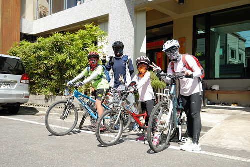謝謝主人給我們一家子的打氣 還主動幫我們全家拍下全副武裝的模樣 並且在其FB留下這樣一段話: "這一家人，最小的妹妹才小二，昨日在新城下車，預定利用三天兩夜分段騎到瑞穗…真是健康又陽光的家庭旅遊方式，相信這段旅程，一定會成為他們甜美的共同記憶…" 若水的好書 好眠 好食物 以及最重要的好心 是我們這次旅行的重要補給!

今日我們繼續在不走大路的導航下 騎進不知名的小村小路裡 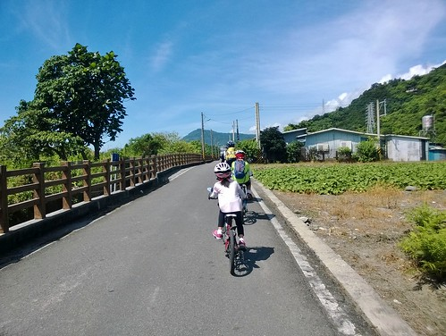 從民宿出發後 很快的我們就轉進吉安鎮內的親山自行車道 沿途的田園風光很美 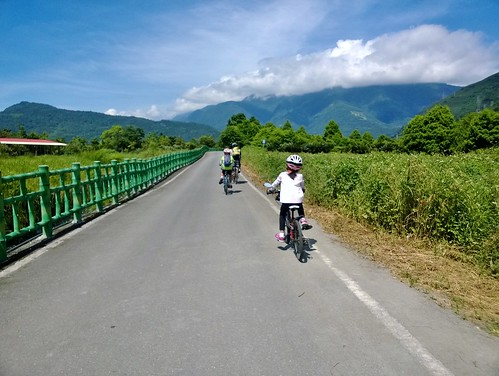 天空很藍好美  只是同時太陽也好烈 [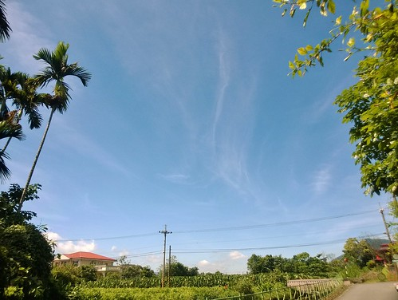](http://flickr.com/photos/33703965@N00/14546911474) 直到騎接初英自行車道後 一旁的樹蔭才讓我們有停車休息的念頭 [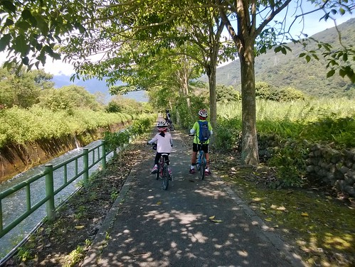](http://flickr.com/photos/33703965@N00/14548456925)這段車道 圳水潺潺 聽來很是消暑 [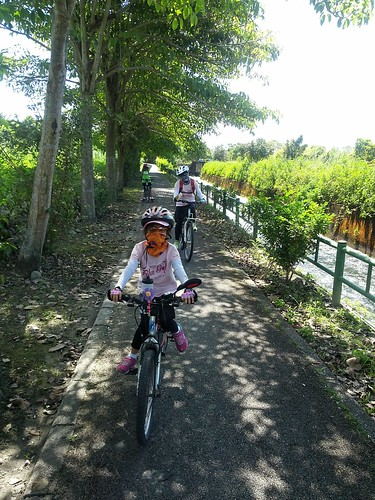](http://flickr.com/photos/33703965@N00/14361804410) 沿途也有不少水車與景觀處可休憩 [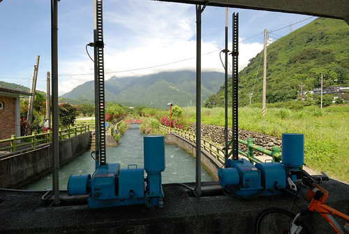](http://flickr.com/photos/33703965@N00/14525381386) 就算沒騎車也是值得散步走一趟的水圳生態步道 [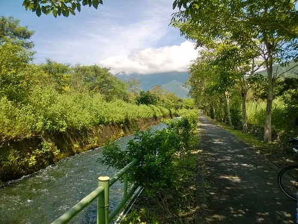](http://flickr.com/photos/33703965@N00/14546913414) 而雖然風景幽美 但前一天腿痠未退又熱爆的愛愛卻無心賞景[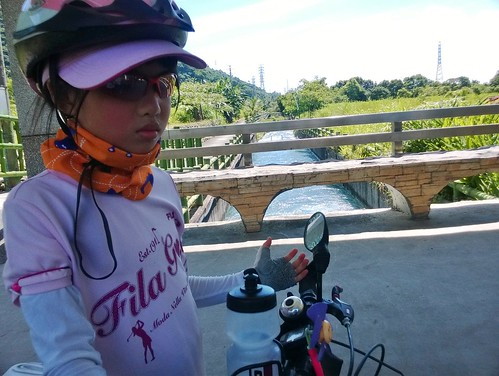](http://flickr.com/photos/33703965@N00/14547527392) 一路上 每隔一陣就唸著 屁股好痛 內褲的花邊壓的好痛... (鬧脾氣的時候啥都能扯上)  涯給帶人家來的阿爸阿母也只能笑臉哄著 陪著家裡公主一段一段繼續著... 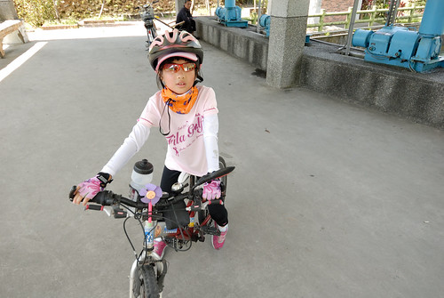 

離開漂亮的吉安鄉內自行車道 接著就是往鯉魚潭的台九丙 [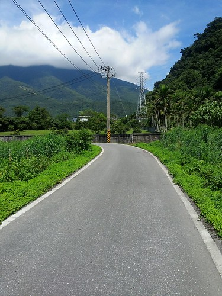](http://flickr.com/photos/33703965@N00/14548469685) 台九丙車不少 路也持續上著坡 [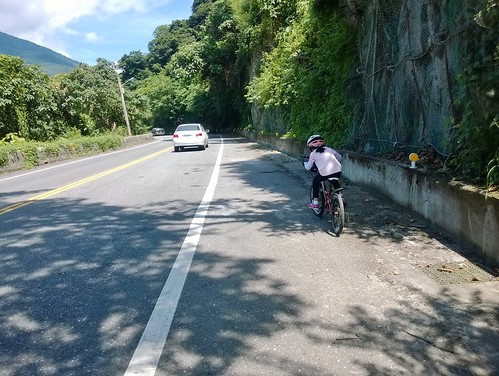](http://flickr.com/photos/33703965@N00/14546926974) 愛愛的速度相較昨天落漆的慢很多 需要喘口氣的休息次數也多很多 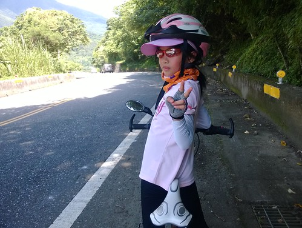 但愛愛不愧是我們家公主 認命的騎 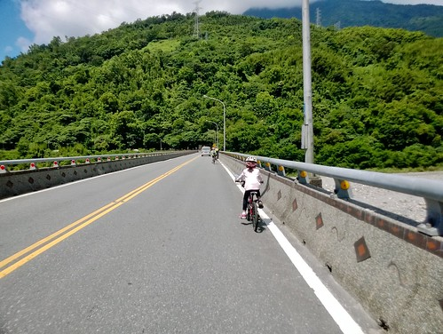 賣力的騎 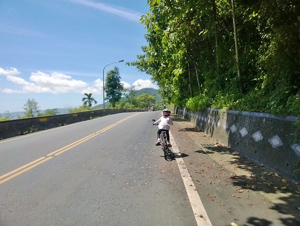 就算不知道是不開心還是沒力氣而騎的搖搖晃晃 還是一直騎著 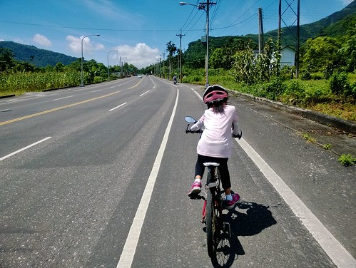 沿路我一直跟她聊著天 帶她回憶起去年她好棒的騎過鹿野好陡的大坡 喚醒(痛苦)回憶的愛愛好像有比較釋懷又更賣力了 [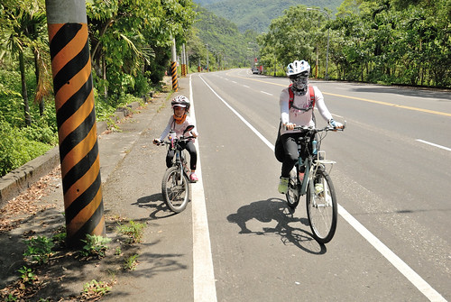](http://flickr.com/photos/33703965@N00/14545084671) 這段往鯉魚潭的台九丙 路很大很好騎 [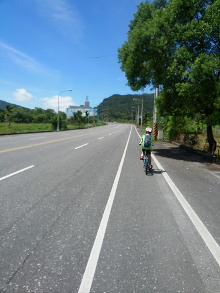](http://flickr.com/photos/33703965@N00/14568586343) 風景也還有漂亮  難怪花蓮縣政府會強打七星潭到鯉魚潭的兩潭自行車道 [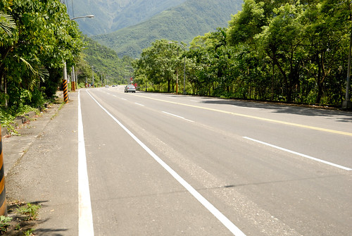](http://flickr.com/photos/33703965@N00/14545080101) 不過像我們這樣近正午時分來騎 那真的得要多喝水 [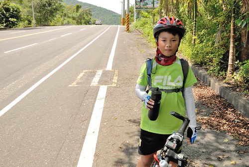](http://flickr.com/photos/33703965@N00/14361868739) 我說徹哥真的變強了 常在上坡路段一不小心就騎到第一台去 用著他自己的速度穩健的持續前進著 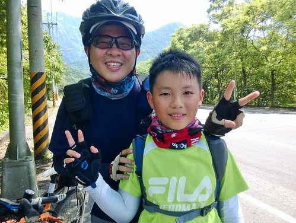 騎到九丙最高點的鯉魚潭時 徹爸問"要環潭嗎?"  母子三人異口同聲回答"不用了吧~" 因為真的好熱阿 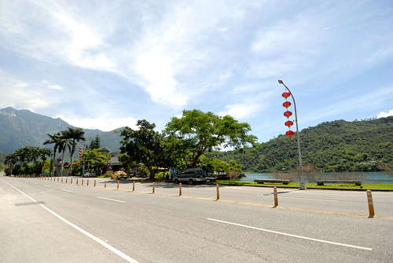 可當我們慢慢騎路過潭邊 看到潭裡好多的天鵝船 愛愛大呼"我好想坐船喔~" 嗯~ 我們的確沒有在鯉魚潭踩過船阿 我想應該會是件挺棒的事 尤其在愛愛公主騎車騎的這麼努力的今日 [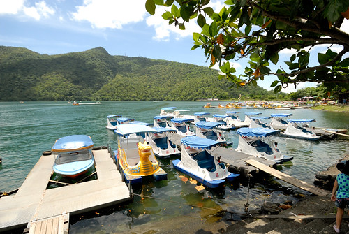](http://flickr.com/photos/33703965@N00/14546963384) 雖然聽到一個四人位的船次要600元 讓我跟徹爸的心銩了一下 可為了寶貝女兒 我們還是握住顫抖的手掏出錢來 [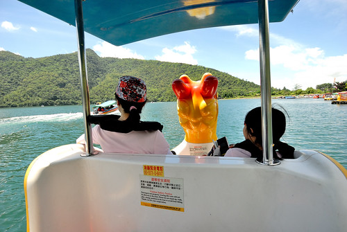](http://flickr.com/photos/33703965@N00/14547557112) 而當出航後 吹著涼風 看著四週環繞的青山綠水藍天 [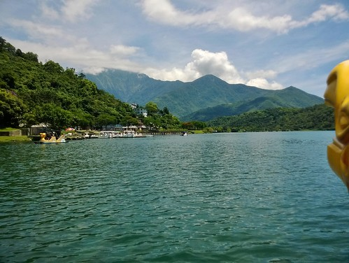](http://flickr.com/photos/33703965@N00/14362029237) 我衷心感恩公主這天外飛來一筆的"我好想坐船喔~" 真的! 好美麗的風景! 好棒的中午! [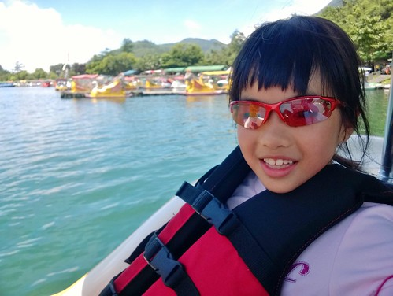](http://flickr.com/photos/33703965@N00/14362028507) 我們把船踩離潭邊 來到四下無船的地方後 索性就讓船自己盪著  我們也放鬆的 讓心蕩漾著 [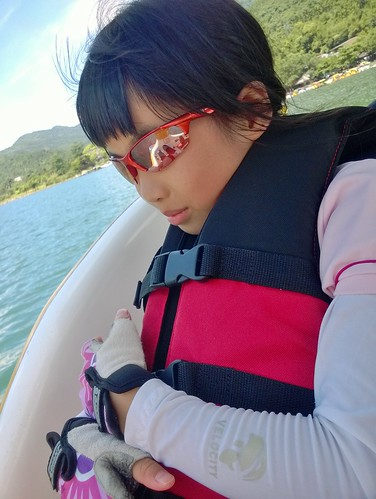](http://flickr.com/photos/33703965@N00/14362037617) 超級讓人放鬆的舒服 [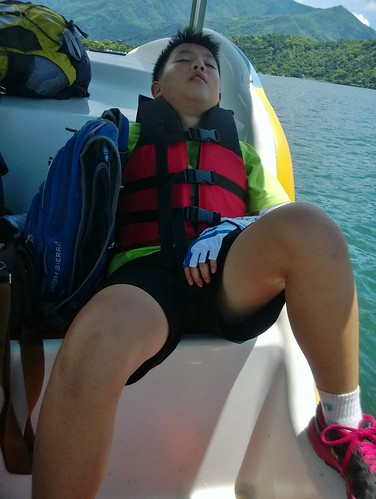](http://flickr.com/photos/33703965@N00/14362038547) 或許 若不是經過騎車的辛勞 我們不會感到如此之愜意 [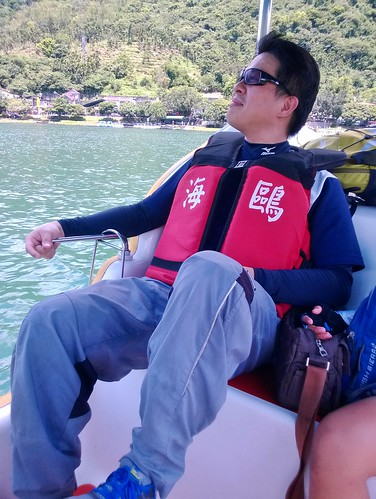](http://flickr.com/photos/33703965@N00/14545096681) 也不會如此讚嘆於這裡的風 這裡的涼 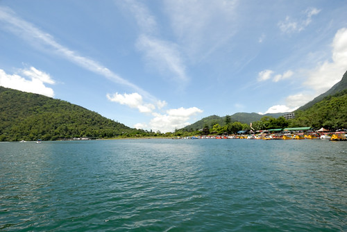 以及每個角度都美的湖光山色 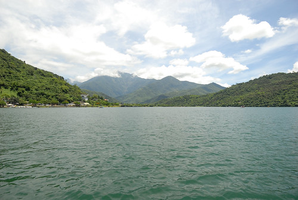  這是我們這次旅行的意外驚喜與收穫 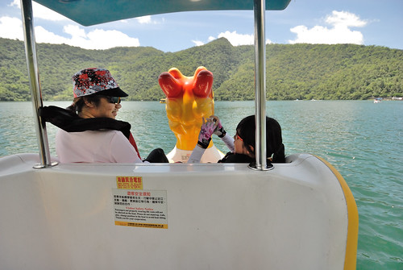 也是讓愛愛一整個high起 不再覺得騎車苦的禮物 [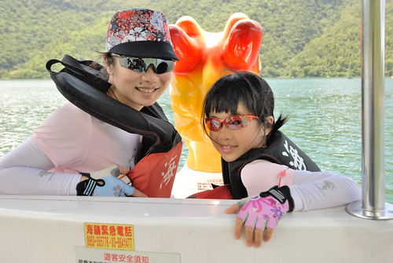](http://flickr.com/photos/33703965@N00/14547561962) 而接下來的路程 愛愛就真的更活力百倍 好厲害阿~ 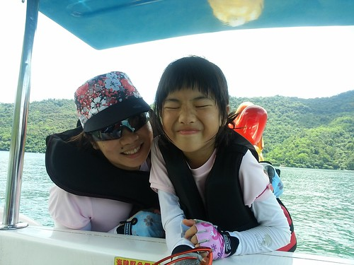 雖然為了不要耽擱行程太久 我們踩了半小時多的船後就依依不捨的返航上岸 卻已夠讓我們仿若被倒了一桶雀巢檸檬茶那樣透清涼   而且回憶好美好滿~ 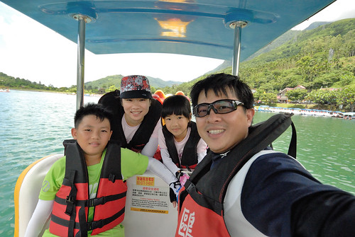
