今年暑假 我們用這次的花蓮單車旅行作為日子的計算 每到週五 我跟徹爸就會感嘆下 原來我們已經從花蓮回來一個禮拜 二個禮拜... 有點希望時間過得快一點 撐過酷暑也早點來到可以再去花東的頻率時間~ 這回刻意的停留一晚在鳳林 只因徹哥四年級時曾說過"聽說鳳林很好玩"(當然是聽他的親愛書羽老師說) 同時我也想 傍晚時分用著散步或騎腳踏車應該是體驗鳳林這個純樸小鎮的最好方式! 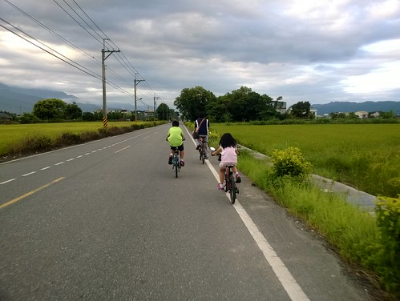

在努力的從涼爽又愜意到極點的鯉魚潭起身後 正中午時分我們一路從鯉魚潭 沿著台九丙下滑到壽豐 (常常上坡不以為意 但下坡滑的過癮時疑問起剛剛我們有爬這麼多嗎 要不就擔心起等會得辛苦爬坡了) [ 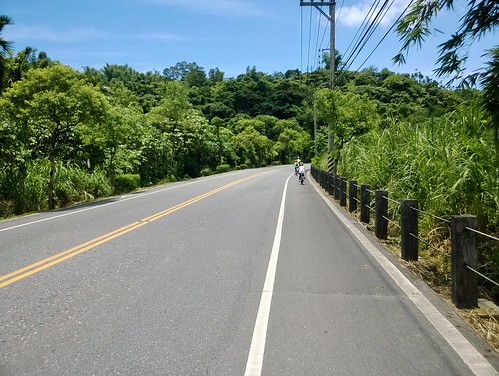](http://flickr.com/photos/33703965@N00/14361896479)行程規劃時 原本還擔心一大早就騎來到壽豐吃冰真是太不才 在鯉魚潭的踩船剛好讓我們的行程延後 嘟嘟好在吃午餐的時間來到壽豐 我們先是經過豐春冰菓店看到滿滿滿的人潮  於是由徹爸帶著徹愛先到鄰近的seven吃中餐 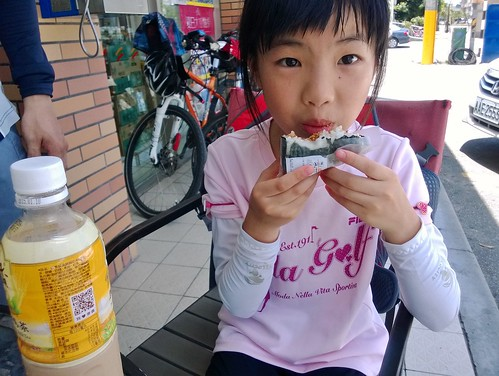 雖然沒有室內冷氣位可坐  但seven的涼食與涼飲在這樣酷熱的中午很得小人心 [ 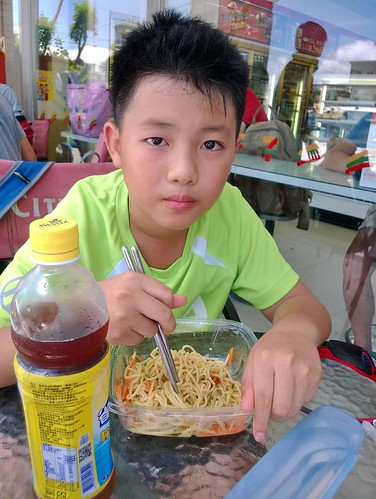](http://flickr.com/photos/33703965@N00/14547577872)而且坐在戶外座位區還挺有野餐的FU [ 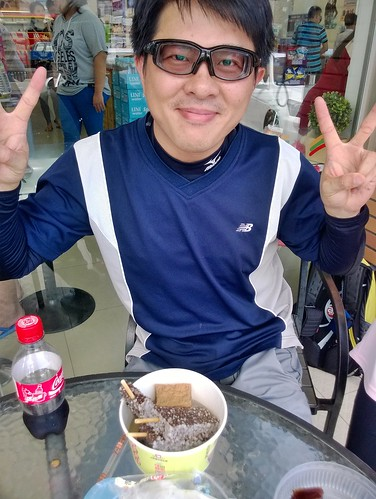](http://flickr.com/photos/33703965@N00/14547578282)同時間我則是先到豐春拿號碼牌 確定要等20分鐘後的下一場後(傳統製冰機要一段時間才產一批) 先回到seven吃中餐 吃飽再剛好回到豐春拿冰 這中間 號碼牌已經從我領的12號抽到70多號  滿屋子人潮真的太恐怖 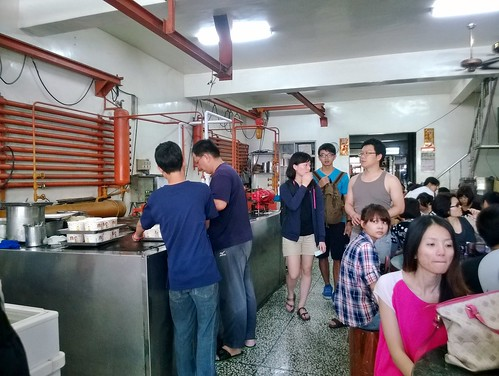 相較店內人聲鼎沸的環境 繼續在seven吃冰的我們相較顯得愜意了 [ 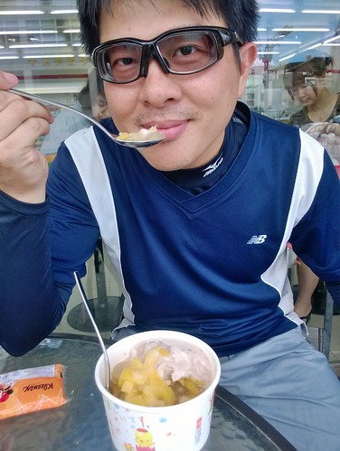](http://flickr.com/photos/33703965@N00/14568623943)我們最愛的芋頭與鳳梨 燉的香軟甜就好像冰淇淋一樣 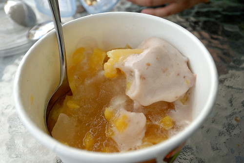 絕對一輩子念念不忘 每次經過壽豐 不管人潮都要來一碗的好吃甘蔗冰

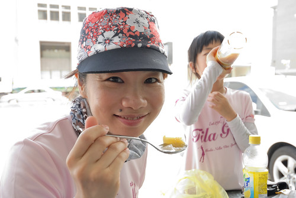 雖然有些擔心吃太飽 等會的上路就吃苦了 我們還是把兩大碗冰嗑光光 [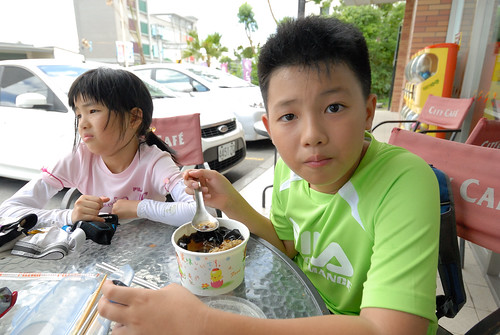](http://flickr.com/photos/33703965@N00/14545113141) 只是善變的愛愛 去年好愛這冰今年卻是對餡料挑剔起來 [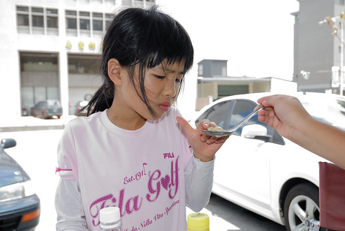](http://flickr.com/photos/33703965@N00/14545121141) 只要最乾淨透清涼的清冰 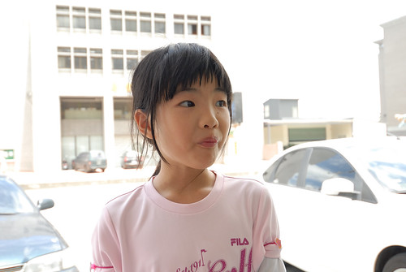在seven休息還有一樣好處 就是可以讓徹愛看看店裡的書籍玩具窮開心 甚至扭一顆蛋 [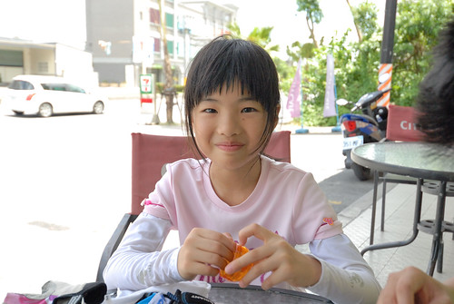](http://flickr.com/photos/33703965@N00/14545126041)愛愛用自己零用錢扭了一顆小鋼彈 [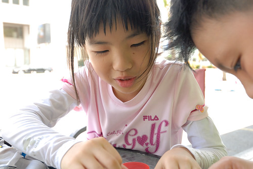](http://flickr.com/photos/33703965@N00/14547597772) 短短的組裝過程就夠讓兄妹倆開心的忘卻單車旅行的辛苦 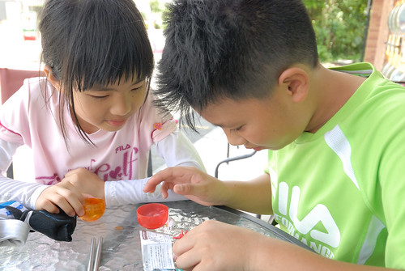而這小小的完成品也是愛愛接下來二日的最佳精神伴侶 坐在愛愛坐騎的小袋子裡 支撐著愛愛努力踩下去 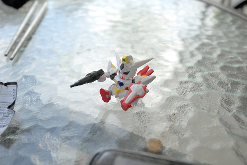 同時間我跟徹爸也納涼的超滿足!  [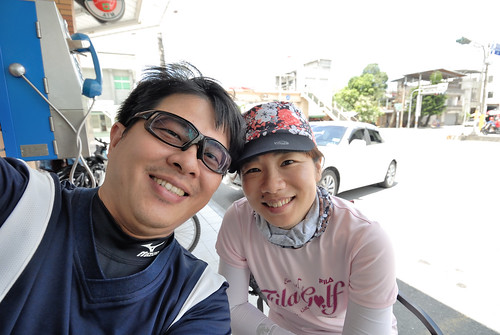](http://flickr.com/photos/33703965@N00/14545132901)從壽豐再出發後我們依然盡量不走台九 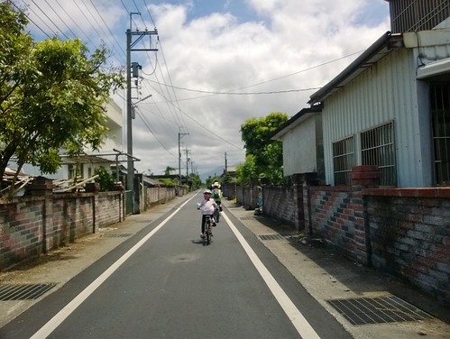 穿梭在很像但其實每鄉每村又不太一樣的小徑小路 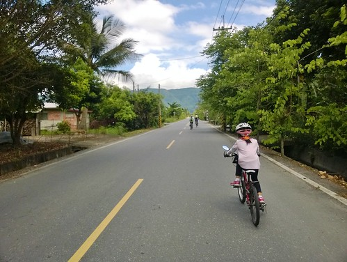 果然我們打從上午十點的鯉魚潭踩船到組完扭蛋再出發的下午一點 實在休息太久 我們有點難耐這個下午的烈陽 每隔一段路就把握難得樹蔭休息喝水 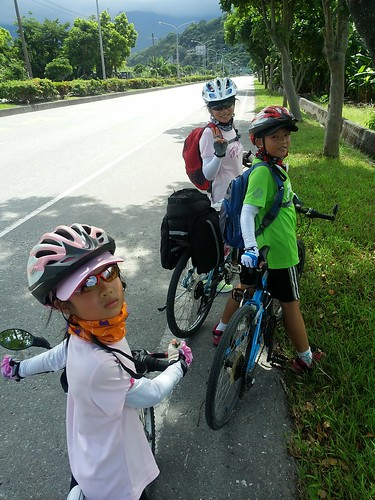 (話說這個小風車跟著愛愛也好多年了 依然勇健跟著愛愛不停轉動著)  (話說二 這個太陽真的很烈 烈到徹爸常看不清楚GPS上的螢幕 ) [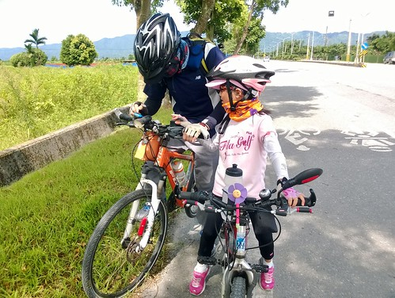](http://flickr.com/photos/33703965@N00/14545143541) 壽豐到萬榮之間 免不了的得走台九過溪 豐平橋就是以前兆豐農場門口乳牛的那個地方  但我們這次走新豐平大橋 2012年才完工的新橋 非常的壯闊還有自行車專用道 [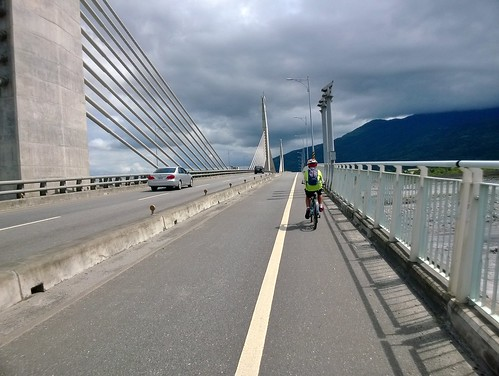](http://flickr.com/photos/33703965@N00/14545144541) 只是每座大橋的上去 都得讓愛愛更費力加把勁 [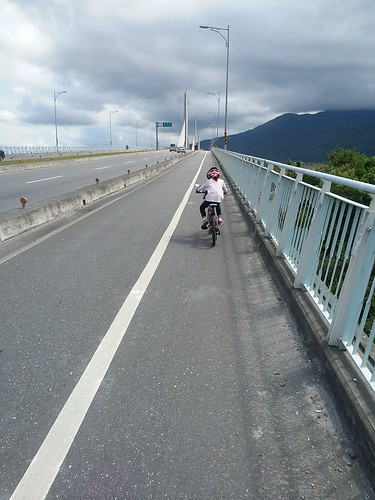](http://flickr.com/photos/33703965@N00/14361932749) 不過愛愛常很出乎我們意外的一口氣騎上來 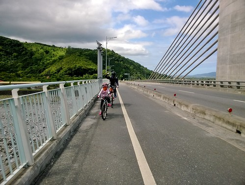 雖然上到橋的高點後得休息喘一下氣 但愛愛越來越厲害了! 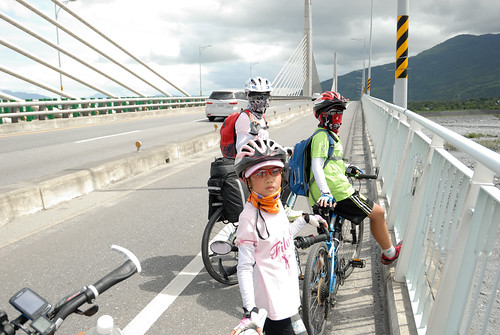 每次在橋上休息的時後 我都會被遠邊的河川山谷給震撼 然後一路享受著這震撼騎過一座座的橋 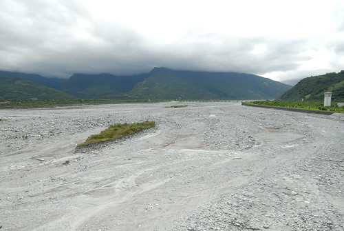 經過新豐平橋 穿過萬榮 我們繼續走小路往鳳林 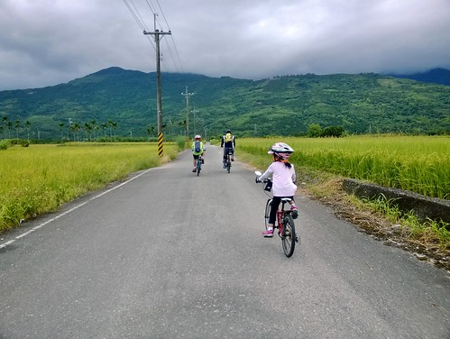 沿途即將收割的稻穗 金黃美麗 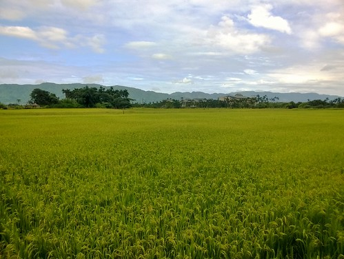 沿途揹著魚網結群的孩子 蹲在路邊玩獨角仙的孩子 令我們羨慕  途經讚炭工房 我們停車入內參觀 [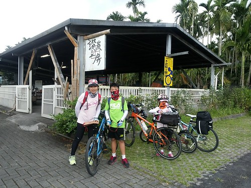](http://flickr.com/photos/33703965@N00/14547012574) 剛好跟著一群團體客聽解說介紹  然後還買了徹哥的竹碳襪以及徹哥超相信的竹炭片 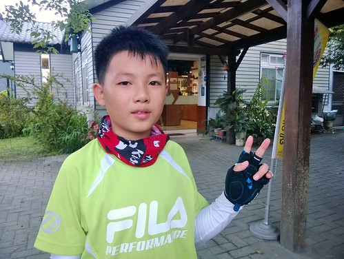 天黑了半邊還飄起絲絲細雨 我們不敢多耽擱的直衝我們今天下榻的民宿 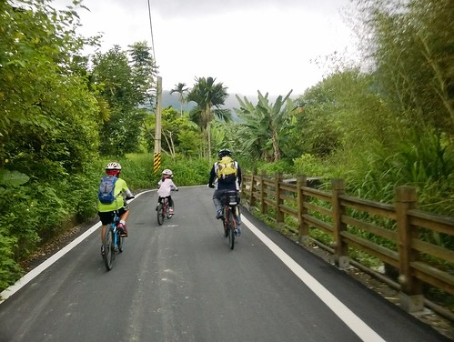 鳳林鎮上的民宿並不多 住的是網路上看起來好像還不錯的古樹芳草 小木屋形式的四人房 除了門口外的蚊子多了點外 是個可接受的住宿 (兩天沒看電視的徹愛 一進房就是開電視解饞 ) 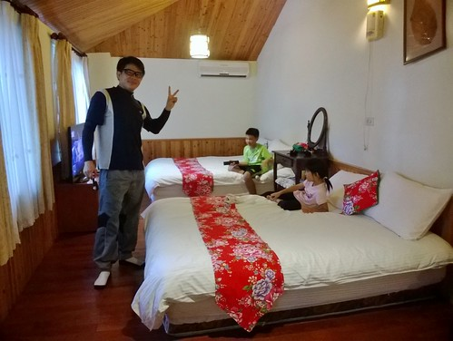 

一樣的在民宿洗個澡涼快過後 我們會輕裝簡便的在傍晚時分(五點)出外溜達 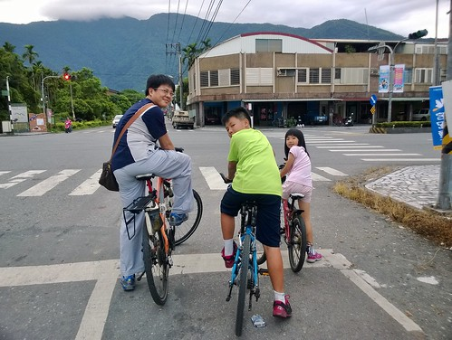 依照行前做好的功課(小抄) 我們先是去吃有名的韭菜臭豆腐 完全迥異於其他地方的搭配 醬料與口感 還挺不賴的 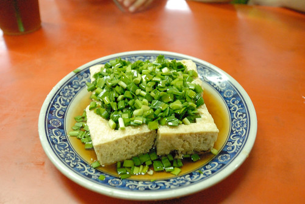 然後去明新冰菓店吃冰喝檸檬汁 [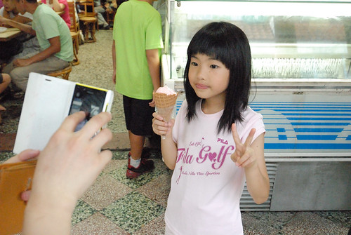](http://flickr.com/photos/33703965@N00/14547631332) 明新跟同樣在鳳林的三立冰淇淋一樣都很好吃 [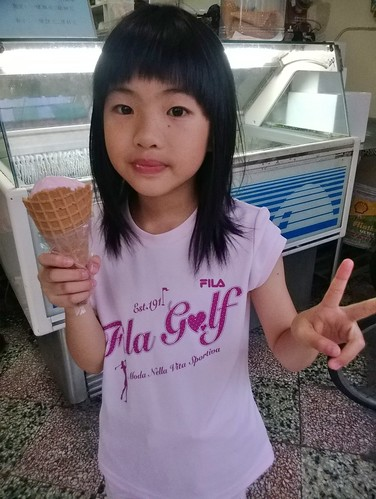](http://flickr.com/photos/33703965@N00/14361905810) 紅豆牛奶冰也好吃的令徹爸大滿意  (話說這次旅行真的吃好多冰阿!)[ 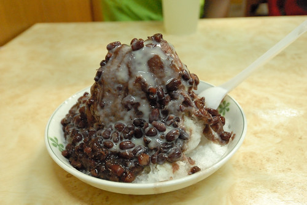](http://flickr.com/photos/33703965@N00/14545165431)填了肚子後 開始我們的鳳林鎮內小旅行 [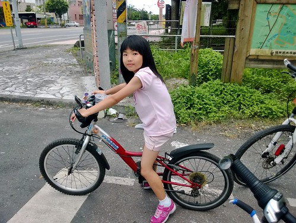](http://flickr.com/photos/33703965@N00/14525480666) 經過校長夢工廠 雖然過了開館時間 但牆外一幅幅的壁畫也夠讓我們跟小學生解釋開導一番 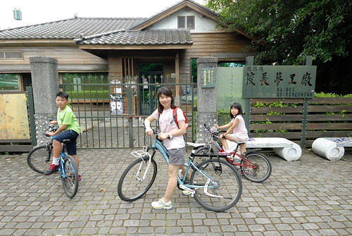 經過民宿不遠處的韓老爹誠信麻花 當然也要買幾包 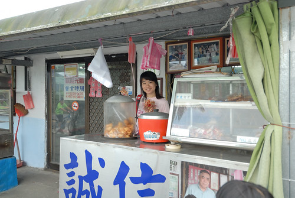 然後我們往菸樓聚集區去 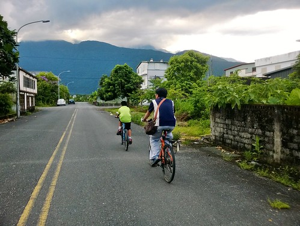 這是保留完整的徐家興菸樓 [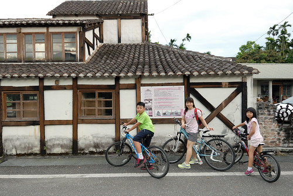](http://flickr.com/photos/33703965@N00/14548574445) 但因為連著私宅所以我們未進去 只是看著屋外介紹跟徹愛小小解說下 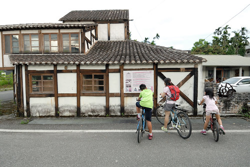我還是很想看看 網路上人家寫的可以參觀的菸樓 所以徹爸努力研究著地圖 打算給我們一個完整的鳳林巡禮 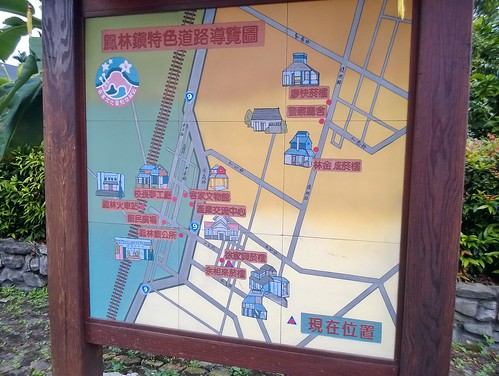 而就在我跟徹爸研究著地圖同時 沒想到兄妹倆竟然就在人家門前尬起車來 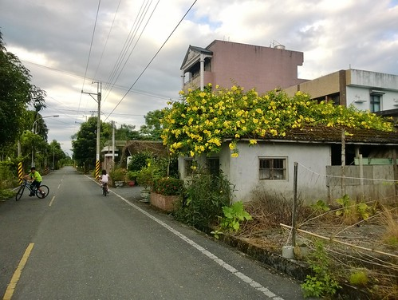 來來回回好些趟 倆人不亦樂呼~ [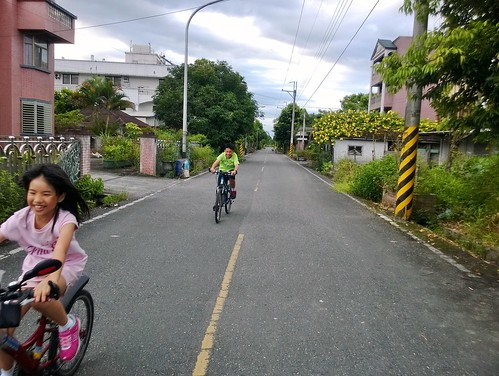](http://flickr.com/photos/33703965@N00/14361919820) 家家戶戶有院子 門口外的巷道人車罕至 是孩子們的最佳遊樂區 這是多麼美好的家庭生活環境阿! 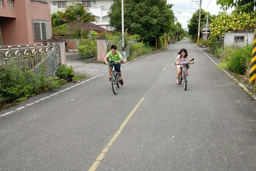 另一個保留完整的廖快菸樓距離鎮中心有段路  剛好讓我們來段很舒服的傍晚輕鬆騎 [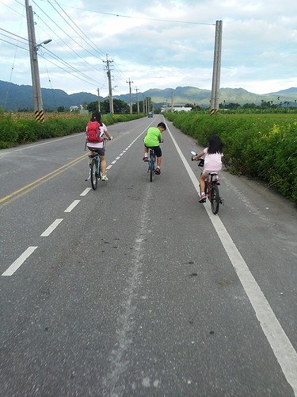](http://flickr.com/photos/33703965@N00/14361925610) 在花東的傍晚 真的有太陽下山後的舒適涼意 [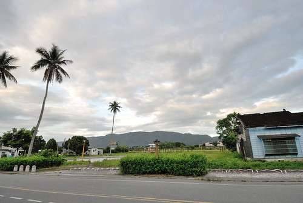](http://flickr.com/photos/33703965@N00/14568706863) 所以我們喜歡在熱到再也不行的三四點就到民宿沖涼休息  等到五點過後再到戶外納涼 這是夏天到花東旅行最棒的享受之一 [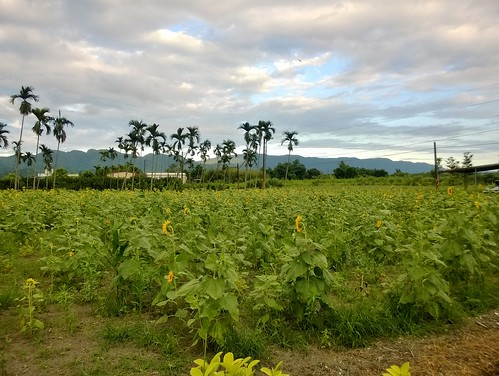](http://flickr.com/photos/33703965@N00/14361969059) 而這時候路上的一景一物 一草一花也都顯得格外迷人 讓人更有耐心與雅致停下腳步欣賞 (看到這片太陽花田我好開心的想要與跟我臉一樣大的花照相 走近後卻看到好多的蜜蜂在吃蜜就不敢打擾了)  途上經過的日據時代保留下來的警察廳舍一樣的打烊 不能參觀了  但是這樣的氛圍就也夠讓我回味  接著我們開心騎過頭的來到大榮國小 國小門口的老松木群沒吸引我們 倒是入口的蔣公銅像讓小學生嘖嘖稱奇  接著我們回頭再訪不小心錯過的廖快菸樓  這裡被保留 修復的很完整  也有很多詳細的過往歷史與煙草製作介紹 (而且還有章可以蓋)  雖然膽小的我們不敢進入菸樓內實際一探究竟 但今日應已夠讓小學生記得鳳林菸樓風華 尤其還在菸樓旁的柑仔店買了兄妹很愛的柑子糖 肯定記憶一輩子!  

住宿的芳草古樹民宿本身也經營餐廳 所以那晚我們就近的就在民宿餐廳用餐 兩個小時的小鎮巡禮後 我們剛好在預訂的六點半準時放飯  網路上有關餐廳的討論與評價遠多於住宿 尤其有不少人也推薦他的烤雞 這回旅行吃很爽的我們 當然很慰勞自己的也來一隻 嗯~ 如果有開車的話 我想月盧的烤雞還是最值得期待.......  這一晚也很剛好的有金曲獎頒獎典禮 於是我們家難得(應該是第一次)守在電視前看典禮實況 同時還配著柴魚小零食與誠信麻花卷更是讓我們放縱的很滿足  這樣的夜晚也真的挺好~    (小人趴在床上看電視是出門在外才能有的奢侈享受阿!) 
