一樣的除了涯給還是只能用涯給形容的單車小旅行 今年第四年了! 旅行中 我跟徹爸看著徹愛騎車的背影常覺得很不可思議 想當年阿徹才剛結束小一 而愛愛還是給爸爸載著的娃 如今愛愛卻也可以用10-15公里的時速同我們踩踏在花東 更別說會跟我競速尬車的徹哥 而同時更深感欣慰的是 一家子的情感與回憶在一次次單車旅行中豐盈踏實! 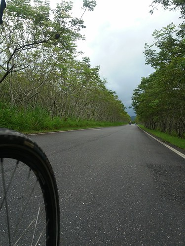

說來汗顏 其實我們家在去年六月的台東騎後就沒再一起出門騎過車 除了因為加入足球隊的徹哥在週一到週六大量運動後 週末休息的時間只想好好在家放鬆 板橋附近的自行車道這幾年被我們騎的差不多 所以也沒有太大動力每次從四樓扛四台車下樓去溜車 可見我們騎車真的不是為了運動 而帶著四台單車 千里迢迢搭火車到花東也不是為了徑速與挑戰 純粹因為覺得這是慢遊花東最好與最美的方式 而且一試就上癮! 只是我們的單車旅行沒法像大部分車友那樣的說走就走 簡單易行 我們得花更多的時間與心力做好規劃與(心理)準備 也因此目前一年一次的小單車旅行對我們來說剛剛好 而如果可以每年這樣一回 直到徹愛長大帶著男女朋友與我們同行 環不環島對我們來說 真的不是目的也不是重點! 想見的是以後我們有好多的家庭故事可以說給我們的孫子聽... 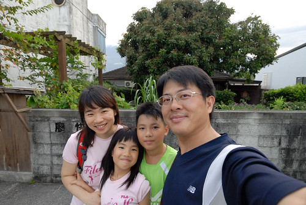 

週遭有好些親友對這樣的親子單車旅行有興趣 就藉這篇順道分享我們的經驗: 旅行前一週整理好塵封許久的車子 也全副武裝的來一趟2-30K的台北河濱自行車道行 藉此調整好車子與小人的裝備 (小人的東西常不知不覺就不適用) 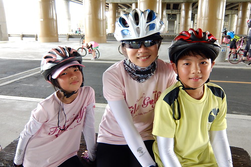 等到出發前一天早點上床睡覺 當日一大早帶著愉悅又飽滿的精神搭6點35分在板橋火車站的車次 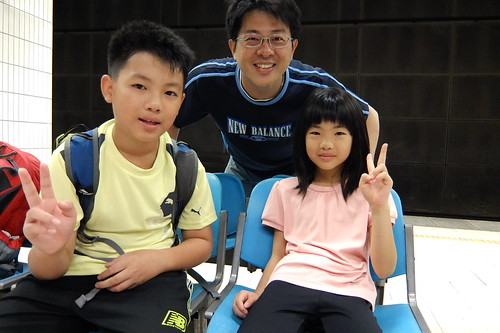 台鐵提供的人車同行服務 東部幹線只有週五到週日間提供每日一班次的上行與下行 詳細說明與訂票方式(與一般火車票訂票系統不一樣): [163.29.3.98/twrail\_bicycle/bicycle/index.aspx](http://163.29.3.98/twrail_bicycle/bicycle/index.aspx)  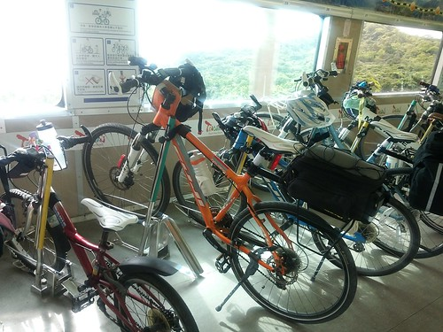 一班次提供約45個人加車的席次 這兩年利用這樣人車同行的小團體比我們3年前第一次搭時多很多 尤其週日的回程班次相較去程是更難訂票(去年從台東回來 就得耗番心力兩段訂票) 所以預定出發日的前二周那個晚上12點要分秒必爭的上網訂好票 二日內取訂好的票 便可心安的期待兩週後旅行的到來 [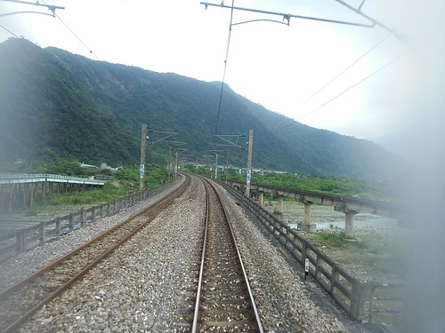](http://flickr.com/photos/33703965@N00/14525052126) 提供人車同行服務的車型是莒光號 所以到花蓮要3個小時 到台東則更久的要ㄎㄡ五個小時 [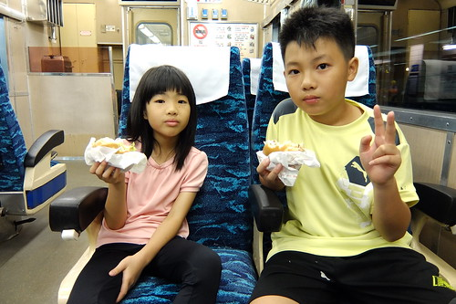](http://flickr.com/photos/33703965@N00/14568240713) 所以準備好充足的早餐(去程)或晚餐(晚餐) 以及可以消磨小人時間的小零食 小遊戲 甚至童書很需要 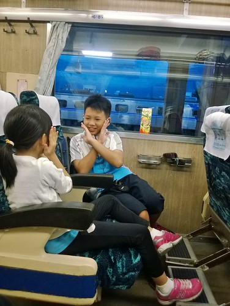 (話說徹愛各帶了一本只看剩一點點的不算薄的書 是要折騰揹載行李的阿爸阿母阿?!) [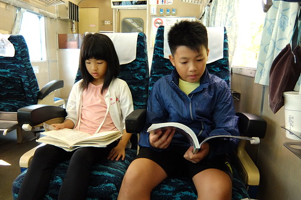](http://flickr.com/photos/33703965@N00/14361477730) 莒光號加掛的三節人車同行車廂 每廂內就是16個座位加上16個單車位 沒有一般旅客的混雜與打擾 其實火車上的時光挺悠閒愜意 只是像我們這次回程遇上機車頭半路故障事件時 因為無法棄車而逃 只能苦苦等候火車的修復 這時候真的只能無怨無悔的讓台鐵誤我們一小時又五十分鐘 然後半夜12點多才回到溫暖的家 不過難得遇上這樣的機頭事件也是旅行的意外回憶 而且全額退票就像是老天爺贊助我們旅費 有些小開心 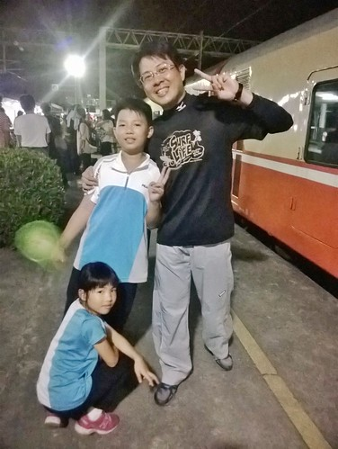 雖然越來越多人利用台鐵的兩鐵環保列車 但火車站的配合硬體設施卻還有很大的改善空間 (3年前我們要在池上搭車時 站台人員還不知道有這服務嘞) 尤其是月台間常得靠人力扛車上下樓梯 所以阿爸阿母要很敏捷又強壯的來回兩趟 扛自己 扛小孩的車 (徹哥今年可以分擔扛愛妹的車讓阿母輕鬆不少) [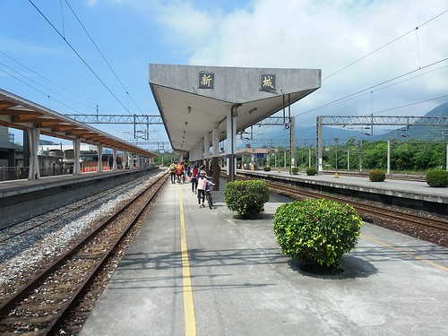](http://flickr.com/photos/33703965@N00/14525055266)

繼之前幾次單車旅行的 壽豐到玉里  瑞穗到池上 池上到台東市 這回我們要補花蓮的最北段 因此安排了新城到瑞穗 列車並未每站停 所以路程起訖的安排時得考量火車的停靠站 (本想騎到光復就好 但花蓮市的下一個停靠站就到瑞穗去了) 如果按照一般環島的方式走台九 其實我們的路程都很短 而雖然台九才是王道 風景其實也很美了 但串聯各鄉鎮間的縣道,鄉道 甚至說不出號碼的小道小路 更能深入花東風景的美與旅行的慢漫 難為徹爸遵奉老婆大人"不走大路"的聖旨 參考網友提供的路徑與分段環島一書 規劃了這次精彩又美麗的行程 當然實際上路後 免不了走錯(迷)路 或因體力與時間因素少走路 這時候保持一家子的心平氣和很是重要 這樣大家的玩性才不減 甚至笑看這一切的意外 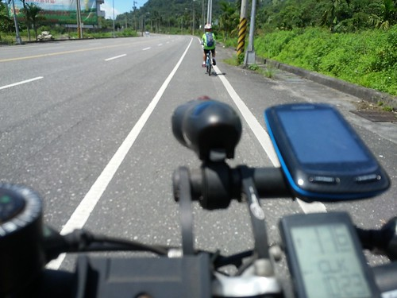 我們的第一天 從新城火車站到下榻的吉安鄉 徹爸為了滿足我的兩潭車道 花蓮港風光 以及很漂亮的田野風光 規劃了這繞了花蓮市一大圈的路徑 [//ridewithgps.com/trips/2922485/embed](//ridewithgps.com/trips/2922485/embed)

第二天 我們從吉安走台九丙到鯉魚潭 然後再經壽豐到鳳林 [//ridewithgps.com/trips/2922484/embed](//ridewithgps.com/trips/2922484/embed)

第三天 從鳳林出發經光復的馬太鞍 大農大富平地森林園區 再到旅行終點的瑞穗 [//ridewithgps.com/trips/2922474/embed](//ridewithgps.com/trips/2922474/embed)

大家看到我在FB放的照片 第一個反應"好美" 接著應該就是'天氣熱爆了吧"的疑問與佩服 真的! 體驗過一次後就會明白夏天在花東騎車其實沒有比走在台北街頭辛苦 用領巾 太陽眼鏡 袖套 排汗衣褲與手套 把自己全身包到認不出人後 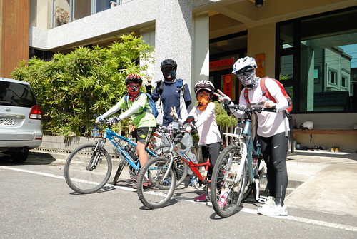 其實沒有熱的那麼難耐! 而且花東除了太陽毒辣點外 溫度與溼度都比台北好 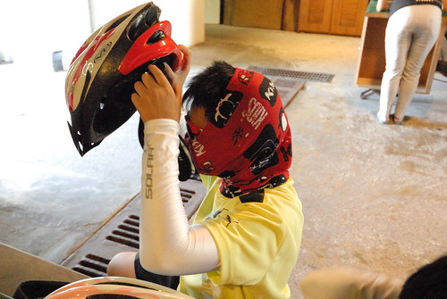 小人一開始當然有些抗拒每每要這樣大費周章把自己裹起來 但不厭其煩的提醒他們 讓他們嘗試裹與不裹的差異 小人就會懂得要自動自發把自己包好 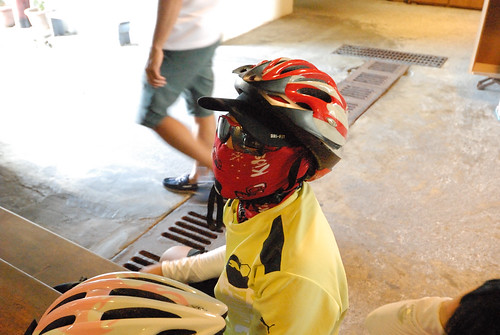 同時 路上適時的休息與補充水分也非常的重要 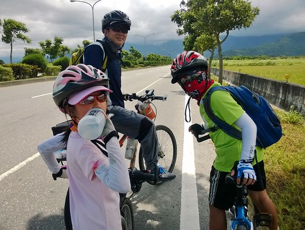 做好以上這些措施 其實健康又陽光的單車旅行沒有大家口中那樣的不可思議! 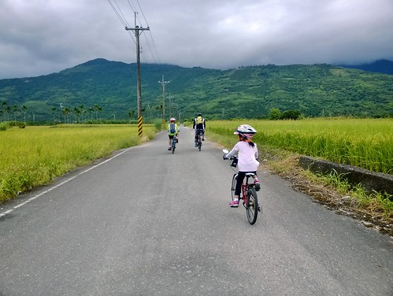

旅行當然要善盡地利之便的吃喝當地美食 況且這也是鼓舞小人堅持努力的最大誘因 新城的佳興檸檬汁 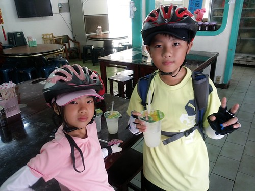 壽豐的豐春冰果室甘蔗冰 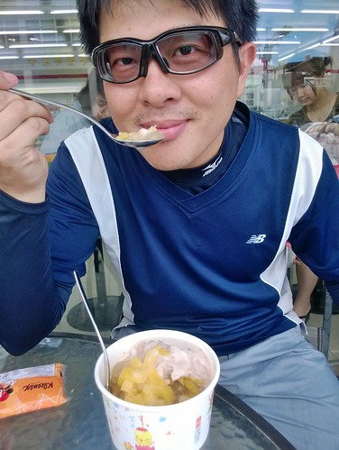 光富的糖廠冰淇淋 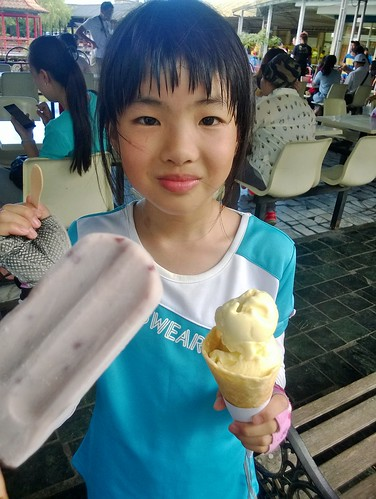 瑞穗的吉蒸牧場鮮奶 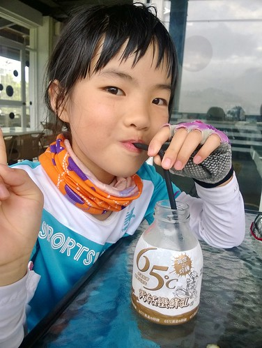 每樣我們以前都吃過 但因為這次路是自己踩出來 所以格外美味與珍惜! 而除了吃吃喝喝  這回我們也更加隨心所欲的邊騎邊玩 騎經鯉魚潭 只因愛愛喊著好想踩船  我們索性停車踩龍船去 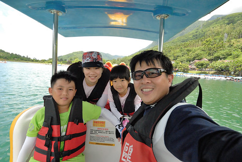 徹爸笑說腳踏車踩不夠阿! 還自找腿痠的來踩船 但青山綠水藍天包圍  外加涼風徐徐 漂在鯉魚潭中真的好美好舒服阿  馬太鞍濕地裡的小溪也同樣的讓我們在正中午時分就像被冰鎮過的透清涼 這些都是出乎安排的臨時起意與意外驚喜 讓小人更喜歡這次的單車旅行 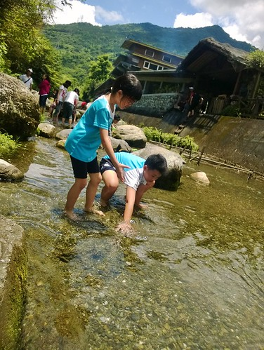 同時 每天下榻一個乾淨又舒適的民宿也非常的重要  民宿不只在於晚上睡一個覺 更讓我們在下午3-4點抵達後得以沖涼休息 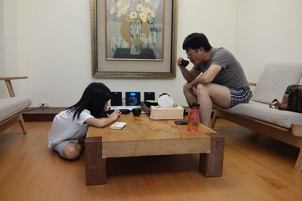 好再精神百倍接著傍晚時分的臨近小散步小騎乘 (花東的傍晚時分真的超舒服) 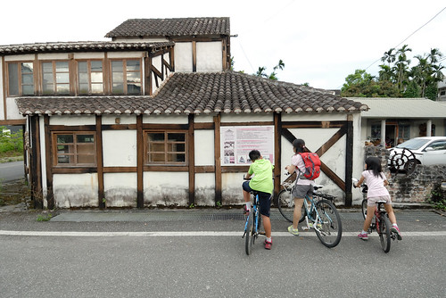

雖然旅行好吃好玩又好住 但小人總會有騎的熱 騎的累的時後 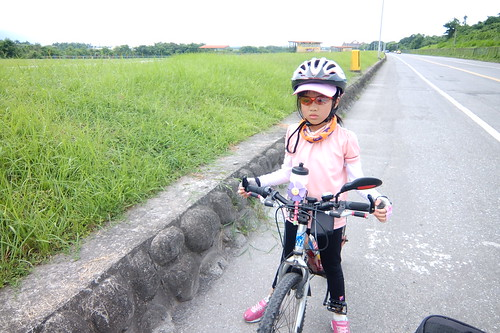 第一天愛愛問"為什麼世界上發明腳踏車這種東西阿?"  阿母說"好讓爸爸媽媽用來折磨小孩阿!" 第二天愛愛問"我們為什麼要來騎車阿?" 阿母說"因為你好愛媽媽阿" 這些答案讓愛愛聽的沒好氣 但第三天她完全矢口否認有說過這樣像是抱怨的話 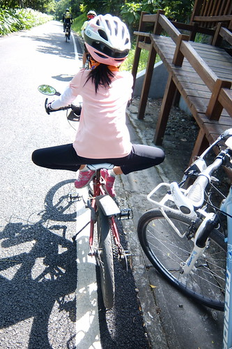 徹哥也曾說"我們班XXX她要去美國一個月耶  OOO要去哪 我也好想出國去日本玩阿" 實在沒辦法! 爸媽沒本事讓一家子過鹽水開眼界 但我說其實從小到現在最讓你記得 津津樂道的 不就是像這樣流淚流汗甚至流血的點點滴滴 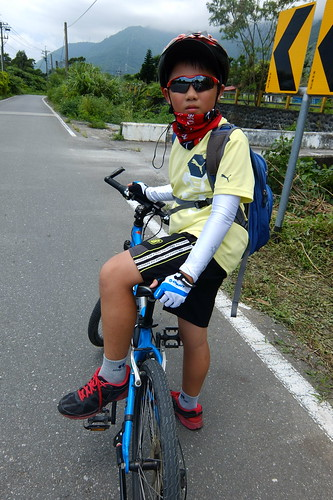 而且阿母真的覺得打開心胸 比打開眼界來的更重要 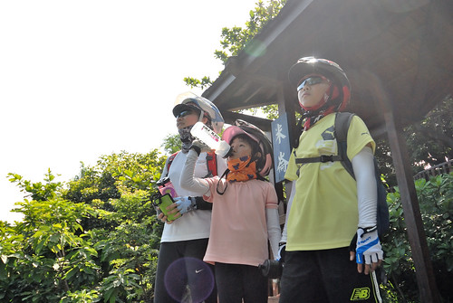 雖然真的是很平淡又辛苦的旅行 但看到徹愛越來越享受騎著車的快感 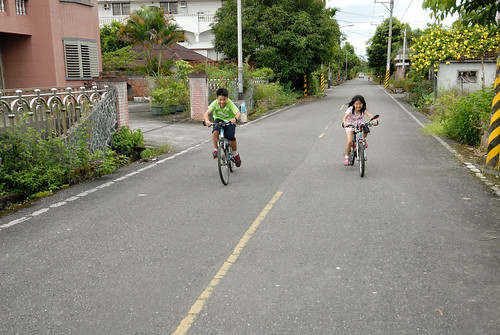 五感全開的感受沿途所見所聞 我跟徹爸每每相視而笑~ 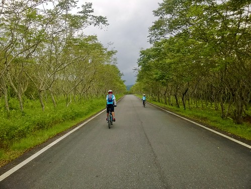 最後一段在瑞穗騎往火車站的路  我們四台車慢騎在沒車的路上聊著 我們分別說說這段旅行的心得與建議 並且打個分數 (每次旅行的回程路上我們都會給旅行打分數 給下次旅行安排的建議) 四人平均給了90分  因為好玩 好吃 好開心 但卻腳也好痠! 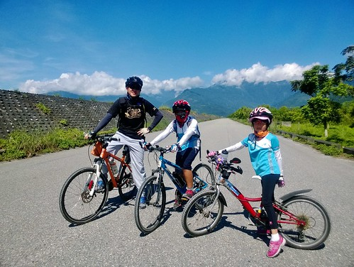 謝謝我最棒的三位遊伴 無怨無悔陪我踏往每個不知名的小鄉小徑 給了我這樣棒的夏日美好回憶~ 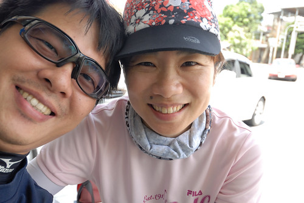
