在字很多又很不低調的開場白後 接下來就回歸平淡的分段看圖說故事 介紹這次單車行的所走所見

以往單車旅行的第一天都只會安排少少的2-30K車程 暖身也暖心 這回第一天就近50公里的路程加上不熟悉的起起浮浮路況 讓徹愛在第一天就大喊苦 這也是最後一天檢討時被徹愛指正最多的地方 但在"不走大路"的導航下 我們走進新城和秀林的原鄉小村落 也飽覽七星潭與花蓮港的海天一色 甚至繞了花蓮市一大圈 其實 真的是很豐富的遊花蓮(市)路線阿! [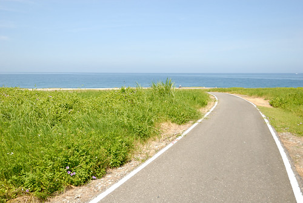](http://flickr.com/photos/33703965@N00/14361617839)

火車停靠花蓮的第一站 新城站 是我們這次的起點 在新城站下車的車友不少 幾乎個個都是超高裝備的挑戰中橫武嶺去 相較之下 我們這家子顯得像是來花蓮亂的 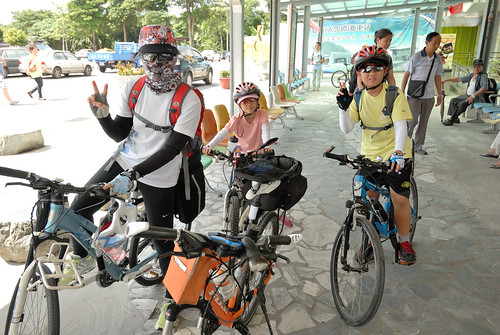 還沒開始我們設定的GPS路線 我們便先岔路騎去大街喝佳興的檸檬汁 這個每次我們進出蘇花都要來一杯的檸檬汁 就算讓我們一開始就喝撐肚子 喝破氣勢也一定要來喝 而且我還有備而來的帶了隻空保溫瓶 就只為了裝上一杯冰涼的檸檬汁好在中途慰勞一家子 [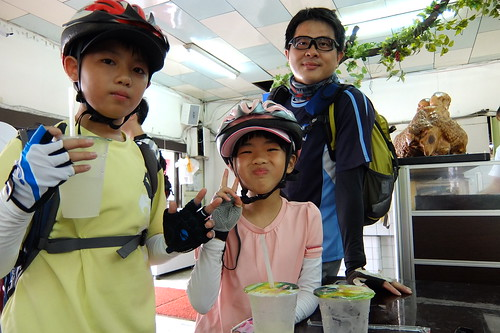](http://flickr.com/photos/33703965@N00/14361536759) 心滿意足喝了檸檬汁 我們回到路線的起點新城火車站  然後正式開始我們的路徑 避開車多的台九以及砂石車多的縣193  我們騎在人車罕見的小路上 [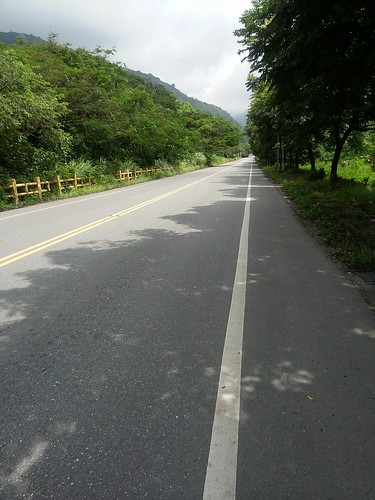](http://flickr.com/photos/33703965@N00/14546610514) 似往山裡去的路很美很靜  但也有些爬 尤其在身子還沒暖夠 檸檬汁也還在齒頰留香的時候 很快就落馬得陪愛妹牽著走 [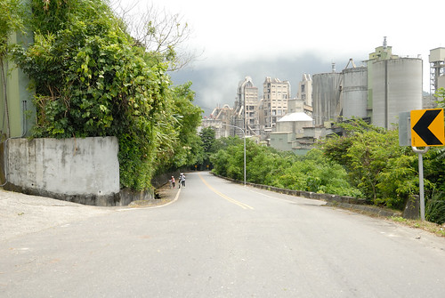](http://flickr.com/photos/33703965@N00/14525067436) 不過越往上騎 遠方的視野越是好 這段我們從沒開車來過的地方 很令我跟徹爸驚豔 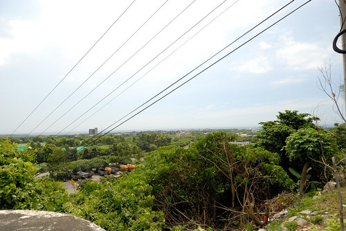 有時候似往山裡去 [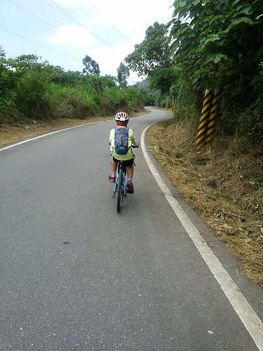](http://flickr.com/photos/33703965@N00/14361503250) 有時候卻是柳暗花明又一村的 [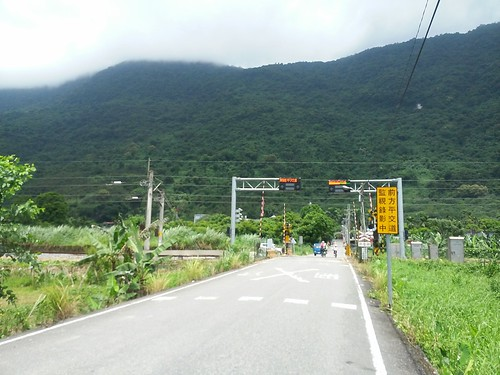](http://flickr.com/photos/33703965@N00/14548166775) 經過新城與秀林的好些美麗小村落 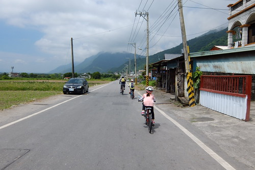上路一個多小時 騎的好熱又有些累的時候 經過三棧溪畔 看到遠處戲水的小孩 我跟愛愛好想騎進社區 下溪戲水 可惜徹爸與徹哥只想一股作氣盡速抵達中午休息的七星潭 我們只能望水興嘆 期待日後有機會再專程開車來戲水 (沒多久徹爸就後悔沒繞進美麗的三棧社區 我想這也讓接下來的二天我們更懂得要把握每個衝動與隨性) [ 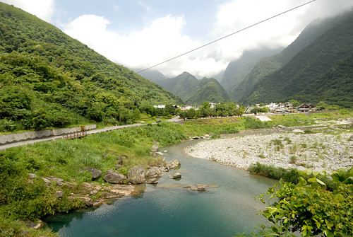](http://flickr.com/photos/33703965@N00/14544766641)我們與火車鐵軌交錯好些次 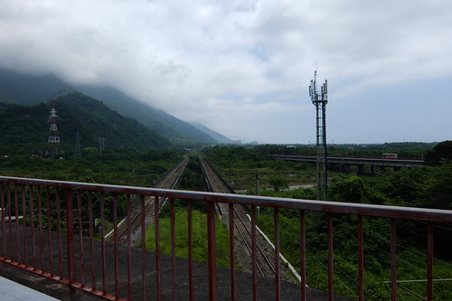 也進進出出山裡好些回 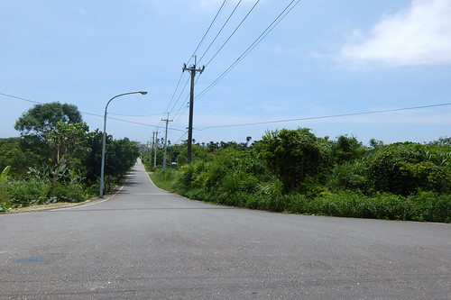 雖然上上下下 騎的愛愛有些累 [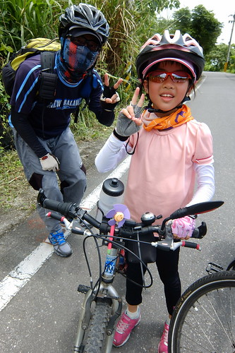](http://flickr.com/photos/33703965@N00/14548169305) 但愛愛的腳力明顯比去年提升許多 很令我們欣慰 [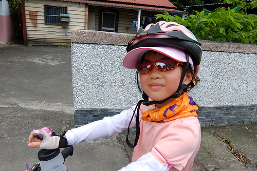](http://flickr.com/photos/33703965@N00/14546640604) 至於徹哥 經過一年足球隊的磨練  也更是強壯的讓人完全不擔憂[ 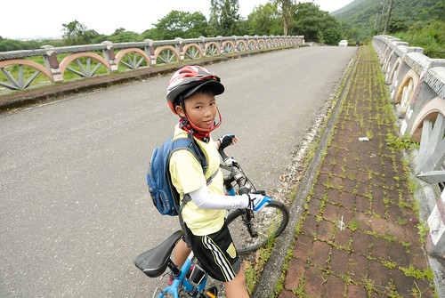](http://flickr.com/photos/33703965@N00/14547245422)徹愛的好戰鬥力 讓我們這回更馳騁於花蓮的小鄉小道間 [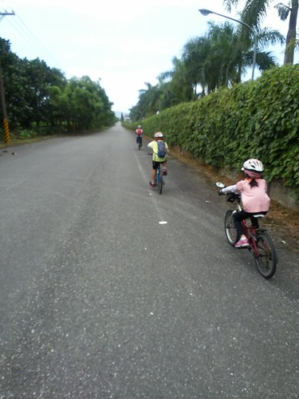](http://flickr.com/photos/33703965@N00/14361566769)

以為很近的新城火車站到七星潭 我們卻如爬山涉水般 騎了一個多小時還到不了 總算在看到機場跑道後 才感覺我們離七星潭不遠了 [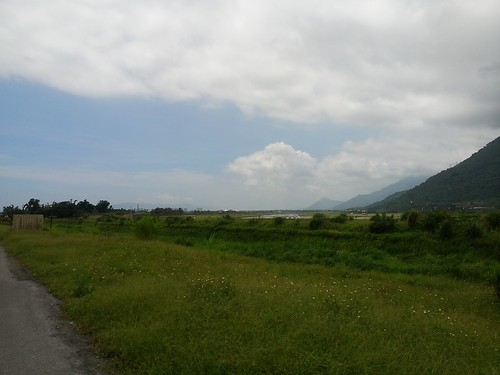](http://flickr.com/photos/33703965@N00/14546641794) 雖然越來越逼近目的地讓人雀躍 [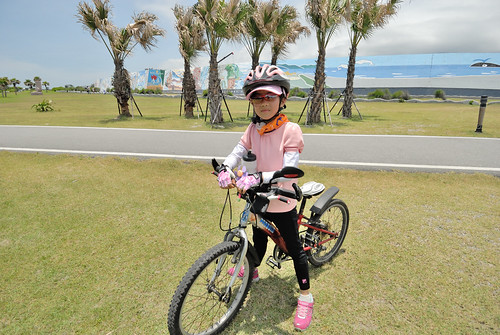](http://flickr.com/photos/33703965@N00/14361575609) 但在正中午時分騎往海的方向卻也讓人熱難耐 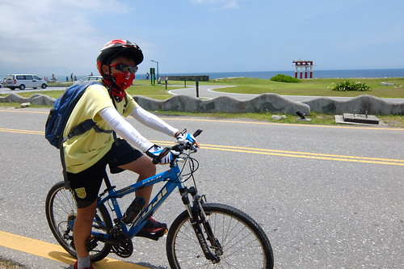 只是烈日下的太平洋很美 [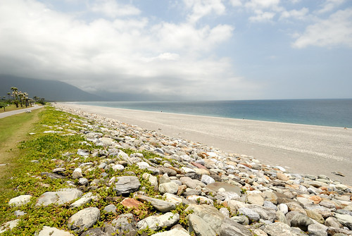](http://flickr.com/photos/33703965@N00/14548193765) 雖然不是夢想中的騎在台11  但第一次離太平洋這麼近的騎著車讓人感到興奮 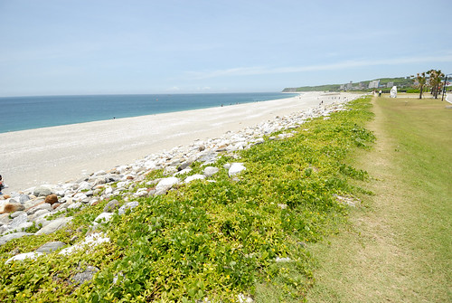來過柴魚博物館這麼多回 第一次我們真的是來這休憩 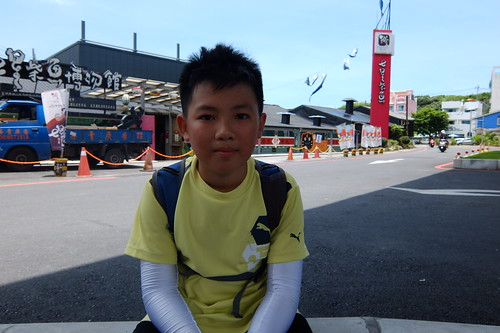 販賣處提供的餐點選擇不多 但以柴魚為最佳配角的每樣食物都讓我們喜歡 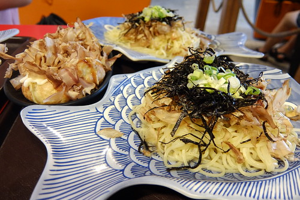 一人一盤的乾拌麵或烏龍湯麵 加上章魚燒還有魚丸湯 我們旅行的第一餐就很重本的吃好 [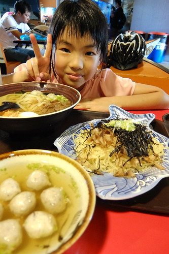](http://flickr.com/photos/33703965@N00/14361545000) 尤其可以續湯續到開心的魚丸湯 讓汗水不停止流也硬要喝上三大碗的父子倆大滿足 [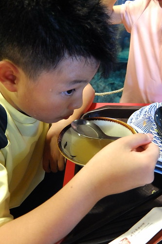](http://flickr.com/photos/33703965@N00/14568310963) 而吃完熱呼呼再來碗涼呼呼的冰火大爆發之洛神花醋冰 更是爽快到最高點阿! [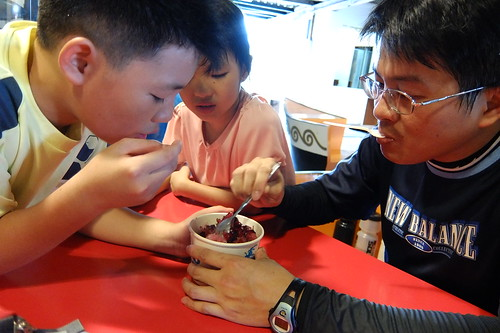](http://flickr.com/photos/33703965@N00/14361549080) 為了讓吃飽的肚子休息 也貪圖冷氣的吹涼 我們買了門票進去以前不需收費時就看過的柴魚博物館 一張50元的門票 可以抵30元的產品消費 也還可以當作明信片的寄出 雖然還是懷念不用門票的年代 但花錢買小人的開心以及接下來的動力 還是值得 [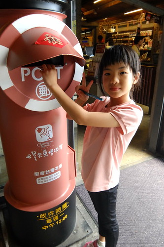](http://flickr.com/photos/33703965@N00/14544809121) 休息了一個半鐘頭 太陽還是好烈 但我們還是該再上路了

相較六七年前我們第一次來住時  現在的七星潭多了好多旅館跟各式風格建物 自行車道的起點也出乎我們想像的大器很多 以致我們傻傻搞不清楚 原來像人行道的這裡就是自行車道的起點 [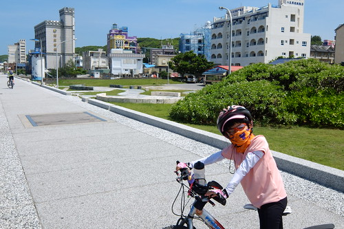](http://flickr.com/photos/33703965@N00/14361620588) 所幸七星潭的海水還是一樣的藍 一樣的美麗 (只是消坡塊也煞風景多了不少) 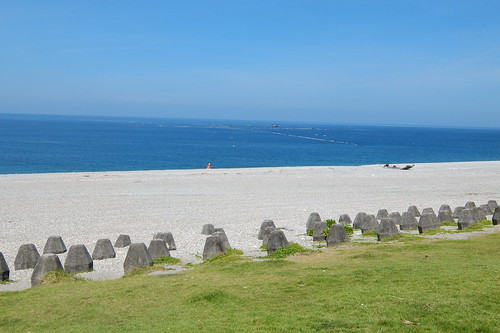 我期待很久的七星潭車道 沒想到是在酷暑烈日下進行 [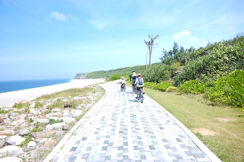](http://flickr.com/photos/33703965@N00/14361624688) 老實講 真的好熱 熱到只想快速通過 [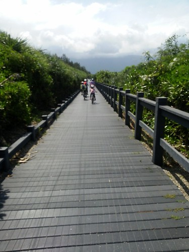](http://flickr.com/photos/33703965@N00/14361601619) 尤其當下沒風 還得牽車走上一階比一階高的木棧道 [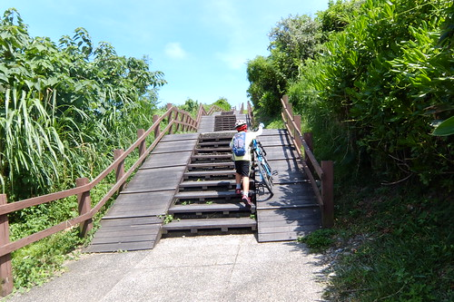](http://flickr.com/photos/33703965@N00/14544821701) 以致來到據說七星潭最高點的四八高地時 完全沒有閒情逸致享受當前美景 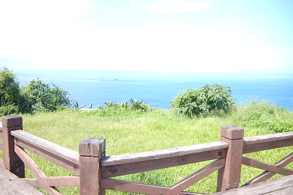 同時 我的相機也熱昏頭的開始秀逗 測光失準照片白亮亮 (下面白亮亮的照片都是秀逗的相機拍) 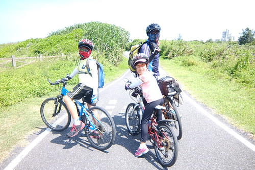 如果不是天氣這麼的熱 其實這段車道真的很漂亮 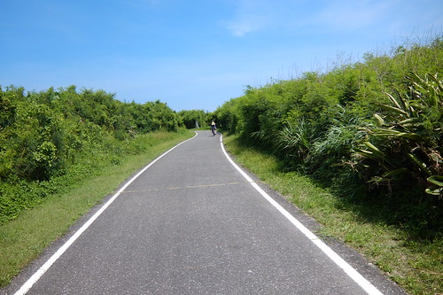 兩旁盡是樹或花包圍的沿途 很有秘境的浪漫氛圍 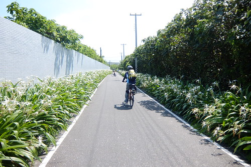 

離開七星潭風景區後 我們繼續依著兩潭自行車道的指標騎著  讓人豁然開朗的這段路吸引我與徹爸的駐足 同時間 徹愛卻如脫韁野馬般迎著海風向前奔馳著 後來我與徹爸苦苦追上時才明白這兩個小人方才有多麼享受於疾速快感 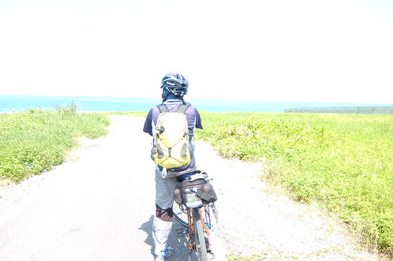 沿途經過環保公園 花蓮港 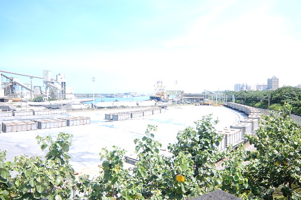 與濱海鐵道平行的木棧道 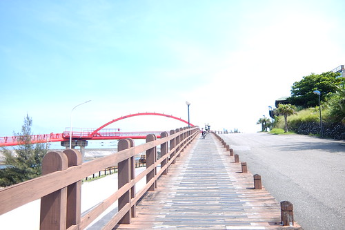 米崙招呼站

[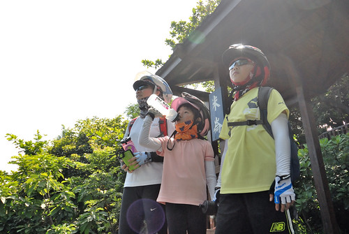](http://flickr.com/photos/33703965@N00/14361631719) 這段路很漂亮 而且兩旁綠樹扶蔭讓我們降溫不少 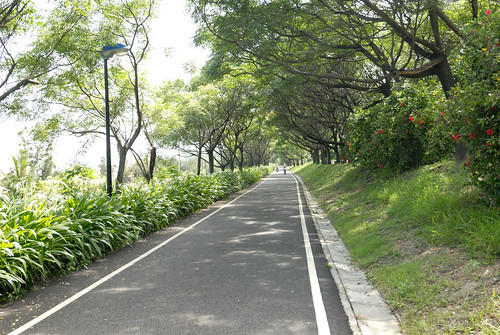同時也緊鄰花蓮港 讓我們窺見許多前所未見的貨輪風光 [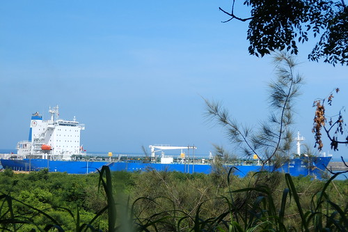](http://flickr.com/photos/33703965@N00/14546708404) 兩潭車道會在跨越曙光橋後 經北濱公園 舊鐵道區 木瓜西橋繼續往鯉魚潭的方向 但我們在離開花蓮港後 穿過某花蓮市高級住宅區(看起來真的很高級) 美侖區  往慈濟大學方向走 這段路 我們沒有任何照片的留下 因為在我們高興總算來到花蓮市 應該快要可以收工後 竟然有一波波嚴峻的爬坡路段考驗著我們 原來我們真的很涯給的給他越過美崙山 又來到旅行一開始的新城鄉 老實講 當我聽見飛機在頭頂轟轟的飛過  看到每次出蘇花後總會見到的新城家樂福  我真的傻眼了! 而且從早上到下午三點的此刻 沿途我們沒經過任何的seven或全家 帶的水也都喝完 我們就像在沙漠中等待著一片綠洲 最後總算見著一攤檳榔攤 一罐礦泉水 兩瓶舒跑 解救了即將脫水的我們 鑒於這下午的苦頭 接著的兩天我跟徹爸便高度危機意識的隨時補充水瓶  不讓缺水困境再次發生

幸好這段辛苦之後 吉安漂亮的田野風光又伴了我們好長一段路 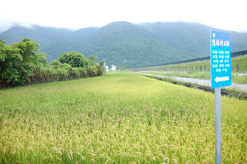 長到徹愛已經無心賞景 只想趕快抵達今天住宿的民宿 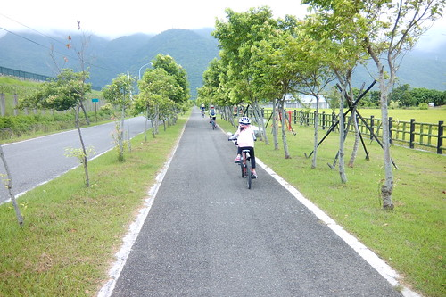 沒想到我們卻如早上 還不斷的騎穿梭在小村小道中

[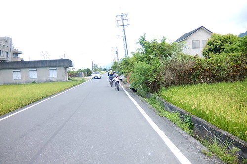](http://flickr.com/photos/33703965@N00/14544857571) 看著累積騎乘數一直往50K逼近著 愛愛真的騎得有些生氣 [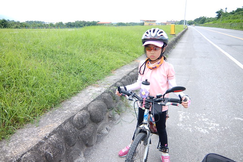](http://flickr.com/photos/33703965@N00/14568368333) 徹哥雖然還是很勇健 但卻也很難接受第一天這麼操  實在不是以往那樣的爽快 [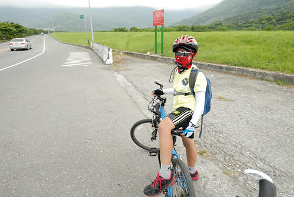](http://flickr.com/photos/33703965@N00/14361603260) 但我跟徹爸兩人還是直嚷著"哇 這裡好漂亮!"  雖然我的腳也好痠 屁股好痛... 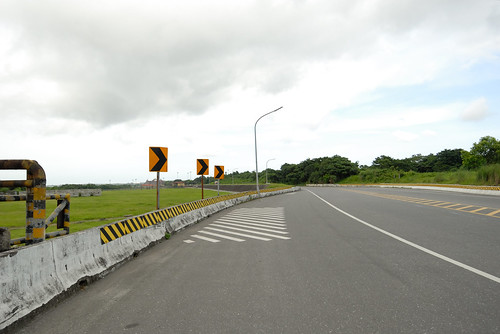 可惜最後我們還是投降了 沒走完預先設定的GPS路線 截彎取直 以最快速度前往今天住的民宿

位於吉安鄉慶豐八街的若水人文空間(民宿) 我知道了好多年 也推薦給好些親友但卻一直沒來過 都快比我家大的四人房 有玄關 起居室區 [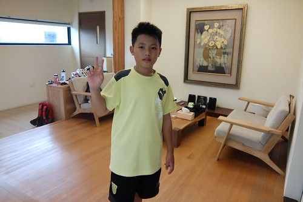](http://flickr.com/photos/33703965@N00/14361649019) 睡眠區 [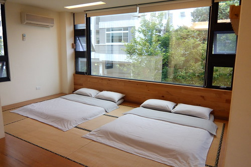](http://flickr.com/photos/33703965@N00/14361667958) 閱讀區  以及浴廁分隔的衛所  寬敞 寧靜又舒適的大空間 讓熱昏又身疲的我們徹底休息與放鬆  同時民宿大廳大量的童書收藏 也讓徹愛完全忘記今天的不開心與累  縱情陶醉於閱讀中  為了慰勞大家的辛勞 我們也犒賞自己去櫻之田野吃野菜涮涮鍋  雖然還得往返騎6公里的路程才能到餐廳 但能吃鍋讓徹愛很開心 尤其愛愛第一次自己開一整鍋 吃了好多肉好多菜 還大呼過癮 喝足飯飽後 雖然還得摸黑騎一段路才能回到民宿 但四個人 一台接一台照應著 追隨著唯一有車燈(但沒啥電)的徹爸  這段路很暗但好溫暖~
