旅行的第三天 也是最後一天 我們要從鳳林經光復到可以搭火車回家的瑞穗 一樣的避開台九 我們踩進熟悉的鄉鎮 但卻不同感受的美麗境界 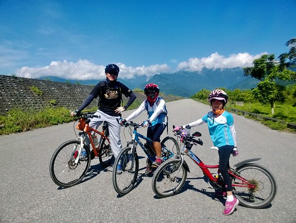

今天我們母子三人有志一同穿藍色系的衣服(分明是阿母刻意安排的) 在吃完早餐出發前 先來個一身清爽紀念照 四年前曾騎經過鳳林鎮內以及環東自行車道 留有很好的印象 [ 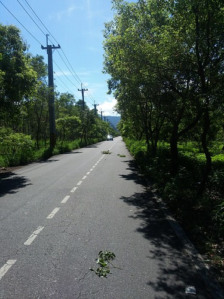](http://flickr.com/photos/33703965@N00/14547071954)這回往南的路程 當然也想盡辦法的騎經我們所不知道的鳳林小徑 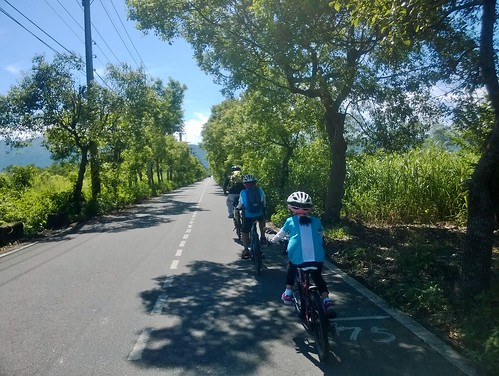 只是怎麼越騎越偏僻了  甚至騎到路況很不佳的長長小碎石路段  讓人懷疑路的盡頭會不會是此路不通 (照片上下兩個色調 一點都不誇張的顯示這路段的塵土飛楊) 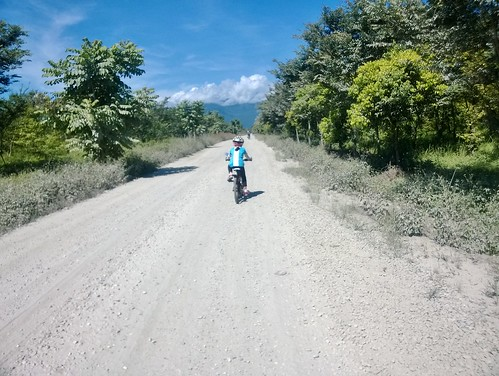 幸好路到底接上我們預期中的防汎堤道 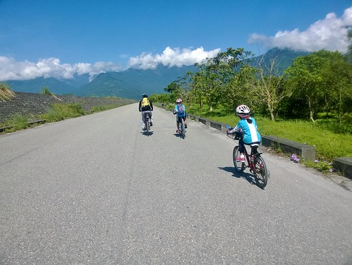 不是特別寬闊的景色 但我卻特別喜歡這樣看不到路盡頭的畫面 尤其迎著的是好綠的山 好藍的天 好白的雲  只是也真的很熱! 難得的小小樹蔭就如沙漠中的綠洲 [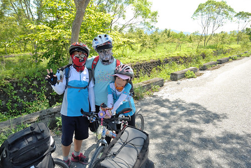](http://flickr.com/photos/33703965@N00/14547082174) 休息過後 我也才敢請大家曝曬在烈陽下 讓我多拍幾張照 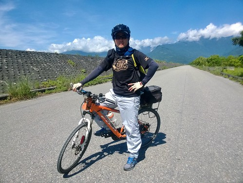 很孤單但感覺卻很棒的這段防汎堤道 騎到底便是接往萬榮的橋 萬榮這段路 我們騎在熟悉的台九上[ 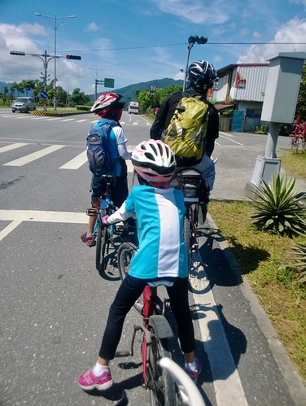](http://flickr.com/photos/33703965@N00/14362013339)北花蓮台九的自行車道獨立於一般車道外  非常的安全與友善 [ 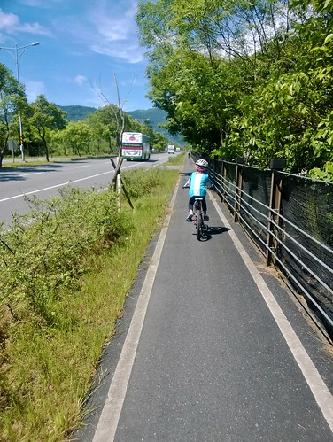](http://flickr.com/photos/33703965@N00/14568739513)花蓮的鄉鎮多以溪流作為分界 同時以大橋作為連結 因此在跨越鄉鎮時 總不可避免的要騎台九好過大橋 一樣的慢慢騎 欣賞映在山頭上的雲影變化 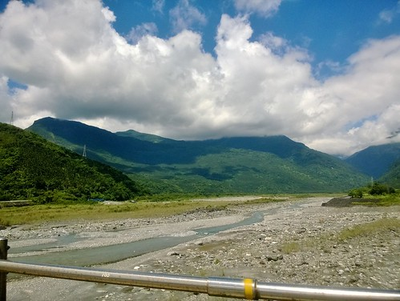 接下來往光復的路 連續下坡滑得徹愛好開心 尤其來到第三天 徹愛對車子的操控性更好 下坡都不怎麼按煞車 縱情享受下滑的快感  到光復 我們轉進往馬太鞍溼地 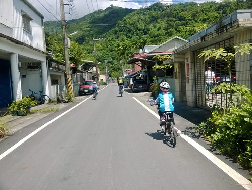  途經一片荷花田 徹愛驚呼"哇 好漂亮阿!" 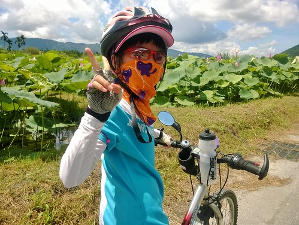 烈日下還能聽到徹愛這樣欣賞眼前美景的讚美聲  我的心裡有種感動 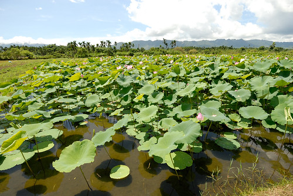 今天的行程有在預期內的可以中午前抵達馬太鞍  於是10點多在萬榮時便先打電話預訂欣綠農場 11點前抵達農場 連濕地都沒去找 我們就躲進農場餐廳吹冷氣休息  雖然說深愔運動過後不宜喝冰水 但酷夏裡這樣來一杯涼真的超級爽快 怎麼避的了阿!!! 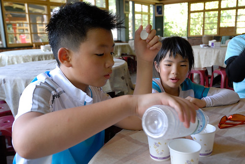 欣綠農場是馬太鞍內有名的特色餐廳  臨時訂位的我們只能訂早早的十一點 所以雖然距離早餐不過3個鐘頭 我們便又要吃中餐了 而且只要吃飯就總很規矩的給他來魚 來肉 來湯  五菜一湯跑不了 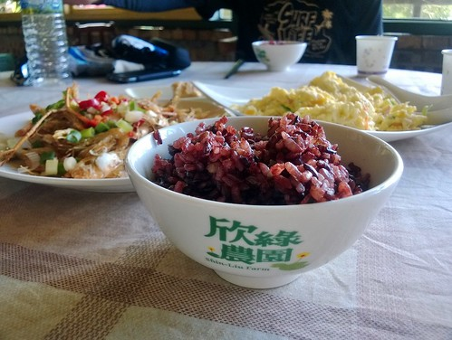 (話說農場的菜色很走健康路線 連麵包樹菓都入湯) [ 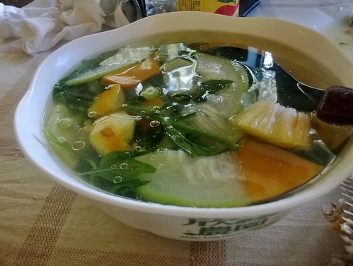](http://flickr.com/photos/33703965@N00/14568758383)農場最有名的就是自家養的烤魚 沒有去鱗 菓上厚厚一層鹽巴後下去烤的吳郭魚 是馬太鞍濕地的名菜 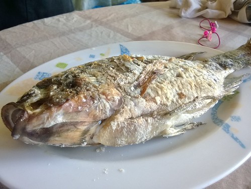 服務人員端魚上桌後會先幫忙去皮 (我本來還一直猜想這魚要怎麼吃) 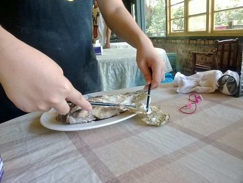 然後就是原汁原味但沒土味的白魚肉  蠻值得一試的特色菜 [ 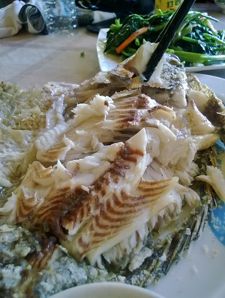](http://flickr.com/photos/33703965@N00/14525557886)吃完飯12點 是大部分遊客的用餐時間  而我們剛好可以逛逛園內  很難理解餵魚的樂趣  讓徹愛頂著烈陽也要餵 (這些是單車旅行中阿爸阿母可以施的小恩小惠)  再往農場後頭走 總算讓我見著每每在網路上看到的景像 就是這條溪! 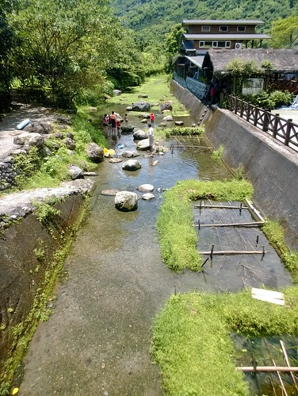 傳統阿美族的巴拉告生態捕魚法在這裡重現 也是夏日戲水的清涼地方 [ 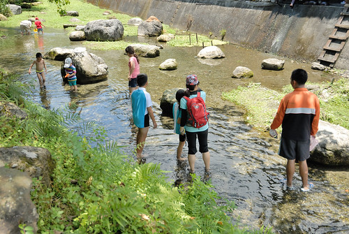](http://flickr.com/photos/33703965@N00/14362057808)徹愛脫了鞋 撩起褲管  擋也擋不了的下水去 冰涼的溪水沁的我們眉開眼笑  而清徹溪水裡的好多小魚也讓徹愛開心的追趕摸補  [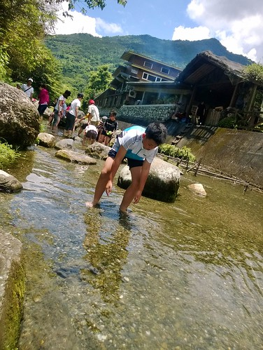](http://flickr.com/photos/33703965@N00/14548664805)不過魚兒很聰明 把徹愛耍得團團轉 [ 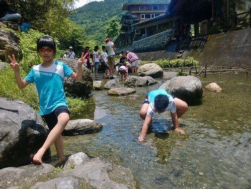](http://flickr.com/photos/33703965@N00/14525576976)不過這意外的戲水 已夠讓徹愛消暑且更不以為意騎車的辛苦 在我們戲水的同時間 徹爸則高坐在溪邊 有如修行的憎人阿 [ 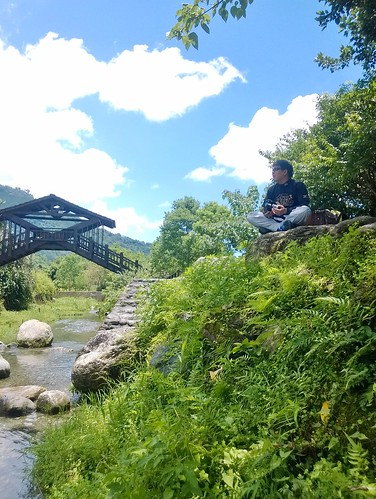](http://flickr.com/photos/33703965@N00/14362043959)在馬太鞍戲水到一點 我們得再上路趕完今天的路程了

不過趕路前還是先繞進光復糖廠吃個冰先  一人一隻冰棒或冰淇淋 解涼也解饞 [ 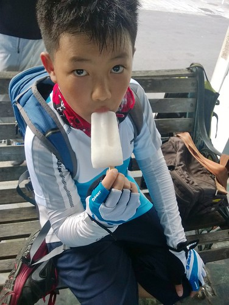](http://flickr.com/photos/33703965@N00/14525586946)不過我們真的覺得還是鳳林的冰淇淋比較好吃說.... 
