有些地方 喜歡在特定的時節一去再去... 龜山島襯著的外澳沙灘是我們家的夏日經典場景 每次我們總趕在秋老虎前才來這裏抓夏天的尾巴 但今年總算不落夏後! 多虧徹爸要去宜蘭喜酒宴才激發我們對暑假酷暑與車潮的忍受 讓我們今夏提早享受到踏在這片沙灘的歡愉與踏實~ 

會甘願冒著塞車之苦 在暑假週末來到宜蘭為的就是到外澳 只是外澳得留在出門一整天 在宜蘭上了山也傳了藝的下午四點過後才能來 思念這片沙灘一整年的兄妹倆 一踏上這片沙 手舞足蹈的往海的方向跑去  沙灘上的拖曳傘 水上活動如火如荼的被進行著 [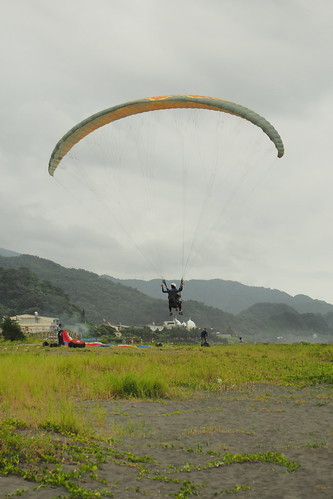](http://flickr.com/photos/33703965@N00/14471685339) 只是這些都與徹愛無關 他們心裡想的 眼裡看的 手上玩的都是這片沙 [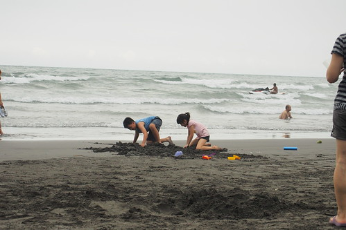](http://flickr.com/photos/33703965@N00/14471457919) 伴著兄妹好多年的玩沙小工具 雖然在一次次的不小心隨浪漂走後所剩無幾 但也無仿了 因為野心勃勃兄妹倆雙手萬能!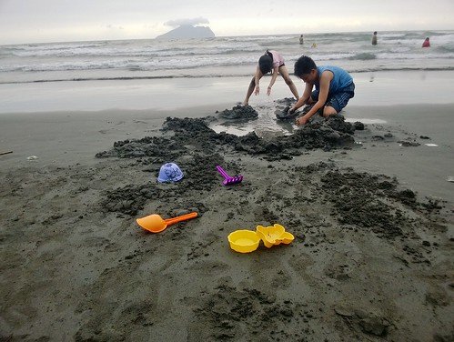 兄妹倆卯起來玩沙的模樣 真的很好笑  努力的挖 [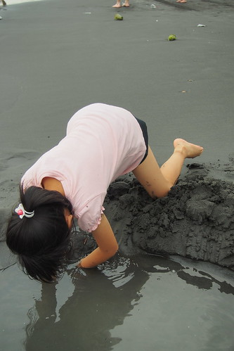](http://flickr.com/photos/33703965@N00/14657684442) 奮力的築 就是想蓋個壩 怎奈海浪一波波的來 壩蓋了就流  流了再蓋...  兄妹倆傻的讓我跟徹爸看著猛搖頭 [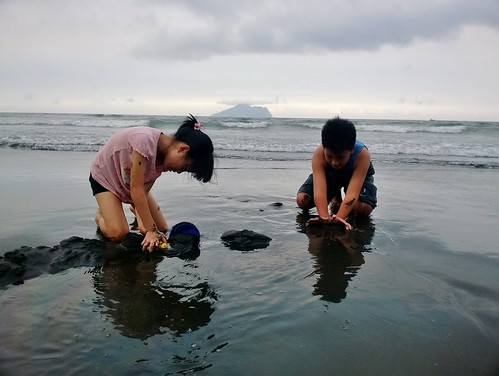](http://flickr.com/photos/33703965@N00/14635372696) 兄妹倆奮鬥的同時 我跟徹爸就坐在不遠處的小椅子上 [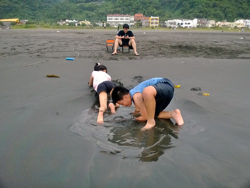](http://flickr.com/photos/33703965@N00/14655935634) 看海 看天 看小孩 (還有看手機) 好不愜意... (每次我們倆人也都會在這自拍一張 回家後比對來年照片 看有沒有變老了) [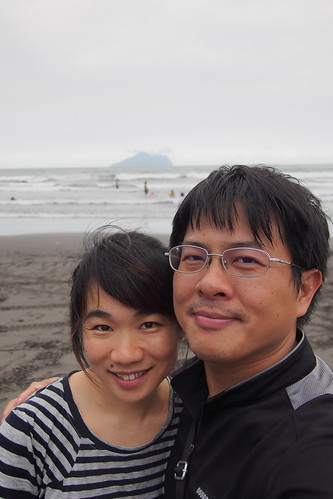](http://flickr.com/photos/33703965@N00/14471718208) 我們只消在小孩吃沙喝海 苦不堪言的時候  幫她們拭去滿臉的沙  滿嘴的鹹  其他時間盡是笑看著眼前兄妹倆 歷年來在這片沙灘上的徹愛影像一幕幕在我腦海裡放映著 不可言喻的感動阿!!! [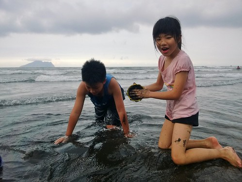](http://flickr.com/photos/33703965@N00/14658349455) 雖然徹愛真的長大了許多 但倆人卻依然幼稚的喜歡這樣堆沙戲沙 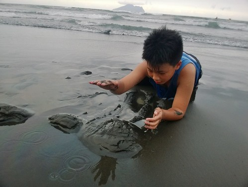尤其徹哥更是沒顧忌的 完全獻身 惝洋在沙灘上  真的 這樣純蠢的徹哥是幸福的! [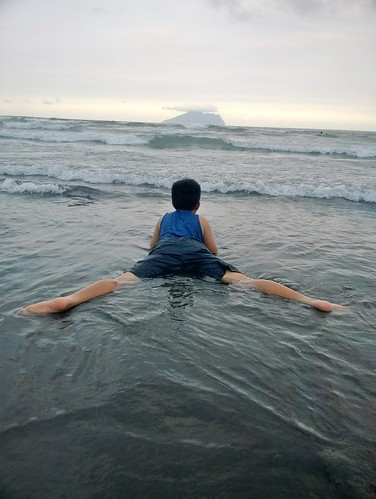](http://flickr.com/photos/33703965@N00/14655136361) 但除了幼稚的玩 徹哥卻也更怡然於海水的潮來浪往  一個人靜靜的坐在 也許是休息 也許是放空  也也許就是單純感受大海的接觸  我跟徹爸好喜歡眼前的這一幕幕  有開心  有自在  孩子這樣開心又自在這一幕 就是爸媽心中的最美風景阿! 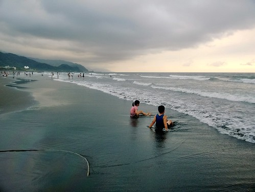 雖然下一個浪來 壩就垮了 徹愛留下的名字就褪去[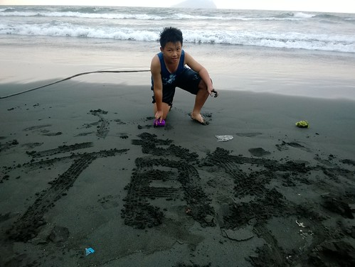](http://flickr.com/photos/33703965@N00/14471744479) 但徹愛的心裡卻早已留下這抹記憶痕跡~  徹家很棒的夏日沙灘回憶阿! 今日出擊 果然成功!!! 

後記: 早早去外澳報到就已夠讓徹愛這個七月開心了 沒想到另一個必備的夏日回憶 溪邊烤肉戲水竟也出乎預期的在下一個週末來到  五個兄弟姐妹打水仗 [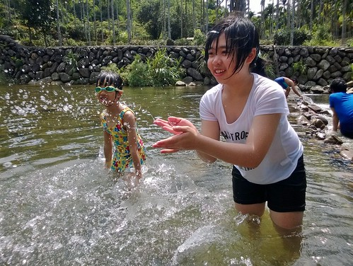](http://flickr.com/photos/33703965@N00/14518682750) 玩石頭  築壩 (硬是讓水面提升了3-40公分 好強)  抓魚抓蝦 浮潛看水流 [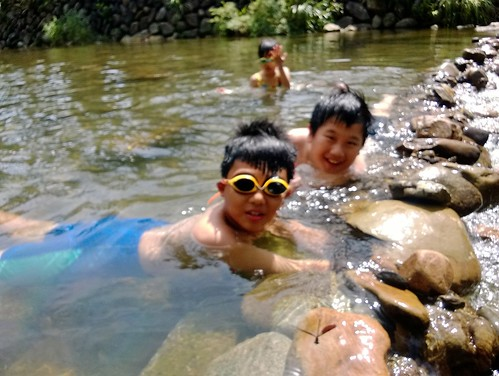](http://flickr.com/photos/33703965@N00/14518690020) 五個孩子玩的好開心 [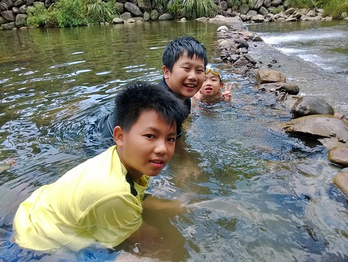](http://flickr.com/photos/33703965@N00/14518699049) 只是孩子的快樂度卻隨著年齡而遞減 只有阿徹不若差沒幾個月的表哥表姊那樣早熟 依然從頭忙(玩)到尾 [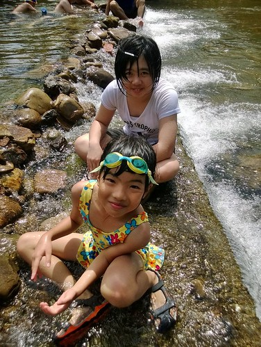](http://flickr.com/photos/33703965@N00/14702962994) 而愛當然也是跟他哥哥一樣的開心嚕 我說沙灘 溪水全都在七月享受到了 這個七月真是太陽光太熱血也太讓徹愛意猶未竟~  很久沒有看到這幾個毛頭聚在一起玩 還玩的這樣開心 心中感觸又不小心的給他滿溢: 30年前的三峽, 現在的坪林烤肉戲水都是陳家爸媽給小孩,給孫子的夏日回憶~ 小人們拚命似的不是玩就是吃，大人則甘之如飴的一直烤,一直餵,一直吃著多到嚇人的豬魚雞蝦肉，從上午十點的早餐到下午四點的晚餐... 只是這樣的回憶隨著將上六年級的三個毛頭漸漸青春，終也將畫上句點! 這也是一種被小孩追著老的體現與感嘆...
