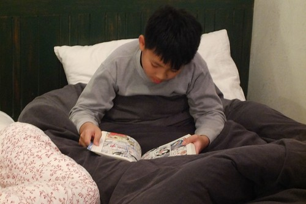
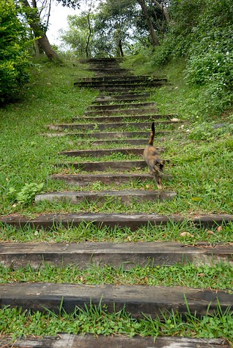

前幾天一家子住在國家森林遊樂區的山莊 睡不好覺的枕頭 難得令我們搖頭的早餐餐點 讓一家子懷念每次花東旅行的好住好吃! 選擇民宿 需要點直覺 才能單憑網路資訊就做選擇 卻也是種緣分 才能在茫茫網路世界與眾多民宿中 遇見這些美好的人事物~ 把這回下榻的四晚民宿兜在一篇一起回味:

一直蠻喜歡瑞穗這個地方 有好吃的牛奶鍋 黃濯濯的生男溫泉 以及幾年前住過的東岡秀川 很令我們回味 雖然東岡秀川並不是民宿 但小而美的渡假村經營模式還是讓人有回到家的溫暖感覺  簡單寬敞的四人房  每個房內的室外家庭湯池  戶外的大眾湯池區 品質與維護的都還不錯  真的黃濯濯的溫泉水 不是不乾淨而是原汁原味 泡了皮膚會咕溜咕溜喔  房間內湯池旁的和室小棧臺 寧靜愜意的讓徹愛享受在這的閱讀~  

第二晚下榻在台東鹿野的森活B&B民宿 這是透過生力農場老闆娘推薦而放入口袋名單好些年的民宿  不是預期中的高台地區 森活座落在另一邊鹿野的田野中  房間內挑高且12坪大的空間 讓徹愛大呼"好豪華 好漂亮"  一直幻想的搖椅更是愛愛最喜歡的小角落  第二天 我們刻意起了大早 趁著八點用早餐前騎腳踏車晃晃  民宿不遠處有條美麗的小欖仁道  如果時間允許 跟著樹 順著路一直騎下去 肯定很過癮  民宿有片大草坪 草坪與建物各角落有不少的椅子與鞦韆擺放 讓人隨興就可坐下來看書 聊天或發呆  很能讓小孩跑跳的好環境  森活 不論是建築 環境 擺設佈置到早餐餐點 給人感覺都很舒服用心  我常說早餐是一個民宿的指標 不需豪華 但一份用心 應用在地食材的早餐 讓我們更是珍惜與民宿的這份美好相遇  雖然因為入住的那晚趕去初鹿吃野餐鍋 第二天早上又趕赴森林博物館活動 沒能在森活多停留些 有些遺憾與對主人的過意不去... 但以後有機會一定來好好補上! 

第三晚落腳在台東長濱鄉 自從兩年前住過老舍後 我們就喜歡這個有些遺世獨立的長濱 一家子一直難忘老舍的美好 ([blog.yam.com/hmchen1975/article/46737523](http://blog.yam.com/hmchen1975/article/46737523)) 只可惜那一年老舍便易主經營 再住老舍已成不可實現的期望 老舍是當初找長濱民宿時 難得喜歡且可以接受小孩住房的民宿 這回喜歡上的陽光佈居 如長濱其他吸引人的民宿 限制10歲以下兒童的入住 於是我用著拗拗看的厚臉皮 拜託主人接受我們家那個只有九歲的小女兒 記得那時後電話中 我說"我們家女兒很乖 可以放心"  女主人說"每個爸媽都說自己小孩很乖" 當下 我只能傻笑兩聲 但我還是不死心的拜託著女主人 請她通融 很幸運的 主人家接受了我們的訂房! 讓我們的長濱回憶再添一個美好  一如長濱其他民宿的風格 不破壞 不突兀的清水模建築 但陽光佈居不同的位處於一個離海較遠 但視野更遼闊的山腰上  陽光佈居如老舍一樣的寧靜 溫馨 但多份帶著文人氣息的細膩 四人房裡 軟硬適中的床鋪 加上簡單卻別有風格的空間佈置  讓我們睡得一晚好覺  這是徹愛睡的床鋪 兩人好喜歡這個有點小閣樓味道的小空間  經徹爸點醒我才發現 室內沒有一個空間是方正的 一個個區域如蜂巢似的鑲嵌著 讓空間變得有趣  跟房間廁所一樣空間大小的畸零角在一樓是可以喝茶的安靜小角落  二樓的小客廳聯繫著各個房間的出入  樓梯旁的書架上放滿滿的各式書籍 連小學生也喜歡  有喜歡的尋寶系列書籍  讓徹哥享受在這的時光  愛愛則一貫的方式沉浸在自己的世界  夜晚的陽光佈居很美  更顯出女主人妝點佈置的慧心巧手  一樓是開放空間的公共區域 許多水果 點心 茶包提供的開放廚房  一張大長桌為主角的交誼區  那個晚上我們一家子在這大長桌玩大富翁遊戲 隔天早上也跟所有房客還有主人一起共桌早餐  這一天的早餐很豐富 (也吃了兩小時之久) 不只是念陽大哥還有慈佈姐親手準備的用心 還有同桌房客以及念陽大哥的人生經驗分享  如同念陽大哥說 緣份 讓大家這個早上一起坐在這分享與學習 民宿 讓我們接觸 體驗 不同主人家的人生與生活  豐富我們的旅行與人生  11點退房離去前 我們把握最後的機會在房子外散個步  還有盪盪那個掛在大樹下的鞦韆  很愜意的一個畫面  貓 一直跟著我們散步  徹愛喜愛的直摸著 逗著貓  還有這隻讓我們大開眼界的哈士奇 跟男主人對唱歌劇時的引吭高歌模樣 真是太太太神奇  真的很妙 很美 很特別的民宿  對了! 還有件事很有趣 因為是拜託主人通融讓不滿條件的我們入住 因此事前特別叮嚀小人在這要安靜乖巧點 結果徹爸與兄妹倆 在房子裡講話不自覺就會壓低聲量 像在講悄悄話般 我說不用這麼刻意啦 但父子三人卻不以為意的一直用那樣的方式講話 或許就像徹愛說 在這忍不住就會這樣安靜的說話... 而沒想到兄妹倆竟然還很喜歡這裡 回家後跟我提了好幾次還想再去住陽光佈居! 

第四天住的是去年底我才來過的花蓮羅山 月荷塘 ([blog.yam.com/hmchen1975/article/71225641](http://blog.yam.com/hmchen1975/article/71225641))  再訪的我 不客氣的自己坐客起  主人忙著社區事務的下午 我們逕自在餐廳裡閱讀休息 而徹愛則跟小主人 欒欒 一起打羽球  一起玩我們帶來的大富翁  還有欒欒同我們分享的UNO遊戲  隔天聽到女主人說 "昨晚欒欒跟我說 她今天好開心" 我也好高興  隔天早上我們體驗完炒米香活動後 刻意的再回到月荷塘跟欒欒說再見 兩個大小孩把握機會的再打最後一場羽球  欒欒姐姐還把家裡僅長成的一朵草莓送給了愛愛 草莓入口後 愛愛說好甜 一臉滿足 我想不只因為草莓甜 也在姐姐同她分享的那份美好  雖然時間很短暫 雖然或許彼此是過客 但卻是小學生美好的回憶 同時 也是這樣的親切感 讓徹愛回家後一樣嚷著好想再去那個像是朋友家的民宿~  對了! 這回我總算在早餐入肚前 記得照張相 自家手工麵包 加上蒸地瓜 太陽蛋與青菜燉煮 很羅山精神的有機一餐! 
