去年11月一個人來去羅山住一晚後 便一直記得與月荷塘及徹愛的承諾 這回一家子實現諾言的來了羅山住一晚 而且真的就如拜訪朋友般的 很沒有安排 很隨意 很自在 也很溫暖... 同時 因為被柑仔店老闆娘刺激(提醒啦) 而臨時安排的炒米香體驗 更是新奇又豐富我們的羅山農村體驗~

寫之前 回味了一下之前寫的羅山 平實的景色 但再回味時依然驚艷 著迷不已 [blog.yam.com/hmchen1975/article/59669319](http://blog.yam.com/hmchen1975/article/59669319) [blog.yam.com/hmchen1975/article/71225641](http://blog.yam.com/hmchen1975/article/71225641)

不到三點 我們就來到羅山村以及入住的月荷塘 天氣很冷 民宿主人又正忙著  於是我們穿上所有禦寒外套去村子裡散步  迷你但整齊乾淨的小村子 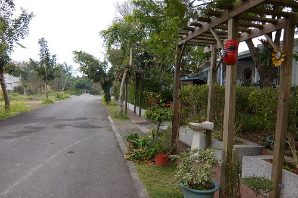 很適合這樣沒有目的的漫步著 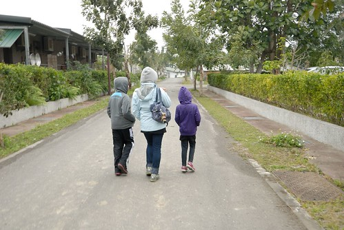 路邊的小花 小草 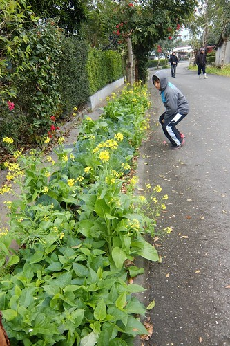 在在引起好奇小學生的注意 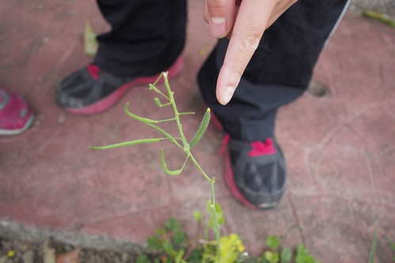 關著門但門外一樣開店狀態的園藝店 引人遐想... 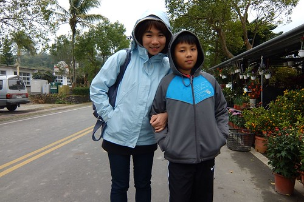 別誤會 是引我們看花的遐想啦!!! 不過農村生活的單純也由此可見 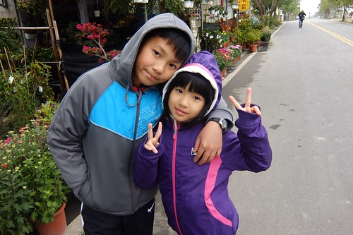 村子很小 我們很久但也很快的走了一圈  到柑仔店裡買了小零食帶回民宿  也結束我們的午後小散步 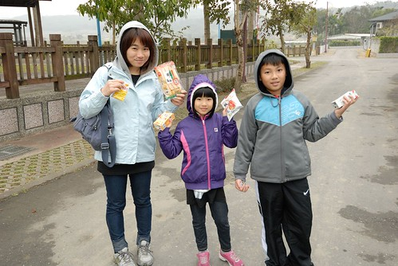 在柑仔店買東西時 老闆娘問 來到羅山有沒有來個羅山三寶體驗 火山泥豆腐 炒米香 手工麵包 沒體驗過就枉費自己來過羅山 阿?! 第三回來的我們 好像太對不起羅山 太枉自己了... 受刺激的我們趕緊安排預約了隔日早上的炒米香體驗 依著民宿女主人的指示 沿著路就能看見的羅山最大招牌   我們來到雞鳴園  老闆忙著做材料最後的準備  我們剛好蹲在門口看老闆娘醃蘿蔔與聊天  老闆夫婦二人很可愛 前一晚聽到我選擇黑糖口味的炒米香時 一直唸著說 "橘皮口味好啦 如果讓月荷塘(民宿)老闆娘知道不是做橘子的 他會說我怎麼沒讓你們做橘皮的啦' 對於她們家招牌的橘子皮口味炒米香深具信心 但也同時很怕讓我們的民宿主人以為招待不周阿 可是因為我怕橘皮的苦味小孩不喜歡 所以我還是堅持預約黑糖口味 只是當天聽到老闆準備著橘子皮 而且誠懇(但我懷疑是裝傻)的說著"橘皮口味阿!" 我們也只能歡喜接受農家這的盛情款待~ 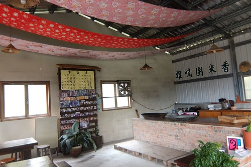 炒米香跟之前我們有做的氣球體驗很像 每一個步驟都要把握時效的不容拖延  緊湊的讓人冒汗 炒米香前要先把鍋中的鹽炒熱  別看這一點沙 快速轉炒個幾回就夠讓我們這些肉雞喊手痠  而且鍋子散發出的高溫也有些熱人 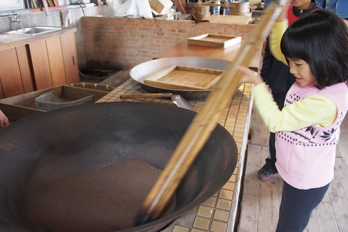 沙子的溫度夠高後(這當然要靠老闆的鐵砂掌感受)  就準備將曝曬的很乾很乾的糙米分批少量的倒入鍋中炒  這個步驟最是讓人緊張 米一倒入後就要快速翻炒 讓米受熱均勻 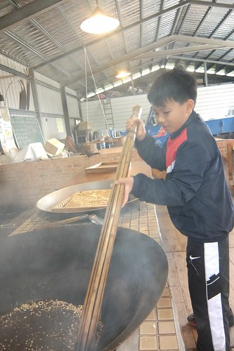 沒幾十秒鐘 米爆的差不多後 更要趕緊的撈起過篩 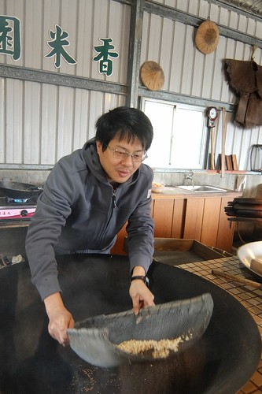 炒與撈 我與徹爸 輪番上陣 合作無間 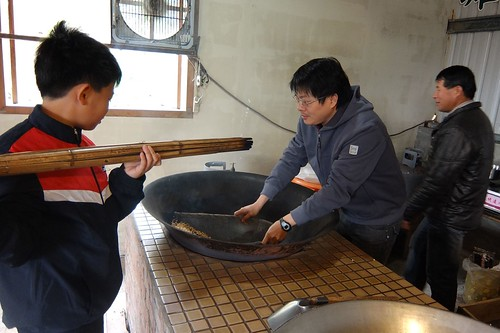 親眼看著米剎那間一顆顆變了樣 真的很神奇 而且香噴 金黃的 讓人好期待等會的結果 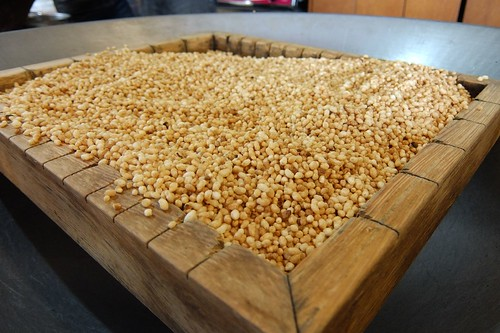 老闆估了估 且稱了稱份量是否足夠後 進入收尾的階段  拌入大量的黑芝麻  同時間 老闆最後大火熬煮橘皮醬 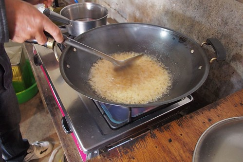 然後超帥氣的將橘皮醬倒入另一個大炒鍋中  然後再次需要我們的快速翻炒  這時後媽媽的拿鍋鏟本事展露無遺 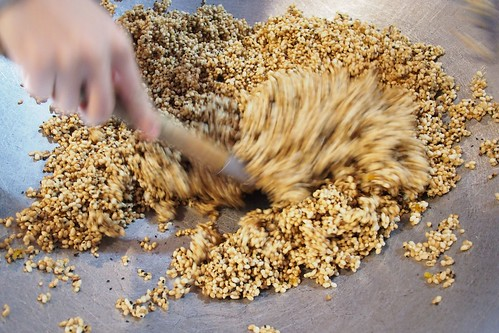 醬拌均後 由老闆將燒燙燙的米糰倒入模  然後趁醬冷掉變硬前 桿壓平整 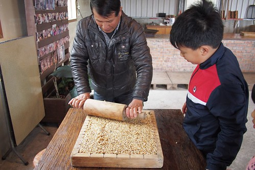 看完老闆的示範 我們派出徹哥掌棍 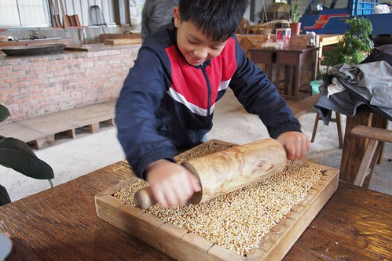 在一家子的喊燒 喊快下 徹哥賣力桿著  老闆做最後的確認與補強後  我們的炒米香 漂亮成形  不過 最後的之後還要把握時間的趕緊切割  沒想到要切整齊 還真得些手勁 於是這重責大任落給徹爸  徹爸果然有工匠之風 架勢十足  切割好後 老闆俐落的分裝入袋  並封裝完成! 原以為沒多少的一"模" 沒想到最後竟然有六袋裝的成品可帶回 讓我們又驚又喜  老闆在分裝的一開始便先給我們一人一塊嚐鮮  第一口咬下後 我忍不住要喊"傑克! 這太神奇了吧" 橘皮口味的炒米香也未免太特別又太美味!!!  一家子親手做的炒米香是這回旅行 阿徹帶回與老師隊友分享的最佳伴手禮阿 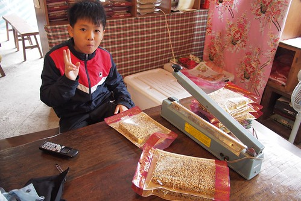 真高興 我們受了柑仔店老闆娘的刺激 於是有了這段這樣美好美味的農村炒米香體驗~
