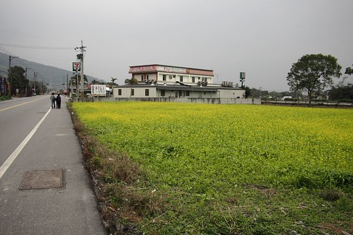
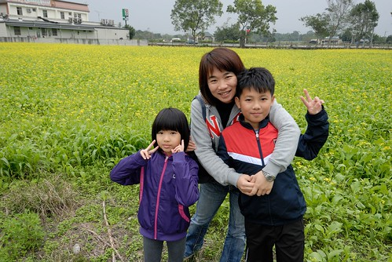

過程 比起結果 常常更為重要且令人回味無窮 移動 之於旅行 是必需 也是旅行中最美麗的意外邂逅  

蘇花公路距離蘇澳起點10多公里的路段有著美麗的海灣 每次開車經過 我們總會放慢速度 引頸往左前遠方看  好天氣時 藍天綠海 讓人心曠神怡 天氣不好時  灰濛濛的海跟天連成一片 神秘卻靜謐   

不再以油菜花為主題的冬季旅行 遇見油菜花時反倒有驚喜的好心情  第一天在鳳林吃完中餐後 我們在餐廳附近散步著 親近這次旅行的第一畝油菜花田  油菜花田不大 但因為茂密加上不期而遇 讓我們好是開心  黃黃綠綠的油菜花田 是我最喜歡的照片背景 

從花蓮玉里趕往台東鹿野的台九線上  傍晚時分的光暈是大地最溫柔的染色  車子平緩的帶我們移動著 也讓我們沉浸一段祥和美好時光中 尤其當後座小人一片昏睡中 

池上土地公廟前的油菜花 沉寂幾年後又一年比一年盎然了  因為新注入 讓農村欣欣向榮 花東十年來的變化 徹家點滴在心頭阿~ 

已蓄滿水準備插秧的稻田裡 依然見著的油菜花令人有些錯愕 但這一幕卻也衝突美麗的令人驚艷  在花東 在山上的夜晚 每次從車子出來時總會習慣性的抬頭 上頭的滿天星斗 遠方又圓又亮的月亮 哇~  每次我們總忍不住張大嘴這樣"哇"著 

寒流 讓第四天的原定行程全部取消 只剩前後兩天民宿間的移動 因為這樣 反倒放慢腳步 晚晚的check-out 早早的check-in 也才有興致在台30泡了路邊的安通溫泉  臉上吹的風很冷 但腳上泡的溫泉好熱 好像感受到一些些雪地裡泡溫泉的幸福  身子越泡越暖 徹愛的褲子也越撈越高 恨不得直接脫到只剩小褲褲 大辣辣的泡起湯  乖~  下回有心理準備了 再來全家一起泡這公共路邊溫泉  今天就不貪心的泡泡腳 人生難得幾回 一家子一起泡腳  在這冷颼颼的天氣裡...  花東旅行最好的安排就是多些時間慢慢移動 發現屬於自己的最美麗風景~
