很剛好 這兩次到台東旅行前家裡的米缸都空了 但卻也是刻意的 非要在路過關山時到人家家裡去訂米 為了這刻意 出門的前幾天 缺米的家裡晚餐不是吃麵就是吃糯米煮的米糕 徹爸說打電話訂不是方便又省事 我說既然都會路過就自己載就好啦 而其實因為我心裡偷偷打著如意算盤... 早在南島秧滿田在稻子收割並在田裡灑下蘿蔔種子後 我就一直期待我們的寒假旅行時可以親睹盛產的蘿蔔田 幸運的 就在我們旅行出發前一週 果然南島秧滿田在FB上公告歡迎大家來關山採蘿蔔 然後 我當然就來訂米的同時厚著臉皮接受農家熱情的採蘿蔔邀約嚕~ 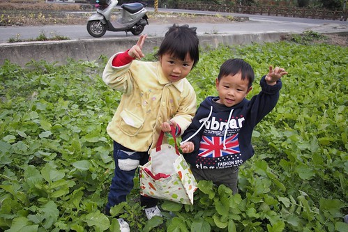

在店裡買好米後 我們跟著老闆娘的小機車來到南島秧滿田的自家田地裡 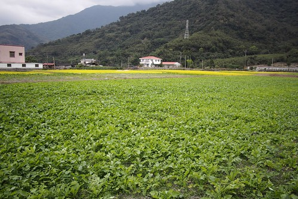 我們是蘿蔔可以採收後 第一組受邀來採蘿蔔的客人 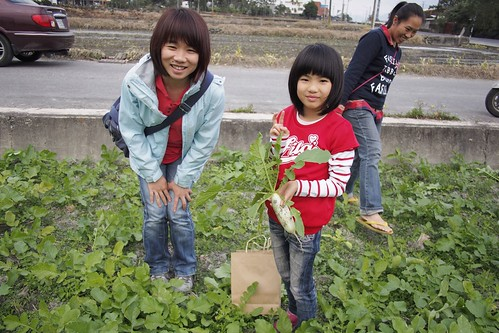 而第一次採蘿蔔的我們不只與有榮焉也超級的新鮮與開心 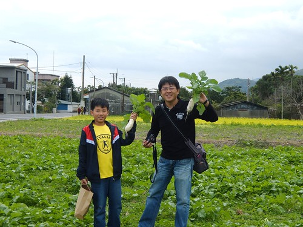 旺盛的蘿蔔田任我們盡情採收 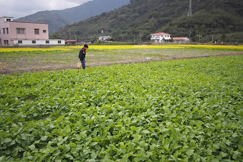 我們的徹哥也真的不客氣放手大採 採的不亦樂乎 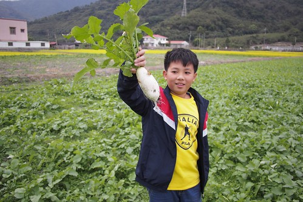 就如玟姿後來在FB上分享的拔紅蘿蔔經驗: "沒拔過白蘿蔔，但拔過紅蘿蔔， 拔蘿蔔不是件容易的事， 以為土裡埋著的是大蘿蔔，用力一拔卻是個小蘿蔔， 土壤上看起來像是個不起眼、營養不良的小蘿蔔， 誰知埋在土裡的卻是個壯碩的大個子， 拔蘿蔔是個有學問的差事， 得要跟和土地最親的小老師好好學學呦！"

我們認真 努力的想挑顆大蘿蔔拔 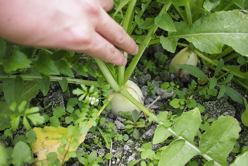 有時候如意的拔出令人振奮的大蘿蔔 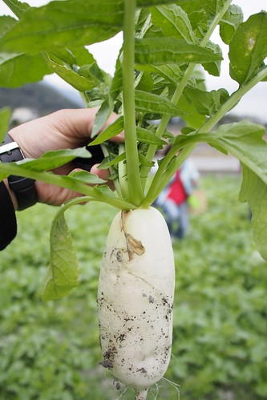 但更多時後是以為很大的小蘿蔔 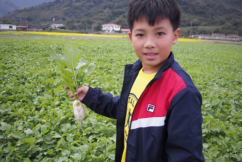 甚至還拔到了完全令人想像不到的雙胞胎蘿蔔 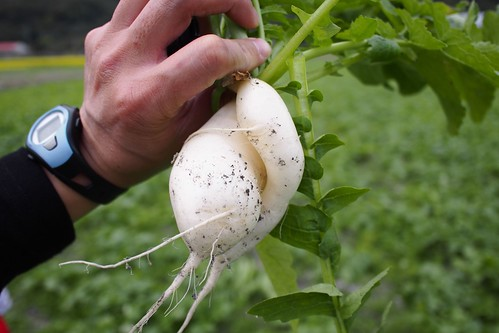 雖然我猛喊著 "夠了夠了 有體驗也拔了一袋就夠了" 但我們還是拔著不亦樂乎 看到可能是大蘿蔔的蘿蔔就想拔起來驗證下 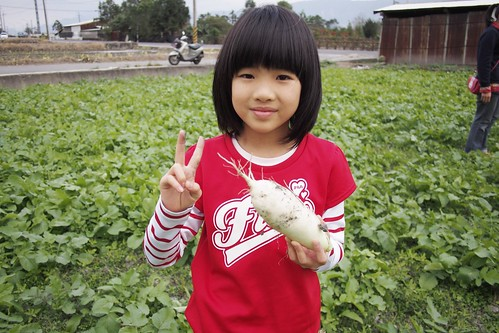 南島秧滿田的小公主跟著我們也拔的好開心 一直喊著"這個好大!" 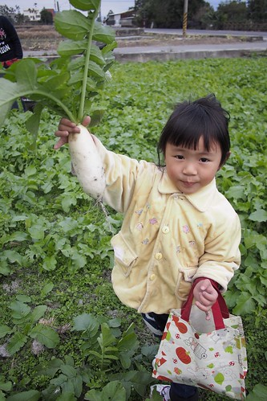 真的! 小公主拔的蘿蔔都不小 好厲害! 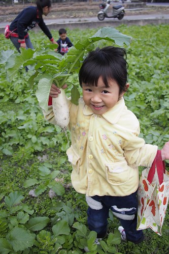 姊姊是能幹的拔蘿蔔小公主 兩歲小弟弟則是盡責的顧蘿蔔小王子 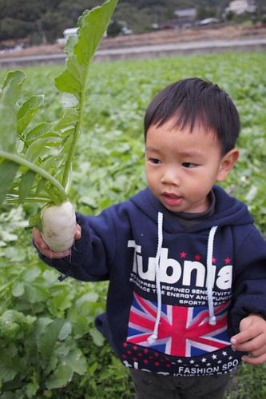 裝滿滿兩大袋蘿蔔 是南島秧滿田一家子送給我們的最佳買米小禮物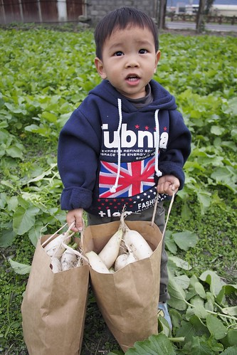 是給我們一家子最棒的田野體驗回憶~ 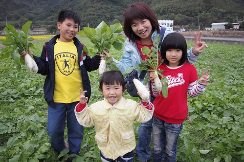

拔完蘿蔔還心漾不已的我們 又幸運的在往台九的鄉道上遇見一大片茂密油菜花田 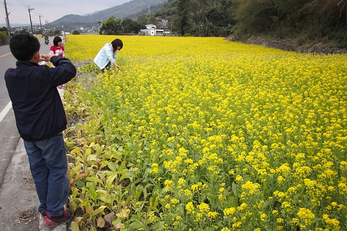 停車本是要拍美麗花田照 漂亮的照片沒拍成 母子三人卻當起採花賊 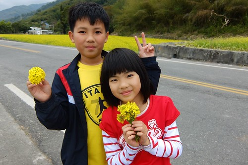 兩束小捧花 讓公主愛與王子徹眼神漾著浪漫 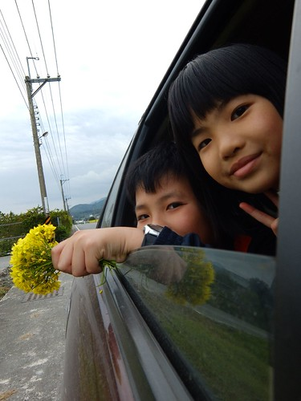 花瓣一瓣瓣摘 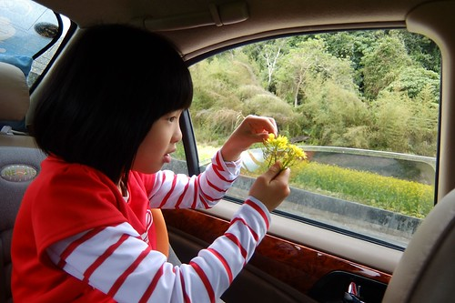 一瓣瓣許著願 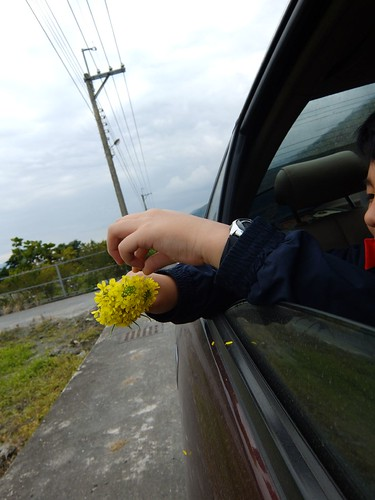 白蘿蔔 黃油菜花 今年冬天 關山的稻田好豐富 好美麗~
