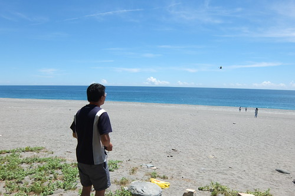

小學生這二天就要結業式放寒假了 媽媽也總算在寒假前寫完暑假環島的最後一篇 再次給自己的莫名堅持拍拍手~ 這個寒假徹家將有個不同以往的大旅行 一家很是期待卻也對於這個寒假沒能到花東走走有些遺憾 就像環島的後二天 我們趕路的從台東最南端太麻里回到台北的家 雖然只是短暫的經過每個鄉 停留一些鎮 但走過就是一份安心與寬心 而花東旅行的美好就在這很多的其實沒什麼但很有什麼的所有!

從太麻里山下來後為了找郵局讓愛愛寄明信片 我們誤打誤撞來到太麻里的千禧曙光紀念園區  隱於台九村落,防風林後的一片美麗沙灘  意外的離太平洋這麼近 徹爸按耐不住興奮的下車飛飛他的直升機  以太平洋為布幕的飛翔 讓徹爸好開心 我說旅行這麼多天 徹爸這時的笑容最燦爛阿  心滿意足的徹爸更是喜愛這夏的太平洋 我們也跟著愉悅的一直往北方駛沒有停歇,我們直搗台東糖廠 難得可遇在台東舉辦的2014台灣設計展 我們來參觀也是休息  設計展與我們誤以為(過多連想)的發明展很不同 是以文創為主的設計與發明  裡頭有不少可愛或溫暖或別出心裁的創意設計展示     這個主題為太平洋的藍色球池(稱他為球池雖然low了但很貼切阿)最讓我們喜歡 置身其中就好像在洗藍色泡泡浴甚或優游大海  在這 徹爸依然亢奮的為他直升機進行一幕幕的外拍 新東糖廠很大 但正中午時分的太陽熾熱的讓我們看完展覽後就趕緊躲回車上  繼續往我們的下一站前進 (這幕是卑南綠色隧道) 經過台東的中午當然 肯定 要來我們家最愛的原生植物園野菜涮涮鍋 果然如徹爸說的 中午來吃鍋戰鬥力最好 而已經自己開一鍋的愛愛也好厲害的可以煮好多吃好多  更別說每次總是吃到喉嚨飽的徹爸父子倆 對有野菜鍋的花東旅行戀戀不忘阿! 雖然我們只是路過...  心滿意足飽食一頓後 我們真的就要趕路了  同時間 總算玩累又飽撐的徹愛則好好休息補眠  睡得東倒西歪 (愛愛每次睡醒都會哀嚎 她的脖子要斷了)  一路經過鹿野 關山 玉里 瑞穗 光復...的往上 雖然徹爸說在花東開車是享受 是幸福 還是要跟他致上無限的感謝與稱讚(真的很耐開!) 這一天也很剛好的會在傍晚時分經過鳳林  我打著或許可以見到花蓮熱氣球的如意算盤  興沖沖的來到鳳林的環保園區卻完全沒見著熱氣球的蹤影! 我說幸運的事果然不會一直有阿! 但剛好在這舒展久坐的筋骨 吹吹涼爽的夏日微風 其實也是很棒的意外! 我們來到二個月前單車旅行住過一晚的鳳林鎮上更是倍感親切  而來到鳳林鎮怎麼能錯過這裡的冰  當然一定要來三立冰淇淋店報到(上回的明新也不錯)  一人一大隻或一大碗的冰  這下真的讓還沒消化完的肚子又飽到晚上去了  但冰真的很好吃! 跟野菜鍋一樣是我們花東旅行的不可不阿!   以致一家人帶著飽意跟泡麵來到今晚借下榻的小溫學姊家  在花蓮教書近10年的學姐 總算這幾年一家三口在花蓮團聚且落地生根 很是替她們感到開心 當然也超羨慕他們可以住在好山好水的花蓮... 也謝謝他們幫我們省下在花蓮市住宿的找房麻煩與費用 大感恩! 

旅行的最後一天 我們只剩"短短"3.5小時回家的路程 很不趕 我們也很不想趕... 我們似有計劃但又很隨性的沿路玩回家 先是去計劃內的七星柴魚博物館備貨  接著來到上回單車旅行錯過而遺憾的三棧溪戲水  放在後車廂的小魚網 還有在屏東里德社區贈的傳統噴槍都是徹愛的戲水工具    沁涼的溪水涼快至極  也愜意萬分  同時間 徹爸當然又在進行他的小飛機外拍  小蒼蠅頭這回跟的我們上山下海 留下不少倩影  當然也飛過好些美麗地方飛著飛機的徹爸真是旅行中最滿足又開心的!  完全不趕時間 我們讓徹愛盡情玩的開心  雖然相較當地少年們的跳水遊戲 我們這些觀光客實在很肉腳  但這樣的愜意十足給我們的暑假畫下完美句點](http://flickr.com/photos/33703965@N00/15080338896)依依不捨離開三棧溪  離開花蓮 繼續踏上我們回家的路  依然司機老張以外的一車子婦幼都睡暈在蘇花公路上  直至東澳餓醒而覓食至南方澳 進出蘇花這麼多年 這麼多次 卻是我們第一次進入蘇花公路口的南方澳漁港 下午一點時分  我們先是到富哥鮮魚湯祭五臟廟  很令我們滿意的 不止海鮮粥到位 料多湯鮮的鮮魚湯CP值很高  飽食後 我們接著散步尋找我與徹爸之前看過介紹的三剛鐵工廠  極具歷史感的舊鐵工廠 門口的小雜貨舖讓我們差點就錯過 原來收藏跟故事都躲在房子後頭以及二樓  二樓展示著許多極具時代見證的照片  與更多的主人家收藏品   挺有趣 但因沒有導覽加上有種闖入民宅的不安感 我們並未停留太久  以前車出蘇花後我們都是直駛加油站上廁所  除了加油站外從未多停留在南方澳 這回不止驚豔於南方澳的鮮魚湯 也意外發現原來這也藏了家有名的涼意叭噗專賣店 真的枉我們這些年進出蘇花這麼多次 相見恨晚阿....  回家的路很漫長 但我們慢慢的一路玩回家 吃回家 心滿意足的不想結束我們的旅行! 這是一趟很棒的多出來的暑假旅行! 也是很棒的一個夏天!!!

The End!
