徹爸說我好久沒寫文了  今天就來繼續寫感覺已經越來越遙遠的暑環島吧! 墾丁的飯店跟民宿非常多多到讓人難以選擇 同時也氣派與價高的讓人很難在旺季裡下得了手 幸好問了旅行達人玟姿 她給了最是推薦的救國團墾丁青年活動中心 寬敞乾淨的環境與房間  加上合理的價錢 讓我們這回在墾丁玩的開心 住的也開心~

 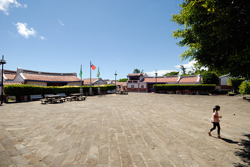 學生時期耳熟能詳 但打從踏出校園後就更沒去過的救國團青年活動中心 沒想到這次意外出現在我們的環島旅行中 順利訂到房後 我跟徹爸異常開心與期待 [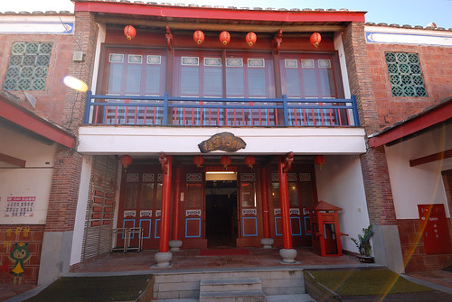](http://flickr.com/photos/33703965@N00/15101140862) 只是徹哥很不喜歡這樣的唐式建築 會讓他聯想起陰森的民間故事與鬼故事 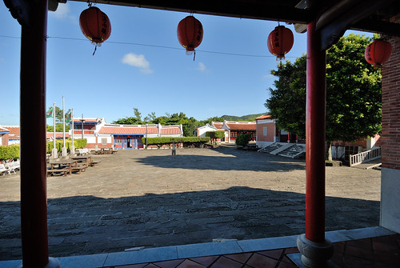 園區內座落好些三合院 [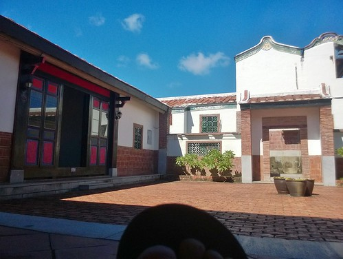](http://flickr.com/photos/33703965@N00/14917012218) 我們住的四人房位處三合院裡的後廂房  房內WIFI收訊並不太好 也因此需要快速的網路時  需得到正廳或埕使用 [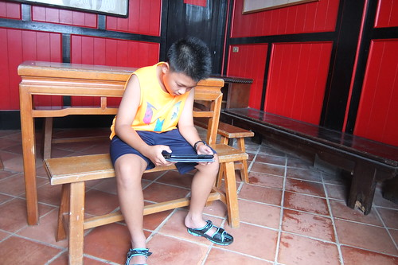](http://flickr.com/photos/33703965@N00/15100031821) 雖然有些不方便 但卻也別有一番閒情逸致 [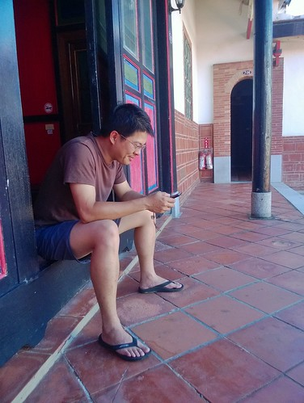](http://flickr.com/photos/33703965@N00/14916884049) 因為住在救國團 我們也才第一次去了墾丁大街 而且還一連二晚都去... (就像回家時順道在巷口的seven買個東西一樣) 位在墾丁大街旁的絕佳地理位置我想或許也是玟姿當初大力推見的原因之一吧! [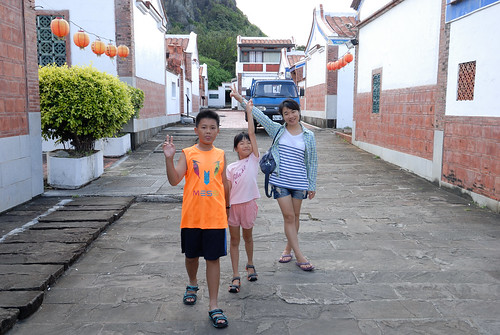](http://flickr.com/photos/33703965@N00/14915427839) 以後如果有人同我問墾丁的住宿 我們應該也會大推薦救國團青年活動中心的! [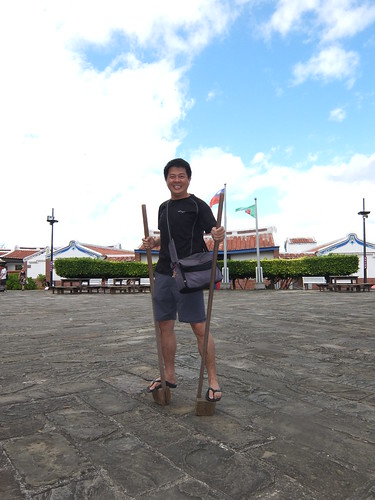](http://flickr.com/photos/33703965@N00/14916589137)

除了園區廣大 逛大街便利外 活動中心後方也緊臨墾丁青蛙石海濱公園  那同時是觀夕陽的好地點 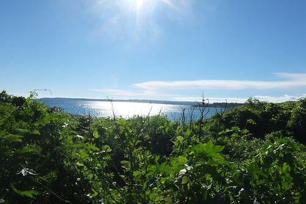 住房的第二天落日前  趁著徹爸午覺不起  我與徹愛一起出門走步道 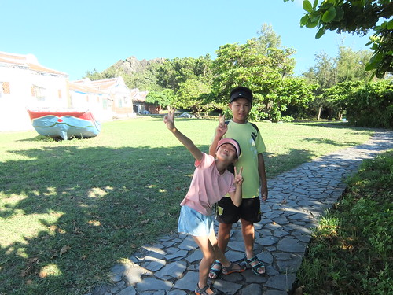 可沒想到步道的入口都還沒到 我們便被路上的情人沙灘指示牌給帶走岔路 [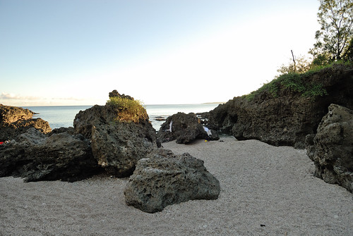](http://flickr.com/photos/33703965@N00/14915480280) 沙灘小小的 但珊瑚礁群與遊客寥寥可數的靜謐 讓我們母子三人喜歡的開心大叫 [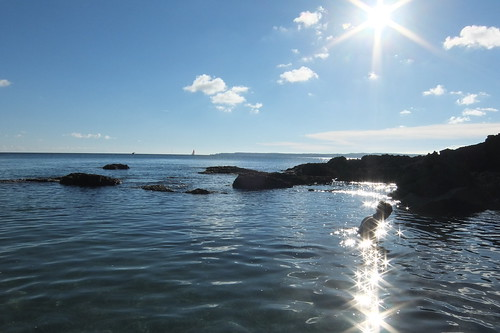](http://flickr.com/photos/33703965@N00/15099903291) 一開始我們只是踩踩海水  觀察珊瑚礁上的生物 [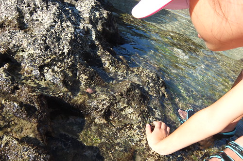](http://flickr.com/photos/33703965@N00/15102901915) 發現一隻揹著美麗貝殼的寄居蟹 [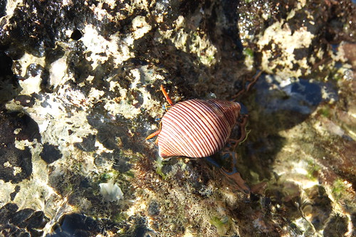](http://flickr.com/photos/33703965@N00/14916345898) 我們忍不住好奇的拿起牠 跟牠打招呼 說牠真是幸福有這樣美麗的家 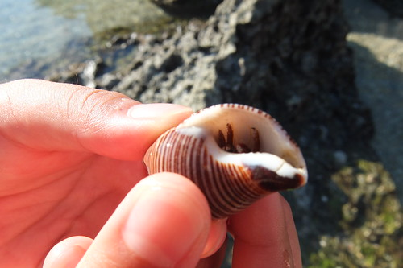然後溫柔的再讓牠回到自己的世界裡 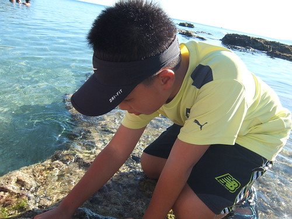 徹愛越玩越是不可收拾  後來我索性也放棄一開始要去走青蛙石濱海步道的計劃 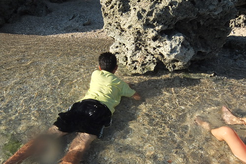 讓兄妹倆好好在這片彷若墾丁世外桃源的小沙灘玩個過癮 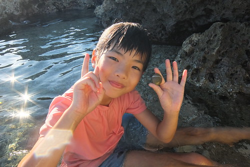 不同於有老師帶領的生態解說  這個傍晚是徹愛自己的自然課 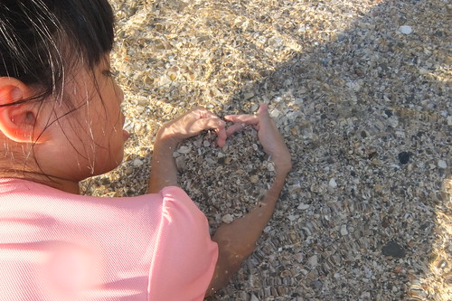 兩人在這個自然教室裡 認真觀察 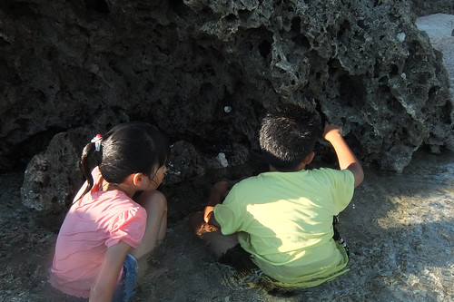 盡情享受藍天 大海的浸漬  一幕幕都好美 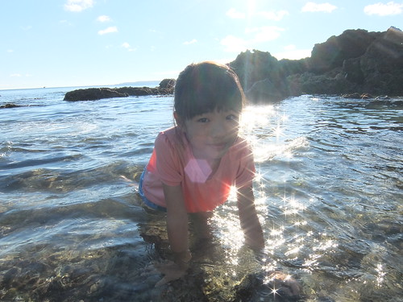 都好令媽媽我感動 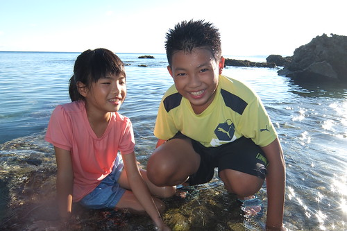 年紀越長也越來越愔水性的徹哥 玩到高點索性把自己拋到海中 載浮載沉 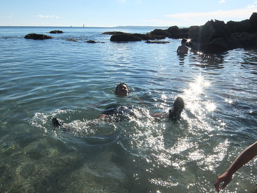 很有緣的 在寥寥可數遊客中的一位香港口音帥大叔看到阿徹這樣熱情陽光 熱心提醒阿徹 把下巴往上抬身體就會更放鬆 浮的更好 果然! 經高人指點後 阿徹的浮漂能力立馬升級 這下阿徹更是漂浮的優雅且放鬆  讓旱鴨子的我們好生羨慕阿... [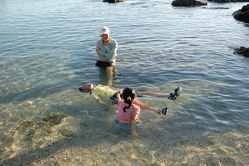](http://flickr.com/photos/33703965@N00/15102103745) 不同於知識收穫的社區生態小旅行 這樣靜謐小沙灘也是我們難忘的旅行中美好時光~ [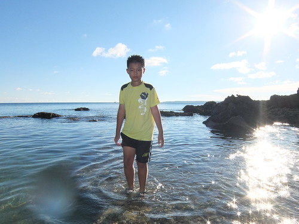](http://flickr.com/photos/33703965@N00/14916598248) 我們在小沙灘待了近二小時 徹爸早已睡醒 太陽也將西下 然後依依不捨離開這片美麗沙灘 我想我會因為這片沙灘想再暑假來墾丁 再住青年活動中心的! 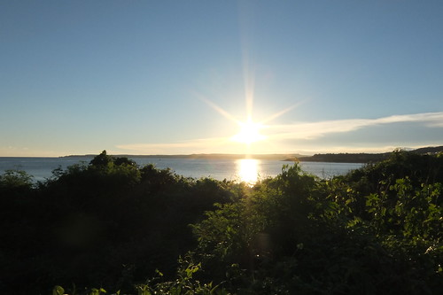 
