這次願意如徹愛的願 暑假帶他們來墾丁 很大的目的是為了讓徹愛來個浮潛初體驗 雖然我跟徹爸都是旱鴨子 而且唯一且最後一次浮潛還是在快20年前 但我們想帶徹愛去浮潛應該很有趣 他們也應該很喜歡吧! 因此在據說是潛水100分好天氣裡 我們來到萬里桐浮潛 一切比我們想像中的順利平安 只是沒想到徹哥是最優游的那個 而愛妹竟是最後唯一不想再有下一次的 果然事情的發展常會出乎我們的意料..........

上網查墾丁的浮潛時 才知道墾丁的浮潛區主要在後壁湖以及近車埕的萬里桐 尤其後壁湖最為知名且熱鬧  因此也絕對不會是我們家選擇的地方 而且網友們筆下的萬里桐小海灣好單純 好純樸  且店家感覺很親切 讓我們更是放心與期待一家子的浮潛初體驗

旅行第四天早上退了房 在北返路上我們順道來到萬里桐 這條路上人車稀少 也沒有墾丁大街大清早的雜亂 很是愜意的美麗 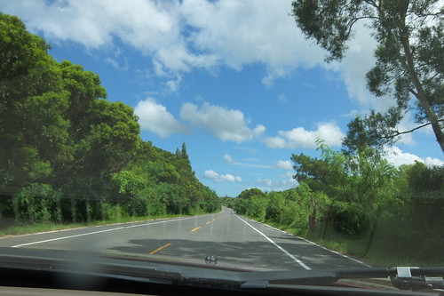 我們有事先與店家預約時間 包含設備的租借以及教練的帶浮 依約定的時間來到店家後  雖然生意很好很忙 老闆娘還是熱絡的招呼我們開始準備 [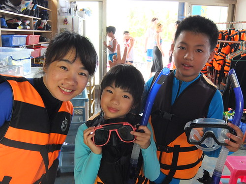](http://flickr.com/photos/33703965@N00/15080145126) 一家子整裝完畢 下水前先照張相 紀錄下這別具意義的一天 [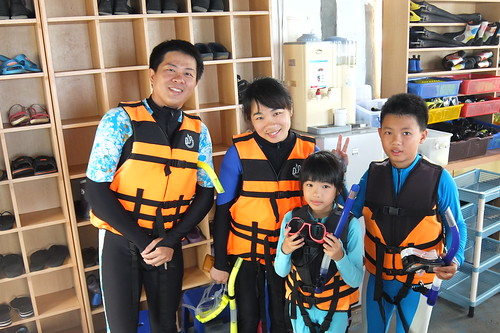](http://flickr.com/photos/33703965@N00/15080052756) 等會我們就要跟著教練到後面的小海灣浮潛嚕 [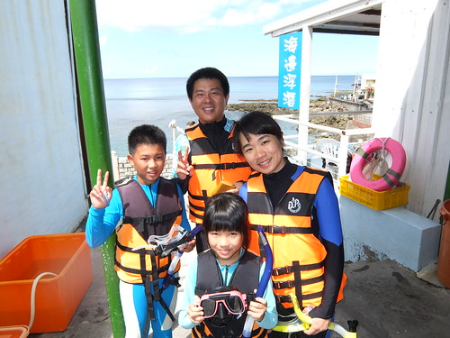](http://flickr.com/photos/33703965@N00/14916513728) 徹哥期待但會小緊張 愛愛則一如既往膽大 異常興奮期待  我們說這個顏色衣服很適合愛   超級卡哇伊 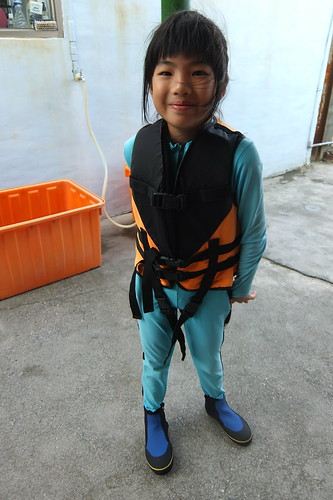 來到小海灣  下海後第一件事便是教練先幫我們拍一張合照 後來我才明白這一張的重要性 因為下海後不論中途或最後都好狼狽阿教練先教我們怎麼戴器具 然後練習水中漂浮與呼吸 愛愛是唯一被教練誇讚浮的放鬆 浮的好的人 而我卻因為不斷的嗆水 完全不OK的令人擔憂與自己好緊張 幸好在回去店裡換掉我那個應該拿錯小孩用的器嘴後  有證明阿母真的沒有那麼不才 (其實因為在我往返換器嘴的10分鐘裡 徹愛她們都已練習好就等我OK才能出海 阿母就算再怎麼弱也只能逞強以免成了大家的拖油瓶阿!)

相較於只有器材租借  多了一百元費用的套裝多了教練的指導 帶出海以及拍照 其實真的蠻值得的  對不黯水性的我們來說也多份安心 雖然徹爸說魚沒有以前在澎湖浮潛看到那樣的多 但可以這樣親近海底世界 看著許多熱帶魚 甚至還有小丑魚在眼前游來游去 已夠令我們興奮開心了! 途中教練也會給我們少許麵包屑餵魚吃  也幫我們拍些照片留作紀念: 從頭到尾表現穩健的徹哥    後來也挺享受的我 (要在一堆照片中找到我們家的 幸好有我那顆痣 超好認)  當然不是問題 但得費心照顧老婆女兒的徹爸  以及後來浮的有些辛苦的愛愛 [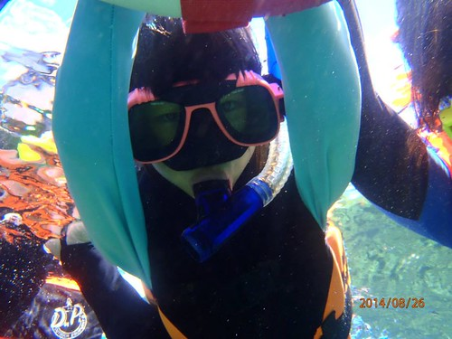](http://flickr.com/photos/33703965@N00/15100787995)一開始最快上手且最開心的愛愛  後來因為身子冷加上越來越緊張 狀況並不是太好 雖然徹爸一直提醒她器嘴不要咬這麼緊 放輕鬆 但後來我看照片才發現 或許問題不是在愛愛太用力而是她的嘴巴真的太小 要撐大嘴 含住器嘴一小時到後來應該真的很累很沒力吧!  其實真的很難辨識的全家福 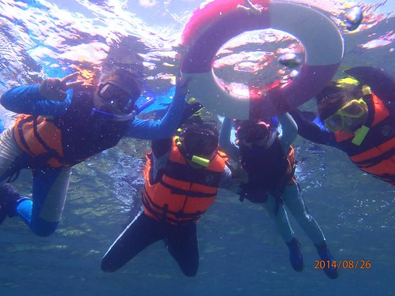 這絕對的醉翁之意不在人的全家紀念照~ [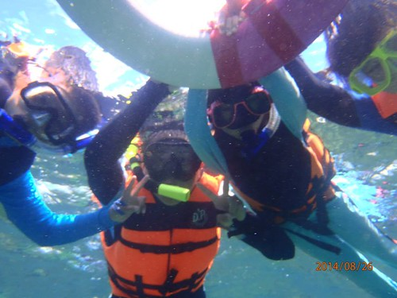](http://flickr.com/photos/33703965@N00/15100434052)所以就算狼狽 也要多拍幾張阿  [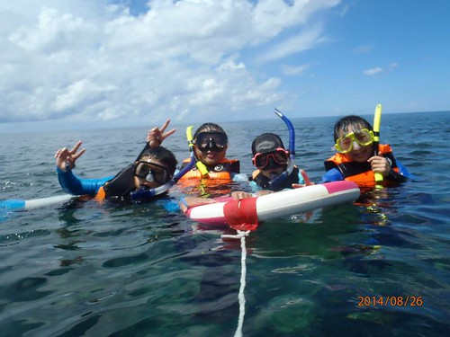](http://flickr.com/photos/33703965@N00/14914234817) 海上漂流半小時多回到腳可以踩的岸邊  教練算是達成任務 迫不及待的要幫我們拍照 我說起碼先讓我們把鼻水擰掉  然後才能乾乾淨淨拍下這別具紀念性的一刻 不可思議的(對旱鴨子我們來講)~ 我們在愛愛九歲前來墾丁浮潛了!!! [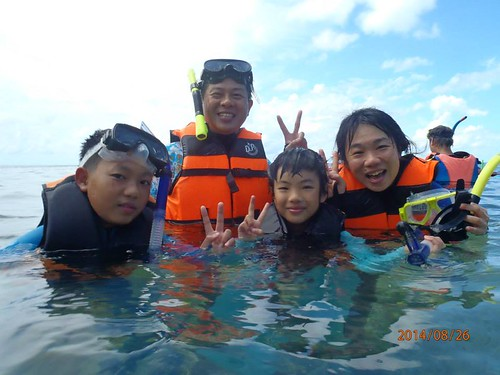](http://flickr.com/photos/33703965@N00/15100788995)

教練完成帶潛任務後 我們可以沒有時間限制的使用器具 可是不會游泳的我們其實浮不遠阿 Orz 因為心理恐懼 根本不敢到踩不到地的地方 太遠的地方 (有些地方就算踩的到地 但因為是珊瑚區也不能踩  )   徹爸努力的協助愛愛 讓她多放鬆 多安心 多看點海底世界  不過最後冷到發抖的身子 還是讓我們母女倆提早上岸洗熱水澡去 [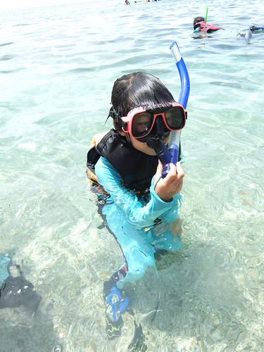](http://flickr.com/photos/33703965@N00/14916580818)同時間徹哥則自己一個人優游的浮潛著 還浮到遠遠 接近警戒線的地方 讓我捏了把冷汗 但徹哥說他沿途看著美麗的海底  清楚自己是往外海的方向去  然後到目的地後又清楚的回岸 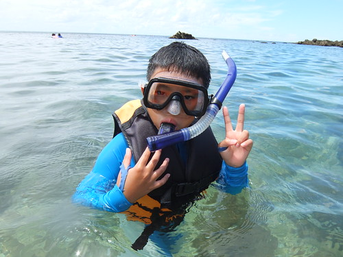 我跟徹爸倆人笑說 徹哥從來沒有一個人這麼勇敢過 可見他真的有享受他的浮潛 有著迷於豐富美麗的海底世界  我們還蠻喜歡萬里桐的浮潛環境 不過份的熱鬧 還保有著小漁村的純樸 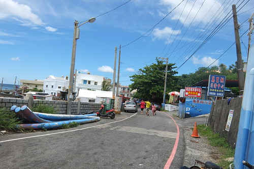 而且小海灣的地勢 有份安心的感覺 (據說這裡是海角七號裡 阿嘉看海的地方 我沒看過電影所以完全不清楚)  緊臨海灣的幾家浮潛店也都蠻有特色與親切 重點是這裡沒有其他水上活動的干擾  顯得單純與寧靜  店家也有提供乾淨且有熱水的盥洗室可使用  設備上很是OK的 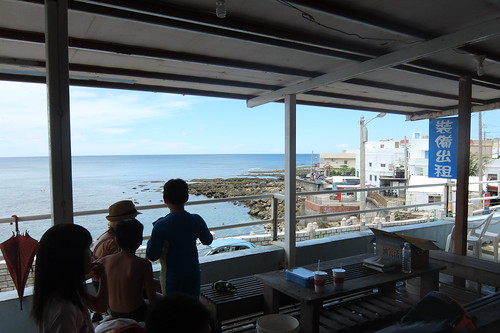 相較於近20年前在澎湖的簡陋設備與不好印象 這次的墾丁浮潛讓我完全改觀 甚至會想有機會一家子再來去浮潛 謝謝今日這樣棒的浮潛天氣(老闆娘形容的100分潛水好天氣) 以及這樣好的店家!  

附帶浮潛完後 我們到恆春鎮上吃中餐以及在恆春轉運站的停留 [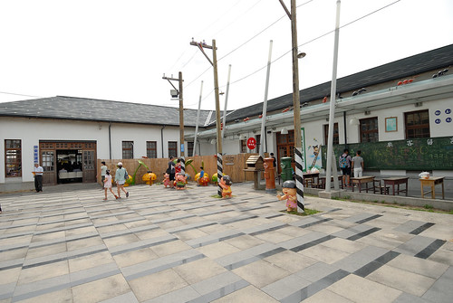](http://flickr.com/photos/33703965@N00/14915503010) 恆春轉運站內有個囝仔村 看網友的照片覺得很是有趣 [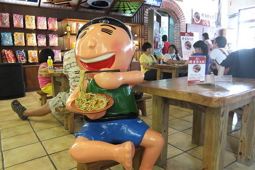](http://flickr.com/photos/33703965@N00/15100083571) 仿以前60年代的廟口場景與人偶很逗趣  只是2014年初甫完成的佈置 不過半年光景卻已微見傷殘 連徹愛都有些感嘆 [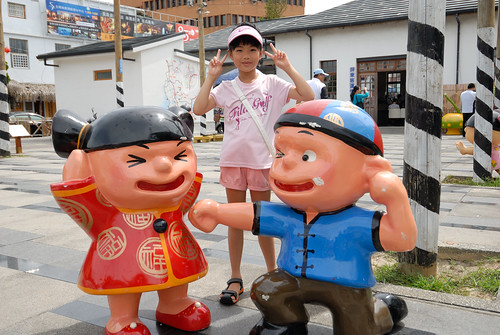](http://flickr.com/photos/33703965@N00/14915567608) 這回旅行很認真 很執著要寄明信片給玟姿阿姨的愛愛 在她最喜歡的墾丁當然一定要寄一張給阿姨 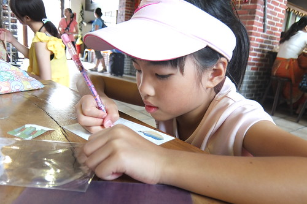 還寫悄悄話 不讓我們知道她跟阿姨的秘密  雖然不比阿姨暑假再日本寄來的四張明信片 我跟愛愛說 阿姨21天4張 你4天3張 相信阿姨可以感受到你的真心誠意的 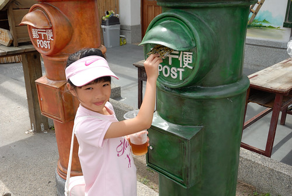 阿徹也寫了張明信片寄回家 上頭畫了熱帶魚也說了他好喜歡浮潛  只是這個郵桶大概二個月才寄一次信吧?! 我們以為石沉大海的明信片在10月初才給我們帶來驚喜  有沙灘 有海水 有星空 有走進山裡 溪水的墾丁真的很棒!
