在太麻里山上的第二天早上 趁著上山賞花人潮湧現前 我們趕緊吃完早餐 往更高的山上去 聽說山頭上的忘憂谷 曙光亭有更密集 更漂亮的金針花海! [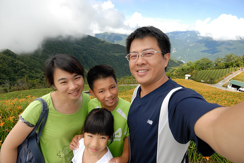](http://flickr.com/photos/33703965@N00/15079570376)

雖然前一天農場的工作人員便已告知上山的路小也叮嚀了一些住意事項 開在越來越小且不容易會車的山上路上 我們還是小嚇到 難以想像八月正花季時的車陣 也慶幸我們是在花季尾聲且非假日的一大早就上來 遵循著指標 首先抵達忘憂谷 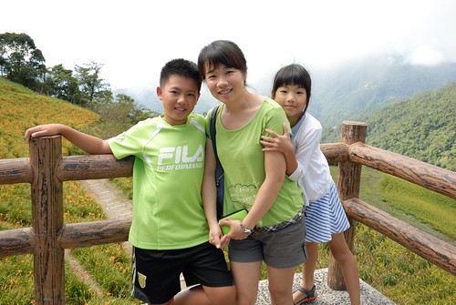 但下車後看到已稀疏的花況 心有點涼 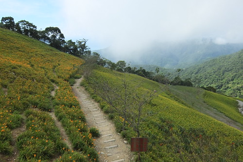 不過視野拉遠後 青山綠草點綴著小黃花令人心曠神怡 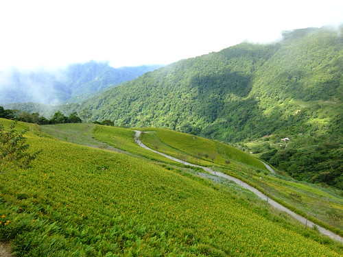 我們走在可走的花田小徑上 [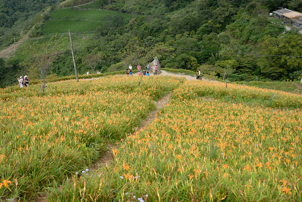](http://flickr.com/photos/33703965@N00/14915888200) 期待與金針花的更近接觸 [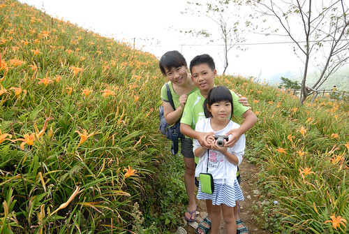](http://flickr.com/photos/33703965@N00/15102529805) 只是我真一直覺得金針花的美在於數大就是美 [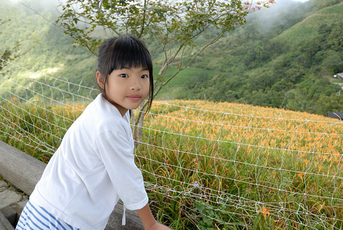](http://flickr.com/photos/33703965@N00/14915952838) 尤其光線不足時 更難拍出金針花的美阿! 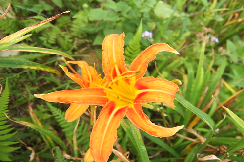 我們也在草叢裡發現一隻藏不住的蜥蜴 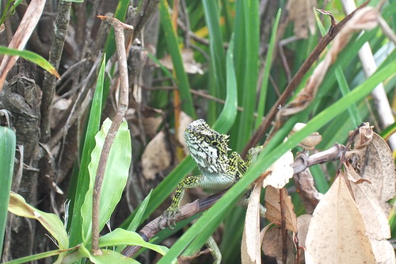 耀眼的螢黃綠 走路搖搖擺擺的可愛模樣 讓我跟徹哥忍不住跟著牠走直到牠消失在我們眼前 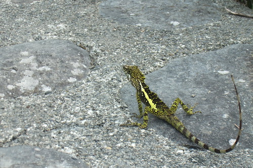 金針花是具經濟價值的作物 [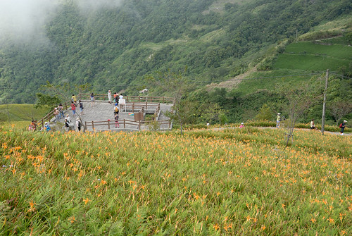](http://flickr.com/photos/33703965@N00/14915965908) 而這些美麗的金針花田當然都屬於私人土地 有賴政府的補助或是像忘憂谷谷主這樣大方 才能讓追花的我們欣賞到這些美景 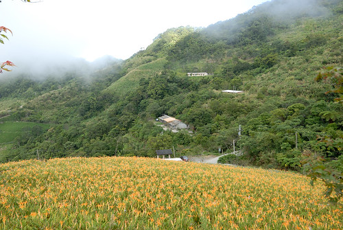 (徹哥超愛拍這樣的到此一遊照! 而母子倆學前一組拍照人的POSE有夠讚) [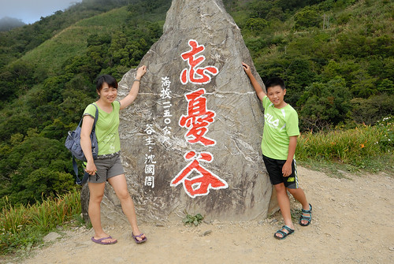](http://flickr.com/photos/33703965@N00/14915977198) 為了繼續保持賞花第一波人潮 我們不敢太多停留的繼續往海拔更高的山上去 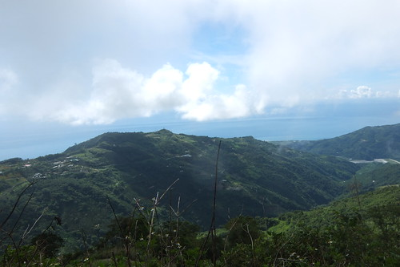 來到海拔一千三百多 也是金針花密集區的雙乳峰 一下車我們就被左右兩側的漂亮山形給吸引 忍不住哇哇叫好美 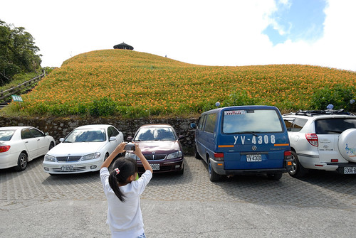 連愛愛也忍不住拿我的相機拍不停 越來越有背包客的模樣 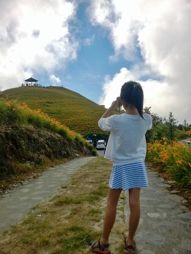 山形隨著我們的高度 角度不同有不一樣的曲線美 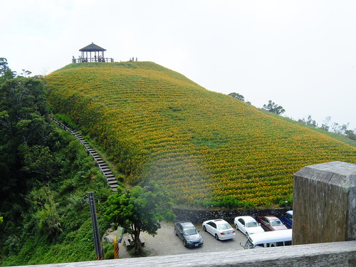 而金針花的金黃色點綴著這一幕幕畫面 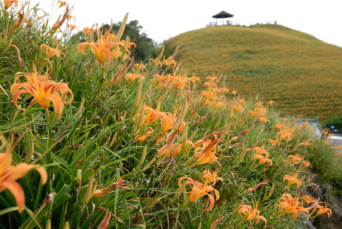 金針花海裡也偶見早已不是花期的繡球花開 [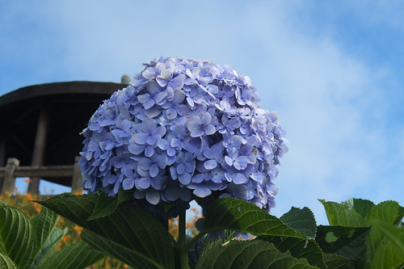](http://flickr.com/photos/33703965@N00/15102833062) 徹哥看見心形的繡球花 開心大喊"愛愛 你的花耶" 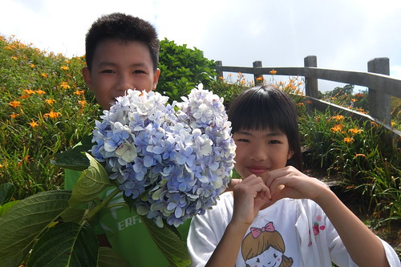 花美讓人看的好心情 而好心情也讓人看花越看越美麗 [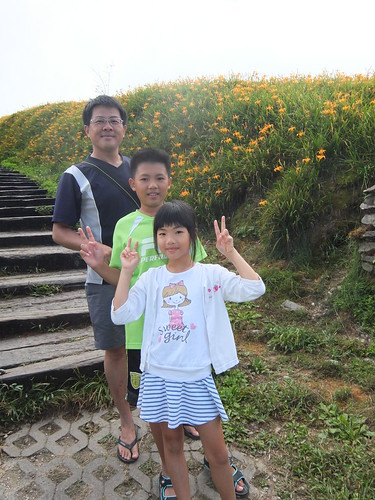](http://flickr.com/photos/33703965@N00/14915853199) 我們來到前面一直照的山峰與上面的千禧亭 [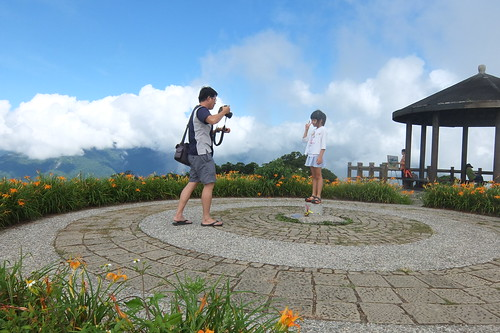](http://flickr.com/photos/33703965@N00/15103232805) 這裡有個一等三角點 也就是有360度環繞的景觀視野 [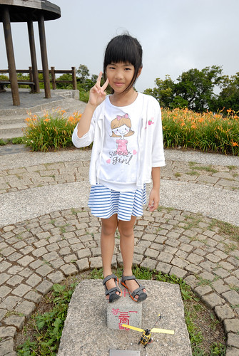](http://flickr.com/photos/33703965@N00/14915931970) 在這裡居高臨下 看著雲海 看著太陽緩緩從太平洋升起 肯定更是精采萬分 (徹哥真的真的很愛到此一遊照) 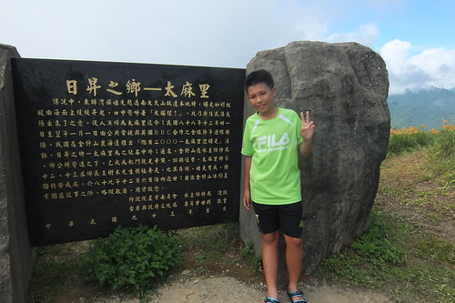 不論六十石山 赤柯山或是太麻里 我覺得都是因為山谷地形讓金針花美更顯豐富變化且讓人心曠神怡 [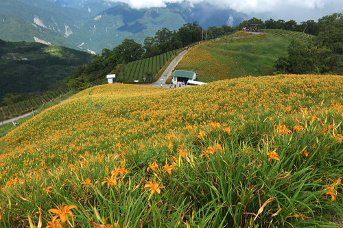](http://flickr.com/photos/33703965@N00/15100232821) 金針花反倒不是主角 而只是出色的配角 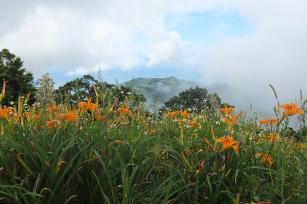雖然上山的路遙迢又顛坡的讓徹爸碎念 以後不會再想來的地方 [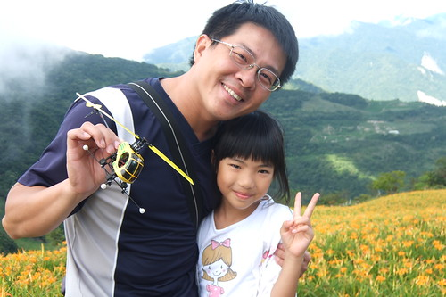](http://flickr.com/photos/33703965@N00/15100196211)但我覺得很是值得走這一遭 有機會還是可以再來賞日出的... 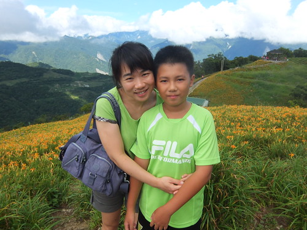 徹爸再試著近拍金針花 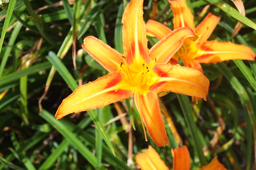 不知道是特效太少還是真的太無感 跟網友們拍的金針花感覺很不一樣阿.. 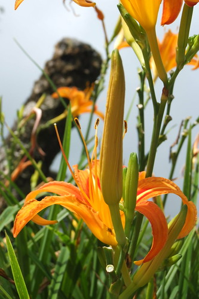 但徹爸遠遠拍的金針花照卻是越看越有FU 很耐看 [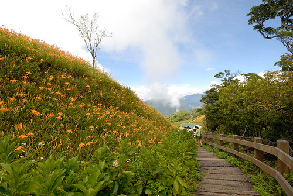](http://flickr.com/photos/33703965@N00/15099572051) 賞完雙乳峰的花也結束了我們的太麻里小避暑 要循著小路往山下一路駛下去嚕~ [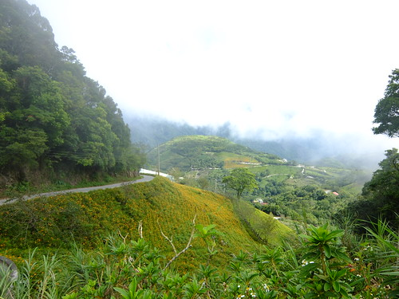](http://flickr.com/photos/33703965@N00/14916866168) 路真的很不大 讓徹爸開的哇哇叫 我一整個可以理解 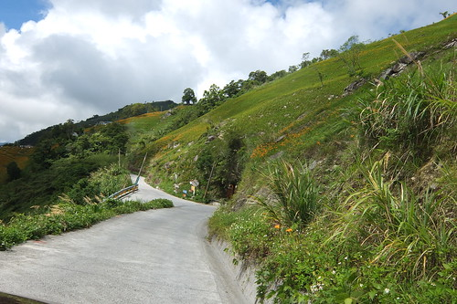 而那個很會暈車的小女生 當然努力的睡著 睡下山 [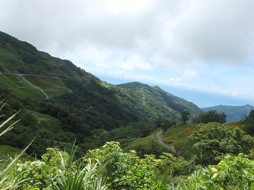](http://flickr.com/photos/33703965@N00/14916784090) 同時 沿途片片的黃也美麗的讓我一路哇下山~ 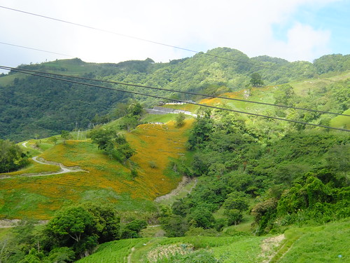 回到山下經過市區 看到代表性的金針花燈 我笑這模樣比較像是開花前被採收的金針花  太麻里盛產的應該是"金針"而不是"金針花"阿~ 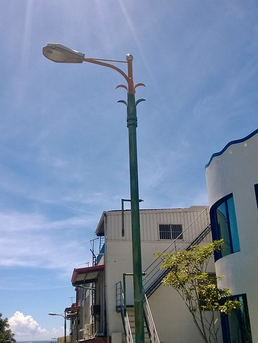
