前陣子忙著房子 忙著收尾的工作  寫了一半的暑假環島行也就一直擱在墾丁了 不知不覺小學生又快期末考 寒假已不遠...   奮起繼續把我們的行程給寫完!

離開墾丁 我們的車子穿過南迴公路來到了太平洋的這一端 排行程時想說海邊曬了這麼多天  那也找座山裡去 好避下暑降個溫吧 第一個想到從墾丁到花東半途中的太麻里山上 而訂房後才想起這時節剛好是金針花季   於是不小心圓滿了我們的花東三大金針花區 

自己距離上一次來太麻里山已是快20年前的事  壓跟忘了也沒印象上山的路這樣崎嶇 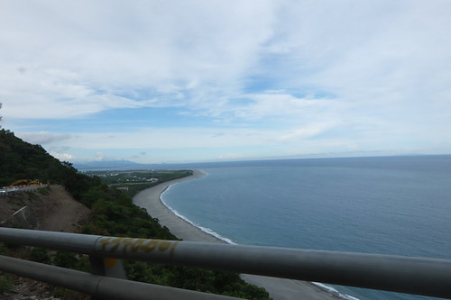 於是很會暈車的愛愛果然在上山沒多久就變成臉色慘呼呼的小白兔  幸好 40多分鐘的車程 在小白兔抓包前平安抵達  辦理好入房也稍做休息後 趕緊趁天黑前在農場內賞花 青山農場內就種有不少的金針花 若在白日光線充足時刻賞花肯定也夠閃耀  但盛況應該還是比不上再上山的忘憂谷地處  不過繞了園區一大圈的步道卻是很舒服愜意的散步賞花路徑 [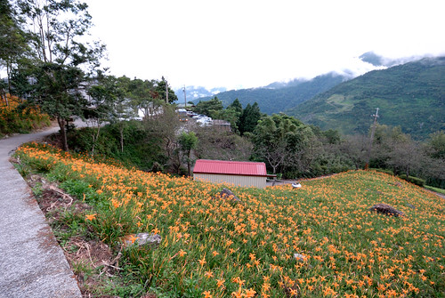](http://flickr.com/photos/33703965@N00/14915652419) 也因此我們的醉翁之意不在花 [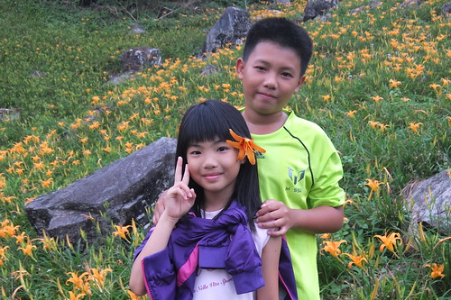](http://flickr.com/photos/33703965@N00/14916485770) 而在南台灣海邊曝曬幾天後的上山涼意 [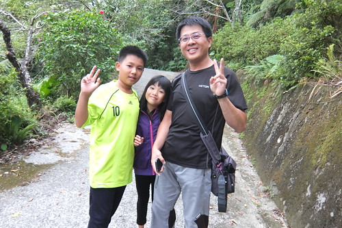](http://flickr.com/photos/33703965@N00/14916547408) 我們邊走邊玩 邊說邊鬧  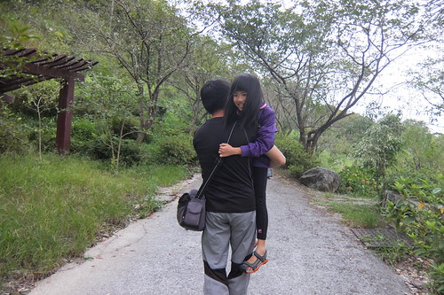 好心情 好情感 感染一家子 [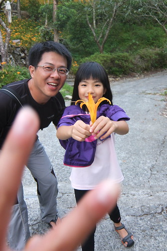](http://flickr.com/photos/33703965@N00/15103119915) 三台相機 四個人 都喜歡拍花 [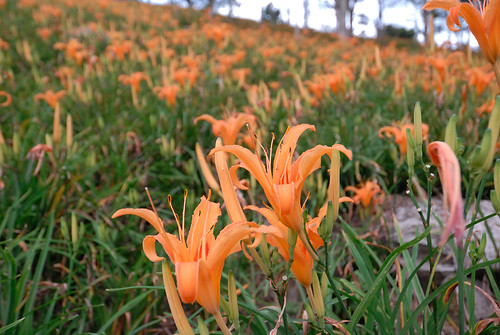](http://flickr.com/photos/33703965@N00/14915601187) 但卻怎麼都拍不出花的韻味 所幸拍更多的到此一遊照  我們請徹愛幫爸爸媽媽拍和照  也拍認真幫我們拍照的徹愛  還比一比誰的構圖技術好 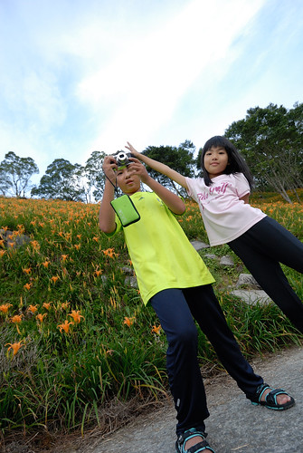 媽媽拍的 跟徹愛一樣少了花海的壯闊感 [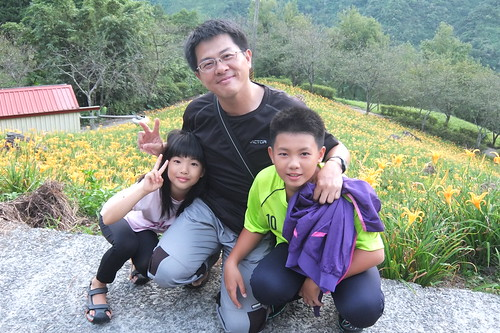](http://flickr.com/photos/33703965@N00/14916501170) 相機還是在爸爸手上時聽話 人跟景都美  環島的第四天 我們從海邊來到高山上 好心情持續著 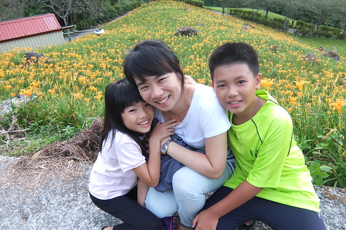 

青山農場原為金針工場 這二十年漸漸轉型為觀光農場且發展的越來越蓬勃 還記得大學畢業後跟著玟姿一起來過這 很難忘當時小農場的純樸 時隔多年再來 不得驚訝於農場的改變與商業經營 住宿環境與餐點內容讓人有些小失望 尤其是沒有新鮮金針花入菜的金針餐最讓我覺得可惜  不過農場內遍植櫻花 百合  金針 楓樹等四季花木  值得不同時節到訪 農場附近有個曙光亭 是賞日出的好地方 重點是只距離農場幾分鐘的路程 也因此我們才有動力清早起床看日出  每年元旦總會在新聞裡聽到太麻里的第一道曙光 就這樣耳聞太麻里日出好多年  總算我們也看到太麻里的曙光 雖然雲層厚到讓人懷疑太陽是否真的會從太平洋上蹦出來 但太陽升起前的七采光芒已絢爛美麗的讓人瞠目難忘 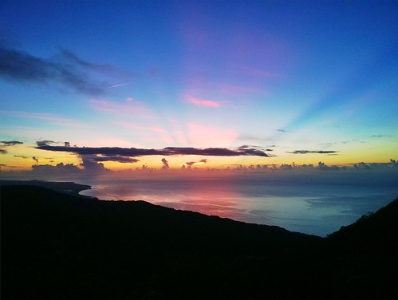 反倒太陽真的蹦出來後  一切歸於平淡 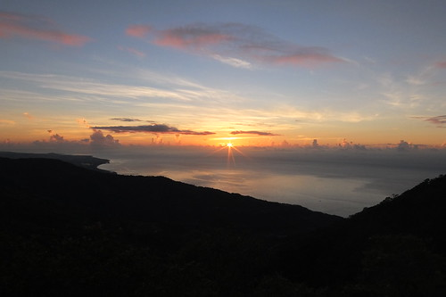 太平陽寧靜的像是一片不流動的沙  海天一片讓人看不盡地平線 [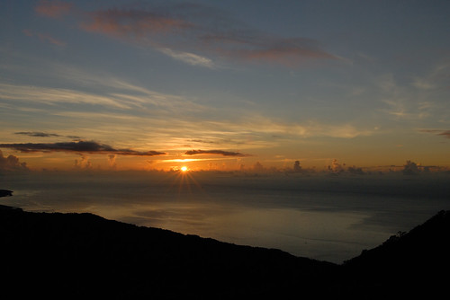](http://flickr.com/photos/33703965@N00/15102106902) 很棒的太麻里日出阿!  雖然水腫 眼睛睜不開 但因為曙光值得這樣上山 這樣早起!! [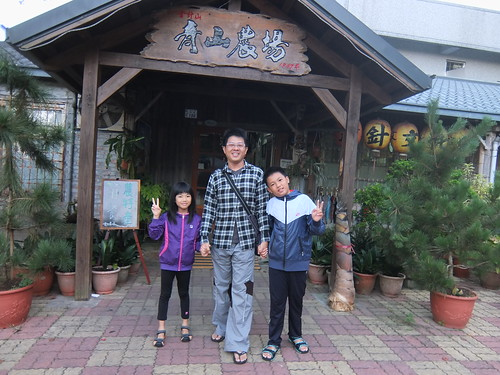](http://flickr.com/photos/33703965@N00/14916893698)
