小琉球除了四面環繞的各海景與潮間帶讓人流連忘返 島上滿佈的石灰岩洞地形與珊瑚礁海岸地形也是非常值得走一遭 而且許多景點的傳奇故事與歷史見證 更添小琉球的神秘與驚奇~ 

第一天的近傍晚時分我們騎著包含在民宿套裝內的機車 開始我們的環島 [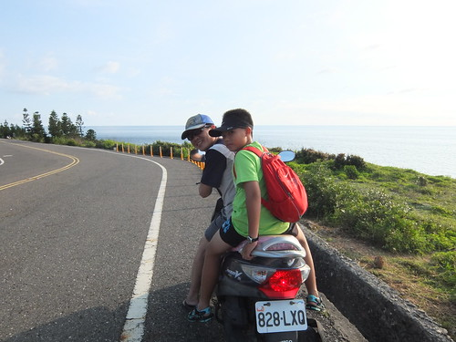](http://flickr.com/photos/33703965@N00/14916971248) 難得坐機車趴趴造的徹愛 有些不習慣但也很快就融入我們的騎著機車滿島跑 [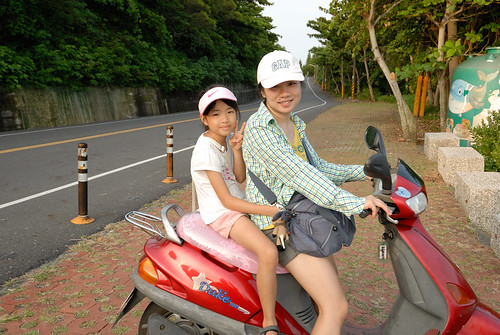](http://flickr.com/photos/33703965@N00/15078230296) 機車除了是在島上的代步 也是放慢速度感受小琉球山海美麗的最佳工具(如果是騎腳踏車肯定更棒) [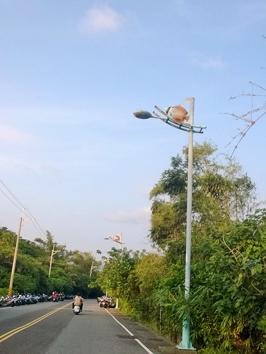](http://flickr.com/photos/33703965@N00/14916871579) 如田媽媽說小琉球很小 20分鐘就可以騎完一圈 但要不放過每個美麗或有故事的地方 二十四小時真的不夠  很多地方我們只能如蜻蜓點水般的點過去  有小威尼斯之稱的蛤板灣 屬貝殼沙沙灘  這裡遊客很多... 相較之下我們更愛民宿旁杉福漁港的愜意 [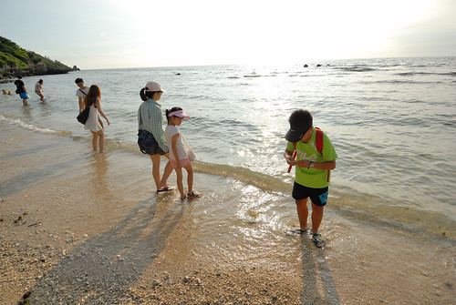](http://flickr.com/photos/33703965@N00/15101179505) 厚石群礁有幾處珊瑚礁風化侵蝕後造就的怪石景觀 紅番石  老鼠石  夜間導覽再由田大哥帶我們來這 我們才明白這些怪石地標的初衷(漁民間相報魚場座向的地標) 也才知道觀光旅遊資訊網站上的怪石名稱與傳說故事某些程度跟當地人說法有所出入 就如這顆老鼠石 經田大哥解說後我們才恍然原來牠更像是頭山豬(山豬很帥氣的)

環島沿途也有好幾個賞海觀夕陽或日出的涼亭  望海亭 落日亭....  我們一個亭也沒停留的 還是回到我們的杉福漁港 我們想 這兒肯定也是觀賞落日的好地方 [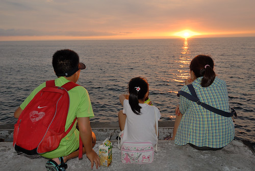](http://flickr.com/photos/33703965@N00/15098233061) 一家子看著太陽靜靜落入台灣海峽裡  這一幕讓人身心舒暢 很療癒... 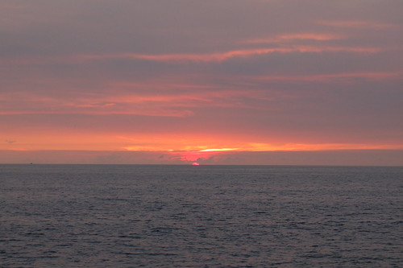 

隔天早上退房後 我們騎著機車繼續我們的環島 先是來到山豬溝

 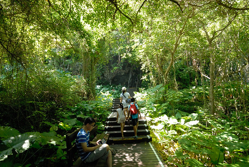 山豬溝的溝是為斷涯所形成 走到望海臺即可見此涯深險惡 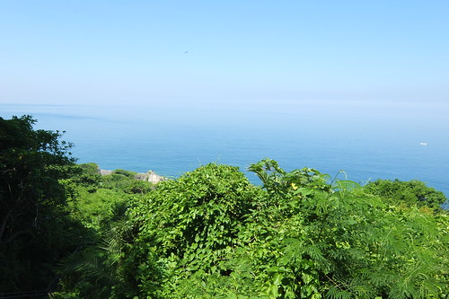 同時海天連成一線輔以蒼綠線條 活脫一幅簡單構圖的美畫 [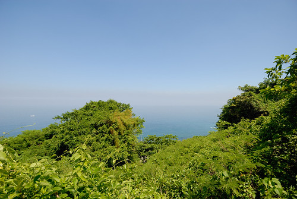](http://flickr.com/photos/33703965@N00/15078360456) 兄妹倆以為看到海就可以收工返程 [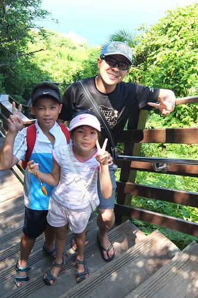](http://flickr.com/photos/33703965@N00/15099743601) 我說山豬都還沒看到 怎麼可能就這樣結束 [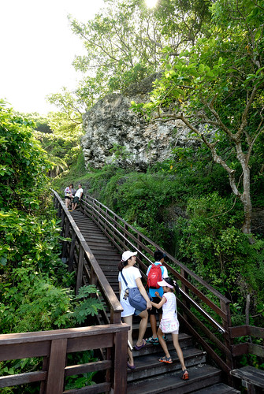](http://flickr.com/photos/33703965@N00/14914725660) 況且這裡林相豐富  走來涼爽  而且珊瑚礁岩地形饒是獨特有趣阿   除了下海 小琉球也很值得上山的! 

來到昔日的防空洞  我們難以想像戰爭的時代  慶幸自己生在太平盛世裡 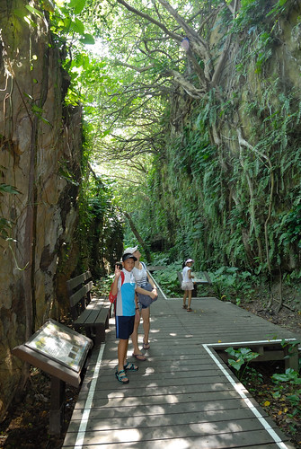 這裡跟之前在墾丁鵝鑾鼻燈塔公園裡的地形很像  但我們更喜歡小琉球的有些神秘可又清爽 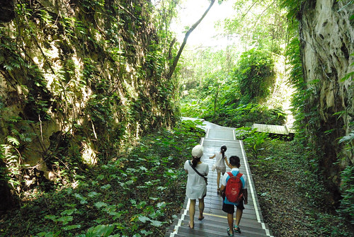 而最後一段走在小水溝的下坡路 更清涼的讓徹愛大呼這裡真是太棒了! [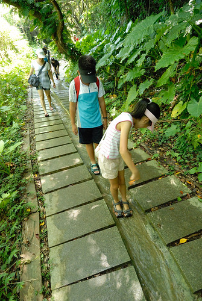](http://flickr.com/photos/33703965@N00/14914846818)

離開山豬溝 繼續騎著車來到也值得一走的美人洞  小琉球島上處處可見這樣字體與型式的景點標示  很兩蔣時代的FU... 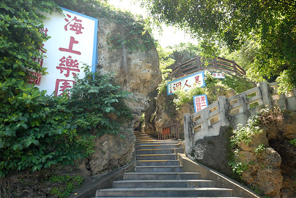 美人洞在環島公路兩側有兩區 靠海近的珊瑚區有許多奇石洞穴 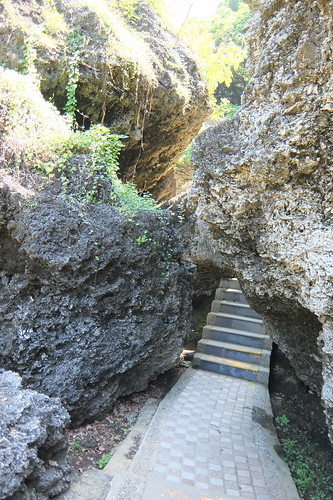 厲害的是個個都有名字 仙人洞 一線天 蝙蝠洞.... 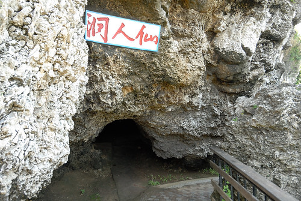 只是烈日下暈頭的我們 一路走來只有感覺大同小異 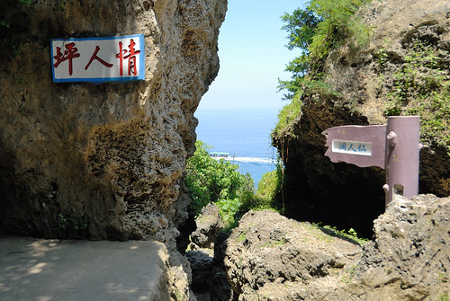 公路另一邊的珊瑚礁山坡地 除了一樣奇石可觀 更有望海的好視野  這裡的海清澈的讓我們嚮往著以後再來小琉球浮潛! [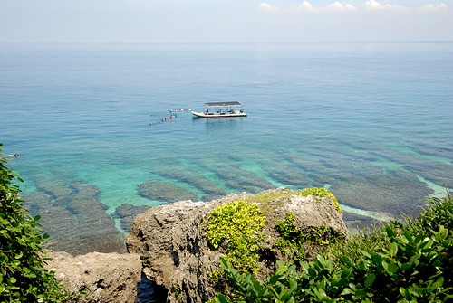](http://flickr.com/photos/33703965@N00/14914865697)

我們說這顆巨石也好像頭頂長毛的蕃頭阿!  大家輪流給他一拳  結果還是爸爸鏡頭下的這一拳最厲害!  我們就在這樣嘻嘻哈哈 有點愜意但又有點趕的狀況下完成我們的小琉球環島 最後結束在遊客中心的蓋章與吹冷氣 (花瓶石明明就在這 我們卻已經懶得再去找她) 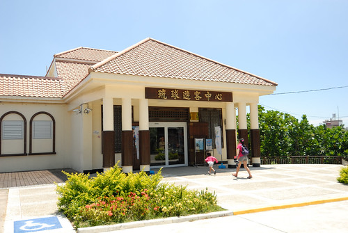附帶紀錄一下在小琉球的吃吃喝喝 第一天中午為了參加潮間帶導覽 我們只有不到一小時的覓食時間 於是我們到民宿不遠處的山豬溝餐館吃飯  真的就在山豬溝入口對面的公路旁 而且就是冒汗吃的熱炒店 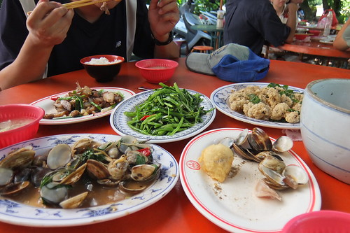 不過餐點道道好吃而且經濟實惠喔 (話說我們家真的很強 只要沒意外通常都是4-5菜1湯清光光)  吃完飯再來根這兒的名產 黑糖冰淇淋還有買些當地漁產小點心 so good~ 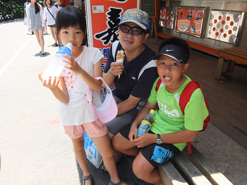 夏天 在海邊 當然無冰不成禮 我們去了花媽冰店(為了吃冰才來到小琉球民產 民宿 餐廳林立的最熱鬧街上) 除了有名的芒果冰外(田大哥說小琉球產芒果 才解了我們"怎麼到處都在賣芒果冰沙"的疑惑) 我跟徹爸更喜歡花媽的招牌冰 有很特別煮法的地瓜與芋頭  我們回味無窮到第二天中午要搭船離開前  冒著如果暈船就都還出來的風險又跑去花媽那吃碗冰才走! 晚餐去了許多網友推薦的大福羊肉 現場果然人聲鼎沸最好要預約阿!  招牌的酥炸羊小排 挺特別的作法 只是味道似乎明顯了點  加上不知道是吃冰吃太飽 還是熱過頭了 我們家難得的胃口不佳...  最後話說 我們搭船前在熱鬧街上買的當地產魷魚乾真的超讓人滿意 除了四尾150的價錢很讓人開心 那新鮮度 軟Q度與鮮味真的超讚 回家後炒了二次 每次都讓我們吃的津津有味 喊著再來去小琉球買 沒想到昨天徹爸竟接口說"那下個月來去 這次一定要浮潛" 我當徹爸是隨口說說而已(開學後的狀況真的也只能當說說) 但可見徹爸有喜歡小琉球喔~ 真的! 有機會的話 一定要再去小琉球 要買好多魷魚乾回家!
