小琉球  船程比預期的短很多 也比大學畢旅來過的僅存認知中繁榮熱鬧許多 生態更是超乎我們期待的豐富美麗 很高興這次我們突破心防再次搭船離開本島 體驗到不同的島嶼風情~ 

這二年我ㄧ直想安排離島的旅行 只是徹家太怕死不敢搭小飛機 加上愛妹太容易暈車暈船 以致從來只能我自己想 曾經看過網友介紹的小琉球印象深刻 且船程好像挺親民的近 所以這回環島 我指名要去小琉球 過過去離島的小癮

雖然在離島 小琉球民宿的發達與價位一點都不輸墾丁 而且幾乎都是包含船票 機車與潮間帶導覽的套裝行程 整家子的費用算下來會頗可觀 因為在暑假且時間接近 我們可以有的訂房選擇少之又少 最後在高檔豪華的沙瑪基渡假村與親切受好評的田媽媽民宿間 我選擇了較經濟實惠的田媽媽 重點是我喜歡田媽媽在電話中說的"我們的生態導覽帶得很好喔~"

田媽媽搭配的是甫開航一個月的新船公司 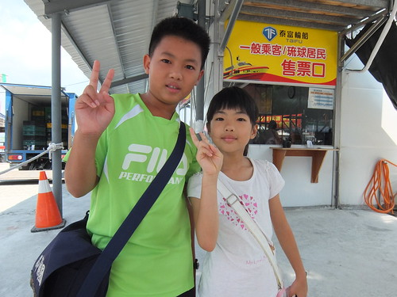 後來聽到很多當地人都對這新輪船很有好評 尤其時間縮短許多  只是東港的整體搭船環境真的很簡陋 還有很大的改善空間阿! (不是只有這家) 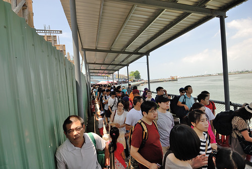 船的內部很新穎 座位也很寬敞 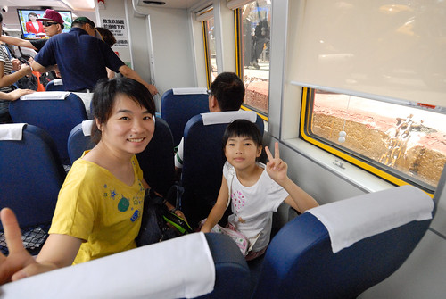 只是很會暈的愛愛 鑑於很多年前吐的一番不可收拾的搭船經驗 船開動後一動也不敢動  努力讓自己睡著 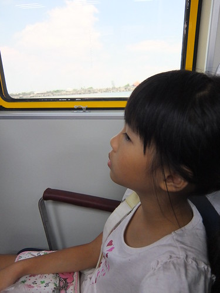 10來分鐘的小覺 讓愛愛躲過暈船也精神百倍 [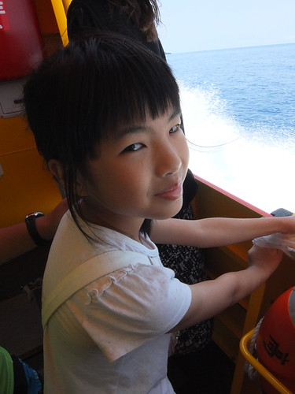](http://flickr.com/photos/33703965@N00/15080531426) 而且不可思議的  不過20來分鐘我們卻快到小琉球  下船後在碼頭邊找民宿的牌子 然後跟著去民宿委託搭配的機車行騎接下來24小時的代步機車 看到民宿的田大哥真的來機車行帶我們騎回民宿 很訝異也很窩心  田媽媽民宿不在小琉球熱鬧的街上  位在相較偏僻的杉福漁港旁 [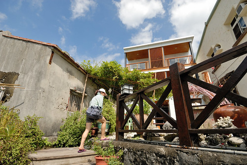](http://flickr.com/photos/33703965@N00/14914613078) 我們住的是民宿僅剩的一間沒有海景的房間  沒有海景對我們來說並不是太重要 反正窩到民宿有海景的公共區域就好(而且房費還能省一些) 房間外的2樓走廊總會吹來徐徐涼風 而盡頭可見的是大海  每每總讓我們進出房門前後 總忍不住往走廊盡頭去  在走廊盡頭的陽台吹風看海 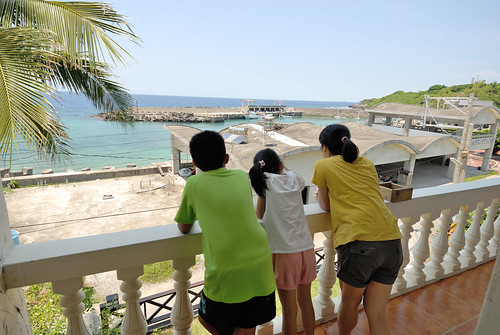 

出門旅行前 徹哥特別要我上氣象局的網站查潮汐時間 那一天的退潮時間是下午1:47分以及晚上11點半多 也因此我們12點半才到民宿 然後就聽到民宿安排的潮間帶導覽時間是日頭赤焰焰的下午一點半時完全不意外 [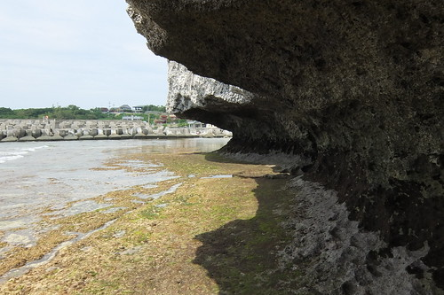](http://flickr.com/photos/33703965@N00/15099366081) 帶領導覽的是田媽媽的兒子 田大哥 黝黑結實的身形 銳利好眼力 加上滿口海洋經 活脫就是熱愛大海的漁人(行船人)  我們緊跟著田大哥 不錯過任何他發現的好物 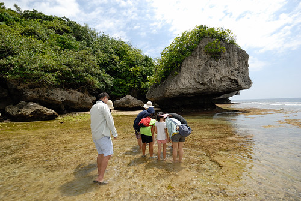 珊貝  蟹  軟癱灘但摸起來卻挺有Q性的忘了名字的生物  海男人之稱的黑海蔘 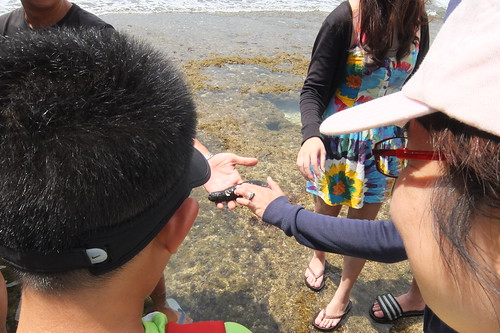 海女人之稱的海蝸牛 [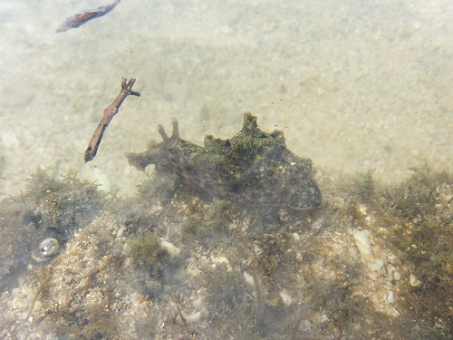](http://flickr.com/photos/33703965@N00/14915830488) 田大哥說看到海女人 這趟就值得了! 只是海女人實在跟名字的想像空間差很大阿 [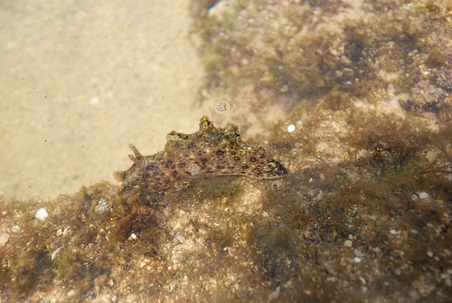](http://flickr.com/photos/33703965@N00/15098154351) 還有許多田大哥如數家珍 而我們總是嘖嘖稱奇後就忘了的許多潮間帶生物 [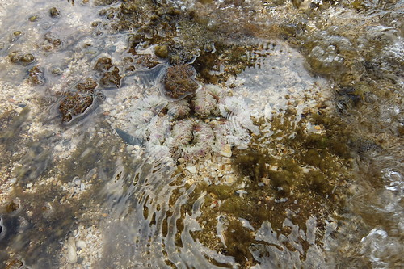](http://flickr.com/photos/33703965@N00/14915818518) 如田大哥說 這裡不是海生館 他沒法保證可以讓遊客看見什麼  而且田大哥非常有原則  不可以離水的生物他不會為了討好遊客就拿出水面讓遊客觸摸把玩  所以很多時候我們是在他的"要不要試試看"的同意下  手才會探進水裡摸摸看  他也會叮嚀遊客不要踩進潮間帶生物的育嬰地"潮洞"中(有人踩進就被嚴格告誡了) 我甚至想他叮嚀的不要亂撿亂摸不認識的生物 除了是怕遊客勿摸有毒生物外 也是他對潮間帶生物的一種保護! (對了! 入住時也會再三叮嚀進潮間帶時 手臂以及小腿以下不要抹防曬品 那是很破壞海洋的喔)  真的! 就如田媽媽電話中以及有網友形容的 很棒的潮間帶生物導覽  除了因為在地 且有濃濃愛海洋的溫度 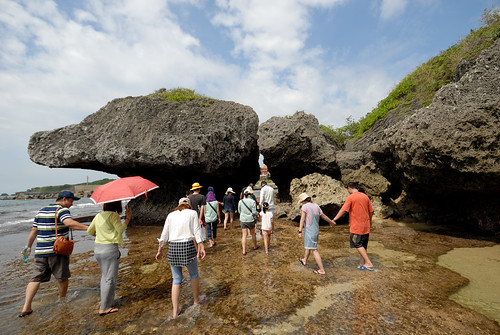 一個多小時的潮間帶探險後 田大哥繼續領著大家上堤岸 [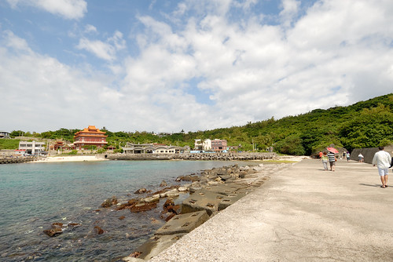](http://flickr.com/photos/33703965@N00/14914539350) 不同於其他團體在海水又漲起的時候才來尋寶  我們早已滿載且居高臨下得意的笑 [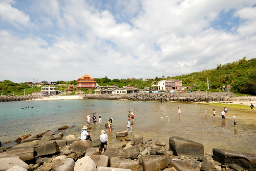](http://flickr.com/photos/33703965@N00/15101162915) 不過我們上堤的目的是要看一旁防波石上長滿的珊瑚啦 珊瑚粉粉螢螢的顏色很神奇 只是baby珊瑚的模樣卻好像一朵朵的磨菇阿 [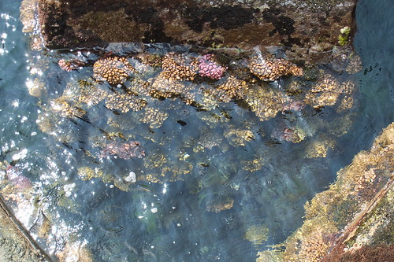](http://flickr.com/photos/33703965@N00/14915842188) 站在堤上的視野很好 連本島高雄都可以看見(原來小琉球真的很不遠阿)  第一次走上海堤的我們覺得超屌超興奮的! 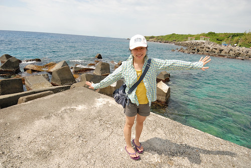考量每日潮間帶的時間不一樣 所以來小琉球的搭船時間最好要配合一下當日的潮間帶時間 免得來的晚或離開的早時 就無法參加民宿精采有趣的潮間帶導覽

民宿套裝除了潮間帶 還包含下午五點的沙灘戲水(一樣在民宿旁的沙灘 但我們沒參加)以及夜間導覽 烈陽高照的三四點 我們窩在民宿裡休息  夏日的旅行裡 熱到已經再也受不了的下午先到民宿沖涼小憩待傍晚後再出門 是所謂的留得青山在不怕沒柴燒 而且會讓一家子玩的更輕鬆愜意的 (雖然睡的都是大人 上下兩張就是小人沒睡覺 玩的作品) [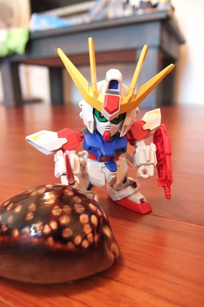](http://flickr.com/photos/33703965@N00/14915851428) 民宿的夜間導覽安排在十點開始 十點 其他住客還在熱烈的烤肉歡樂中 但卻是我們家小人平日睡著的時間  我們並沒有非要參加不可 但徹愛覺得機會難得不想錯過 於是我跟徹爸自從大一過後再沒有過的夜遊 我們一家子第一次的夜遊獻給了小琉球 (集合等候時間 我們跟田大哥聊民宿的建築 左方是相隔十年後利用貨櫃為架構的綠建築 聽到看到田大哥滿臉發亮的說貨櫃屋有多麼浪漫(因為貨櫃去過那麼多地方) 真的有夠可愛 但也有夠讓我跟徹爸不可思議 因為造價一點都沒比本棟便宜 果然船員很浪漫阿!!!) 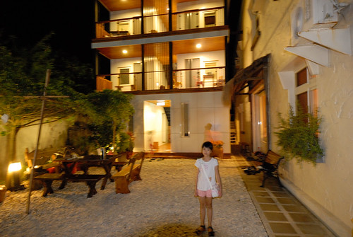 大家騎著機車跟著田大哥到美人洞看遠方的高雄夜景 看的到摩天輪喔 但起碼要有阿徹般的1.2以上視力才看的到  也到舊砲陣地找涵洞裡的三顆愛心(據說找到三顆愛心可以許願) 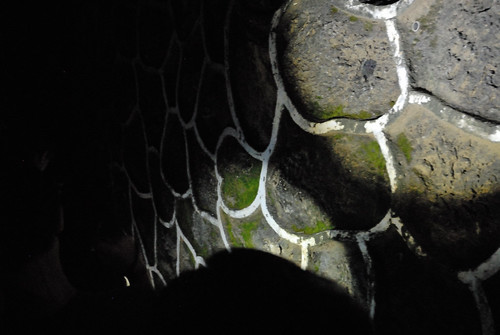 消音的梅花孔洞 這裡也是很棒的賞星地 看見滿天星斗 有牛郎織女星以及搭起她們鵲橋的銀河 我們從來沒看過這樣多 這樣滿 這樣棒的星空! [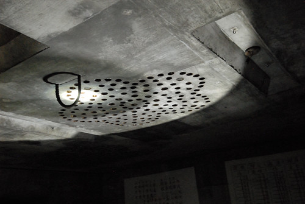](http://flickr.com/photos/33703965@N00/14914637520) 然後還去爬烏鬼洞(光看名字就怕的徹哥當然不敢進去 跟其他人在外頭等) 以及如玩影子遊戲般的觀賞島上珊瑚礁群 然後近午夜十二點結束這果然令人亢奮但會好累的夜遊! (愛愛回程坐機車時就忍不住抱著我睡著了)

隔天田媽媽提供的早餐是用他們自己捕的鮪魚做的魚排三明治 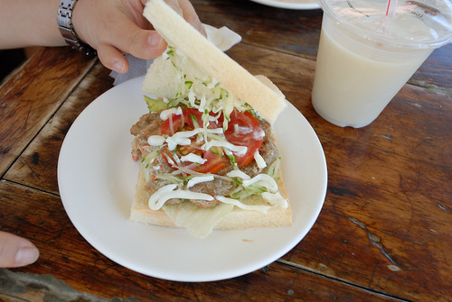 雖然簡單但一樣在地的讓我們好珍惜 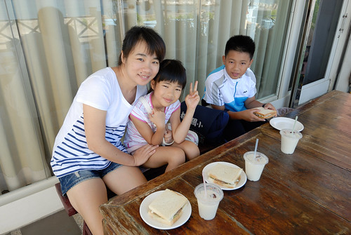 我們坐在前陽台看著大海享用早餐  雖然旁邊就是別人的房間 但這是公共區域喔! 所有房間有沒有海景真的不是太重要 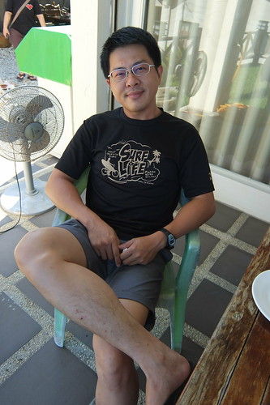 民宿內總能找到讓人愜意的地方喔 [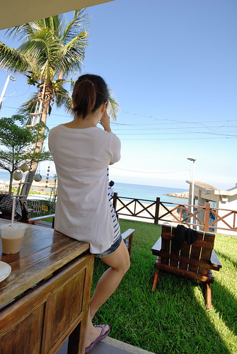](http://flickr.com/photos/33703965@N00/15101279235) 吹著海風 看著海 太舒服  徹爸們又拿出模型玩外拍  沒想一個不小心 主角跌落二尺深谷中  愛愛的心都快碎了 於是主角再也無緣擔任外拍模特  獨剩徹哥的海王子撐大局   田媽媽民宿真的就在杉福漁港旁  每每進出把車子停在漁港休息區時我們總忍不住順著這階梯上去 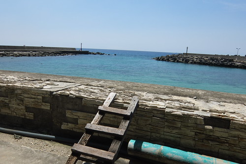 再順著這石階往下走 離海近一點  很喜歡坐在這裡 很涼 很美 很舒服 [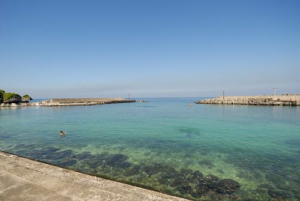](http://flickr.com/photos/33703965@N00/14914738728) 這也是沒有海景房的我們 另一個任我們無敵使用的海景空間 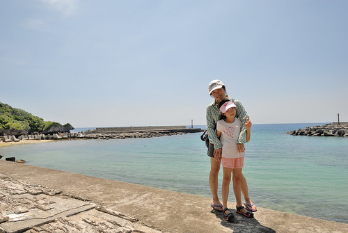徹爸父子倆繼續她們的外拍  甚至把場景拉到沙灘上  徹哥很用心喬他的寶貝 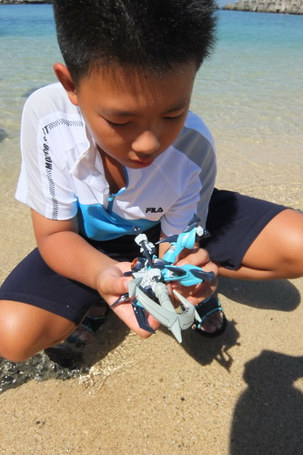 徹爸很認真拍模特 [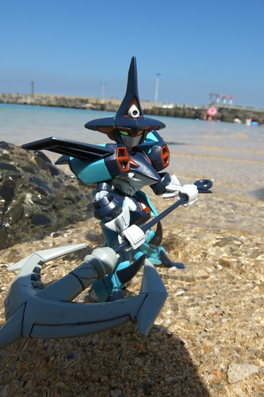](http://flickr.com/photos/33703965@N00/14916050529) 同時間 愛愛則利用坐的地方剛好的遮陰玩起手影遊戲 [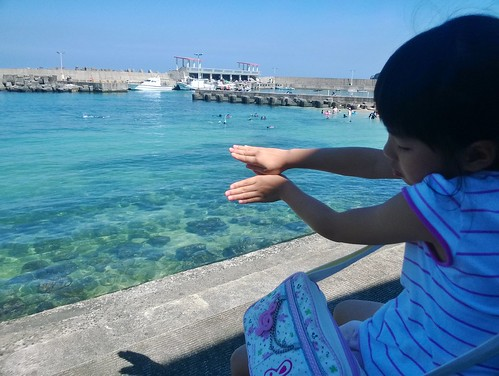](http://flickr.com/photos/33703965@N00/14916874689) 大蟒蛇 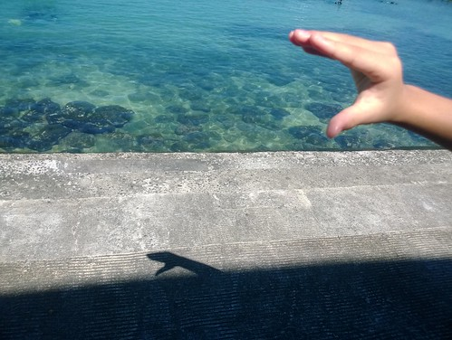 蝴蝶 沒想到大白天還能空手玩手影遊戲  愛愛好得意  而且還有以豪華海景為背景的舞台  

小琉球的第二日 我們搭12點半的船回本島 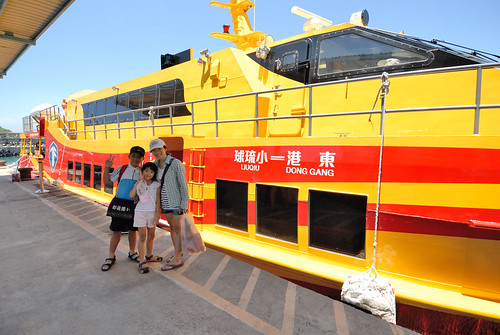 提著滿手魷魚與滿心歡喜  就如小琉球漁民的滿載而歸  更棒的是 小琉球真的不遠且好美 會暈車的愛愛在完全沒暈船下有了美好的小琉球旅行!  
