自從前年寒假第一次去懇丁 徹愛便對墾丁戀戀不忘且更嚮往 不過他們也知道要爸媽再安排去墾丁 尤其還是夏天 是比天方夜譚還不可能的事 因此當他們這回又隨口說說要去墾丁 而且要去墾丁就要住二晚時 萬萬沒想到媽媽竟然輕易就答應  這當然讓兄妹倆從那天起每天興奮期待旅行的到來... 其實自己對於上次的懇丁行也留有非常好的印象 可以觀賞落日與戲沙的白沙灣 以及好些值得走訪的步道與生態園 都讓我興致勃勃 沒想到暑假的墾丁果然熱鬧滾滾 實在沒有我們寒假來時的清閒 但或許擠滿人的沙灘與墾丁大街也是墾丁的一種風情 而沒想到我跟徹爸好像也漸漸喜歡墾丁的大海 藍天與熱情.... 雖然人真的好多阿!  [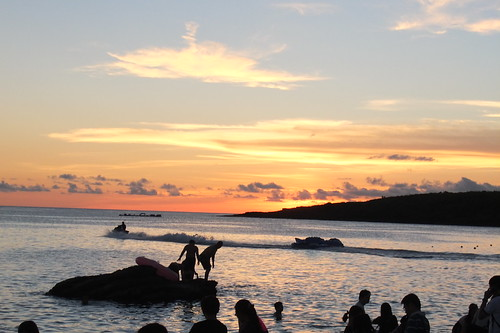](http://flickr.com/photos/33703965@N00/14916116959)

從小琉球回到東港後 我們便直接往南方的墾丁開去

經過車埕時 我們先繞進海生館入口旁的龜山步道 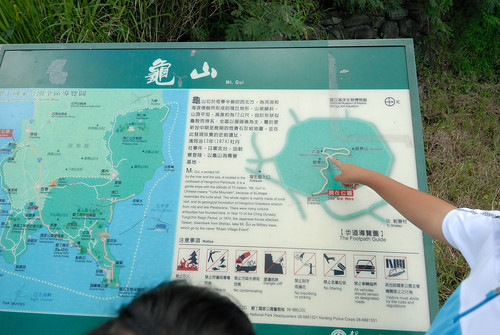 走一走透透氣 也是作為我們墾丁行的暖身操 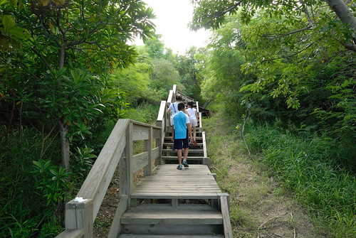 沒有風 加上好不容易來到墾丁竟然還要走步道 讓徹愛有些小煩躁 我說 步道真的很短 只要走10幾分鐘 聽說就有很棒的視野 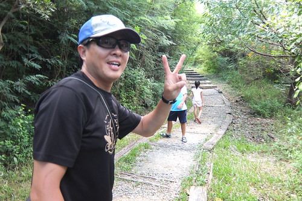 遠眺車埕的視野 你說棒不棒 [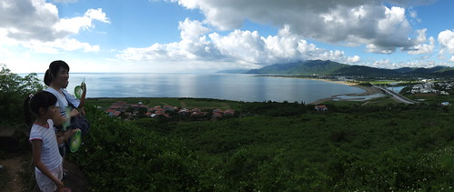](http://flickr.com/photos/33703965@N00/14916136800) 雖然沒有如網友說的360度環景 但這180度的view也真夠讓人心曠神怡 [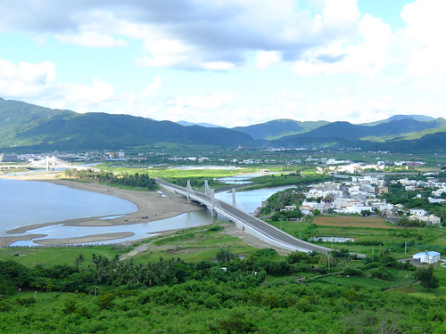](http://flickr.com/photos/33703965@N00/14916965638) [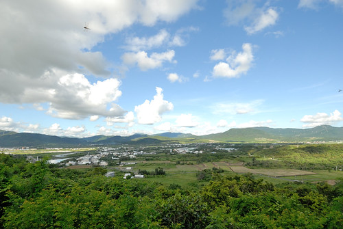](http://flickr.com/photos/33703965@N00/15101102512) [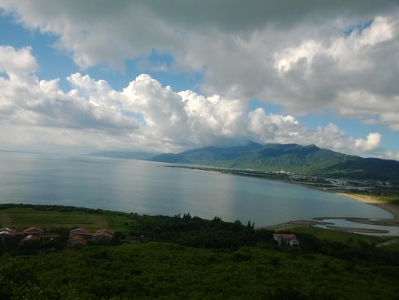](http://flickr.com/photos/33703965@N00/15100558251) 這趟暖身也是向徹愛的宣告  我們的墾丁不只是下海還會有很多的上山! 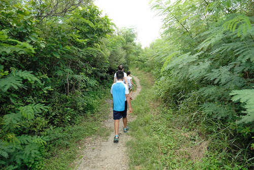 

四點多抵達即將住二天的救國團青年活動中心後 我們便又急忙忙往白沙灣趕去 雖然實在應該就近在南灣玩沙最省事 但我實在很難忘上次寒假的白沙灣落日 只是一路從墾丁大街 南灣塞過來 我們到白沙灣時太陽都快落入海平面下了 [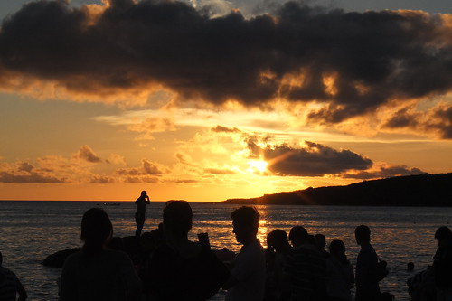](http://flickr.com/photos/33703965@N00/14916105869) 而且 天阿! 人怎麼可以這麼多阿! 這樣要怎麼玩沙阿?! [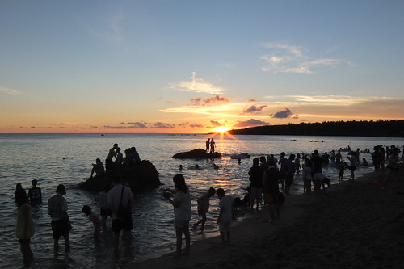](http://flickr.com/photos/33703965@N00/14916167950) 不過一切好像都是我多慮 徹愛很迅速 很理所當然的就找到自己的縫隙 [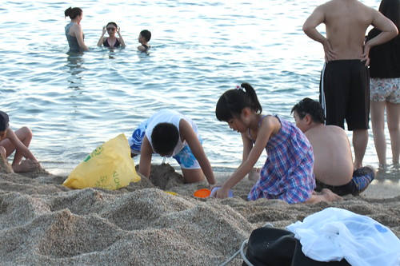](http://flickr.com/photos/33703965@N00/14916098019) 然後馬力瞬間全開的卯起來玩 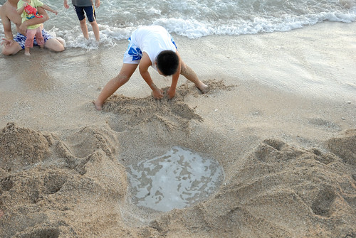 一個忙著挖坑 一個忙著掏沙 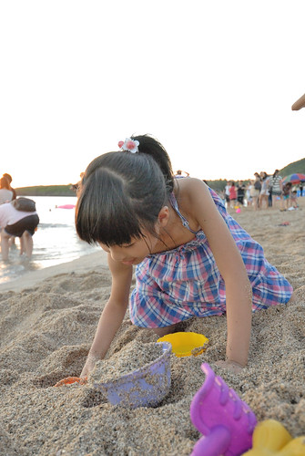 然後隨著浪來潮往 一聲驚呼 一陣白忙  不過二人還是一股勁的蠻幹著 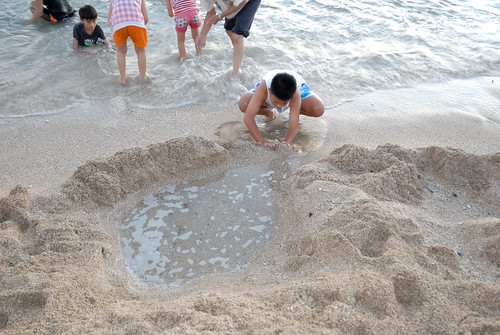 我跟徹爸笑看兄妹的忙與傻 [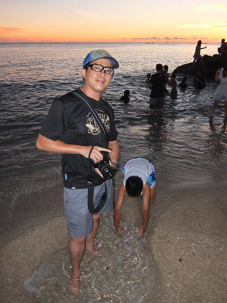](http://flickr.com/photos/33703965@N00/14916943987) 這是帶徹愛來海邊玩沙 我們的最大樂趣  最後看到徹哥所幸躺在自己努力半天但還是不成型的壩中 享受一波波湧來的浪花 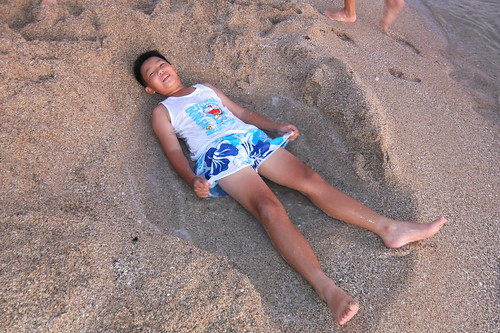 其實有些羨慕小孩子的他們 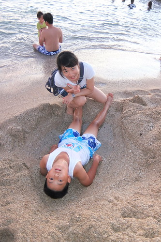 儘管遊客很多 儘管太陽快下山  他們只管努力開心的玩 [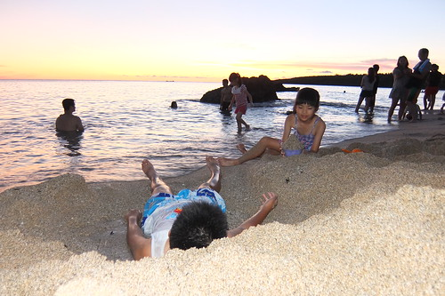](http://flickr.com/photos/33703965@N00/14916258808) 夏日的墾丁沙灘 愛愛嚮往很久的夢想  總算來了! 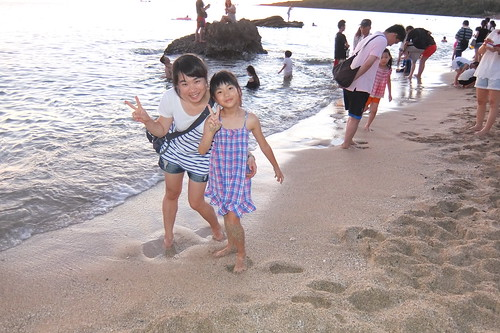我跟徹爸也總算克服盛夏 來到墾丁! 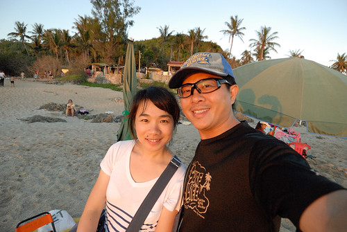這次更厲害的突破是  不善逛夜市的我們竟然去了墾丁大街 而且連著二晚都去 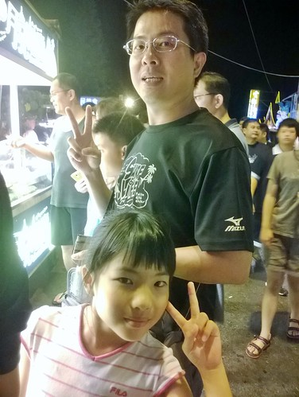 在此要好好感謝玟姿阿姨大推薦的救國團青年活動中心 要不是住在墾丁大街口這樣的近 這樣的便利 我想我們是不會有有動力與勇氣來熱鬧的墾丁大街  大街的東西都很好吃 也熱鬧的讓人目不暇給 (雖然也真的好貴阿)  總算我們也有人家來墾丁有的樣子 有的回憶 而身歷其境的我們也漸漸明白 為什麼大家的暑假都很愛去墾丁... 果然有其魅力所在阿!!! 
