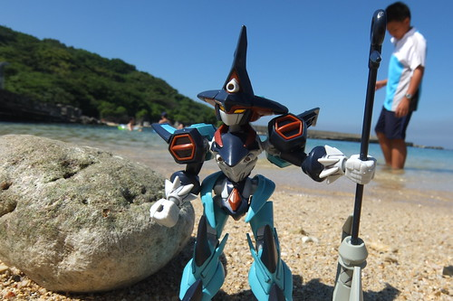
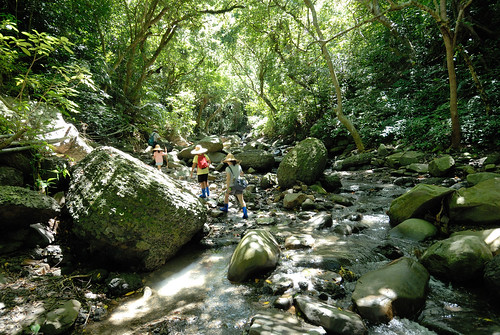
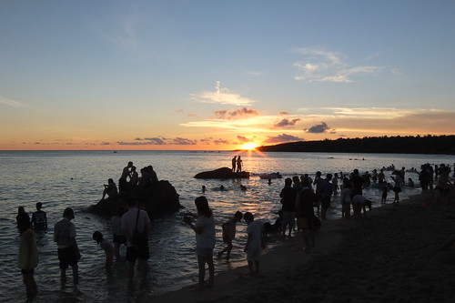
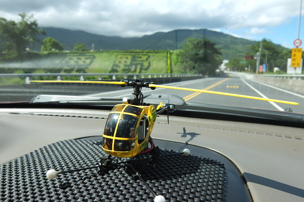
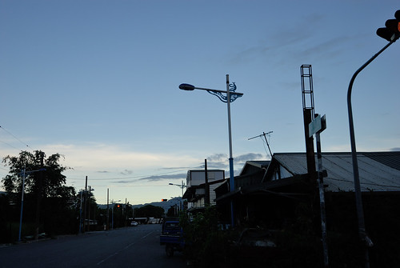

這二天一口氣貼了十多篇主題的照片  我要奮起趕緊度寫寫寫 寫我們暑假末意外多出來的六天六夜環島行! 這次的旅行很大海藍天 很上山下海 很豐富也格外讓我們玩的不想回家 雖然天氣熾熱 但我們喜歡上了"夏天到海邊"! 已經懶得數的環島 一次次讓我們發現不一樣的台灣風景且期待著不久之後的再一次...

一直以為暑假前的三天北花蓮單車行是我們這個暑假唯一的過夜旅行了 一來徹哥的足球隊 從暑假第一天開始的連著八週每週一到五的早上都得到校練球 再者原打算利用暑假完成房子不算大但也不小的整修工程 沒想到一家子殷切期待的整修計畫被計畫趕不上變化的一延再延 八月中確定了整修勢必得再一二個月才能動工 一家子的心情低落了好些天 於是愛玩的媽媽提出乾脆來去玩的建議 媽媽說想去小琉球 愛說要去墾丁 徹說要去花蓮找老師 哇~要滿足所有人 那豈不要環島 於是我們拿出因為要裝修而取下的台灣立體地圖 攤在沙發上研究起要如何環這個島 敲定好每天的落腳處後 隔天白日由我用著高效率解決所有訂房 不得不佩服一家子玩的行動力越來越強了!

旅行的安排與最後的執行如下: 第O 天 8/22(五) 台北 -> 嘉義 第一天 8/23(六) 嘉義 -> 東港 -> 小琉球 潮間帶生態解說 機車環島 第二天 8/24(日) 小琉球 山豬溝 美人洞-> 東港 -> 車城 龜山-> 白沙灣 墾丁大街 第三天 8/25(一)  滿州里德社區 欖仁溪探祕 -> 墾丁情人沙灘 -> 里德夜間巡奇 第四天 8/26(二)  萬里桐浮潛 -> 恆春轉運站 -> 太麻里 青山農場 第五天 8/27(三)  太麻里 忘憂谷金針花 -> 台東糖廠2014設計展->原生植物園->鳳林->花蓮市 第六天 8/28(四)  秀林 三棧溪戲水 -> 南方澳漁港 -> 台北

如徹爸形容這次玩很"大" 好些個個把鐘頭的生態旅行(主題)讓我們每天玩很大 小琉球的潮間帶觀察與夜遊  滿州鄉里德社區的欖仁溪探祕與夜間巡奇 還有墾丁萬里桐的浮潛體驗  這些主題小旅行讓我們這回旅行更不同以往的豐富與感動!

暑假出遊果然會遇到我們最害怕的人潮 但所幸我們越來越有性子排需要排的隊 也越來越能有我們自己的愜意方式  以及探索冷門景點的先知與幸運 雖然是環島 但旅行的重心主要還是在屏東 花東反倒成了回家的路  不過刻意的安排與海邊極端的太麻里山上 讓我們總算也收集到第三座金針花山  而且迎接到嚮往許久的太平洋日出  太麻里曙光  我們為什麼總往花東跑? 只因喜歡沒有高樓 沒有車水馬龍的寧靜鄉村田園 就算只是趕路的經過一個接一個越來越熟門熟路的鄉與鎮  最後一天離開花蓮的路上 徹愛哀嚷著好幾次的好想再繼續玩下去阿! 一家子都好想旅行如果可以再多一點... 幸好隔天的小學生返校日督促著我們旅行是為了讓我們更有希望的面對生活!
