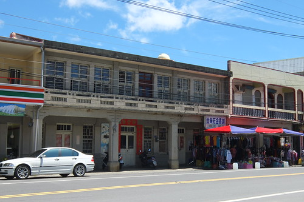
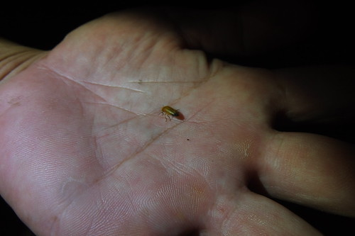

里德社區的生態 不只日間的欖仁溪精采 夜晚的蛙鳴蟹爬據說更是熱鬧 也因此一開始我便貪心的一次同時預約欖仁溪探祕與夜間巡奇 二個截然不同的內容與趣味 但一樣的被里德居民盛情招待!

行前掙扎好些次到底要把欖仁溪安排在下午然後接著延續到晚上 還是安排在早上 然後下午回去睡個午覺後再來參加晚上活動 雖然最後的二段式進出社區 讓我們少了傍晚時分在社區內散步的機會 但卻是讓我們得以精神飽滿參加每個活動的好方法 而且進出之間更得以放慢腳步且細嚼每份感動

那天中午離開社區的回程路上 我們停留在滿州鄉公所旁的圓環吃中餐 以大榕樹為圓心 散佈著派出所 鄉公所 國中 便利超商以及好些小吃店 小攤商 這裡是滿洲鄉最熱鬧的地方! 我們來到宋老師推薦的陳秋枝山產店吃飯  老闆娘一開始的慢條斯理 加上別桌陸續飄出的香味 讓我們等的飢轆腸腸 但輪到我們的菜開始上桌後  不得不稱讚老闆娘的好手腳與好味道 這幾天在不同地方吃了好些盤的海菜料理  這裡的熱炒方式最是特別也好味道  其他的炒山豬肉 紅燒黑白豆腐(黑豆腐也是這的名產)等每樣也都美味下飯的讓我們吃光光  不過店裡的招牌過山蝦我們並未點用  因為我們才剛從保護生態的里德歸來 才剛聽完老師們如何巡守山林 防止過山蝦的盜抓 實在沒有念頭吃這樣的山產! (老師說過山蝦可以離水一星期 成群結隊翻山越嶺去 實在很是神奇)

吃完飯後我們來到一樣在圓環邊的果汁店 這是行前上網做功課時所看到  我說我一定要來這喝一杯紅咚咚 貨真價實的火龍果汁  阿徹的芒果汁 跟我的火龍果汁一樣根本是果泥冰沙 超級過癮  還有愛愛的蘋果牛奶 以及徹爸掙扎很久才選的比較能接受的鳳梨果汁  每一杯都超級濃郁好喝 我說這幾天缺少的蔬果攝取都在這補足了  我們就霸在人家店門口 邊看著老闆娘打著一杯接一杯的果汁 邊喝著我們的一杯又一杯果汁 (我手上的就是第二杯的南瓜牛奶汁 有焦糖味超讚 只是我也超飽的)  

那天晚上7點半 我們又準時出現在里德社區的活動中心 第二次來到時更是多了許多熟悉與親切感 還被正巧在開會的居民招待送了中秋月餅 晚上是另外一位當地居民解說員帶領 這位老師很會講故事 生態帶的很棒(可是我竟然忘了老師的名字....) 夜間巡奇地點一樣離社區活動中心有一小段距離 由老師開車載我們去(也要先換穿雨鞋) 不同於欖仁溪 夜間導覽是在某一產業道路上 路平坦好走 但鄰近的池塘與溪流讓這裡棲息許多蛙 蟹 螢火蟲 還是灰面鷲過境時的落腳處 雖然好一陣子的乾燥天氣讓那晚的蛙 蟹 螢火蟲吝於見人 但在老師的眼尖與努力尋找下 還是讓我們目睹了許多可愛昆蟲與生物   7-10月是這裡的營火蟲季 點點螢火的來源有二種 一是雄性成蟲所發出 一是雌雄同體的幼蟲所發 二者發出的光頻與亮度有所不同 我們來的八月底剛好是黑腹櫛角螢尾聲 而山窗螢的幼蟲正努力長成到十月時的爆發 所以我們看到的是比較多的在草蟲附近的山窗螢幼蟲點點發光  山窗螢幼蟲很可愛 發現有人在看還會裝死一下  老師眼很尖 抓了好幾隻不同齡的幼蟲給我們觀察  也透過老師以及徹哥的分享 才知道原來看似可愛的螢火蟲其實是嗜吃蝸牛的恐怖肉食系阿   蟹跟蛙也是夏日夜晚的主題  只可惜天乾物燥 都害羞的躲起來啦  不過魚池旁的蛙鳴協奏曲還是壯觀而且努力探索下 也能在草叢間發現一隻隻瞪大雙眼的可愛小青蛙  同時 夜間昆蟲並不少   不同於白日的蹦跳 休憩中的昆蟲乖巧模樣更讓人喜歡: 雙腿好健壯 好有力學美的蝗蟲  蛙牛其實也是好厲害的生物 啃葉子的功力不能小看  我們一直很喜歡的變色蜥蜴   耳聞許久據說會吃蟑螂的好蜘蛛 拉牙    野生蟑螂 雖然一樣乾扁但有比較不討人厭一點   好多腳的恐怖蜈蚣啊  結的亂七八糟的蜘蛛網 但仔細觀看後卻令人驚嘆這網的結實與另類美感阿  老師指了但我們剎時也看不出來的竹節蟲  真的讓我們以為不過是落在葉上的小枯枝阿  雙腿細長 但實在太"鳥仔腳"的螽斯  以及最後在老師車上發現的螳螂 模樣真的好像拳擊手  沿途老師一直叮嚀小心不要踩到不該踩的蛇 但我說其實我還蠻期待遇見一隻來看看 沒想到老師竟然也很熱心與我一起期待且尋找 雖然最後沒如願 但這二小時的夜間巡奇 我們在老師的帶領以及滿天星斗陪伴下  聽蟲鳴 看螢光  窺見從未見的昆蟲夜間生活 跟早上的欖仁溪探祕一樣 都是讓我們收穫滿載且樂在其中的好棒生物課!  而且從二位老師的言談中 可以感受到由社區居民組成的生態解說隊(巡守隊) 除了有心之外 還遵守著嚴格的紀律與規章 而看著這些曾經是獵人的居民 變身成為如此盡責又博學的生態保育者/推動者 更是深感動於這樣的社區再造! 現在台灣好多鄉鎮如流行似的有許多的社區營造或再造 可往往除了美化 彩繪 或是說個故事這樣的文創活動外 到底實質給當地居民改善什麼 保留什麼 發展了什麼... 我覺得這是從地方政府到居民以及一窩蜂趕流行的遊客都該好好想一想 不過我知道以上都是我個人的碎碎念.................
