這二年偶會在網路新聞看到有關墾丁生態旅遊的消息 也在墾丁國家公園網站上多所留意各社區生態旅遊的訊息 挺好奇也期待這樣不同的墾丁旅遊方式 因此這回安排了滿洲鄉里德社區的生態小旅行 一是日間的欖仁溪探祕 一是夜晚的夜間巡奇 很在地且很深入的生態教學與體驗 有別於以往的旅行收穫與感動 而出乎我們意外的 欖仁溪探祕是愛妹這回旅行中最喜歡最難忘的 可見墾丁不是只有沙灘與大街 這樣的生態旅行也是小人心中的最棒墾丁! 

 預計的活動日前一週我才電話預約同時預付訂金 原想暑假期間人潮應該不少  有些顧忌團體人數影響導覽品質 後來才發現社區以小團體為單位(雖寫四人以上成團 但據說並沒下限) 我們一家子四人就出一團  所以我們如貴賓般的被專屬接待著 那天早上八點半 我們依約定時間的來到滿洲鄉公所前 然後由我們的導覽員開車領著我們來到10多分鐘車程的社區裡  在社區活動中心裡 我們挑雙適合自己的雨鞋 [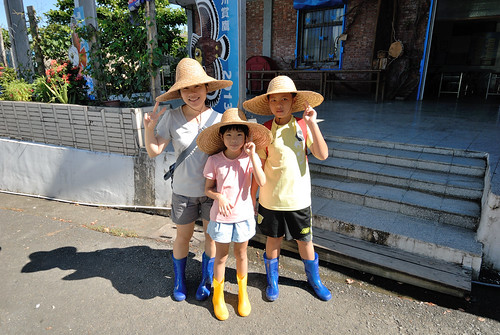](http://flickr.com/photos/33703965@N00/15101155792) 然後導覽員正式開場介紹社區 老師自己(宋老師) 以及今日的活動內容 最後人手一杖加上一頂草帽  開始今日的探險  我們坐上導覽員的車子出發往欖仁溪  10多分鐘的車程裡  經過社區的牧草區 老師侃侃而談起滿洲的農業發展 原來不利耕種的滿洲  賴以謀生的農業作物是牧草 我們才明瞭鄉內一片片的草原可不是隨意雜草叢生而已   抵達欖仁溪步道入口後 宋老師開始更是詳盡且不放過一草一木的跟我們解說沿途植物  脫離高中生物課本很久的我與徹爸 很是回味這樣的戶外教學課 問題不斷 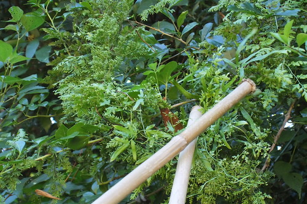 才發現原來木杖不只拿來幫助行走 更是與老師的請益解答間的重要工具  [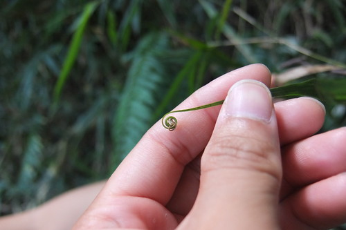](http://flickr.com/photos/33703965@N00/15102469242)[ 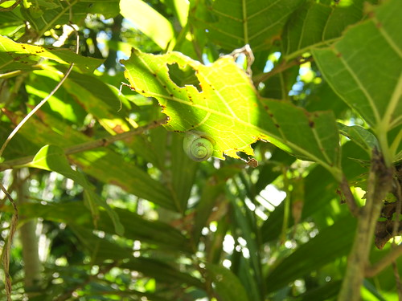](http://flickr.com/photos/33703965@N00/15103139392)步道走到欖仁溪入口 老師就讓見到水便一發不可收拾的我們玩水去 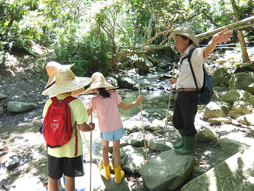 而且老師拿出他有備而來的小玩具讓我們更盡興的玩  小射槍 就如徹哥之前用原子筆管射橘子皮一樣 [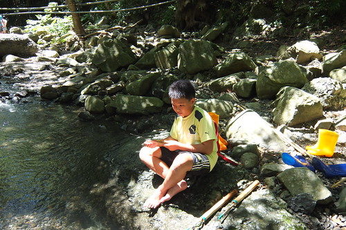](http://flickr.com/photos/33703965@N00/15099855351) 但老師自己用小竹管做的射槍 威力不容小覷 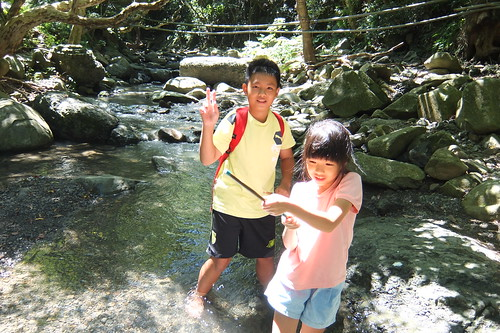 而且讓一開始不得要領的徹爸竟也有驚慌失措的神情 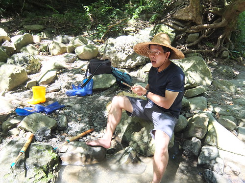 另方面竹子做的噴水槍容易上手多 清涼的溪水 好玩的小玩具 讓原是安靜的愛愛頓時活了過來  我跟徹爸每每很愛拿日本的奧入瀨溪說嘴 我們說這裡哪裡輸奧入瀨溪阿!  我們相信多些停留 多點愜意 其實台灣風景一點都不輸人 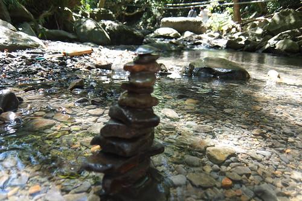 玩的過癮後 我們跟著老師的腳步繼續往上游走  沿途老師依然盡責的與我們介紹花花草草 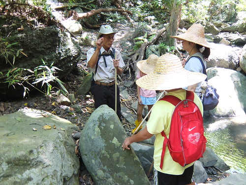 不敢時間的我們也容其他趕路團體的超車 盡興聽著老師的解說 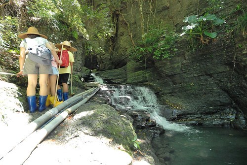 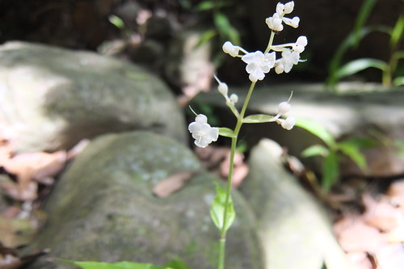 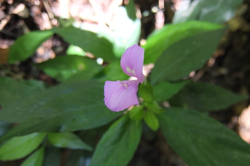 走走停停 不知不覺間來到欖仁溪的上游集水區 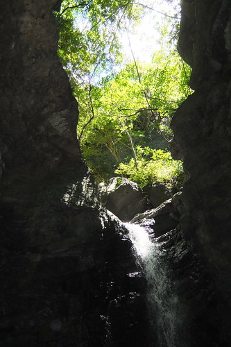 瀑布比想像中小很多  但隱密安靜的有如習武祕境  這裡也是村子用水的水源地  所以來到這也請小心不要踩入水源 留給村子最乾淨的水源  我跟徹爸留在水源地享受清涼與感動 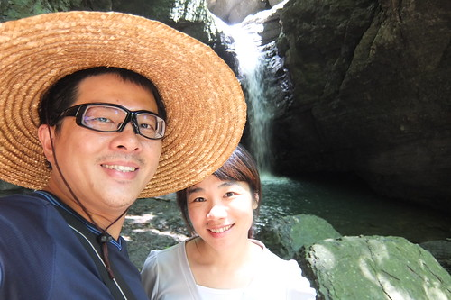 同時間 老師則帶著徹愛到下一層水潭中戲水  原始又清涼的溪流 讓徹愛玩的不亦樂乎 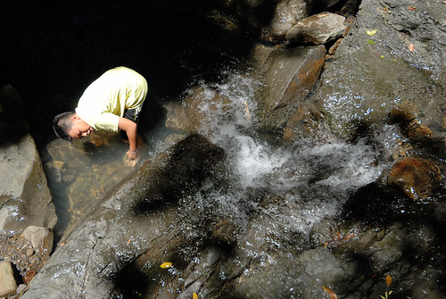 雖然愛愛這早一直很冷靜的樣子 但後來聽到她說她最喜歡欖仁溪的探祕 我們既驚訝又高興 我想原始林間對於小孩子來說 肯定有著不用言喻但絕對存在的魔力吧!  這早上老師跟我們介紹好多生態 也陪我們玩了好久的水 近三小時的生態小旅行 我們收穫滿滿 老師也辛苦了 雖然老師一直說 他的國語不好還請我們多包涵 但60多歲老師的國語真的說的很不錯 且口條超好的 幸運的我們遇到了巡守隊的大隊長 解說員中的種子師資  宋老師! [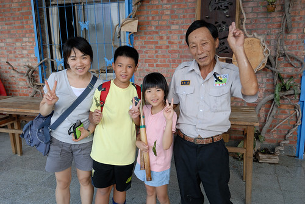](http://flickr.com/photos/33703965@N00/15102072995)老實講 那天老師介紹的一堆植物學名與特性  99%在之後都被我們給忘了 但感念生物的多樣性與尊重每樣生物 這肯定有在我們與徹愛心中發芽 而且這樣的戶外生物課真的很有趣 讓人很享受當下的一堂課  里德社區是著名的賞灰面鷲勝地  每年國慶日前後總會有許多灰面鷲鷹過境 也吸引許多賞鳥人士來這觀賞起鷹 落鷹  雖然我們沒賞過鷹  但里德的原始生態卻也讓我們留有美好回憶  很值得走一趟的社區生態旅行! 
