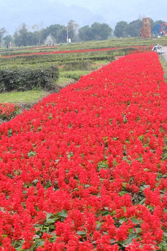
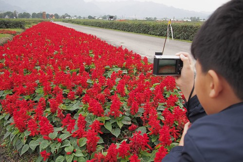
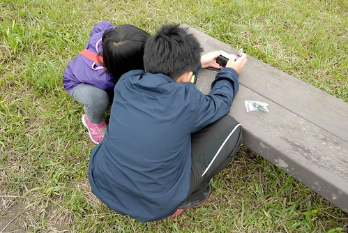
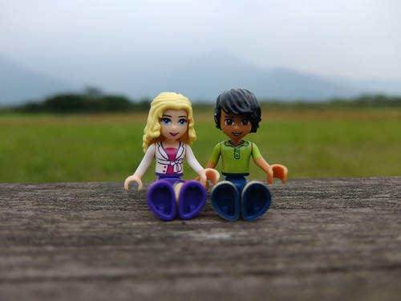
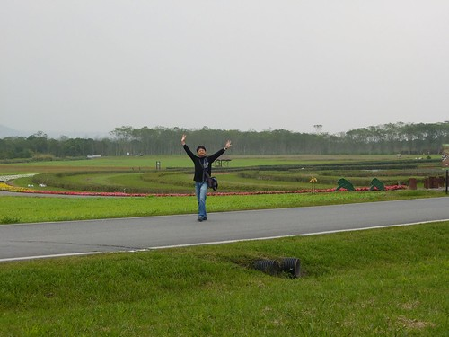
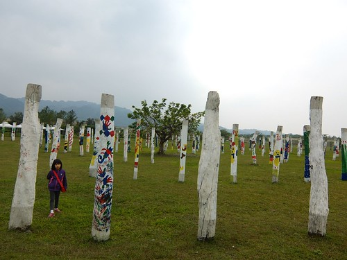
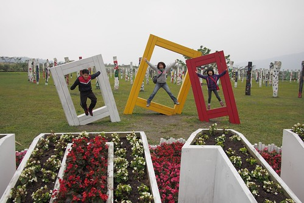
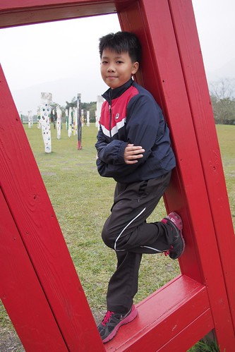
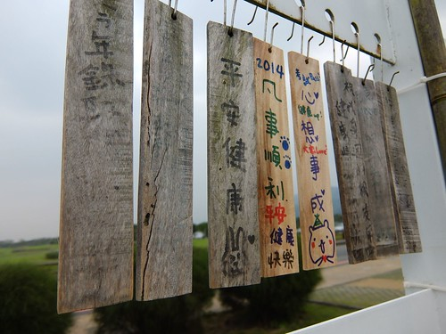
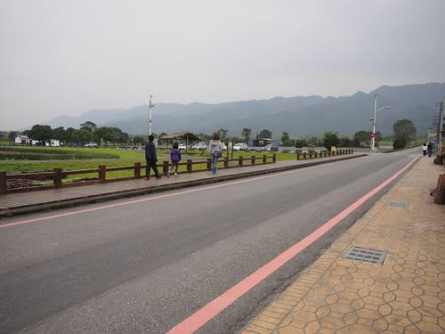

彷若人間仙境的雲山水以及因熱氣球而熱鬧起的大農大富平地森林是花蓮近年很夯的兩個地方 好像來花蓮的觀光客都必去且讚不絕口 每隔一陣徹爸就會問"我們去過嗎? 我們好像都沒去過?" 是滴! 號稱花東觀光大使的徹家真的都沒去過 因為這兩處都被徹家專屬導遊(就是本人)歸類為人工造景 所以一直沒有安排過... 這回趁著第一天住宿在瑞穗的地利之便 那我們就順道來去平地森林走走看看唄 以後再聽別人提起或是看到網路上的照片/遊記 我們就真的"很有感覺"了

大農大富平地森林在花蓮的光復鄉 就在縣道193自強外獄通往台九線那條好長好直好像溜滑梯的大農路上  三年前我們第一次來花東騎車時 曾經在自強外獄的那段路受過苦 但也在那一次注意到這條好直的路以及驚艷於這片平地森林的美麗 ( [blog.yam.com/hmchen1975/article/29408983](http://blog.yam.com/hmchen1975/article/29408983) 好長的遊記阿...中間段)  這裡原是台糖的土地 在台灣糖業落沒後漸漸荒蕪 民國91年配合林務局的"保育為主"林業政策 開始進行為期6年的平地景觀造林計劃 而大富大農平地森林園區於2011年揭幕 是以低碳 低開發 低商業性 這三低原則所開發創立的農村森林生態園區 2013年夏天在這舉行的花蓮熱氣球季 更是讓這裡成為花蓮的新興熱門景點  事前沒有做足功課的我們 依著導航 沿路指標來到園區 不知道園區有多大 森林如何親近 更是不曉得單車需要事先預約才能使用 我們只能用散步的方式走著  我們應該就像大部分來到這的遊客 只是走馬看花的走在園區的圖騰花海區 雖然圖騰設計原意很宏觀 很美麗 但缺少高觀景台實在很難讓人看的明白 另方面 其實很artifical的花海景觀 實在讓人覺得跟她的名字很不相襯 森林呢?  那才應該是主角不是嗎??? (後來網上有看到人家拍的超美森林 只是那要腳踏車才到的了)  雖然冷颼颼 也同時有些小失落 但我們還是隨遇而安的把花海區走一圈 邊走邊玩  為讓兄妹倆興致高昂 於是把相機交給徹哥讓他們透過鏡頭發現美麗  還有為他們的樂高小人進行外拍  另方面 既然花海不迷人 那就多拍拍人吧   走完花海區後 我們繼續走往遊客中心去蓋章  走在大農路上 雖得多留意來往的車輛 但覺得這裡有趣許多  舊糖廠機材的放置 斑駁的石牆 雜生的小花小草  反而吸引我們  在這裡也能更全貌的看見整個花海園區  遊客中心旁有188跟漂流木樁彩繪構成的藝術品"生命寶樹"  徹愛各自找出最喜歡的木樁  兄妹倆讚嘆每個彩繪者都畫的好可愛好漂亮  接著我們看到三個大木框 三個人忍不住一人佔住一個框 要徹爸幫我們拍照留念  然後三人還玩起跳框遊戲  跳的很High阿~ (只是2014字樣都被喀掉了)  越來越愛帥的徹哥也裝模作樣擺起pose  遊客中心提供的資訊比我們預期的簡陋很多 真覺得這方面的軟體設備可以多加強點  尤其若能提供更便民的單車租借服務 相信大家更能深入體會森林的美好  因為不趕時間 我們繼續在園裡散步著  偶而坐下來看看眼前的空 挺愜意

休息的時候 遇見執行園區計劃團隊的工作人員邀請進行園區問卷調查  我們寫著問卷才發現 其實園區比我們以為的大很多 但也完全搞不清問卷上所說的特景點在何處... 以後有機會要騎著單車好好深入整個森林  我想我會更認同這個其實不只是也不應該是花海區的平地森林園區  以前我們一直搞不清是大富大農還是大農大富的平地森林園區 總算一探他的究竟 雖然在旅行的第四天徹爸就徹底忘記我們在第一天來過的這裡 但凡走過必留下痕跡的... 照片的回憶 還有希望下次騎著單車穿梭在美麗林間的期許! 
