最近的天氣 除了下雨的潮濕讓人不舒爽外  不冷不熱的溫度其實很怡人 而隨著立夏後(5/5) 南風的吹起  我們開始期待起暑假的到來 避暑的高山 火辣辣但風涼呼呼的東台灣海邊 都在我們的幻想藍圖裡... 同時 我們的寒假豪華好住好吃旅行也該是完成最後一篇紀錄 回憶就此完整收錄!

我跟徹爸常會想起在愛愛出生前 常用seven御飯糰就解決中餐的克難旅行 除了簡單方便又省錢外 讓阿徹可以好好在車上休息睡覺也是主要原因 但曾幾何時  呷飽呷開心已是我們旅行中需要多費點心思與銀兩的重要大事 尤其曾經嗷嗷待哺的兩張小嘴 現在真的越來越能吃 也越會吃了!

每次往返花東總會經過的花蓮鳳林 有著著名的滿妹豬腳 但跑跳花東十載的我們還真的從沒停車吃過 這回從台北出發後 我們直衝到鳳林的林田山山腳下才停歇   為的就是聞豬腳香而來  行前上網比較了滿妹豬腳跟不遠處的林田山豬腳兩家店的菜單 最後決定來到林田山豬腳的最大原因 除了因為滿妹一盤豬腳份量實在太多外  滿妹只有苦瓜湯的選擇也讓很重湯的我們毫不猶豫就排掉  豬腳很入味很軟Q 其他菜色也都中規中矩  600元 就讓一家子吃了頓有菜有肉有湯的中餐  CP值算是很高了 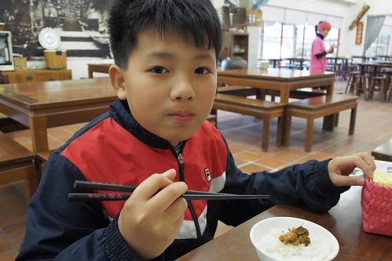   

住瑞穗的那晚  當然 肯定 要來綠精靈吃飯 (爬滿綠精靈外牆的藤蔓 真的讓綠精靈越來越綠!) 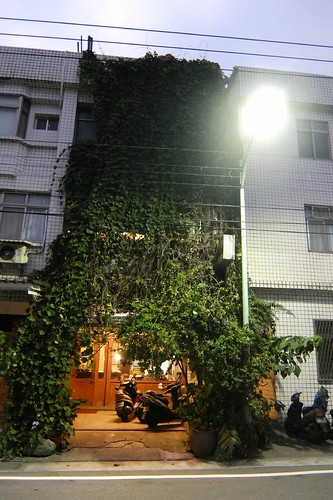 旅行的樂趣不只在於新奇事務的體驗 像這樣一而再 再訪的親切感也是旅行中的幸福期待 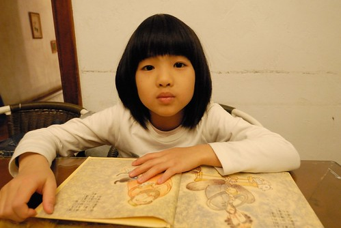 總會隨身背著包 裝著本子或書的徹哥 跟愛妹總會利用看書 畫圖 打發等候餐點上桌的時間 要不就一家子瞎抬槓 或是聊今天白天的事 明天預計的事 是我們 不同於家裡餐桌的另種餐桌回憶  綠精靈的菜單這幾年幾乎沒變 每次我們來也都點一模一樣的餐 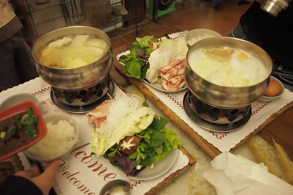 但簡單清爽的原味涮涮鍋 以及濃的恰恰好的牛奶鍋 每每還是讓我們吃飽吃開心 且下次到瑞穗還想再回味  除了牛奶鍋外 綠精靈的焗烤也超級棒 之前 我們都是我與徹爸各一鍋 然後徹愛共食一份海鮮焗烤麵 沒想這回徹哥已獨當一面能自己吃一鍋  因此愛妹難得的有她自己專屬的餐點 美味的焗烤麵真的讓愛妹給霸著獨享 不論我們怎樣好意想幫她分食 吃完整整一盤 愛的肚子撐了 心也好滿足........ 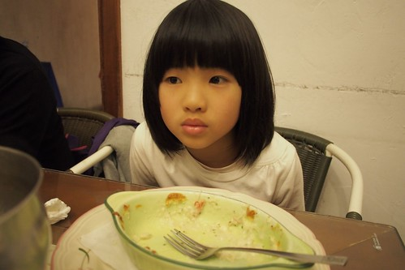 同時 綠精靈的鮮奶酪也是超級棒! 真不愧是牛奶的故鄉阿 

是滴~ 住在鹿野的那一晚 一家子當然(開半小時的車)衝到初鹿吃睽違一年的原生植物園野菜鍋 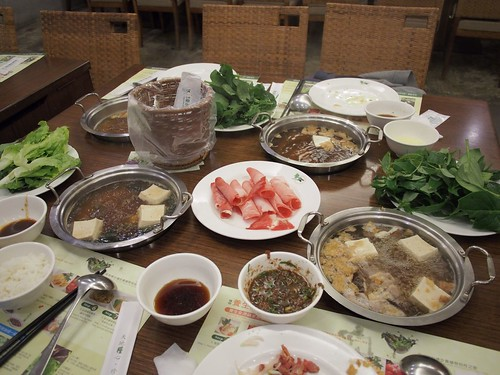 雖然台東也有其他標榜野菜的餐廳 但因為我們愛喝湯  所以涮涮鍋形式的原生野菜鍋便一直是我們的心頭好 每次來 我們自己總也會邊吃邊納悶 為什麼我們會喜歡這樣的野菜阿?!  但各種讓人意想不到 可能苦的 甜的或脆的野菜風味 真的很讓我們著迷 尤其最後融合著各式野味的湯 更是精髓所在阿 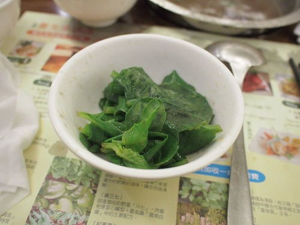 愛愛這回得計價了 所以也獨當一面自己開了一鍋 自己煮一鍋 愛愛食慾特好 成就感也特大  至於徹哥 不用說當然一如以往的卯起來吃 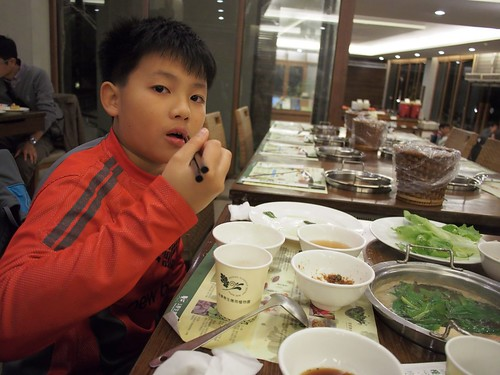 戰鬥力幾乎強過我與徹爸 果然是"在大"的少年阿 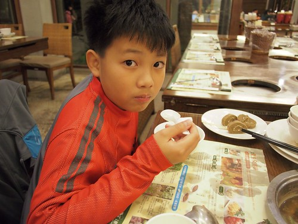 雖然這幾年 每次來的費用都越來越貴 從兩小免費 到阿徹收兒童價 再到愛愛這回也開始得付費 加上中間的價格調漲 甚至下回再來 阿徹便超過140公分得以大人計價 但這頓餐真的是徹家難得大手筆且不皺眉的"大"餐阿! 而且不知不覺也變成我們台東旅行的重要期待與回憶~ 

再住長濱 最興奮期待的就是可以再享長濱100的美食美味 但沒想到從旅行第一天 我就開始撥打的預約電話卻一直等不到人來接聽 直到我們人到長濱 親眼目睹長濱100拉下的鐵門 才無奈的接受老闆這麼剛好休息的事實 原最壞打算就用泡麵解決當日的晚餐 但因住的陽光佈居太靈性 正面到讓我們覺得在裡面吃泡麵實在不應該 於是依著女主人的建議 來到街上的哈地喇小吃店 色彩鮮豔鐵皮屋的哈地喇 內部完全出乎我們意外的寬敞乾淨 而且好吃 第一個端上桌的小菜 到位的擺盤與味道 立馬讓我們不敢小看哈地喇  而混著紅蘿蔔末的炒飯 也是口味獨特美味的讓人讚  更別說著帶著海菜的貢丸湯 一整個對了徹愛的胃口 大呼好吃!  隔天中午離開長濱前 我們又到玉長公路口 男主人推薦的邱爸爸海鮮 因為這是五天旅行中 離海最近的鄉鎮 實在怎樣都應該吃個海鮮再走  如同麵店般的小店面 也一樣的出乎我們意外 但清潔的用餐環境以及老闆親切的招呼與配菜 讓我們很期待等會的海鮮大餐  魚還沒上桌 一小盤醬筍小菜就讓徹愛猛扒飯 喊好吃 更別說接下來一盤盤上桌的海味  每個都讓我們大呼美味  因為我們不吃生魚片 老闆用薑絲 九層塔與些許醬料調味的方式料理今天的"主"魚 好吃到向來不是那麼愛吃魚的愛愛 一塊接一塊 回家後還一直念念不忘那個竟然讓她覺得魚好好吃的邱爸爸 (回家後愛愛對魚的接受度也提升許多) 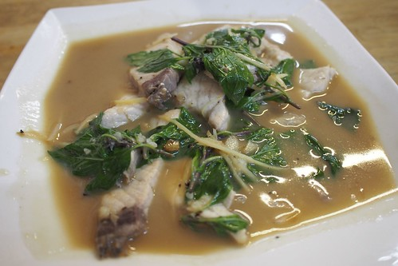 東石來的蛤 充滿海味 鮮味的甜美 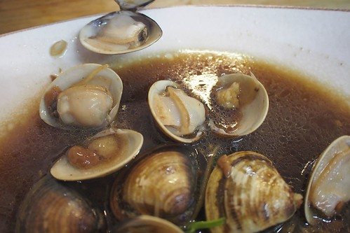 邱爸爸有介紹 但我們在剩下骨頭後完全忘記的煎魚  香酥美味的一樣讓我們大呼過癮  加上一大盤的新鮮燙白蝦 炒青菜  以及跟第一盤同身的大魚骨熬的魚湯 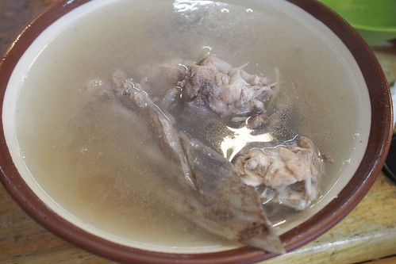 真的太讚的一頓海鮮大餐! 有了哈地喇 邱爸爸 加上長濱100 以後來長濱真的不用吃泡麵了!!!

最後一天從富里趕路回台北的路上 為了韓老爹的誠信麻花我們繞進鳳林  自取自付費 一切誠信的交易方式 讓韓老爹的麻花除因為美味外 還多了吸引人來的故事性 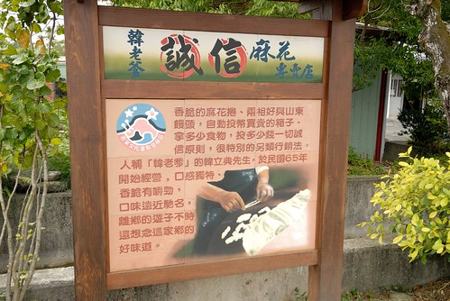 香脆口感的麻花 真的越嚼越有滋味  超級物美價廉的丹祿  我們還買了兩相好  以及也很夠味的茶葉蛋 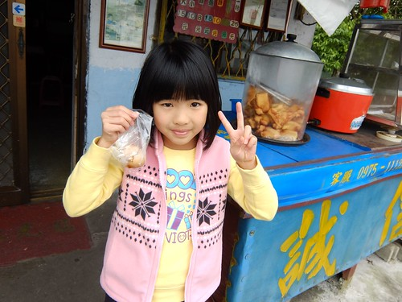 然後依照價目表上的價錢 算好總價後 投入我們的金額 這是小學生很不可思議 但卻親身感受到這份美好的買賣! 

旅行一路上我們買了關山米  七星潭的柴魚  原生植物園的醬油跟香皂 與鳳林的誠信麻花 還採了蘿蔔 做了炒米香 再加上最後一天住宿的月荷塘送的手工麵包跟吐司 如同徹愛說這趟旅行真是大豐收 也是廚房的大採購阿! 是阿~ 這樣好吃 好住 還滿載而歸的旅行 真的太..太..太棒了!!! 
