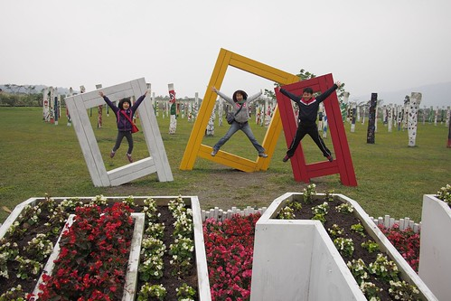
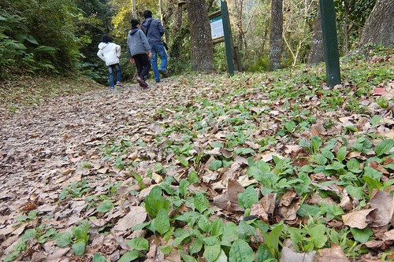
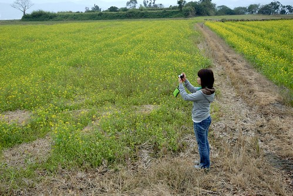
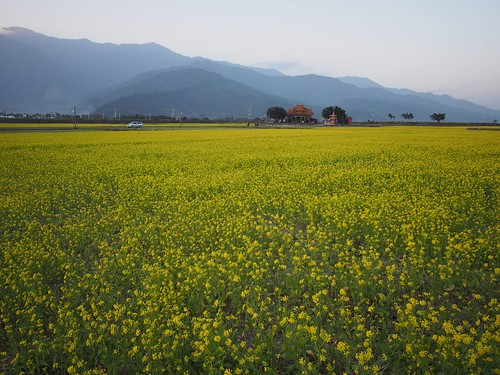
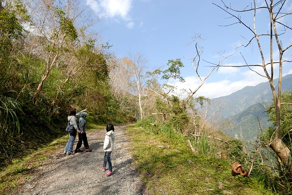
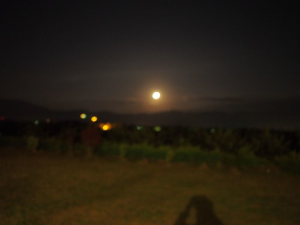
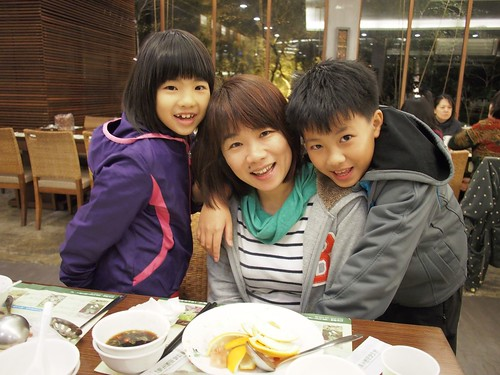
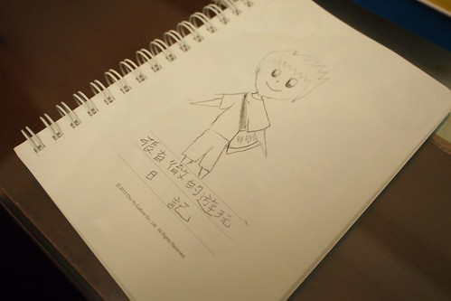

寒假的五天花東旅行似乎快變成徹家的傳統 "必需"到一家子沒有出國見世面的動機 卻怎樣也不能不去花東玩好多天 12月初徹爸就開始問 "這次要去哪裡?" "開始安排了嗎?" 殷切期盼的讓我得更是認真企劃我們的寒假花東旅行! 這幾年安排的景點真是越來越少了 但這次看似沒甚麼的行程卻獲得徹爸跟徹愛異口同聲的讚賞 直呼真是太好玩 太好吃 太好睡 太開心 以致當我請愛愛幫忙給這次旅行取個名稱時 愛愛馬上就想到"豪華"這二字 雖然沒有五星級飯館也沒有六星級酒店 但我們豪華的好住 好吃 好開心~ 

這次旅行中很難得的認真記著帳 順道剛好也認真來分享我們花東旅行的"實務"經驗 一開始的行程規劃是: 1/18(六) 台北 -> 花蓮午餐 -> 193春日社區 -> 宿瑞穗 東岡秀川 1/19(日) 玉里 -> 南安瀑布,瓦拉米古道 -> 宿富里 月荷塘 1/20(一) 璞石館DIY -> 原生植物園野菜鍋 -> 宿鹿野 森活B&B 1/21(二) 197 鸞山森林博物館  -> 宿長濱 陽光佈居 1/22(三) 台11 -> 石梯坪, 石門, 月洞 -> 台北

可是訂房時民宿空房日跟我們的住房日兜不攏 雖然最後四個預訂民宿還是都有訂到 但一整個大搬風而行程也跟著變動如下: 1/18(六) 台北 -> 林田山豬腳(午餐) -> 大農大富平地森林園區 -> 宿瑞穗 東岡秀川 1/19(日) -> 南安瀑布,瓦拉米古道 -> 玉里璞石館 -> 原生植物園野菜鍋 -> 宿鹿野 森活B&B 1/20(一) -> 鸞山森林博物館(AM9:00)-> 關山 -> 長濱100 -> 宿長濱 陽光佈居 1/21(二) -> 石雨傘(台11號省道102K) -> 三仙台/比西里岸(111K) -> 成功(115K)海鮮 -> 阿美族民俗中心(126K) -> 東河橋(128K)-> 泰源幽谷(台23東富公路)-> 宿富里 月荷塘 1/22(三) -> 鳳林菸樓 -> 花蓮市 -> 台北

計劃當然也永遠跟不上變化  所以我們最後的執行如下: 1/18(六) 台北 -> 新城 佳興檸檬汁 -> 鳳林 林田山豬腳(午餐) -> 大農大富平地森林園區 -> 綠精靈(晚餐) -> 宿瑞穗 東岡秀川 1/19(日) -> 瓦拉米古道(至佳心) -> 璞石閣玉里麵(午餐) -> 璞石藝術館 -> 原生植物園野菜鍋(晚餐) -> 宿鹿野 森活B&B 1/20(一) -> 鸞山森林博物館 -> 關山 拔蘿蔔 -> 哈地喇小吃(晚餐) -> 宿長濱 陽光佈居 1/21(二) -> 邱爸爸海鮮(午餐) -> 安通野溪溫泉泡腳 -> 富里農會便當(晚餐) -> 宿羅山村月荷塘 1/22(三) -> 羅山 雞鳴園炒米香 -> 鳳林 誠信麻花捲 -> 花蓮 禾禾飽滿餃子(午餐) -> 柴魚博物館(買物) -> 台北 花費小計: 住宿$16120, 吃飯$5125, 體驗活動$3300, 兩缸油錢(900K) $3000 加上沿途買的油鹽醬米(這也是趟廚房補給之旅阿)  總共約三萬元 好像真的像大部分人說的 在國內旅行不如搭飛機去港澳玩... 但去花東旅行真的是件會上癮的事ㄚ!!! 

這回安排行程時根本沒想到花海跟油菜花  因為這麼多年下來真的越來越不敢期待了  沒想到今年卻意外遇見令我們驚喜的美麗油菜花田 特別是在池上還有關山  這回還意外的跟高山 森林好親近 在瓦拉米古道的4KM路上 在鸞山森林博物館裡  也意外的遇見好黃好亮好近的月亮  很多的意外驚喜 但也很多的熟悉與感動 例如 像是跟農友交朋友般的到田裡拔蘿蔔 還有我們已經累積到不知道第6還第7次的原生植物園野菜鍋  返程的路上 我們由老至小依序發表這次旅行的心情與建議 沒想到大家都覺得這次的旅行跟以前不太一樣 特別的好玩又開心 而獲得最多迴響與回味的是森林博物館裡的烤山豬肉 (大家講著的同時口水又快流下來) 只是兄妹倆也認為唯一的缺點是 應該再多玩幾天的! 徹愛真的是玩上癮 也戀上花東了...  做好準備 放鬆好心情 花東旅行就是這樣令人期待又回味無窮~
