十一月一個人的旅行回到家後便跟徹愛約定好 寒假一家子去花東旅行時 要帶他們去看石頭畫還有自己DIY石頭畫 旅行中 徹愛最常問的一句話是"什麼時後要去做石頭畫阿?" 而這石頭的約定也是讓徹愛勇腳走八公里瓦拉米古道的最大動力 雖然礙於時間太短 只夠讓徹哥小玩一下 但卻已美好的讓我們忍不住又約定了下次旅行的到訪 而且下次絕對要停留可以讓人慢慢做畫的一整日甚至好些日~

從南安回到玉里鎮上時 刻意在客城鐵橋前停車 讓徹爸拍下這經典又美麗的一幕 紅色鐵橋襯著的黃色油菜花田 幸運的是 徹爸才下到田裡 一列火車就剛好從鐵橋下駛過 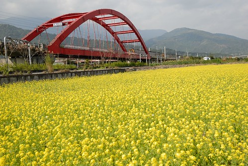 雖然沒有最佳角度與構圖 但這意外搭在一起的火車 鐵橋與油菜花 很是讓我們竊喜 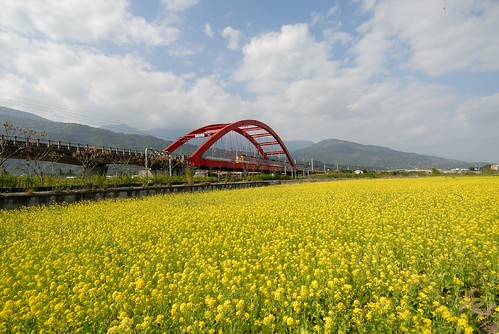 上回我一個人拍的一張火車過鐵橋照片 徹爸很是喜歡 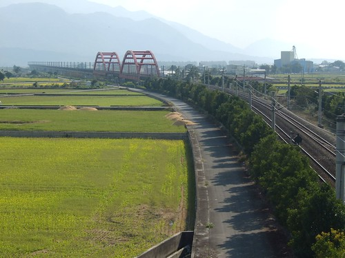 這回我帶著徹爸到這個看鐵橋的最佳觀賞處 讓徹爸好好實地了解 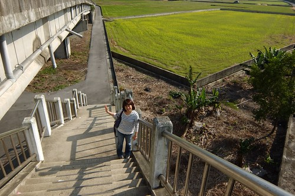 從南安下山後一路的停停拍拍 等我們在玉里鎮上吃飽中餐已是下午三點 然後也才總算帶徹愛到這幾個月媽媽口中常說的石頭藝術館 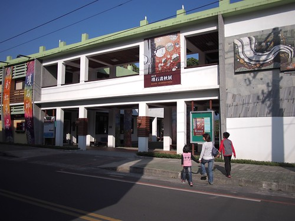 璞石藝術館就在有名的橋頭臭豆腐與璞石閣玉里麵附近 可以的話從中午的玉里麵 下午的參觀與DIY 到傍晚的臭豆腐  一整個半天與兩餐都解決了  "璞石畫"原只是玉里高中石材加工科在民國63年響應教育廳而推出的一門地方鄉土教學課程 初時為利用石材加工廠的剩料為材 後來原創老師偶然在玉里鄰近河域發現具有豐富色彩與美麗紋理的火成岩與安山岩 以此為素材 創造出另類的石頭語言 也因此逐漸發展成"以石頭為思考中心的"璞石畫 取名璞石畫不止與發想地"玉里"地緣關係 我想也同時凸顯璞石畫的獨特質樸特質 (以上摘自 花蓮縣文化局網上資料)  我們先是參觀北棟的常態展覽室 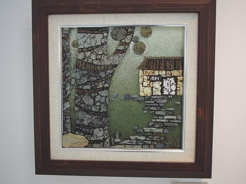 徹爸不約而同最是喜歡 我上次也看很久的"勁草" 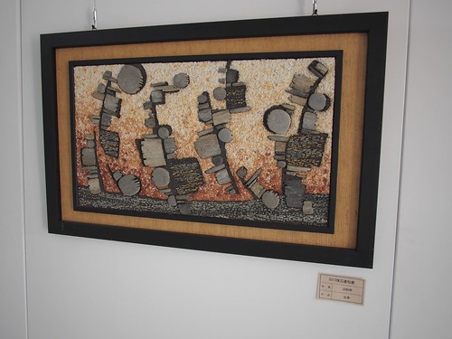 然後我們再到南棟的藝術工坊 參觀並讓阿徹製作一個小DIY 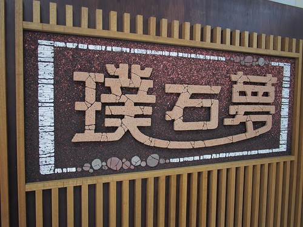 牆上陳列的一幅幅DIY小創作  以及滿桌各式各色的石頭素材 讓徹愛兩人躍躍欲試  可是我們來的時間有點晚 距離關館的4點半前所剩的1.5小時實在很難完成一幅作品 可是已讓兄妹倆期待好幾個月  且因為我們的堅持走完瓦拉米古道而讓下午在鎮上停留的時間被縮短 我們努力說服不想給館方增麻煩的阿徹以及認為時間不夠的館方人員 讓阿徹在有限時間內DIY一個"霍夫曼黃色小鴨"的仿畫 (畢竟複製總比創作容易許多) 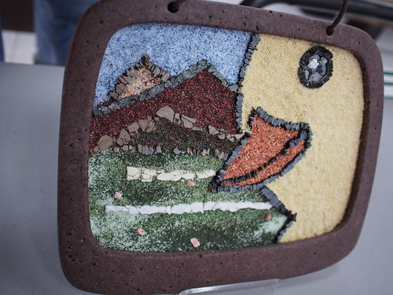 也很感激館方人員願意讓我們進行DIY(還把霍夫曼的創作擺到阿徹眼前做範本) 並熱情允諾會陪到我們製作完成才關館  阿徹難得喜不形於色的 立刻認真起來  很快的就構好圖  璞石畫製作過程包含下列六步驟  老師掌握我們的進度 在每個步驟過來給予指導  這是主體的鑲嵌  阿徹貼的認真 我這阿母也很稱職的當起書僮(實在是怕耽誤到老師們的離開時間 只好全家總動員) 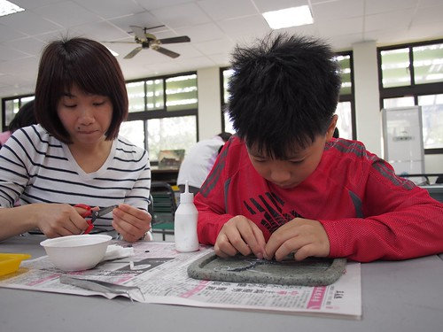 每次到材料區取所需的素材時 就會忍不住多看幾眼多摸幾下 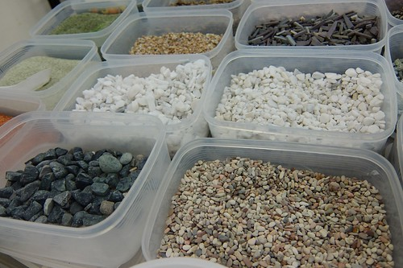 很不可思議 石頭的變化性竟然這樣多 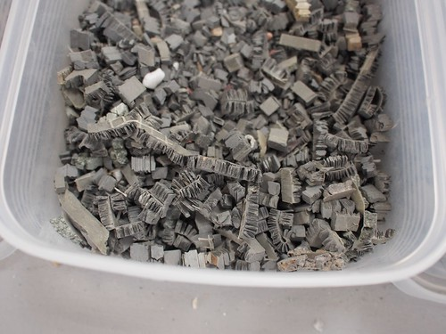 顏色這樣豐富又美麗 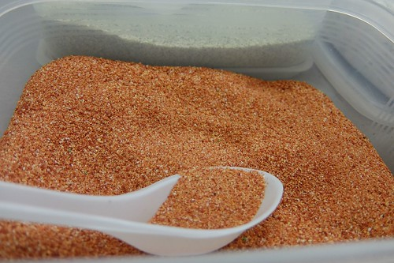 而透過不同的切割與碎裂方式 讓一樣的石材有著不同的呈現 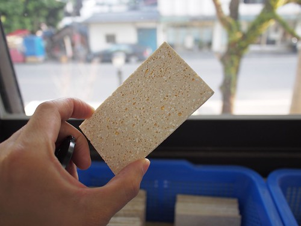 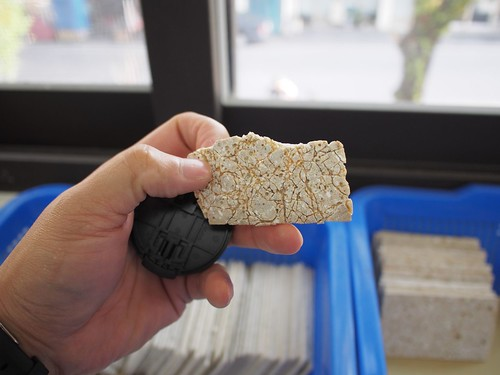    

半小時過去 阿徹的鴨形浮現了  接著就是縫隙砂與背景砂的鋪灑 看似簡單 但鋪的勻與整潔需要細心與耐心  同時間 徹爸帶愛愛到一樓的璞石印染工坊參觀  好天氣下 印染工坊的老師們正進行著植物染  這樣的小鎮氛圍 真的很讓人愈加喜歡玉里哩 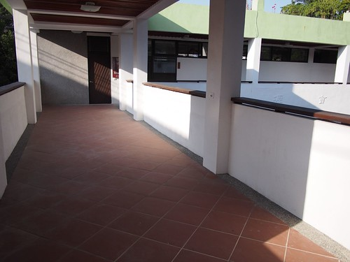 一個小時過去 阿徹的小鴨進入收尾階段  全家一起為我們的黃色小鴨貢獻一己之力 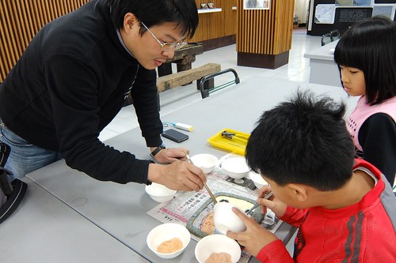  不過最後的結尾還是操在阿徹手上  然後最後的一步 上膠保固 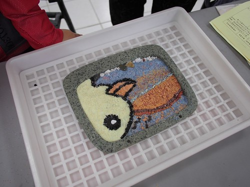 一樣的由老師先示範  上膠後的石材色澤更顯亮了  阿徹小心翼翼的上膠   真的是最後步驟的 吹風機吹乾膠 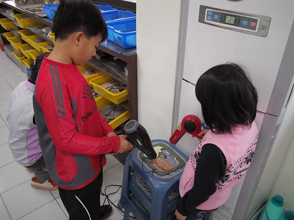 吹了挺久 吹到愛愛手痠換我接手  噹~ 阿徹的黃色小鴨完成 跟霍夫曼的山嵐版相比 阿徹的海邊夕景版同中有異的也挺美  在關館的4點半前 我們完成了我們的第一次璞石畫製作 甫走出館 意尤未竟的阿徹以及礙於時間沒能獨當一面的愛愛便央求著下次可以來久一點嗎 然後啪啦啦的說起下次她們要做什麼樣的畫  而且下次真的是自由創作了! 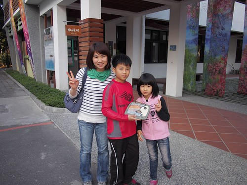

補充: 這是館內我們看的很喜歡的小時鐘 只可惜這是為了二月的客家節所設計的主題材料 且非賣品阿! 殘念.......... 
