來過花蓮卓溪的玉山國家公園南安遊客中心好多次 總算這回往山裡開去 真正進到玉山國家公園裡(南安是玉山國家公園東段入口) 越往山裡走也才真見識到高山的秀麗與雄偉 而瓦拉米古道更是美麗的讓我們大呼過癮 不虛此行~

從南安遊客中心到步道入口的六公里柏油路上 我們便已被眼前的藍天綠山給聶服 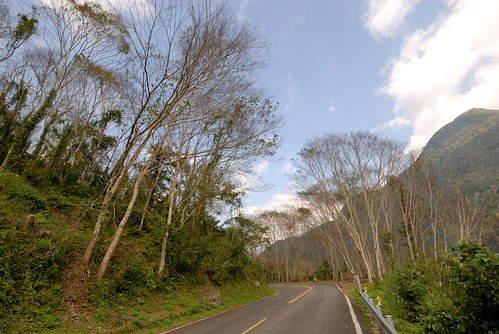 依著拉庫拉庫溪谷平緩上升的山勢 讓我們越升越感到興奮與好奇  加上好天氣 是個令人一開始就愉悅的親山健行日  車子順著柏油路開到不能開的台30路終點 便是瓦拉米步道的起點 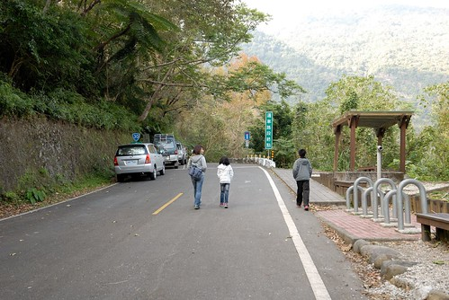 台30原為台18 台18線為台灣未貫通的四條台灣橫貫公路之一 西起嘉義縣阿里山鄉 經南投信義鄉、高雄桃源鄉、花蓮卓溪鄉 直到南安，全長200公里。 因為生態考量 台18線橫貫公路因而到底沒有完工!  八通關古道是清朝時期所建台灣本島東西部的三條道路之一 西起南投竹山 東至花蓮玉里 全長265公里 是國家一級古蹟 玉管處沿著八通關越嶺的路基 整建從南安到瓦拉米間長達13.6公里的路段 是為瓦拉米步道 目前步道口到佳心路段為特許的生態遊憩路段 不需辦理入山證 但若是要前行到瓦拉米山屋就須辦理甲種入山證才可進入 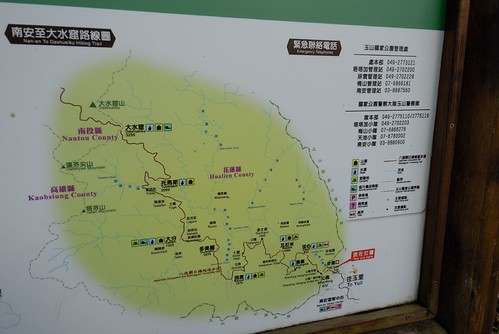 我們今日的目標是走到不能再走的佳心 但因為事先沒做好功課不知道這段路實在不算短 沒先準備午餐帶進山 所以最壞打算就是量力而為 隨時可以回頭  一走進步道 我跟徹爸便好是喜歡  沿路是原始又豐富的中低海拔林相  走在期間 每一口呼吸都好舒服  雖然有些冷 但冷風中走在太陽底下更感溫暖  好天氣作伴下 我們大步的往前走~  除了偶而停下來看看前方的樹 遠方的山  還有拍照留念... 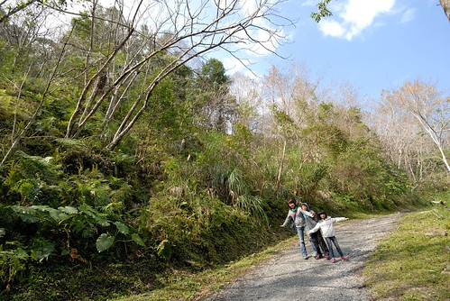 只是冬季旅行中向來呷好做ㄑㄧㄥ扣的兄妹倆 還是不太喜歡這樣的健行行程  不過徹愛從小訓練起的勇腳 走這點路真的沒有什麼  加上誘因脅迫 兄妹倆還是乖乖跟著邁開步伐往山裡走 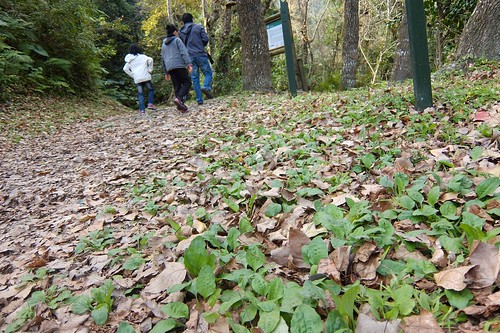 可是愛愛說"這裡有虎頭蜂耶 太危險了"  加上小心黑熊 野生動物出沒的告示牌 小姑娘抗走更有理了 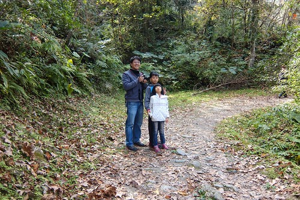 但爸媽真的好喜歡這 所以還是放寬心好好享受走在這山林裡吧 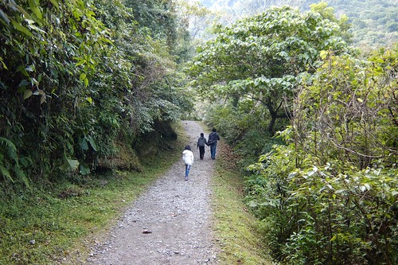 走到第一座的山風一號吊橋 愛刺激的愛愛總算精神來了 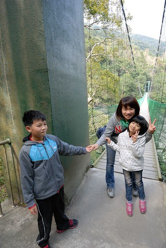 可是換膽小的徹哥挫了 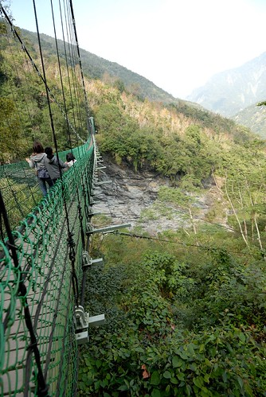 於是媽媽跟妹妹變身成左右護法 牽著我們的徹哥平安走過橋 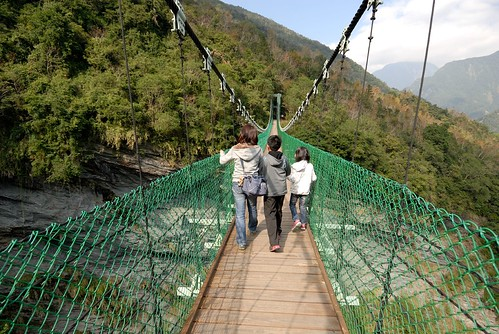 走在吊橋上 視野真是好 右方遠處的中央山脈系好雄偉  往吊橋下所見更是壯麗!  雖然頭皮有點發麻 但站在橋中央360度環視一圈真的很美 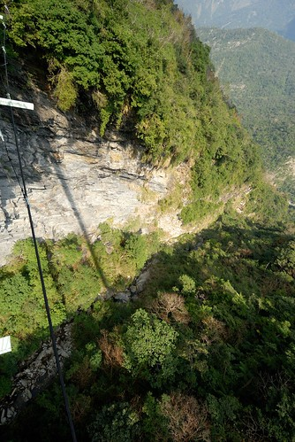 美到送徹哥平安抵達橋的彼端後 我跟愛愛又走回橋中照相賞景 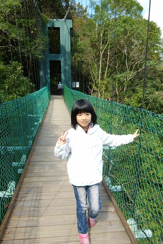 (這張自拍失敗了 但卻挺喜歡)  過了山風一號吊橋後 路變的小了點  告示牌上禁止的事項也更多了 (洋洋灑灑挺壯觀) 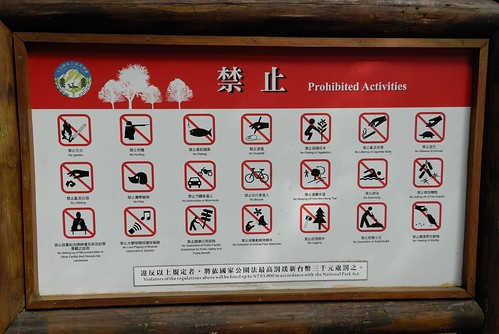 我同徹愛說 "禁止這麼多事情的地方可見真的很美 所以我們要很開心走這趟"  地上滿是枯葉的黃 兩旁盡是盎然的綠  黃黃綠綠好不豐富 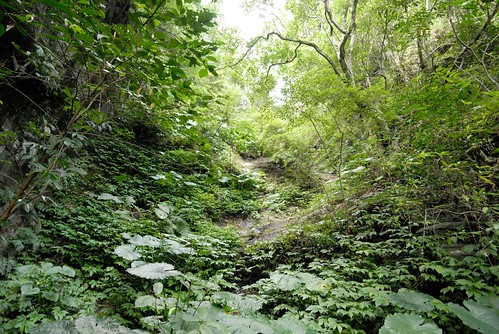 加上偶見尚未飄落的楓葉  更增添詩情畫意 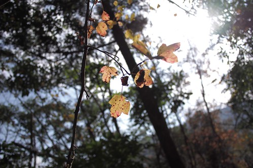 抵達第二座山風吊橋前有個山風瀑布  但必須下120階的階梯才能到觀景台 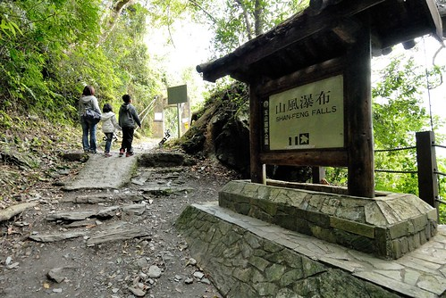 我們留待回程時再讓徹爸去挑戰 (可惜最後因為肚子餓趕下山而沒成)  通過的第二座吊橋 山風橋 古樸的很有歷史感 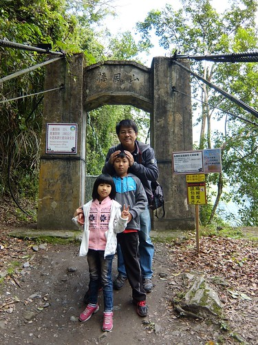 而長度雖然比山風一號吊橋短 但卻感覺比較搖晃 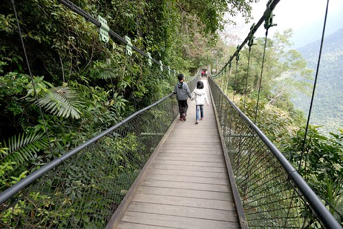 吊橋中央看見的水瀑 不知道是不是山風瀑布的上流 (水真的好清澈)  通過吊橋後 讓軟腳的徹哥休息會 從步道口到這裡也約莫走了 2 km 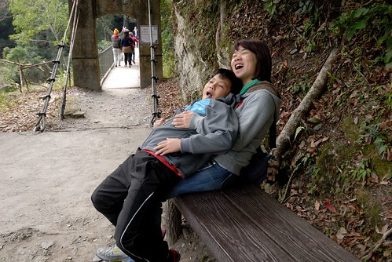 接下來的路況更是精采且考驗著我們 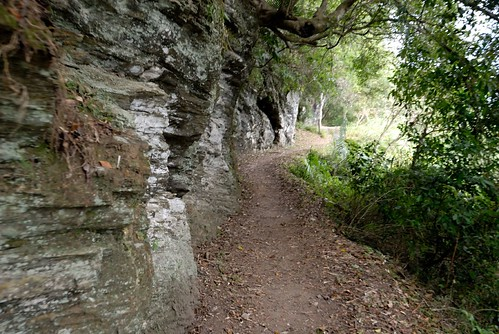 (兄妹倆雖笑不出但起碼沒臭臉 媽媽已滿意)  沿著拉庫拉庫溪一路上來的風景真的引人入勝 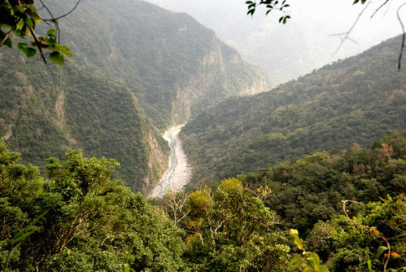 讓人想一窺究竟的忍不住直往山裡走 走到不能走的地方與時後  這告示牌雖然令我們哈哈笑了幾聲 但我們知道這不是開玩笑的  真的不是開玩笑的阿! 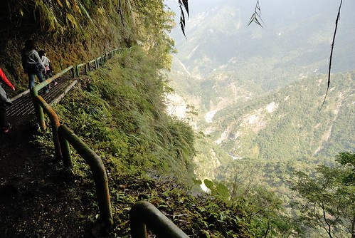 完全沒裝備也沒食物的我們就這樣順著路一直走  想抵達終點卻不知道距離還有多少的我們安靜的走下去  但遇見好些顆盛開的山櫻花令我們開心  不知名的植物種子令我們新奇  雀躍 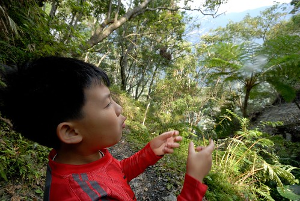 像這樣的發現與開心穿插著 讓徹愛有力氣跟著阿爸阿母繼續走  只是越走 路越不好了 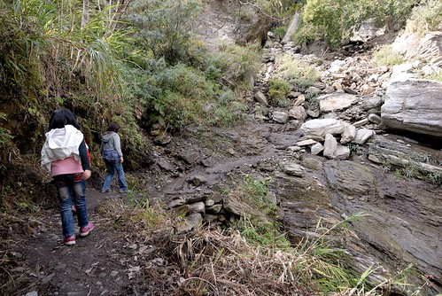 不像路的路讓謹慎的兄妹倆有了催促我們回頭的藉口 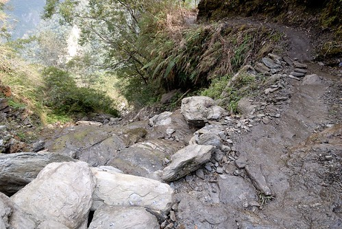 加上正中午肚子餓 以及徹爸的google map明明30分鐘前顯示20分鐘後抵達的終點卻還依然顯示著16分鐘抵達 兄妹倆的臉臭了... 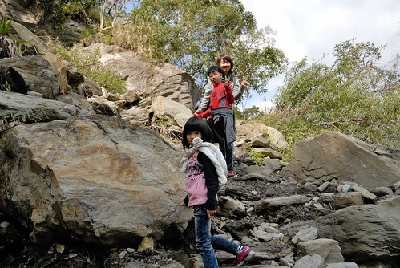 雖然知道距離步道開放的終點"佳心"一定只差那一點點而已 但因為無法跟小孩保證到底還要走多久  10分鐘?抑或半小時? 雖然遺憾 還是決定停在一開始就說好的4公里路程處 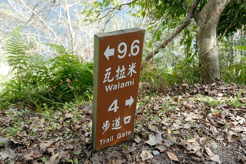 粗估回程時間 我們下山回到步道口也要近下午兩點了  而身上唯一的糧食是一袋雪魚香絲  啃幾條充充飢 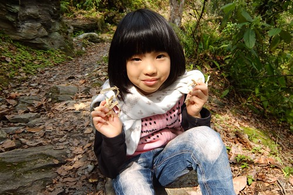 徹愛休息的同時  不甘心的徹爸獨自前往我們的目的地"佳心" 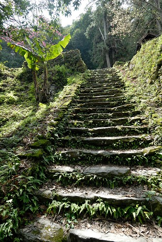 據徹爸說真的只差一點點路 而我看過徹爸照片後也更是遺憾沒有逼著小孩ㄍ一ㄥ下去 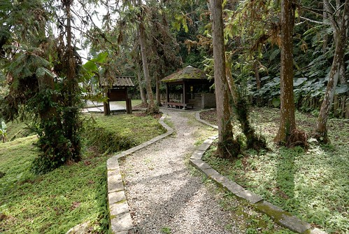 不過不執著終點 適時的撤退也向來是徹家旅行的原則 所以慶幸起碼徹爸有代表我們走到終點了  這裡是步道口迄此唯一有廁所與涼亭休息的地方 挺豪華又漂亮的  而且是步道中視野最佳的地方 (盛開的山櫻花增添一抹美麗) 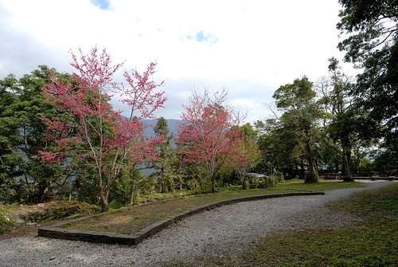 與徹爸會和後 我們加速腳步的下山了 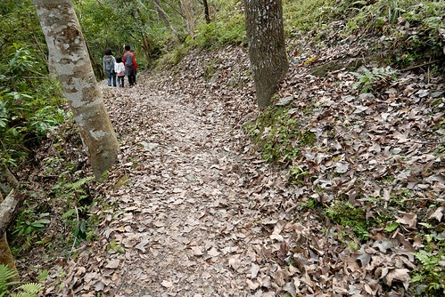 下山再走過相同的路 才發現 嘖嘖嘖~路況真的這麼差阿?!  但吊橋卻已不再令人恐懼  徹哥一個人穩健又大步的走過  走過吊橋 母子三人回眸讓徹爸拍一張 看照片才發現 自己竟完全不查覺的如此狼狽了(羞) 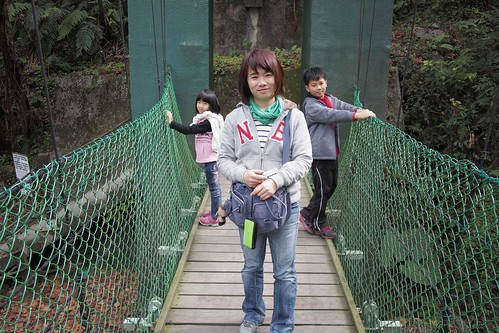 下山的路越走越寬 步伐也越來越快  但看到迷人的風景還是要停下來 駐足好好感受 (一樣的景物但去程跟回程所見卻是不同) 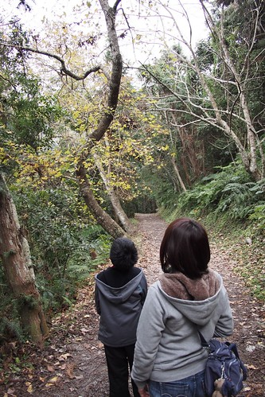 快結束今日的健行 兄妹倆的笑容越來越大  體力也完全沒損失似的爆發著 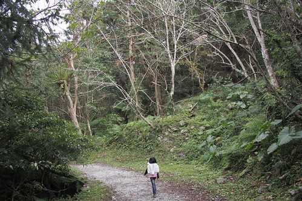 四個小時 完成我們今日的八公里古道健行 這是趟比想像中困難了點但卻美麗許多的很棒的古道健行!  只是下午兩點的肚子真的好扁好餓 得趕緊回玉里鎮上覓食 

不過再怎樣趕路還是要在南安遊客中心停留 上個廁所 蓋蓋章 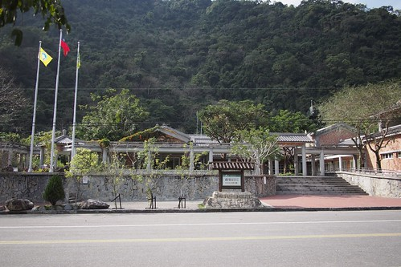 當然還有看看這片已收割的田  然後再次砰然於卓樂部落的小欖仁樹路段~ 
