知道鸞山森林博物有一兩年時間了 但直到覺得愛愛夠強壯的這個寒假我才敢安排 一如每個去過的朋友所說: 阿力曼老師好厲害 鸞山森林博物館好棒 是一輩子難忘的回憶 鸞山的這一天也是我們一家子這回旅行中最難以忘懷的記憶 (我們跟阿力曼老師一樣是億萬富翁 擁有回憶與記憶) 有天愛愛唸著說"好想再去那個原住民朋友家"  我ㄧ時之間會意不過 後來才明白 愛愛說的是那個可以如猴子爬來爬去 還有著好吃迎賓山豬肉的鸞山 每回徹愛講到鸞山總是眉飛色舞的 讓我們忍不住也跟著回味起那天的美好與美味! 我跟徹爸兩人曾討論過 鸞山森林博物館也如其他的原鄉或客城 都是刻意的讓平常人我們來體驗不同的文化與生活 但很奇怪 在鸞山的一切讓我們覺得如此自然與發自內心的認同 感覺真的就像是去到朋友家玩耍 還吃了一頓豐盛的朋友家常料理... 鸞山森林博物館不只是說故事 還很潮的旅遊亮點 更是讓人深刻體驗自然與生活的大教室!  

鸞山部落位在台東的縣197上 距離前一晚我們住宿的鹿野只要20分鐘的車程 很幸運的 這一天天氣晴朗  採預約報名制的森林博物館體驗活動 從早上九點在鸞山派出所前的集合開始  早到的我們 站在派出所外 陽光下 玩著小遊戲 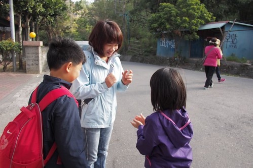 打發等候的時間 也把握在台東曬太陽的好機會 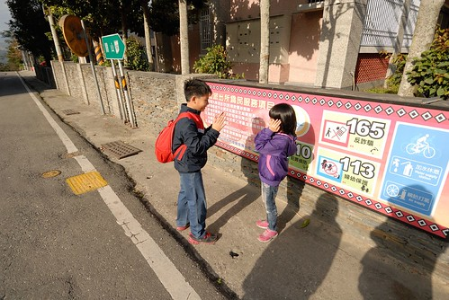 九點半 參加的各大大小小團體都來了 來帶我們上山的阿力曼老師在集合大家後先來個行前說明會 如小演講的30分鐘說明 讓大家了解森林博物館成立的初衷  堅持與期待 真的! 阿力曼老師的口條超好 幽默風趣又極深化淺出的讓人還沒進到部落裡就已迷上他口中的部落 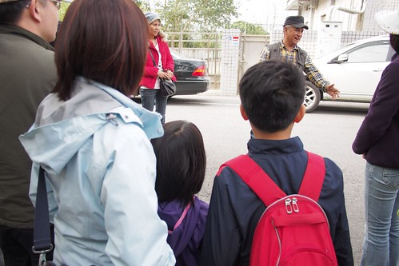 說明完畢後 大家開著自家車跟隨著阿力曼老師的鐵牛法拉力進到部落裡 要跟好! 因為沿途都是沒有任何指標的小徑  順著山繞著的路 越深也越高  還沒到部落 半路上停車先去看會走路的樹 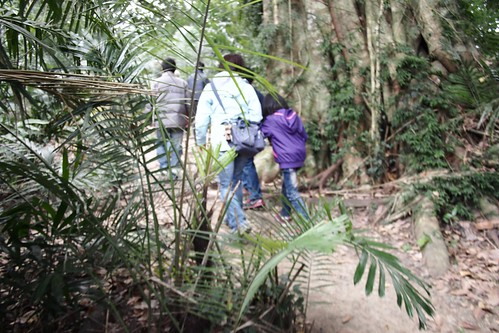 大家跟隨阿力曼老師的腳步往大樹間穿 突然 腳步停了 大家抬頭一望 每個人都忍不住哇了一聲  沒等阿力曼老師開口 大家便被這如章魚般長了好多腳的大白榕給震撼了  好幾十年 甚至百年了的經年累月 讓不斷延生且紮地深根的氣根枝繁葉茂 讓人分不清哪個才是真正的主幹  大自然的力量 讓人驚嘆 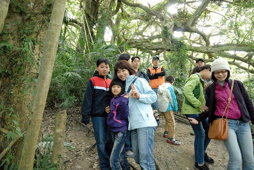 繼續跟著阿力曼老師的車 往路越來越小的地方開去  從鸞山派出所出發後 約20來分鐘抵達這不是秘密的秘密地 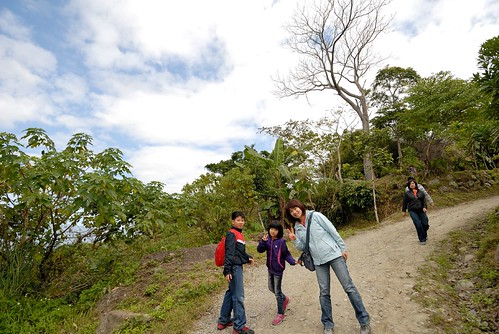 停好車 跟著阿力曼老師步伐走到一座平台 哇~ 好棒的視野 難怪阿力曼老師傾盡全力的與財團爭地 原始保留這座林  部落用烤山豬肉跟小米酒歡迎客人的到訪  我們邊喝著小米酒邊烤著自己的那串肉  不小心坐在風頭的我們 最後只好由我獨自含著淚烘烤完成  不過那個外頭焦香 裡面多汁又帶Q的山豬肉真的好好吃阿! 說是這輩子吃過最好吃的肉一點都不為過 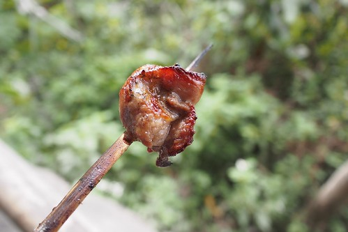 好燙~ 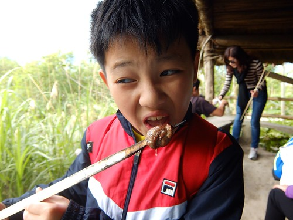 可是豬肉好吃到讓徹愛不顧燙舌也停不了口 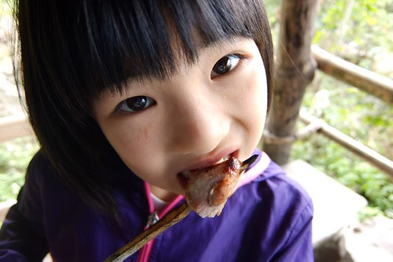 回味無窮的我們幸運的又拿到了三隻  換由剛忙著拍照的徹爸掌烤 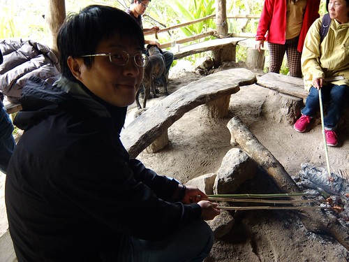 暖洋洋的烘烤 香吱吱的山豬肉  這個迎賓禮真的太令人喜歡!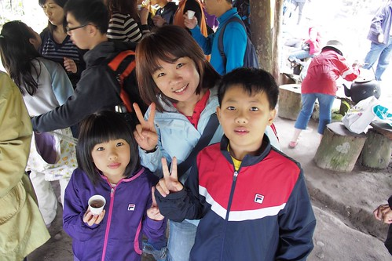 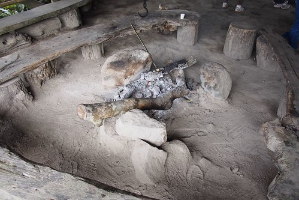 迎完賓緊接著就要開始今日的森林體驗 不過入山前得先拜個山神   不能拍照所以我們很乖的一張都沒照  拜完山神後由阿力曼老師的小女兒擔任小老師 領著我們往林裡鑽  好奇的我們跟緊前面人的腳步 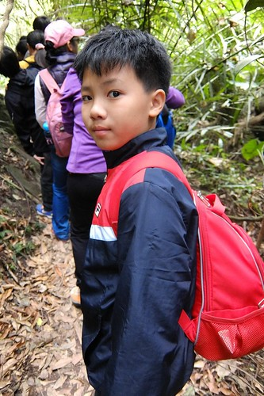 上上下下  走走又看看  徹愛越走越興奮 就像小猴子回歸森林一樣 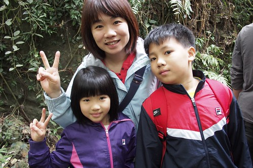 來到傳說中的大石壁  哇! 真的很窄!  連我都得有些側身才能過 幸好徹爸縮個肚子後也能平安度過 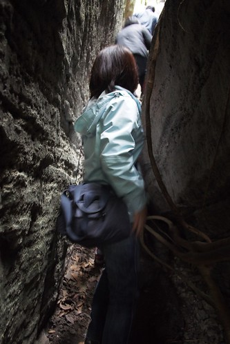 路 越走越是不可預期 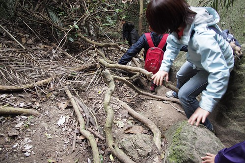 我們手腳併用才走的安全 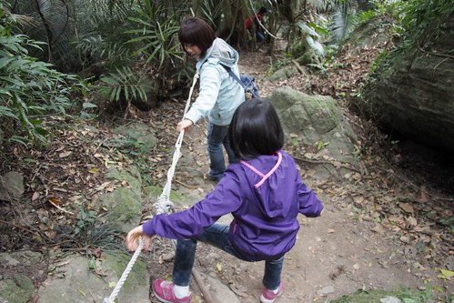 原有些擔心愛愛無法勝任 沒想到愛愛一步一階都走的謹慎又穩健  2層樓高的繩索攀爬 令眾人緊張卻又興奮  我們由徹哥打頭陣 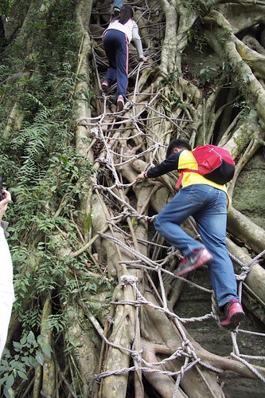 然後是愛愛 接著我跟在後頭備著接小孩 而徹爸則落我們幾個人次後的好幫我們拍下這一幕 只是拍照的那一刻 愛愛大喊 "我沒法轉身回頭啦" 愛愛真的爬的很認真 很小心!  爬上後 兄妹倆大呼好簡單喔! 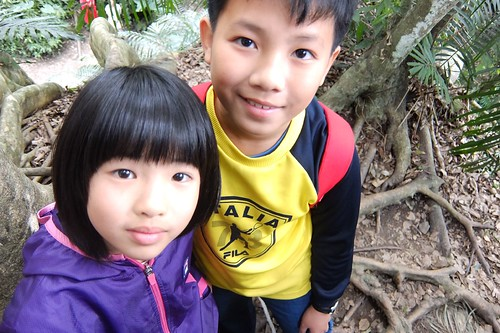 成就感不可言喻  而沒想到接下來不是路的下山路 其實才更是考驗  鑽樹洞 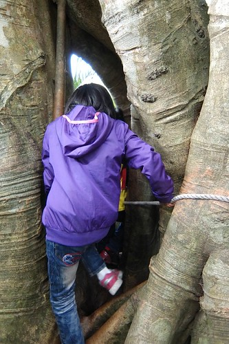 爬上爬下 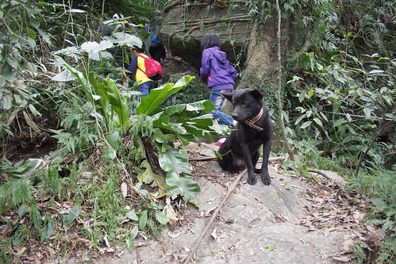 不過30分鐘的路程卻已讓人滿頭大汗 氣喘吁吁 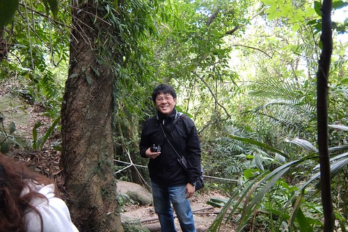 卻也讓人大呼過癮 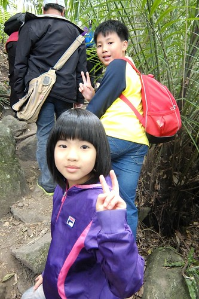 整個體驗真的緊湊又高潮迭起 只是也在突然間就回到了起點 令人有些落寞怎麼就結束了... (隔天我鐵腿了(原來四個人中我最遜) 我才明白這只有30分鐘的不得不阿! )  (完成挑戰當然要全家自拍一張) 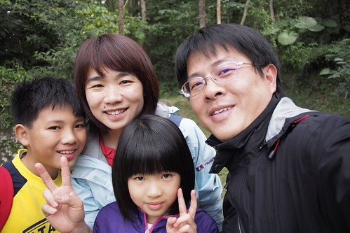 愛愛很得意自己真的就像班上同學說她根本是男生 愛愛真的是很不嬌弱的小女生  等候其他人歸來的時間裡  一家子開心的互拍著   一日體驗包含中午的用餐 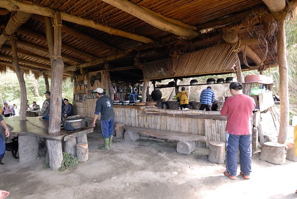 中餐是由部落婦女們所準備的原住民風味餐  首先 找好自己的座位  我挑了個沒人喜歡的曬太陽位置 但好有view阿 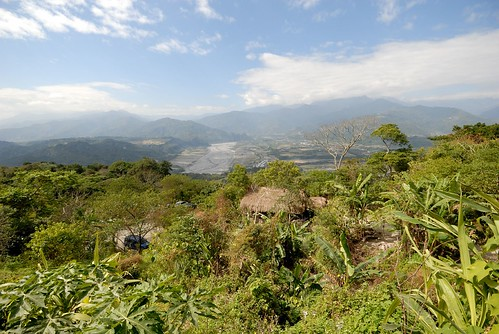 然後用自己帶來的碗先盛好飯  加入小米與芋頭並用柴火炊煮的飯 香Q的讓徹愛還沒開動就偷吃起飯來 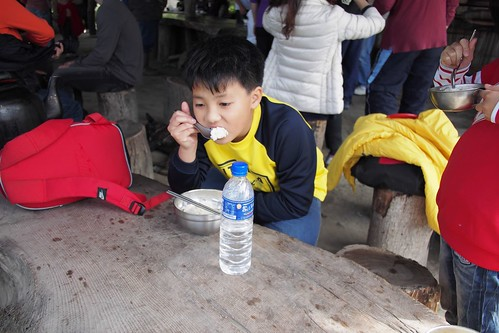 (菜還沒上 就快吃完一碗飯了) 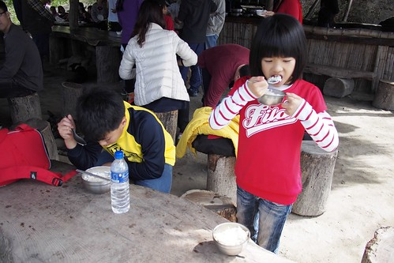 今日的體驗也包含布農母系社會裡對於母親的尊重與貼心 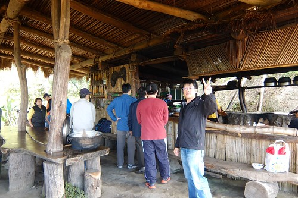 由小孩幫媽媽盛飯 由男生幫忙端菜上桌 而媽媽就等著大快朵頤  菜一盤盤的被端上桌 遠遠看著的我們好期待  菜都上桌後 由阿力曼老師逐一介紹 雖然不是山珍海味 但是原汁原味的豐盛饗宴 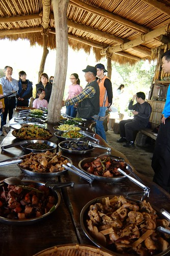 阿徹不負是我們四人中唯一拿大碗公吃飯的  裝了滿滿的野菜與肉 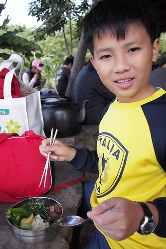 而愛愛雖然拿小碗 卻也是裝滿滿且又添了好多的菜  這是徹爸的碗 放在左邊的烤山豬肉是秒殺極品  我的碗則是裝了好幾回滿滿的菜 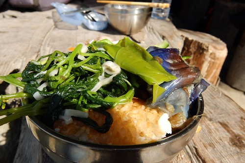 簡單的料理 但因為在這裡 因為感動 格外美味 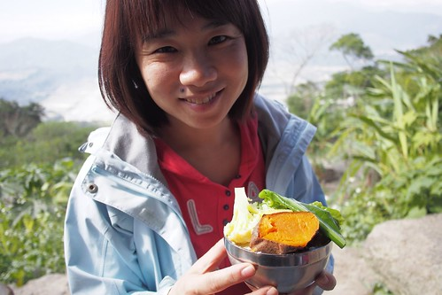 大家都好認真 好努力的吃著  這是吃過最棒的戶外餐廳了  (同時間部落的小黑狗也依在一旁曬著太陽 暖呼呼的睡著覺) 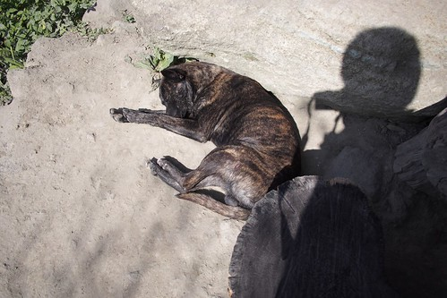 飯畢一樣由小朋友幫忙收拾  而媽媽還沉浸在冬陽與居高臨下的美景中 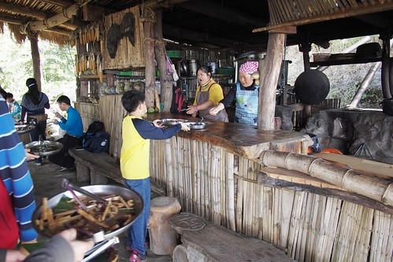 飯後還有搗麻吉的活動 先是由部落青年將小米與南瓜搗成團 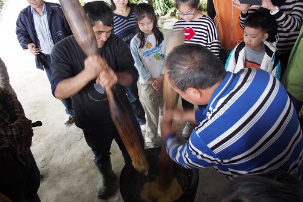 然後讓夫妻們輪番上陣搗麻吉 聽說搗麻吉可以促進夫妻感情  自從幾年前在南橫天龍飯店搗過麻吉後 徹哥便一直唸唸不忘想再體驗 雖然徹哥力氣還是太小 但總算也小小貢獻  同時間 愛愛則是沒湊熱鬧的在亭子外的大石頭上玩耍  把握難得當猴子的美好時光  吃的滿意 玩的開心 難怪愛愛這樣喜歡  回家後猛念著想再去原住民朋友家  (繼續回到麻吉的現場) 眾人一番攪和的麻吉 最終還是靠部落青年快手重力的敲攪成 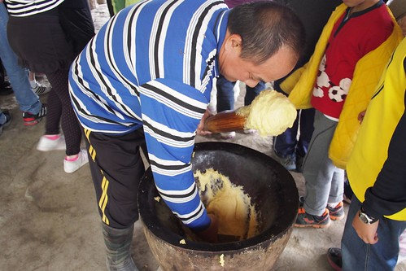 準備起鍋的麻吉Q彈的好令徹哥期待  上桌後大家幫忙分切 沾花生粉  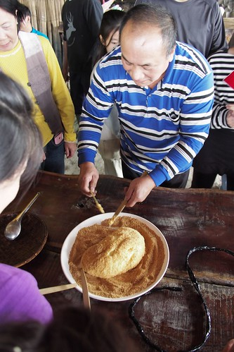 雖然有些慘不成型 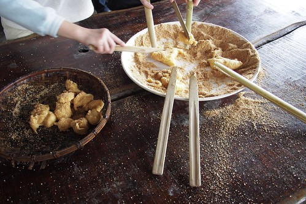 但真的好好吃 這是在部落才吃的到的道地麻吉  愛吃麻吉的母子三人 吃了好多塊 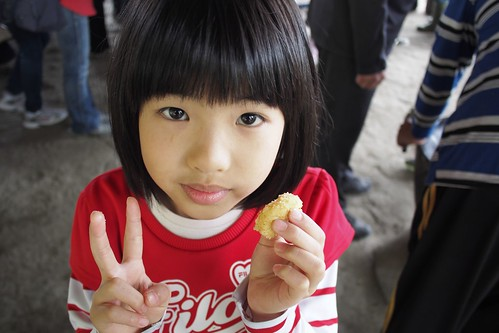 滿足的飯後甜點! 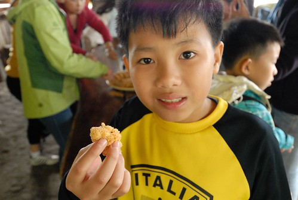 到這 今天的活動也即將依依不捨的進入尾聲 最後是在阿力曼老師的帶領下 大家共同植入一顆樹 每個來過鸞山森林博物館的人都有專屬於的一顆樹 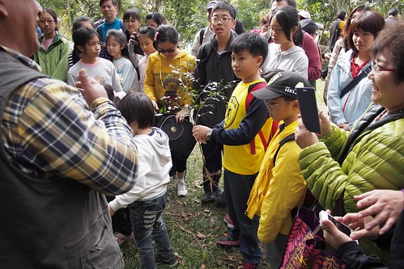 (植樹前 阿力曼老師先偷偷的把土挖鬆)  主要由代表希望的孩子們以及一位老奶奶挖土與植入小樹 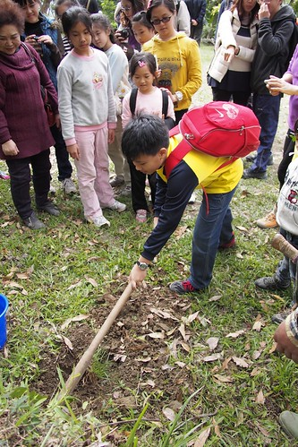 大家撿拾落葉舖蓋上 祈禱小樹的長大 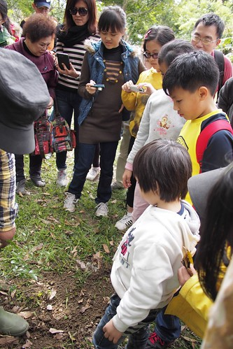 最後並在阿力曼老師帶領眾人合著聲的八部合音中結束今日這樣震撼卻又溫馨的森林體驗 小樹不止植在鸞山上也植入每個來到這的人心中 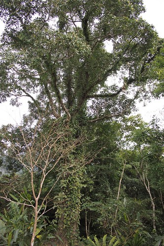 PS. 那天阿力曼老師說了好多有關他 有關環境 森林 原住民 大自然...的故事 這些故事值得喜歡大自然 關心這片土地的人來到這聆聽並體會 所以我盡量只是用照片做我們旅行的記錄 沒說的美好我相信已在我們心中且念念不忘
