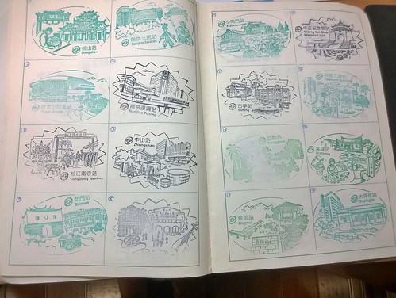

徹爸很久沒出差的出差不在家 出發前 兄妹二人便杞人憂天的念著"少了搞笑的爸爸在家 一定很無聊" 果然爸爸不在家的日子 兄妹常感嘆著"爸爸不在 好無聊" 明明前一刻還玩的很開心說 為免兄妹在漫漫週日三不五時就無聊 想起最愛的爸 媽媽想 就趁機來個母子三人念好久的捷運蓋章之旅吧 打發時間 也振作我們的心情 同時也實踐母子三人小小夢想 

旅行時徹爸的背包裡都會有個小本子 收集我們第一次到訪景點的紀念章 耳濡目染下 徹愛出門在外對於紀念章很敏感 每次看到紀念章 總是大喊"爸爸~ 這裡可以蓋章" 我想 蓋章是大部分小孩天性就很愛的遊戲 年初看到新聞: 北捷每一車站都設計有專屬的紀念章(之前是一條線一個章) 我專程跑去販售點買北捷推出的集章冊 徹愛興奮的說 哪一天用捷運一日劵收集每一站的紀念章吧 不過阿母光想也知道這是件很累的事  所以一直打哈哈 拖延著 而徹愛也只能在偶而記得把本子帶出來的時候才蓋到新的章 半年下來 累積寥寥可數的4個 搭捷運就只為了蓋章  我想這是徹爸不太可能會陪著做的傻事 於是爸爸出差不在家的週末 剛好是母子女三人無牽無掛做這檔事的機會 而且徹愛最近刻橡皮章刻的熱噴噴 更是衝動好時機 徹愛光想就覺得有些瘋狂 但也好興奮 我說 人偶而是該做點瘋狂的事 我想 這也是人生訓練的一種 去做的勇氣(傻勁)!

前一天我將捷運路線圖印出 讓兄妹擬定作戰計畫 徹哥還突然其想利用國小的數學作業格子本 依照五條路線 編好每站編號 好完整且有序的收集蓋章 事後證明這樣的作法很棒 不同線的轉程站才不會漏蓋 而且同一線的各站章依序看下來真的壯觀的特別漂亮! 這件事再次呼應徹班導最後一學期的評論"很聰明 靈活 只是常用錯地方"....

早上九點從我們家的新埔站出發嚕  一口氣搭到5號板南線的端點 頂埔站 蓋下我們今日的第一章  話說近期完成的新站 公共藝術做的比最早期的車站漂亮很多 只是臨終點的車站 不論實際距離與車次班距都較拉長 等車坐車挺花時間  中間板橋到江子翠三站 我們剛好有位子坐 秉持今天最高指導原則"多坐多休息" 我們回程時才再補這三站 除此之外 我們一站站的蓋下去  一站站的下車 找服務處(章都在服務處附近) 比我們原先預期的還要花時間而且困難 下車後走樓梯 走路的時間甚至比坐車的時間多 而且為了把握時間 我們盡可能的趕搭我們下車後的下班車 如果服務處找的順利 可以配合的讓我們握拳大呼YES 但只要出一點小狀況 便會緊張刺激的讓人喘呼呼  比一開始預期慢很多的 我們12點才抵達板南線的另一端終點 南港展覽館站  徹愛從課本上知道這裡有漂亮的幾米畫  美麗的畫作讓已經有點疲累的他們 仿若醍醐灌頂  被注入一劑強心針 

我們從南港展覽館站接著轉搭1號文湖線  中運量的高架設計是徹愛難得的體驗  新鮮感讓他們振奮再起  愛愛在板南線時就因為搭到累而哀求12點一定要吃飯 (不敢喊累 只好吵要吃飯) 於是我們搭了幾站的文湖 便在葫洲站出去吃中餐 因為一開始就鎖定小七  在高架的捷運上我們就先鎖定看來較密集住宅區的車站 而下車後往服務處的天橋上也剛好讓我們確認小七的位置 於是沒額外花很多時間的來到小七簡單解決我們的中餐  看似克難 但很久沒吃的泡麵可是愛愛口中的興奮劑 讓她整個人活了過來  吃飽喝飽 繼續一站站的蓋下去  文湖線來到南京復興站 我們轉2號的松山新店線 先往松山蓋 回頭便可一口氣多坐幾站休息下 一路再蓋到北門站已經是下午三點  是我們的瓶頸期 徹哥開始有些動搖 唸著想回家了  反倒是愛愛 雖然一起喊著腳痠 卻又活跳跳的總跑在第一個找服務處  而且雖然疲憊 還是會觀察每站不一樣的地方 駐足欣賞漂亮的公共藝術  只是我們體力與耐力快到底也是事實 於是我們在還算是熟悉的公館站吃點心休息 還順道買了徹哥升國中後自己的摺疊傘(這幾年我跟徹爸的傘都在公館這家傘店買)  酸甜的愛玉檸檬冰讓徹哥眼睛亮了起來 而愛妹很愛吃的臭豆腐則是繼中午的泡麵之後 持續給足她精力  但是台電大樓站之後的班距時間又跟一早的板南線後段一樣  拉長很久 班次之間的五六分鐘等候 對我們來說長若半小時那麼久 我們忍不住坐在樓梯階上休息  我說徹哥 很棒 除了照相外今天都沒有玩手機 聽我提起 徹哥才傻笑著說"我緊張到 都忘記了" 於是徹哥開始玩手機打發等車的時間 他說手機之於他就像泡麵之於愛愛  而果然樂極總會生悲的 才玩二站我們就坐錯對向的車又回到公館站 那一刻 三個人一臉苦瓜! 但還是耐著性子繼續一站站的蓋到2號線的終點新店站  因為板南線還缺幾站要補 文湖線只進行了一半 所以這是我們努力八小時後 完整收錄的第一條線 三人都好感動阿~~~  從終點新店站再搭回中正紀念堂站 是我們難得可以坐很久的一段路 三人忍不住打起瞌睡 舒服到要靠意志力繼續下去 從中正紀念堂站 我們轉搭信義線到大安站 再轉文湖線繼續集章  在大安站轉往文湖線的路程上 看到漂亮的藝術作品 徹愛一樣又是喜歡的觀賞拍照 他們十足投入又執著的背包客模樣 讓媽媽心裡很欣慰  蓋章行也可以是一趟很棒的旅行 美麗的風景就在每個車站裡 高架捷運窗外一幅幅的城市景觀  文湖線的站距都很短 徹愛形容的30秒就到下一站 而且2-3分鐘就來一班車 車站也小很多可以不用太費力就到服務處 讓接下來的蓋章很輕鬆 (愛愛今天不知道從頭數了幾次章 開心時就數一下  數了後就更開心)  傍晚的冷時段 車廂空曠的讓我們總能坐到第一節車廂 看著前方起起伏伏的軌道 感受著車子的前進與震動 徹愛說好像在坐雲霄飛車 好好玩 好過癮  帶著愉悅的心情 我們不知不覺的就蓋到終點木柵動物園站 以滋紀念我們當下的感動  我們看到大頭貼機沒多想的就衝進去花了100元  徹哥說 那我們去動物園逛一下好了 我跟愛愛異口同聲說不要 反到媽媽隨口說的來去搭貓覽看夜景 獲得愛妹的高度支持 於是我們就像口中說的 真的太瘋狂 真的走去纜車站搭貓纜  大雨過後的傍晚 風很涼 坐在纜車裡很舒服 而隨著越來越高而看見的視野也美麗的更添愜意  只是我們的大膽愛在年初迪士尼的驚魂古塔受驚後 現在患有她自己形容的"下降恐懼症" 貓覽的上上下下讓她花容失色 連帶徹哥也受影響 驚了起來 於是媽媽想像中的貓纜浪漫夜景 就鍛羽在只有一站的動物園內站便回頭  再搭上捷運 我們一路坐回到忠孝復興站再轉板南線回家  已經沒有集章壓力的徹愛聽著音樂 享受著此刻的滿足與寧靜  只是車廂內不時有食物的香味傳著 讓我們總聞著就餓了(徹哥說 怎麼常聞到煎餃味) 捱不住餓回到板橋 我們在善導寺站出站吃晚餐 捷運口就有的義大利麵 是在這區域上班的我想到的最便利用餐處  吃飽飽的我們 順著回家的方向繼續補板南線還缺著的章 而最後的一章就蓋在我們家最是熟悉的新埔站 OHYA~ 我們完成三條線的集章了  徹哥作業本上同一線的章依序看下來  很是漂亮也讓我們感動阿  雖然我們沒有出站看捷運站外的風景 卻也透過這一個個的章多些了解我們其實不熟悉的台北  這一路我們蓋了很多章 也說了好多話 是個母子女三人都很開心又滿意的小旅行!  十二小時 扣除吃中餐 點心 晚餐的二小時 我們都在等車 坐車 找章 蓋章 進出62個站 蓋了63個章 我們絕對是充分利用了這張150元的捷運一日劵!

後記: 徹哥回家後在FB的PO文: "今天早上9點就出發去蓋捷運的紀念章,一開始還興緻勃勃說要蓋完五條線的印章,沒想到出站還要找服務處而且有時還會坐錯車,因此坐了12個小時的捷運也只蓋了3條線,但不知道為何蠻有趣的,有可能是有目標的緣故吧！" 看到徹哥這樣的心情分享 是今天的另一個收穫與感動!

問徹愛隔天早餐要吃什麼  二人不約而同指定我們這一天聞到好多回的煎餃!

不到12小時後的隔天早 母子女三人再搭著捷運去上班上課時 愛說"又要搭捷運 我都想兔了" 捷運車廂上 我比著路線圖問"你們現在看這路線圖有沒沒超有感覺" 二人點頭如搗蒜 我說"那還要再去蓋剩下的二線嗎" 二人發亮著眼睛說 "當然要!" 呵呵~ 下次一定要拉著爸爸跟我們一起瘋狂~
