162甲 36彎雲之道 海拔一千多 太平村的交通位置位於瑞峰、瑞里兩大風景區的必經之地 

 [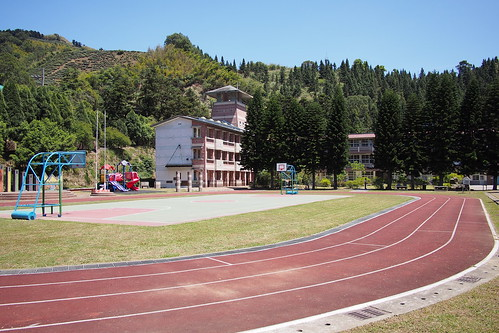](http://flickr.com/photos/33703965@N00/17353738538)

 

[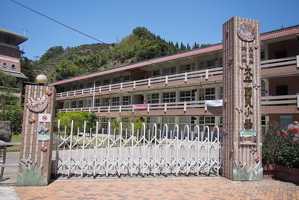](http://flickr.com/photos/33703965@N00/17353916600) 太平山莊旁的孟宗竹林步道，就是著名的孝子路，石階沿著翠綠的竹林蜿蜒而上，景色如畫 [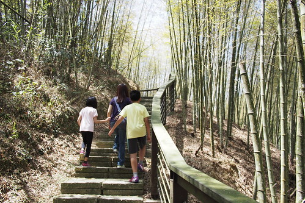](http://flickr.com/photos/33703965@N00/16918939324)

[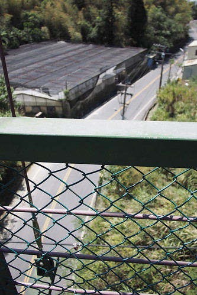](http://flickr.com/photos/33703965@N00/17541345371)

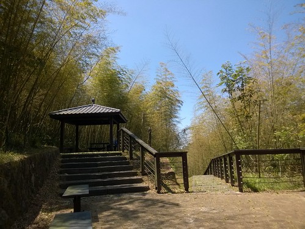

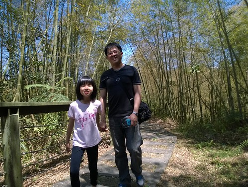

[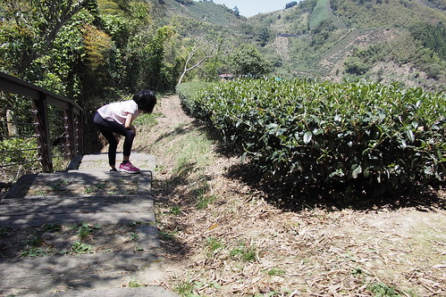](http://flickr.com/photos/33703965@N00/16918919714)

[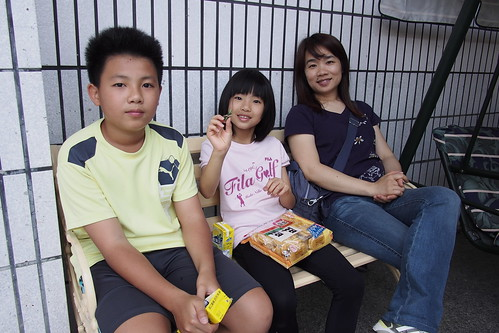](http://flickr.com/photos/33703965@N00/17541336711)

[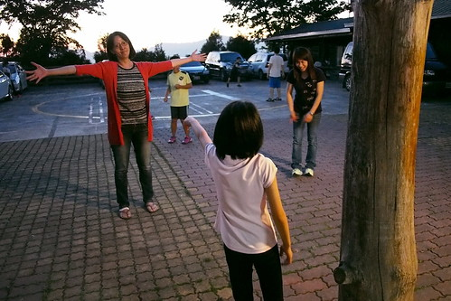](http://flickr.com/photos/33703965@N00/16921115133)

[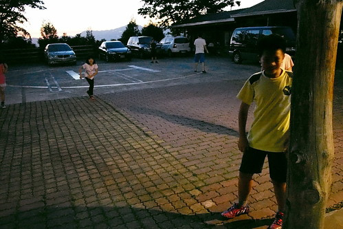](http://flickr.com/photos/33703965@N00/17541295301)

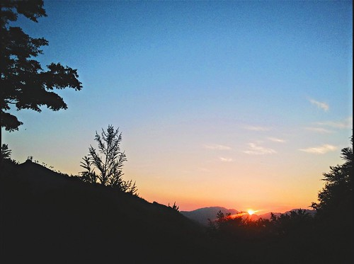

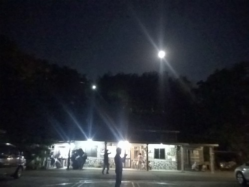

[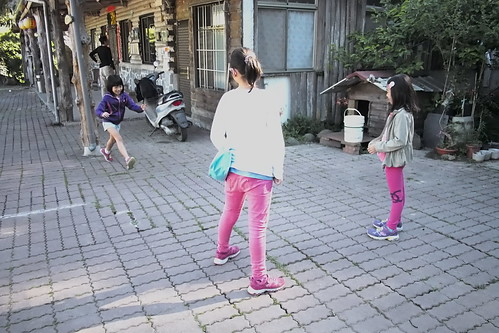](http://flickr.com/photos/33703965@N00/17539170392)

[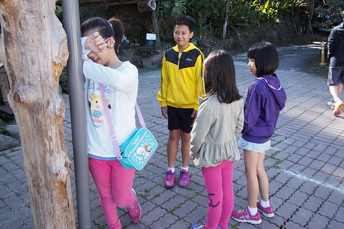](http://flickr.com/photos/33703965@N00/17353627938)

[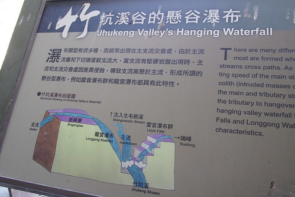](http://flickr.com/photos/33703965@N00/17515030556)

[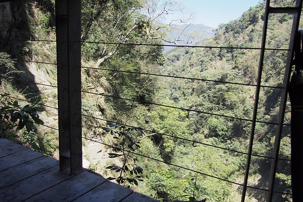](http://flickr.com/photos/33703965@N00/17541251011)

[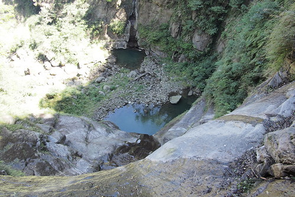](http://flickr.com/photos/33703965@N00/17541243351)

[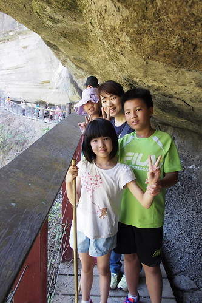](http://flickr.com/photos/33703965@N00/17355044249)

[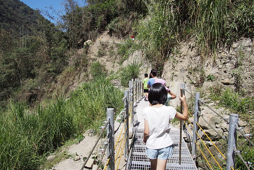](http://flickr.com/photos/33703965@N00/17541382515)
