武陵的櫻花季又即將登場 好多年前賞過武陵櫻花的我們當然很嚮往再去武陵賞櫻 只是這幾年炒的熱烘烘 向來不愛熱鬧的我們更是沒有勇氣與衝動再上武陵賞櫻 (幾年前的賞櫻還真是衝動下的一日爆肝行阿[blog.yam.com/hmchen1975/article/19745920](http://blog.yam.com/hmchen1975/article/19745920) ) 而不只是櫻花季 現在武陵一年四季的遊客量也都不可同日而語了... 我們曾經在第一次的武陵賞楓後 連著四年秋都來武陵報到 只是楓況一年不如一年  是運氣不好也或許更是氣侯變遷造成的無常 不敢期望加上武陵的房間越來越難訂 於是四年前跟玟姿一起賞楓後就再也沒上武陵 不過每到秋風起 我們一家子總是懷念起武陵 一起念著好久沒去武陵了... 總算在徹哥上國中後的多事之秋 我們再次上武陵賞楓了 從十月初的訂房到十二月中的成行  這是上學期中最早的安排卻最慢到來的旅行 而我們的賞楓之意更不在葉了 而在回味曾經與享受當下 

那二天照了不少照片 [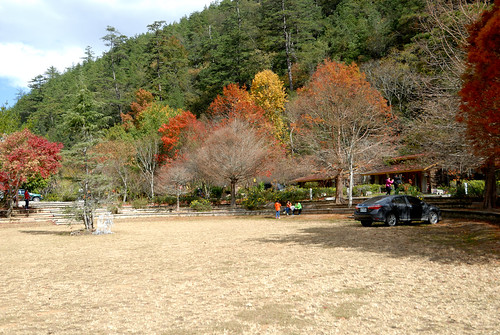](http://flickr.com/photos/33703965@N00/24266799636) 不過相較於一旁熱鬧 興奮的遊客 我們家是淡定的  不過因為很多美好回憶湧上心頭 好心情而忍不住拍很多 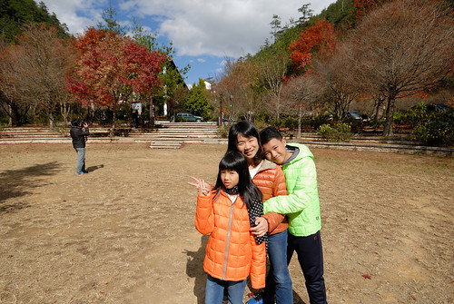 (話說身後賓館旁一株很高的松樹不見了...很不習慣)  我們習慣的從員山的小七買些東西帶上武陵到賓館後方簡單午餐 [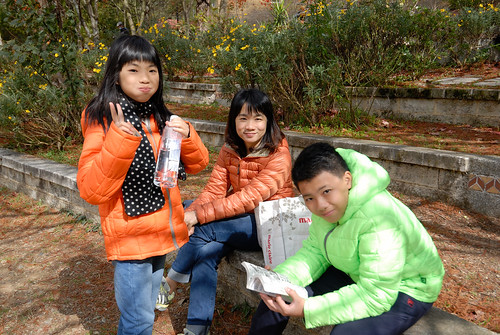](http://flickr.com/photos/33703965@N00/23666113203) 也在這廣場緩和上山車途的疲勞  2015的秋特別的熱 即使在十二月初來了幾波寒流 楓況依舊慘烈  我想可能在寒流來前葉子便已開始掉落 等到天冷到可以變色了 還留在樹上的葉子早也稀稀疏疏了  地上滿上枯黃的落葉 不過卻也很容易找到剛飄落正新鮮的紅楓葉 [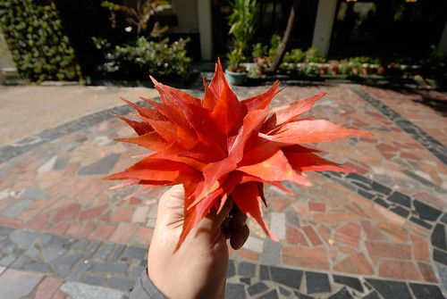](http://flickr.com/photos/33703965@N00/23924981139) 雖然楓葉紅的不若往年深 但數大還是美  新鮮的楓也剛好換掉車上不知道已經掛了幾年的武陵楓葉 [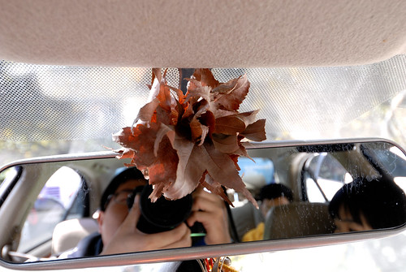](http://flickr.com/photos/33703965@N00/24292815295) 四年前跟玟姿阿姨上山賞楓時是愛愛第一次吃泡麵也喜歡上來一客  來到遊客中心看到好多遊客在吃泡麵  愛愛就又嚷著肚子餓要吃泡麵啦  愛愛吃的津津有味的樣子 看的我們也嘴饞 很卑微的求愛愛賞些湯 [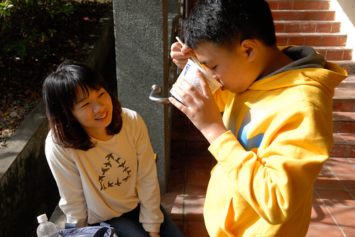](http://flickr.com/photos/33703965@N00/24184541182)

飯飽滿足之後 我們開始一站站探訪記憶中有著美麗畫面的地方 [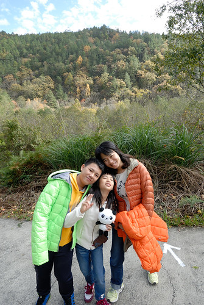](http://flickr.com/photos/33703965@N00/23997092630) 曾經看過美麗槭樹的桃花莊 曾經撿過很多松果的培育中心  幸好雖然遊客中心那熱鬧滾滾  這裡還是靜謐  相隔四年 愛愛也長大到更懂得欣賞這兒的靜與美  我說今年武陵的秋 美在地上的落葉阿 [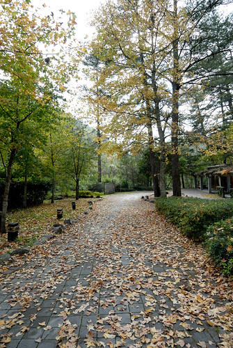](http://flickr.com/photos/33703965@N00/23997000010) 向來楓況佳的行政中心水池旁 [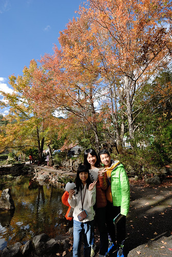](http://flickr.com/photos/33703965@N00/24210059631) 果然也是落在池子裡的那片最美 [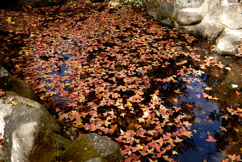](http://flickr.com/photos/33703965@N00/24292552455) 雖然楓況令人失望  但就如每一次來武陵總會有不一樣的驚豔 覺得武陵的美更在於許多無意間的詩情畫意 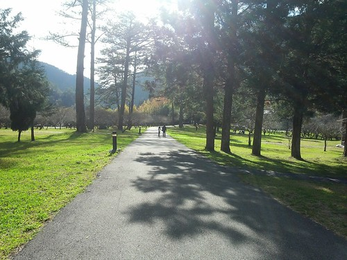 回到遊客中心前的草坪  我們慣性的鋪上野餐墊  愜意到慵懶的躺著日光浴 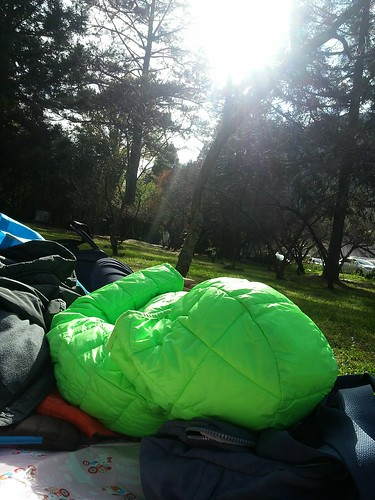 以前像猴子般好動的徹哥 現在已過了能在大庭廣眾下縱情玩耍的年紀 反倒愛妹長大後野性越來越顯現  跟爸爸盡情玩耍 [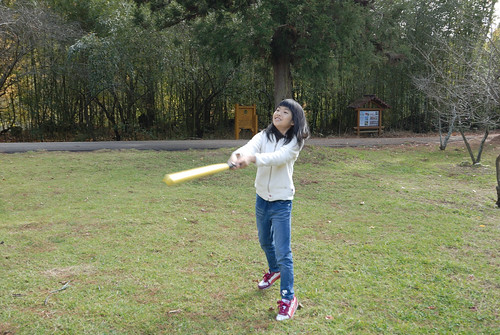](http://flickr.com/photos/33703965@N00/24292533485) [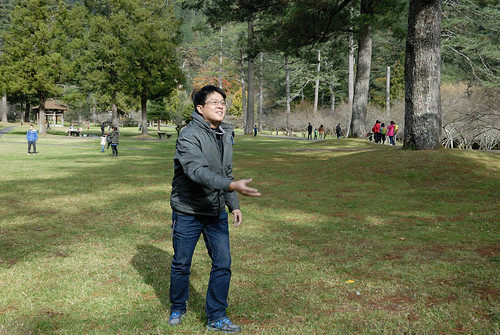](http://flickr.com/photos/33703965@N00/23996915470)    在這草坪上的野餐 嬉遊 真的是我們武陵回憶中很重要的一幕 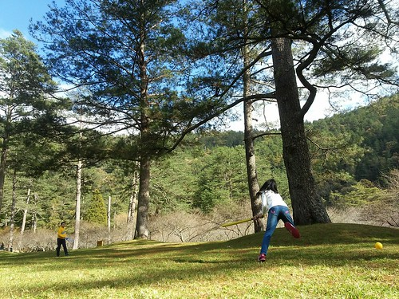 接著我們再來到茶莊步道 [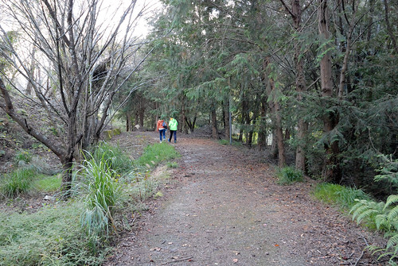](http://flickr.com/photos/33703965@N00/23664187394) 一探這的楓況 尋找任何的可能  不過今年武陵的楓樹真的就像照片上那樣有紅有綠 其實是很矛盾的 [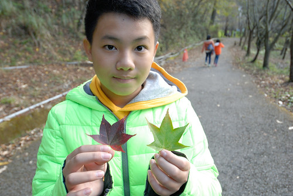](http://flickr.com/photos/33703965@N00/24266230186) 相隔四年再來武陵 我們就像久別的戀人  不浪費任何可以的相處 住在農莊和式房的我們 慢慢走半小時去賓館吃晚餐 [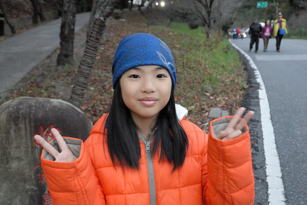](http://flickr.com/photos/33703965@N00/24209848611)  飯後在滿天星斗陪伴下 再慢慢走回房區 [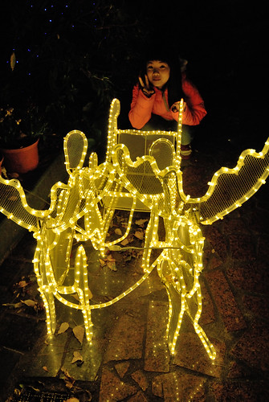](http://flickr.com/photos/33703965@N00/23924508719)

武陵的早晨一樣的冷冽 [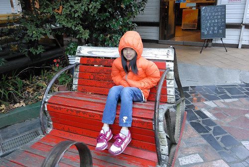](http://flickr.com/photos/33703965@N00/23664095584) 徹哥們也總愛在結滿露水的小紅上盡興作畫  早晨的楓也更顯鮮艷  只是喔 成名之後帶來的大量遊客就這麼恣意把車停在廣場上實在很煞風景阿... [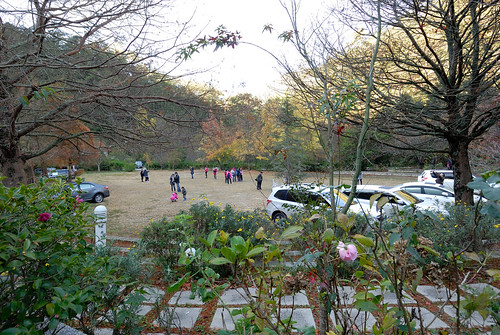](http://flickr.com/photos/33703965@N00/24292302555) 沒有動力再走來往四小時的桃山步道  我們決定走沿著產業道路而行的賞蝶步道  一點也不誇張的  沿路完全沒遇著人啊 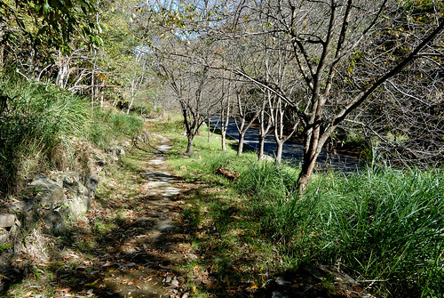 有種意外的清靜 [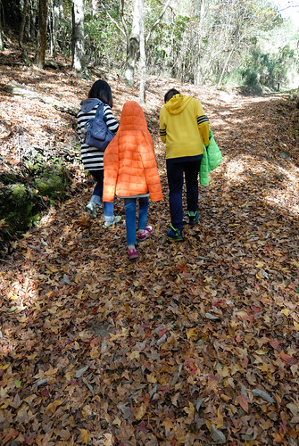](http://flickr.com/photos/33703965@N00/24266056166) 滿地落葉與灑落的光影也煞是美麗 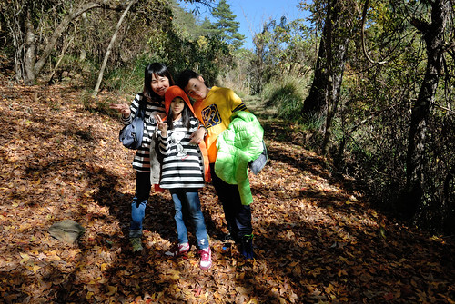     [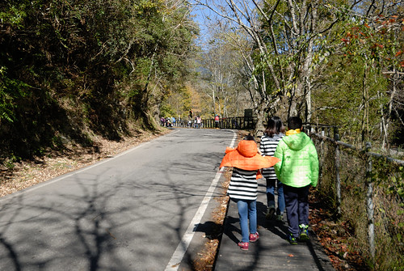](http://flickr.com/photos/33703965@N00/24183871792) 走到觀魚區 溪裡的魚量比往年多好多 復育有成  堅持走完步道的我們繼續走到果園區  近登山口路的終點 [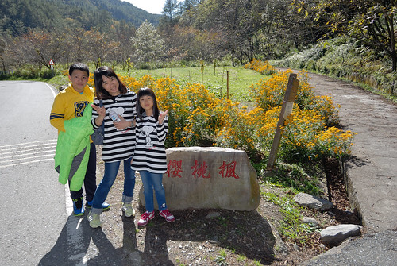](http://flickr.com/photos/33703965@N00/23665171843) 然後沿著我們一直覺得好美 這條武陵唯一的路往回走  [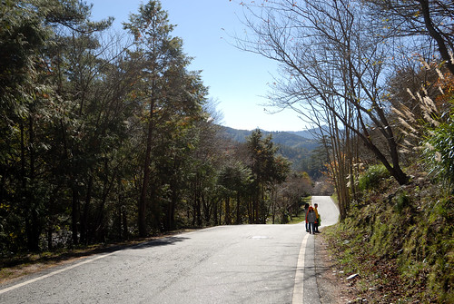](http://flickr.com/photos/33703965@N00/23665112013) [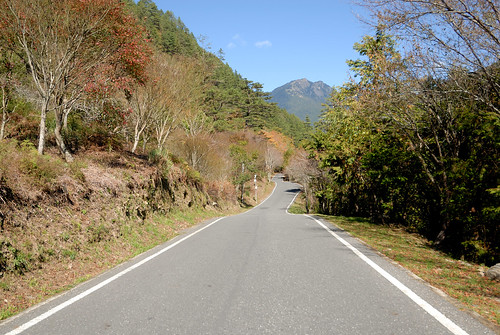](http://flickr.com/photos/33703965@N00/24183715622) 我們比對著記憶中最美的路段 [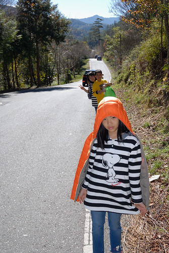](http://flickr.com/photos/33703965@N00/23663696274) 維護也更新我們腦海中武陵最美的這條路 [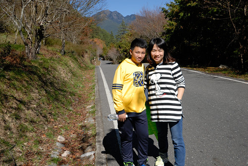](http://flickr.com/photos/33703965@N00/24291899815) 很久不見 還是覺得武陵好美 也還是覺得武陵的美藏在這慢慢走的許多不經意之間  回到起點的茶莊 我們的賞蝶步道圓滿達陣 

我們好像真的怕下次再來武陵不知何年 繼續往露營區更新我們的記憶 [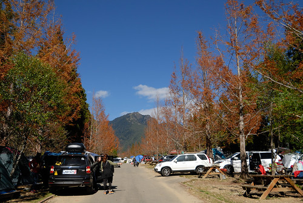](http://flickr.com/photos/33703965@N00/23663503104) 營區環境與人潮相較記憶中 多了太多太多   [ 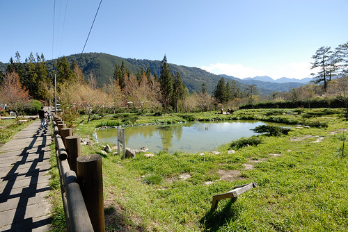](http://flickr.com/photos/33703965@N00/24183599132) 雖然美麗 但感覺有些陌生阿 [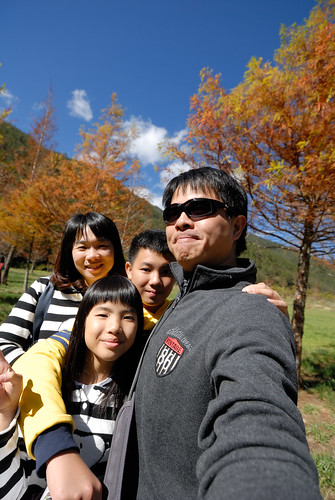](http://flickr.com/photos/33703965@N00/24265594586) 而我們以前就念著要來營區小木屋宿一晚的心願從來沒執行過 在這我一直被徹哥叨念著 [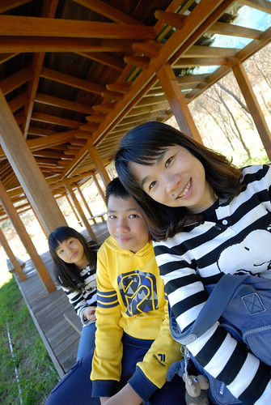](http://flickr.com/photos/33703965@N00/24183558092) 我很認真的巡了一圈營區 登記下好位置的小木屋號碼 希望哪天心血來潮真的能來武陵露一宿  二天內我們巡禮似的走訪那樣熟悉的武陵 四個人總是開開心心 好多的回憶可說 好多的溫暖感動上心頭 雖然還是會想再來武陵 尤其我還缺夏天這塊才能成全曾經說的要集滿武陵四季風采 只是武陵真的出名了...  而我們好怕人阿...
