北橫 拉拉山 是我跟徹爸一直希望帶徹愛去的地方 因為那裡是結婚時很窮的我們 僅有的二天一夜蜜月旅行 還特別難忘持住宿劵入住的那家旅館  冷清昏暗的闢美司馬爺爺故事裡的場景 雖然如此 我們還是一直唸著有機會全家一起舊地重遊 尤其當初路過覺得很漂亮的名池 徹爸說有機會以後我們再來... 12年過去 總算我們帶著都已經好大隻的兒子女兒一起來名池了!

宜蘭的小旅行離開蘇澳後 我們直駛北橫公路上的名池 大雨剛過的名池 迷濛的更顯詩意  倘大片的小木屋區 讓人很有渡假的感覺  連鎖飯店式的經營管理 讓這裡的小木屋屋況維持很好 甚至可說是豪華級木屋 一直很喜歡小木屋的徹愛對這樣充滿意境但又舒適的木屋滿意不得了  那個傍晚我跟徹爸二人獨自在園區散步 回味也感嘆12年的過去點滴 而晚上一家子一起玩盤大富翁 一起看日本綜藝節目大笑 這晚的舒適與歡樂 迥異於12年前那一夜 

一夜好眠後的早晨 我們早起享受森林浴  漫步往名池森林遊樂區  這幾年我們注意到名池也最有印象的一幕 便是北捷車廂廣告上的深秋名池這一景 紅紅黃黃又綠綠 好不美麗如仙境 令人嚮往  雖然初夏時節的現在 林木單純的只有綠  還是別有一番避暑意境  我們依著園區導覽到景點走走看看  不是涼亭便是造景的景點 各各小但稱不上巧 [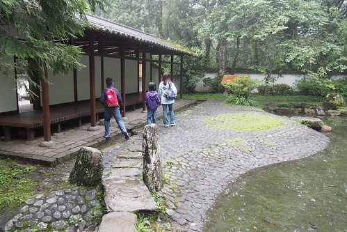](http://flickr.com/photos/33703965@N00/17525008876) 食之無味但棄之可惜的 讓人不起勁 [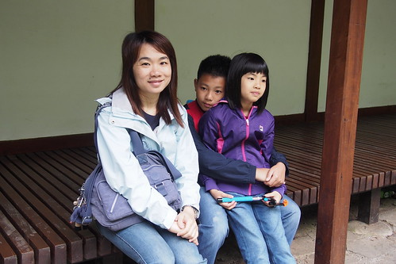](http://flickr.com/photos/33703965@N00/17551380075) 還是回到環池步道 有趣且浪漫許多  剛長出的嫩葉 下雨之後更顯青嫩 這是很有生機 很漂亮的綠 [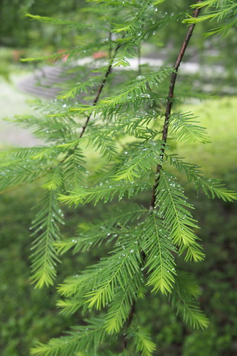](http://flickr.com/photos/33703965@N00/17549077832) 我們坐在池邊棧臺 看著鴨子划水  安靜享受當前美景 [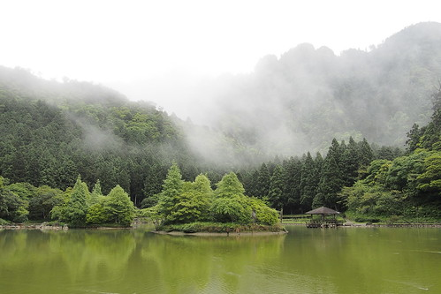](http://flickr.com/photos/33703965@N00/17363529558) 突然間 一陣呱呱呱 鴨子怎麼神不知鬼不覺的出現在我們身旁 也太有趣  我們順時鐘方向走在環池步道 [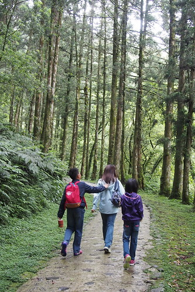](http://flickr.com/photos/33703965@N00/17551195611) 繞一圈也剛好往小木屋方向去 [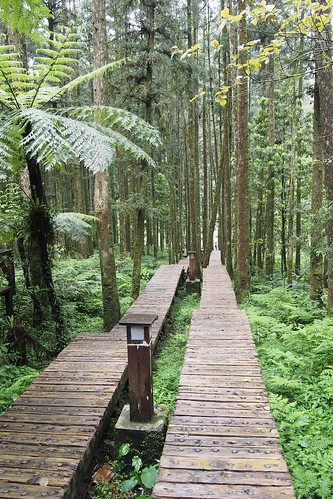](http://flickr.com/photos/33703965@N00/17524902746) 我說旅行的前面是海邊去 讓小孩子開心 後頭的山上走換小孩子表現誠意 奉還爸媽嚕~ [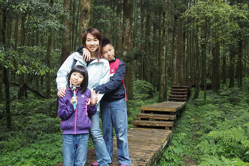](http://flickr.com/photos/33703965@N00/17551181791) 步道不長 走來輕鬆愜意 時間也不趕 邊走邊玩措措有餘  來到林間教室 愛愛舞台魂上身  站上台 遊戲起角色扮演 [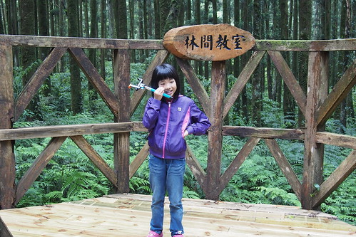](http://flickr.com/photos/33703965@N00/17524877576) 雖然辭窮 愛愛老師還是落落大方的惹我們愛 [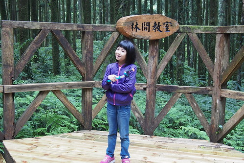](http://flickr.com/photos/33703965@N00/17364898799) 回到山莊 我們來到名池神木前復刻12年前我與徹爸在神木前的到此一遊照 真的! 時間在過好快 一晃眼已是12年過去... [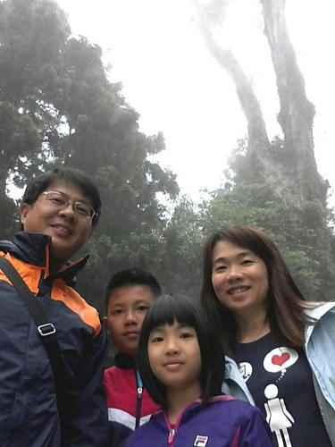](http://flickr.com/photos/33703965@N00/17888443112)

這次才了解 原來名池山莊連同棲蘭山莊與棲蘭神木園區一起委外經營 稱作馬告生態公園 而我們都來住宿了 當然就也報名了神木園區的生態之旅 老實講 費用不斐 這幾年政府越來越愛把國家森林以BOT委外經營 或許服務與硬體品質提升了 但貴三三的費用(訂房價)卻反而讓民眾更難親近 我蠻難接受政府這樣的"美意"....  神木園區距離名池或棲蘭山莊都大約一小時的車程 園區只限制山莊的接駁小巴進出 也就是只有報名生態旅行的遊客才得以進入 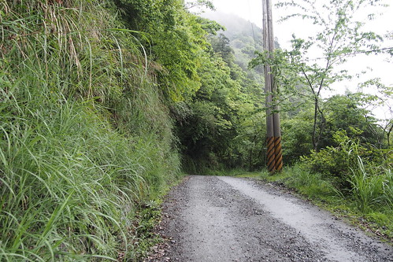 崎嶇的上山路 海拔相對也上升很快 半途可以看見美麗雲海處 司機還特別好意讓大家下車看雲海 [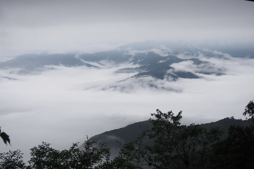](http://flickr.com/photos/33703965@N00/17364884519) 司機把大家放在步道的起點 [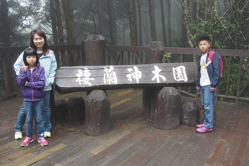](http://flickr.com/photos/33703965@N00/16928641944) 從這裡開始跟著解說老師的腳步 開始生態導覽之旅 [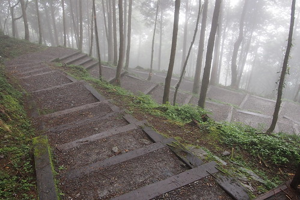](http://flickr.com/photos/33703965@N00/17363604210) 園區內有許多新植樹 [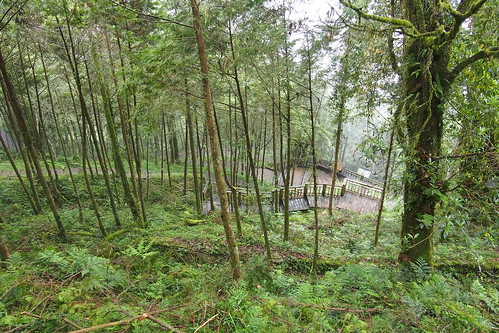](http://flickr.com/photos/33703965@N00/16930831653) 但據說也矗立著近百顆千年以上的紅檜與台灣扁柏  [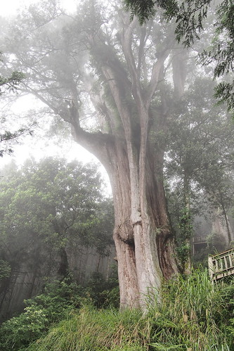](http://flickr.com/photos/33703965@N00/16930809403)  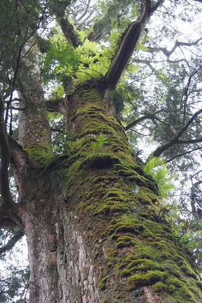 園區內神木都以歷代的古勝先賢的名字命名 老師貫通古今中外歷史外加現代時事講的口沫橫飛  可惜對於現代小孩來講 古人是那麼遙遠的陌生人 走沒多久就喊肚子餓 幸好阿母英明備有乾糧 [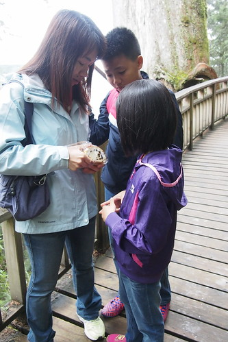](http://flickr.com/photos/33703965@N00/17548890272) 神木威嵷 令人讚嘆 但更令我們感到新奇的反倒是些歪歪倒倒 有趣現象或強韌生命力   [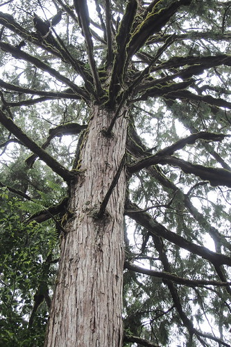](http://flickr.com/photos/33703965@N00/16928522304) 同時正值經營權轉換之際 也見新事主新的整理 氣象  雖然近二小時的解說走下來 看了不少神木也吸收許多芬多精 但向來習慣自己行的我們 其實還是喜歡自己走的自由自在與寧靜 而且我也才發現我ㄧ直把這裡的神木區誤以為蜜月時的拉拉山(達觀)神木園 看來日後我們還要再找個機會走一趟12年前的達觀神木區才行阿!  交通接駁連生態解說約四小時的行程 預約時可一併選擇訂購午餐便當  於是我們的馬告生態之旅就結束在下午一點多時分的木屋用餐 配著馬告魚丸湯 [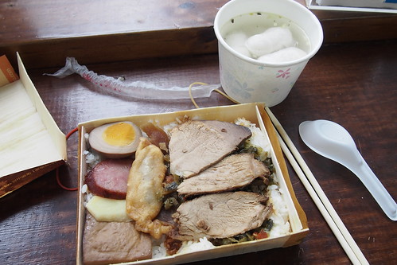](http://flickr.com/photos/33703965@N00/17364704489) 馬告名池之旅 稱不上特別或值得 但有我們回味曾經與一路走來的甜蜜在心頭~~~ 
