期盼好久的暑假總算到來 只是我們的夏之旅礙於總總因素延宕著 只能看著別人打卡流口水... 就來清清徹家這半年的點滴 止止渴

徹哥最後一次的國小校慶補假日 我們一如往年安排了小旅行 來到去年暑假環島時沒吃到美味料理的東澳 以及意外發現值得停留的蘇澳 沒有宜蘭平原的觀光熱潮 我們喜歡這些還有著靜謐的小漁港 

 

搜尋蘇澳 沙灘時才發現蘇澳的內埤海灣(情人灣)原來赫赫有名  雖然人潮也是出乎我們意外的多  但幸好還是令人舒服的密度 [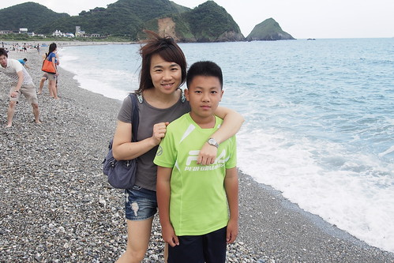](http://flickr.com/photos/33703965@N00/17525313756) 而且海灣沒有任何水上活動的進行 大家單純的在這 看海 聽海 玩石頭  雖然徹愛對於不是沙灘的海灘有些小失落 但兩人卻也喜歡眼前這片大海 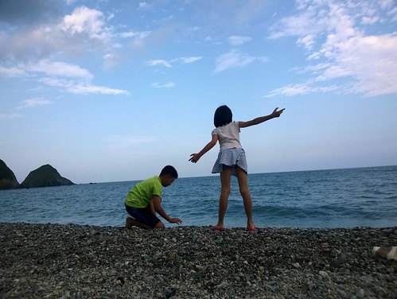 兩人感覺輕鬆愜意  不過小石頭也有小石頭的樂趣 [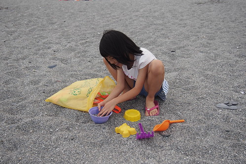](http://flickr.com/photos/33703965@N00/16931393343) 兄妹倆這個傍晚還是看海 玩石的大呼過癮~ [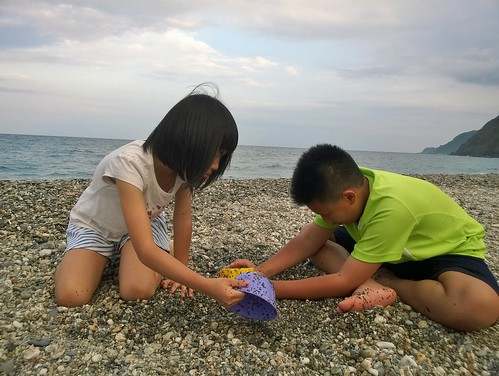](http://flickr.com/photos/33703965@N00/17891401995)

這一晚我們住在蘇澳的民宿 網路搜尋熱門的民宿滿房 於是訂了間關往照片看來不錯的民宿  只是所謂maintain才是一家民宿的關鍵 我們不小心(難得)踩到雷啦.... 

第二天我們如平常時間起床 用完早餐後便出發往蘇花公路路上 來到距離蘇花口20分鐘路程的東澳粉鳥林漁港 [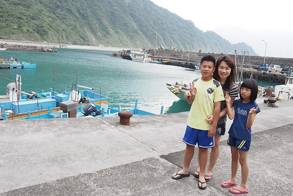](http://flickr.com/photos/33703965@N00/17525276266) 據說這裏有隱於防波堤後的秘密海灘  只是我們繞了一圈仍遍尋不著海灘的秘密入口 不過僅有些許釣客的小漁港 寧靜的令人感到放鬆[ 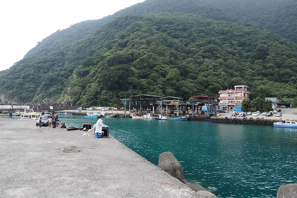](http://flickr.com/photos/33703965@N00/16931279883)直到我們看見有人在我們完全注意不到的地方鑽出鑽入 我們才循著前人的步伐鑽過防波堤 爬過巨石 來到人稱的粉鳥林祕密海灘 [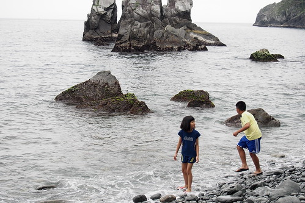](http://flickr.com/photos/33703965@N00/17549326882) 海灘範圍不大 但被巨石環抱的有隱世的感覺 可惜今天天候不佳 少了藍天白雲的襯底  美麗打折許多  秘密海灘石頭大的讓小人很難玩起  我們踏一會浪便離開 反倒來到往漁港路上的一旁沙灘  這裡的沙灘線挺長  重點是有小人最愛玩的細沙 [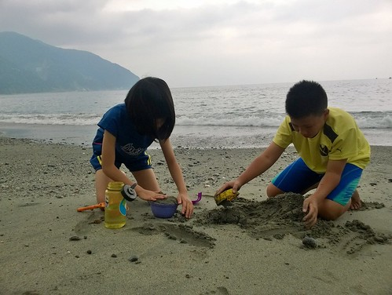](http://flickr.com/photos/33703965@N00/17891411225) 兄妹把握不多的時間  火力頓開的玩起   [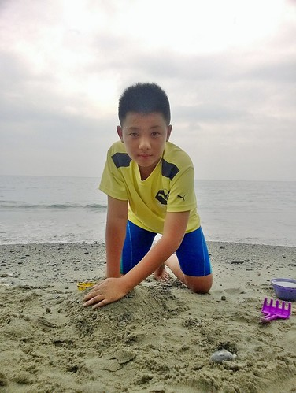](http://flickr.com/photos/33703965@N00/17268904584) [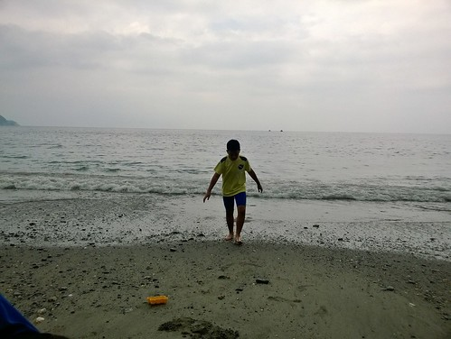](http://flickr.com/photos/33703965@N00/17865074906) 同時 徹爸則是盡興玩著遙控車  看著愛車越野奔跑 不亦樂乎 [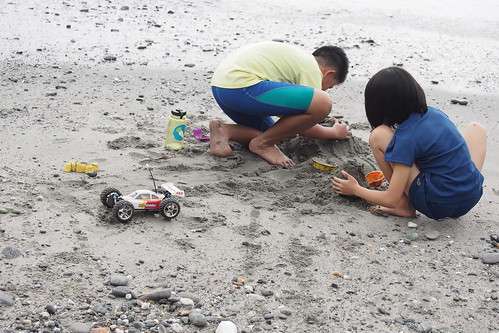](http://flickr.com/photos/33703965@N00/17551600585) 進出蘇花十年來 我們第一次來到蘇花公路上的東澳沙灘 心中沒有相見恨晚的遺憾 只有期待以後進出蘇花便可順道來東澳看海 玩沙 跑跑車...

引起我們對東澳的興趣  是在去年環島最後一天回台北的路上 下午一點飢腸轆轆的我們想要在蘇花路上的東澳用餐 網路搜尋到的東興食堂 食客如熾 更令我們難接受的是 即時我們願意等待半小時以上 老闆娘也沒有任何東西可以賣我們.... 而這加深我們有機會非得來一吃究竟的決心! 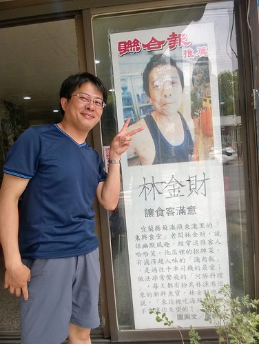 網路搜尋時 建議要提早訂位 於是我們前一晚先打電話詢問(被告知用line訂位 所以得先加line 哈) 可是東興只接受合菜的訂位 Orz 幸好店家很好心的說 開店的11點來就一定什麼都吃的到! 於是早上11點 我們準時來報到! 老闆娘剛好提著採收的青菜來到店裡 看到我們就笑瞇瞇的問"你們是昨天line上的?" 呵呵~ 對阿!  除了桌上放著的預訂客人都還沒出現外 也只有我們這麼戰戰兢兢的早上11點就來吃中餐! [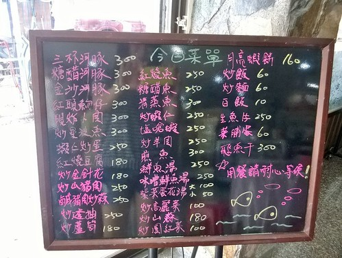](http://flickr.com/photos/33703965@N00/17891436565) 老闆娘很熱情的介紹來他們店不吃可惜的不得不吃菜色 加上我們本來就想吃的 不小心就點滿桌菜 (早上11點就要吃海鮮大餐 考驗不小) [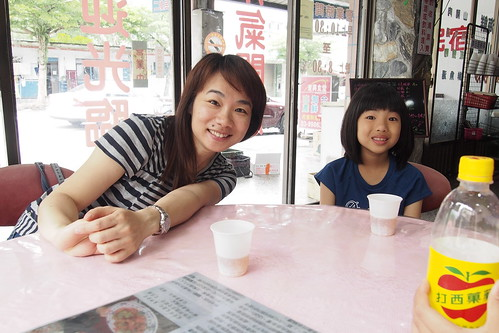](http://flickr.com/photos/33703965@N00/17549310202) 被形容比三星卜肉還讚且海報大剌剌寫著鎮店之寶的卜肉 果然肉嫩多汁非常好吃 [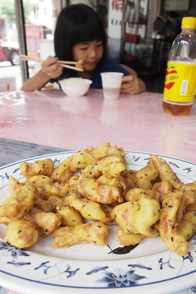](http://flickr.com/photos/33703965@N00/17363790998) 為了不是那麼喜歡吃海鮮 但很喜歡吃月亮蝦餅的愛愛點的月亮蝦餅 這蝦餅真材實料的是出自海鮮店無誤  只是墊在下面的紅色吸油紙也台味十足  不用沾醬 原汁原味吃的鹽嗆蝦 口口鮮美又Q彈 [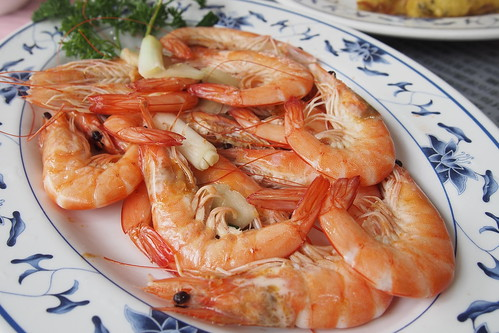](http://flickr.com/photos/33703965@N00/16929012184) 本來就喜歡而點的地瓜葉 被老闆娘大讚我們識貨 因為這是老闆娘自家開心農場種且剛採收的嫩咪咪青菜  老闆娘看到我們點菜單後從廚房出來強烈推薦的紅頭魩魚 數量有限的紅頭魩魚 據說有時候就算吃最貴的合菜也不見得吃的到 這麼剛好就只有這一周只要有桌(可以用餐)就可以點 吃的到QQ口感的魩仔魚 我們前所未吃過阿  也是招牌的河豚料理　我們選了適合小朋友的糖醋口味 出乎我們想像的河豚料理　雖然肉骨交雜但像吃帶骨鹽酥雞似越嚼越涮嘴 [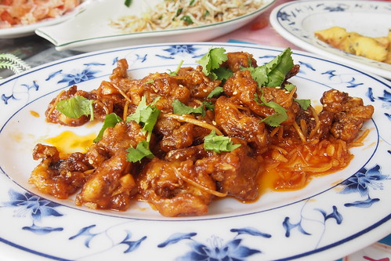](http://flickr.com/photos/33703965@N00/17365223909) 六道菜　外加一鍋滿是魚的味增魚湯 我們不負老闆娘熱情與自己的善吃　幾乎清盤  而且吃飽時才12點 店內還沒湧進訂位的人潮  我們真的太強啦! 

飯畢要離開時 老闆娘推薦我們夏天時可以到附近的東岳湧泉玩水 很清涼 真巧 其實我們接下來就打算要去湧泉玩水 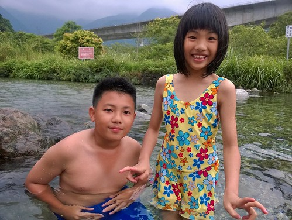 東岳湧泉是八十年代台鐵北迴工程時意外挖到而發現 現場遺跡看來之前還為湧泉公園的建設 只是似荒廢多年 不過往裡頭走 走到台鐵鐵道與新工程鐵道間便可見此天然戲水池  據說終年14-16度的泉水 果然五月天來玩還有些太涼  剛下水的徹愛微發抖著 [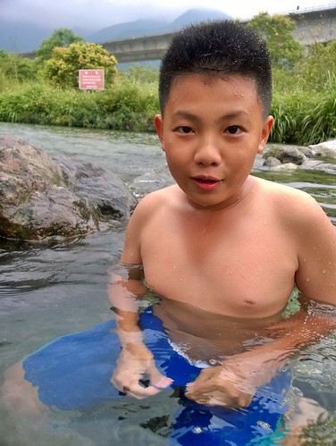](http://flickr.com/photos/33703965@N00/17865100906) 但好玩的二人又怎能放過這清澈清涼的戲水地  [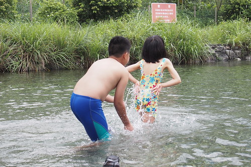](http://flickr.com/photos/33703965@N00/17525115106) 所幸忍著一開始的冷感 漸漸適應就也越玩越開    向來只是看著的我與徹爸 一樣的坐在池邊看著小孩在水裡吱吱叫 哈哈笑我們喜歡有靜謐沙灘 清涼湧泉 美味海鮮料理的東澳 以後進出蘇花 我想我們可以多些停留在東澳 甚至專程來這裡依山傍海都值得~

出蘇花后 我們連著第二天又去涼意叭噗以及隔壁的義珍香麵包店報到 [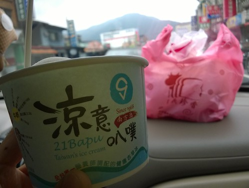](http://flickr.com/photos/33703965@N00/17891990131) 綿密好吃的叭噗已經是我們經過蘇澳的不得不吃阿! 而這也是去年暑環島時的才發現...  而那個據說也是人氣店的義珍香 讓我們吃到充滿古早味的拜拜蛋糕與麵包 我想以後也是我們經過蘇澳的不得不來店之ㄧ了~
