輕鬆可以當日往返板橋的東北角  難得這回我們決定在金瓜石住一晚 二天一夜更可以飽覽山城的晨昏美景 滿天星光的夜空 第二天也更隨興與自在的一處處發現東北角的奇岩怪石 [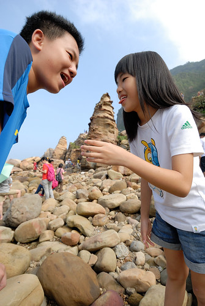](http://flickr.com/photos/33703965@N00/23050653106)

印象中最後一次去九份應該是徹爸當兵時 二人一起去的而且還在九份住了一夜 那時很喜歡九份的懷舊氣氛還有遠眺大海的視野 後來一位在金瓜石唸時雨中學的大學同學帶了我去金瓜石 那時候的金瓜石好荒蕪 如今的黃金博物館 礦坑口..當時跟廢墟無異 但我就此喜歡金瓜石 每隔一陣子就會想上金瓜石  而九份漸漸再也不去了  十幾年過去 九份的熱鬧更不可同日而語 而金瓜石園區雖然也建設的越來越美麗 廣受遊客青睞 但幸好還有許多靜巷小弄寧靜的讓人喜歡 趁著這回在金瓜石住一晚 帶著只從課本上耳聞九份很久的徹愛來到觀光客很喜愛的九份  原以為夜晚來九份應可以避開白日的人潮 沒想到一樣的遊客如熾  只能跟著人潮 排隊般的一路步行下來 意外的 昇平戲院裡是九份難得不擁擠還有清閒的地方 我們在這坐了好一會  離開戲院後不敢再原路擠出去 我們東鑽西竄的盡可能必開人群的走出去 結果這一晚在九份 我們沒喝茶 沒吃芋圓也沒買丹路 只有各自吃了一碗普通的麵做晚餐  熱鬧的夜生活果然我們過不來... [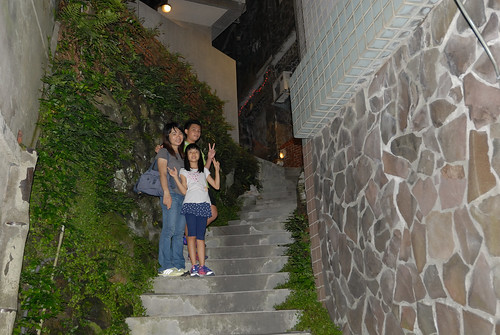](http://flickr.com/photos/33703965@N00/22658318777) 金瓜石這一晚 我們住在玟姿十多年前來過的雲山水小築民宿系列中的樹屋民宿 樹屋是從前礦工家保留整修的獨立小房子 因門前有棵大榕樹故而取名樹屋 (貼照片時才發現徹爸一張照片都沒拍阿!) [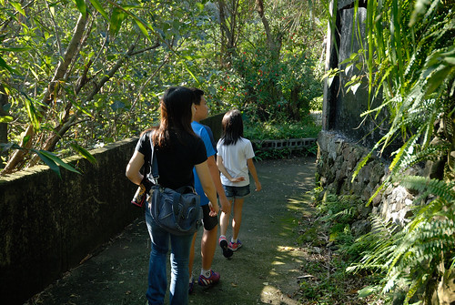](http://flickr.com/photos/33703965@N00/23063104812) 房子本身沒有太令我們驚豔 倒是隔天早上從房子走到民宿本館用餐的步道令人耳目一新 [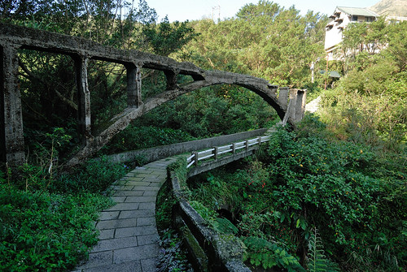](http://flickr.com/photos/33703965@N00/23050674296)   早起的玟姿 自己走 帶愛愛散步 再加上一同走去吃早餐 上上下下已經走了三趟 今天早上的運動量都夠了[ 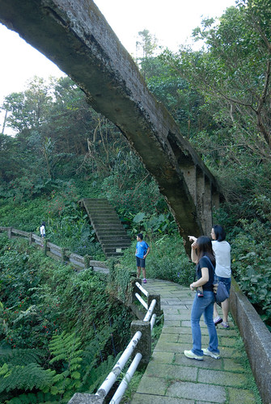](http://flickr.com/photos/33703965@N00/22455512573)而流過汗之後的早餐也特別好吃阿!  原預定第二天上茶壺山賞芒的 怎知前一日的大好天氣卻在今日變得灰濛濛 而且賞芒熱季 茶壺山步道口的停車場不易停車 我們索性放棄上山賞芒 改去黃金博物館園區以及老街走走

 不過說是走走 其實我們也不過是吃了春一枝 吃了礦坑口的豆花後就快速離開黃金園區  往勸濟堂  往人少的金瓜石隨意走去 [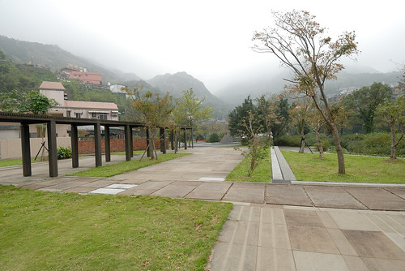](http://flickr.com/photos/33703965@N00/23063094572) 遠遠看到一處未曾看過的美麗園區  走近一看才知是國際終戰和平紀念園區  這裡原為1942年至1945年間日軍的金瓜石戰俘營 石牆上刻了當時被關在全台各地的四千多名戰俘姓名供家屬追思 現場彷彿還殘存著當時的苦難與悲悽 帶著點淡淡憂傷 但同徹愛一起看的這段歷史 更顯現現今和平日子的得來不易與可貴 [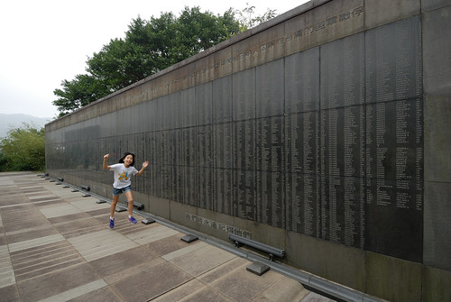](http://flickr.com/photos/33703965@N00/23087915701) 我們既不精通史地也從沒積極認真認識大自然的一草一物 但我們喜歡旅行中每個接觸/了解當地歷史或自然的機會 也許船過 水會無痕 但心底肯定被涵養 累積了一點什麼 [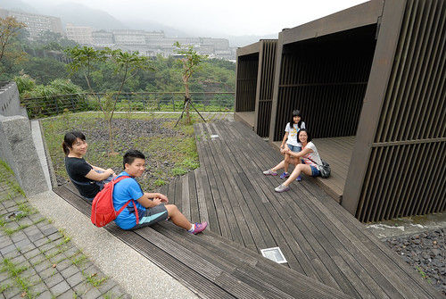](http://flickr.com/photos/33703965@N00/23050666116) 我們笑 今天沒看到芒草但卻賞到楓了 [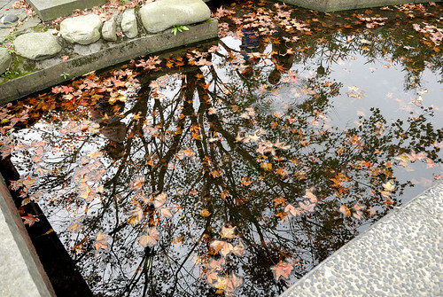](http://flickr.com/photos/33703965@N00/22658318057) 一株枯黃落葉就夠詩情畫意讓人驚艷 [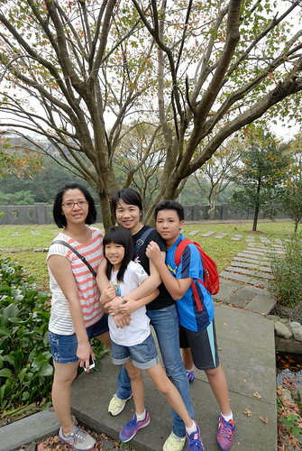](http://flickr.com/photos/33703965@N00/22455503173) 離開紀念園區我們繼續往房子密集的老街走去 [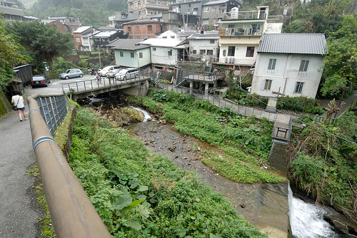](http://flickr.com/photos/33703965@N00/23087913001)  (見著有小庭園的老房子 我都難擋幻想阿)  走到老街 當然要去阿嬤的柑仔店買零嘴吃 [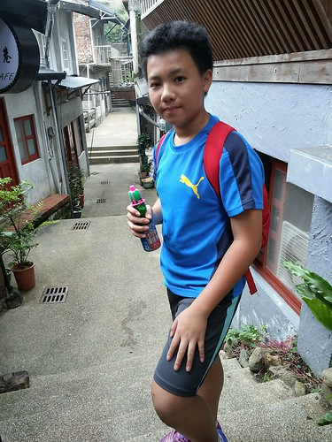](http://flickr.com/photos/33703965@N00/23541116711) 沒有人潮 我們索性當起路霸 佔了馬路(階梯)大口吃 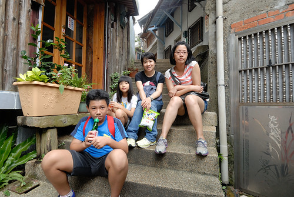 雖然老街上每家店都冷清的有點唏噓 我們心裡其實很慶幸 雖然黃金園區的熱鬧也已經不可同日而語但會走進這很不熱鬧老街的人還是少之又少  離開金瓜石後 我們打發午餐前時間的來到不遠處的南雅奇岩 原以為只是濱海公路旁的一處只有一個顯著奇岩地標的觀光景點  沒想到這兒的奇岩真的奇阿 [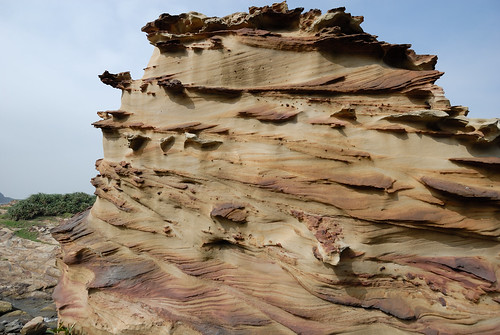](http://flickr.com/photos/33703965@N00/23050659236) 而且美麗的讓我們瞠舌 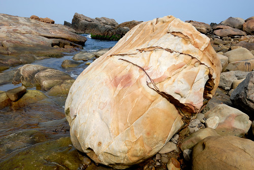 明明是石頭 卻因岩質以及風化 彷若木材般有美麗紋路  奇岩不只在於近觀 遠觀也是好壯闊 我真的第一次被東北角的美麗景觀給震驚到  除了奇岩  秋老虎高照的這天 看到分不清是溪還海水的沁涼 徹愛同阿姨  不假思索的脫了鞋子泡腳玩水     我走上臨海的大石頭上 更近的眺望遠處岸邊 這裡真的好像一座戶外的大自然石雕博物館 太有看頭了 

來到東北角 沒去吃頓海鮮實在說不過去 憑著行前略作功課的印象 來到深澳漁港內的老船長海鮮 [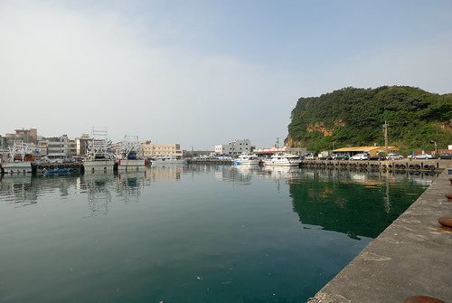](http://flickr.com/photos/33703965@N00/22453902884) 餐廳生意果然鼎沸 沒有預訂的我們等候半個多小時 二點入桌吃到午餐 其實也算順利了 店裡的招牌墨魚香腸  正逢時的香酥白帶魚 還有小管 燙蝦 魚湯等等...都好吃 越來越吃鮮的徹哥吃的好開心 大呼過癮 [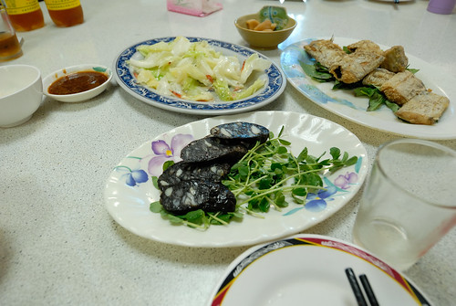](http://flickr.com/photos/33703965@N00/23063079552) 在餐廳門口等候入桌時  看到牆上貼的深澳景點有個象鼻岩 人站在象鼻上的照片 豪氣地讓人好想一探究竟 於是吃飽飯後 明明就在象鼻岩口的我們還傻傻上網猛查該怎麼去 查了好一會 才恍然明白原來漁港內的車潮人潮就都是要往這象鼻去的阿 [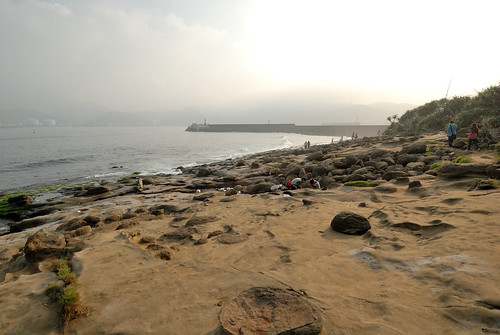](http://flickr.com/photos/33703965@N00/22455487313) 於是我們跟著人跡 去尋找太令我們好奇的象鼻  十來分鐘 翻過小山頭後 沒想到真的有象!  愛愛同玟姿阿姨往象鼻頂走去 雖然知道應該不會有安全疑慮 但我們看著看著心裡腳底都忍不住發起毛 反倒站在象鼻頂的他們好開心 好得意 據說在象鼻上還可以看見海豚ㄋ [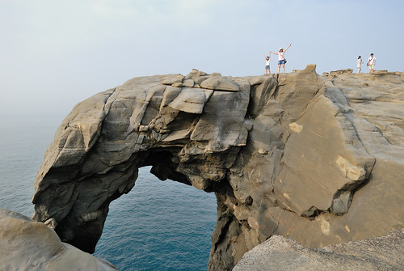](http://flickr.com/photos/33703965@N00/23076702065) 除了象鼻景觀驚奇外 這裡的蕈狀岩景觀也很壯闊阿 徹爸說 這裡比野柳美麗太多 (而且只有熟門熟路的自己人) [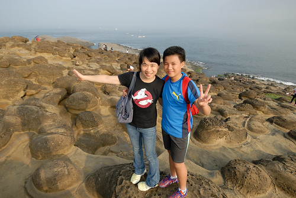](http://flickr.com/photos/33703965@N00/22453898064) 這二天 真是讓我有驚豔也驚喜於東北角的豐富美麗 以後好天氣時 偶而就來去東北角走走吧!  相信有更多風景等著我們去發現... [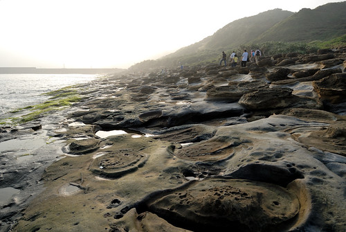](http://flickr.com/photos/33703965@N00/22684409649)
