十一月初託玟姿阿姨上台北參加講習的福 我們多了個二天的水金九小旅行 雖然原計畫的茶壺山賞芒因時間安排 天氣以及難停車而最終取消 但秋高氣爽好天氣裡的水金九 東北角海岸 好美阿!!! 以往我們只會62快速道路接濱海後 從金水公路直上金瓜石 這是是我們唯一熟悉與喜歡的東北角 從來不知道瑞濱公路沿線藏著許多奇岩怪石與好風景 喜歡這趟旅行出其不意的發現與感動 ~ 

從板橋出發到水金九只要一小時的車程  早上九點出門十點便已來到十三層遺址旁的長仁社區 爬上社區裡一段小小又短短的步道  步道頂的涼亭有270度好展望  十三層遺址與大肚美人山 [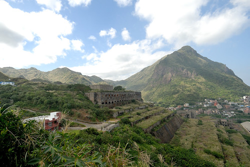](http://flickr.com/photos/33703965@N00/22684416209) 濱海公路S彎道 [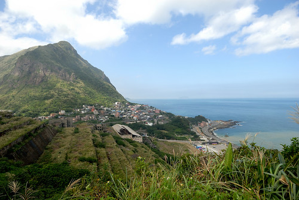](http://flickr.com/photos/33703965@N00/23076767755) 好天氣下更是分明的陰陽海 [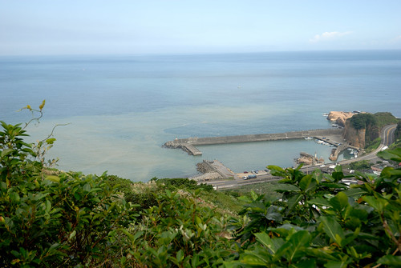](http://flickr.com/photos/33703965@N00/22658352858) 接著我們因為覓食中餐來到水湳洞社區的山城美館 [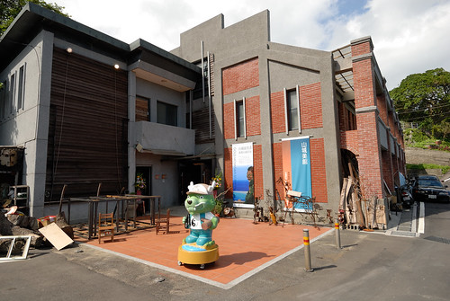](http://flickr.com/photos/33703965@N00/23063138192) 山城美館曾是日據時代水湳洞的第一戲臺 經歷台金公司的接收  新北市觀光局的修整管理 現由當地藝術工作者們承租營運 提供藝術展覽以及藝術創作或工藝作品的展售(徹爸向來尊重智慧產 不拍內部 )我們很喜歡逛這樣的店(博物館) 總嘖嘖稱奇與感動於那些的新奇 美麗與故事 [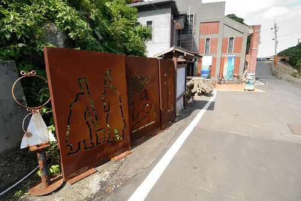](http://flickr.com/photos/33703965@N00/23087956661) 山城美館對角的水湳洞遊客中心在幾年前我們往返金瓜石路上曾注意到過  如今雖仍掛有遊客中心的牌子 但其實裡子已是一家展現時代意義與人文情懷的咖啡簡餐廳  宣紙手寫菜單  飯糰味噌湯套餐 [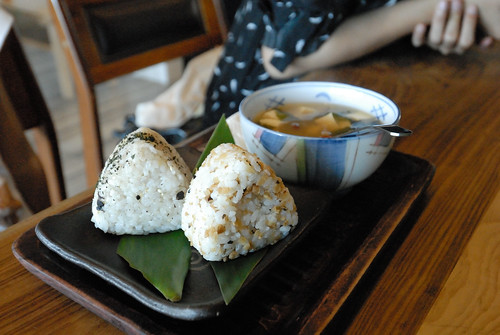](http://flickr.com/photos/33703965@N00/23087953401) 香椿醬烤饅頭 飯糰跟烤饅頭都是以前採礦時期礦工常食用的點心 [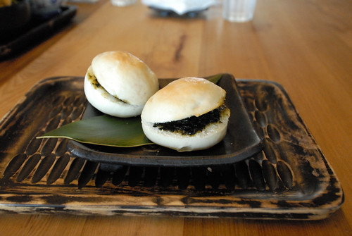](http://flickr.com/photos/33703965@N00/22658383267) 手工pizza [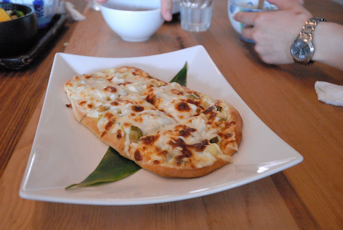](http://flickr.com/photos/33703965@N00/22455541603) 當地媽媽利用新鮮食材製作的蔬食料理 每樣都看來美麗吃來美味  原以為這樣吃氣氛的輕午餐只能止餓  但我們吃的開心又飽 喜歡!  餐廳的戶外陽台也有座椅  可邊用餐邊看海 [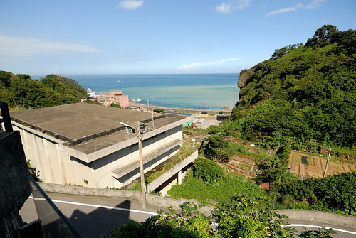](http://flickr.com/photos/33703965@N00/22658343058) 以及遠處的十三層遺址  但大熱天大家寧願室內吹冷氣用餐 最後才到陽台小憩拍照  山城美館旁有條長階梯通往濂洞國小 [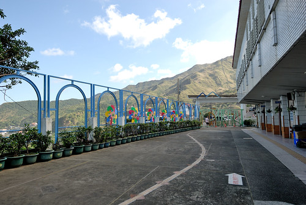](http://flickr.com/photos/33703965@N00/22453949174) 國小內有個長溜滑梯很有名 吸引許多遊客來到國小 四年前我們上金瓜石賞芒時也曾來溜過 [blog.yam.com/hmchen1975/article/58745406](http://blog.yam.com/hmchen1975/article/58745406) 轉眼間 徹愛已過了看到溜滑梯就衝衝衝的年紀 [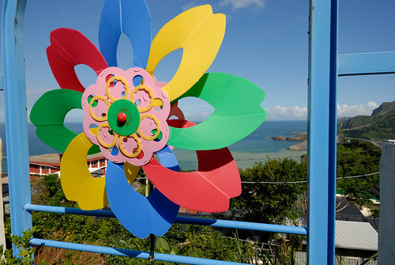](http://flickr.com/photos/33703965@N00/22684415849) 本來我們只是午餐吃太飽的散步幫助消化 隨意地走上長階梯 沒想到當我們要再從國小走回美館時 才發現這下階梯視野之美 [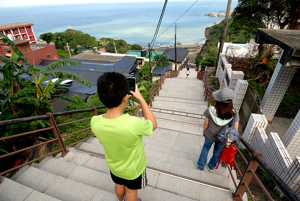](http://flickr.com/photos/33703965@N00/22453948634) 我們隨興坐在階梯上 享受這延伸到海的美麗構圖  遠方的基隆嶼雖然電線交雜 卻有生活的存在感 [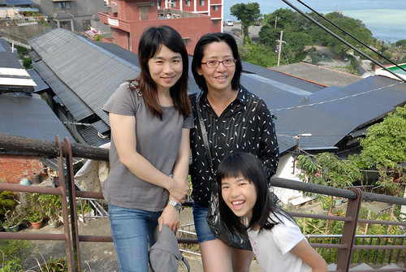](http://flickr.com/photos/33703965@N00/22453946824) 在這依山傍海 心裡感受安心又開闊  回到起點的山城美館  鄰近還有個多功能展演平台 一樣的這裡又是看山看海的絕妙地點 尤其在這樣的好天氣  每一幕都讓我們讚嘆不已 [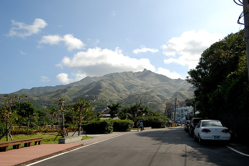](http://flickr.com/photos/33703965@N00/23050695646)

趁著好天氣 我們乘勝追擊的往鼻頭角挺進 [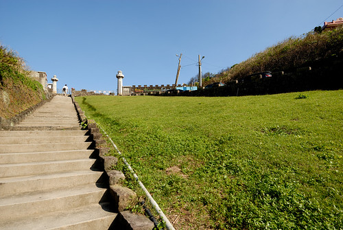](http://flickr.com/photos/33703965@N00/23076749985) 以鼻頭國小為起點 開始號稱北海岸明珠的鼻頭角步道行 [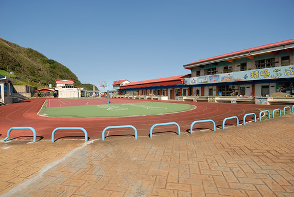](http://flickr.com/photos/33703965@N00/22455531053) 等候徹爸停車的時間 我們坐在教室建築後的平台欄杆上看海  看著眼前蔚藍大海   大口呼吸的我們一掃開學以來 身為老師 國中生 國中生媽媽的辛勞鬱悶 [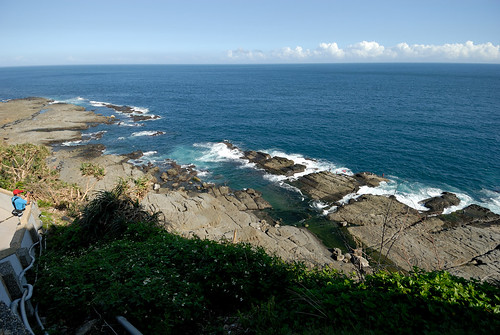](http://flickr.com/photos/33703965@N00/23063070292) 鼻頭角不饋是熱門景點 人潮絡繹  不過密度鬆散 還可以照著自己速度行走   以前我們只看過照片裡的海蝕平台 海溝峭壁 岬角奇岩 身歷其境 才真實感受這些美景的氣勢磅礡  [ 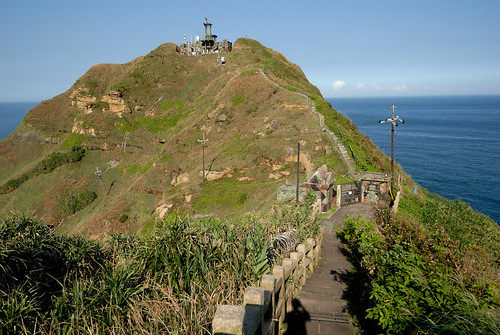](http://flickr.com/photos/33703965@N00/22684457859)  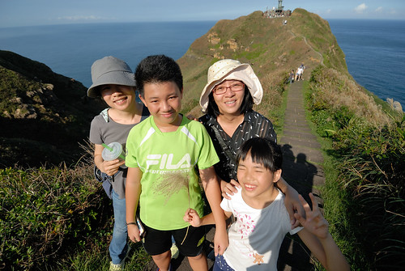 鼻頭角步道包含三段: 燈塔 海濱與稜谷步道 其中燈塔步道已因風化 危險考量而封閉 而傻傻我們錯過岔往海濱步道 沒能親踩海蝕平台是今日的小遺憾 但稜谷步道的壯闊 就足以讓人心神蕩漾 印象深刻  稜谷步道上的最高處可俯瞰鼻頭漁港跟海岸風情  景觀亭也是沿途沒遮蔭行走後的最佳吹涼處 [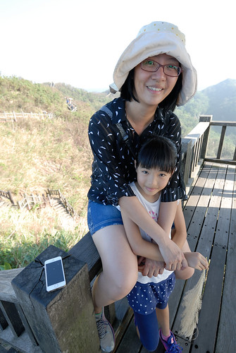](http://flickr.com/photos/33703965@N00/22453933254) 高處之後是陡下的木棧道 通往鼻頭港 約莫十多分鐘抵達鼻頭漁村  今天的鼻頭角稜谷步道約莫一小時走完 但陡升陡降加上秋老虎高照 走完後大家不約而同說著好想來碗剉冰 涼一下 同時也沒勇氣上九份擠人潮吃芋圓 憑著印象中看過的網友推薦瑞芳芋園 我們搜尋來到瑞芳鎮上的保雲芋圓  店裡不只有冰的或熱的芋圓各取所需 還有甜不辣很好吃 尤其完食後可無限自己添加的湯 完全對了徹家的湯胃 [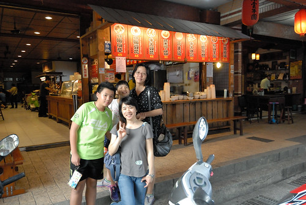](http://flickr.com/photos/33703965@N00/22453931484) 大手牽小手 這一個白天肚子很飽 視野很滿  心很開闊~ 
