國中生第一次段考過後的十月中 安排了新竹二天小旅行 沒什麼特別好吃 好看 好玩的旅行 但是國中生開學後 益發可貴與珍惜的放鬆 [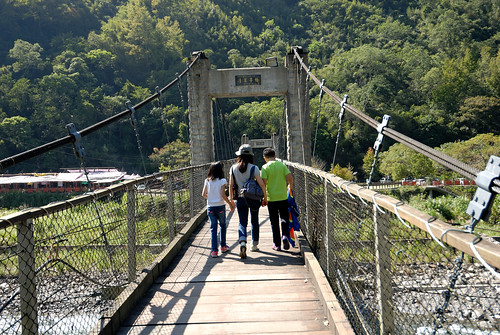](http://flickr.com/photos/33703965@N00/22684334369)

沒在念書的小學生升上國中後果然難以適應 而爹娘也跟著不是太好過 總算熬過第一次段考 成績雖不如人但起碼忠實反映出付出與收穫之間 全家也才敢在段考過後出門小旅行 喘口氣一下(媽媽很需要) 不想跑遠 腦海中浮現出放口袋名單很久的觀霧雪霸 只是那個路也是給他很迢遙 而且還很貴很難訂阿 不過卻也在搜尋鄰近民宿時 發現了雪霸公園入口處的白蘭部落 清泉風景區 白蘭的原始林相以及清泉聚落的原味 就足夠讓我們心動來趟久違的西部旅行 [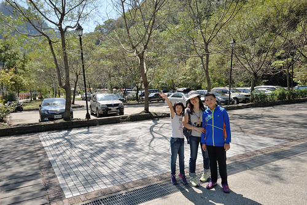](http://flickr.com/photos/33703965@N00/22658220268) 二個小時左右的車程便抵達五峰的清泉風景區 一下車徹哥就忍不住大伸懶腰 大喊好舒服阿~ 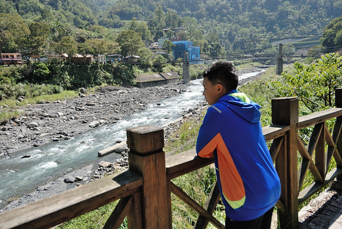 清泉部落最有名的是張學良以及三毛的故居 我們先是到原張學良紀念館 現為原住民文化館參觀 [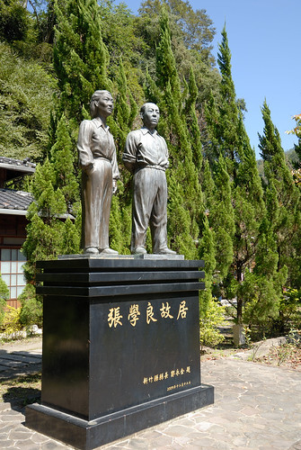](http://flickr.com/photos/33703965@N00/22453829604) 每每參觀原住民文化館 總驚艷於原住民的素人木雕創作 既有創意又生動 [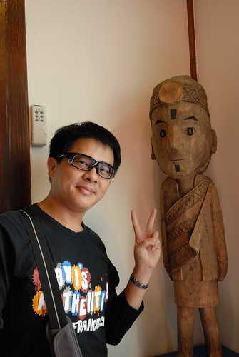](http://flickr.com/photos/33703965@N00/22684307009) 開始部落散步前 我們先到風景區的商店街吃中餐 一整排一樣賣著野菜山產的店家 著實讓人難以抉擇且尷尬到底該走進哪一家店 最後我們索性 選了一家有跟愛愛一樣大女孩吆喝攬客的店裡 [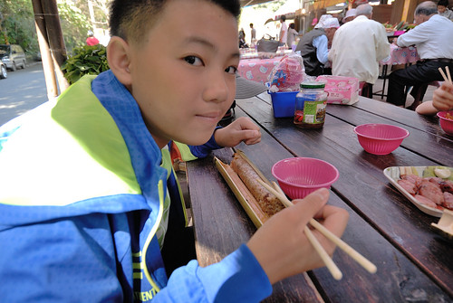](http://flickr.com/photos/33703965@N00/23076632515) 竹筒飯 烤山豬肉 馬告香腸 有這幾道原住民風味餐好像就到味 [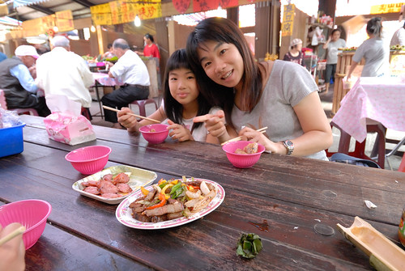](http://flickr.com/photos/33703965@N00/22658255407) 清泉有三座頗具歷史的吊橋 串聯著部落 溫泉各區 雖然行前有稍微做點功課　概略了解景點分布與最佳化路徑 但我們還是興之所至的  隨意散步走走　[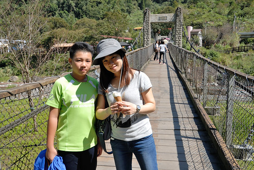](http://flickr.com/photos/33703965@N00/23063004232) 走過緊鄰停車場的清泉吊橋 便是清泉國小[ 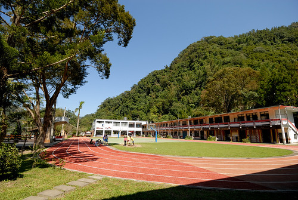](http://flickr.com/photos/33703965@N00/22684342619)正好有群大大小小孩子們在練(玩)著跳遠 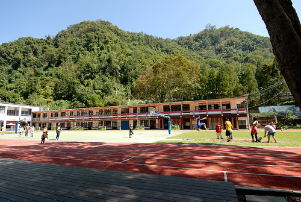 看部落孩子們充滿活力又很愛搗蛋的模樣 讓徹哥很是感歎與羨慕這樣的山中學校 [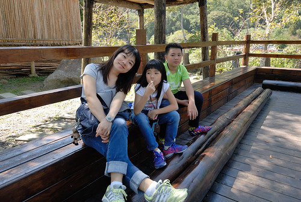](http://flickr.com/photos/33703965@N00/23076627085) 我們坐在操場旁的木棧台上看孩子 看天 看樹  很久沒有的自然呼吸 [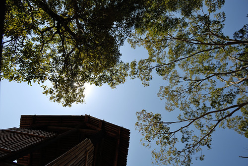](http://flickr.com/photos/33703965@N00/22658212978) 同一河岸 我們順著路往張學良故居尋去 [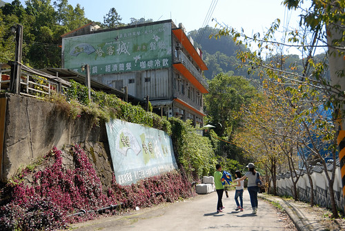](http://flickr.com/photos/33703965@N00/23087817881) 還有本來期待的足底溫泉  可惜將軍湯在今年夏天颱風重創後被封閉 [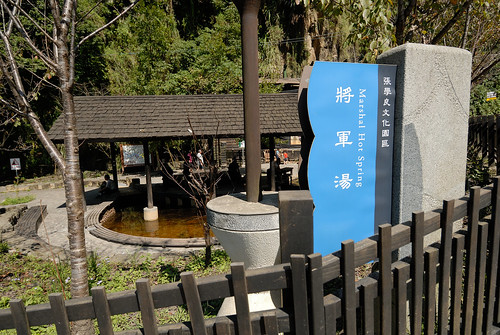](http://flickr.com/photos/33703965@N00/22455406313) 二次大戰後軟禁張學良將軍13年的清泉住處 在將軍遷離後幾年早在民國52年就因颱風侵襲成廢墟 直到９７時才又在故居原址闢建紀念公園　重現將軍當年生活與此的情景 離高中歷史已經很久遠的我們　早已說不清（忘記）張學良對於歷史的影響 在這剛好複習這部分的歷史　上了年紀的我們再讀這些歷史就真明白也記得了 我最喜歡的是房子的這角落　視野光線都極佳　將軍與秘書軟禁於此雖鬱悶但應也有愜意 [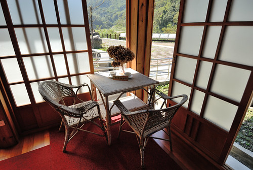](http://flickr.com/photos/33703965@N00/23076621675) 另一個曾經居住過清泉的名人是三毛 民國７０年因為來拜訪清泉天主堂丁松青神父的三毛 在７２年後的三年期間租了這的一座紅磚屋做為他的夢屋 後來屋主無償提供房子成為了台灣唯一公開展示三毛照片與故事的紀念處 粗人如我們不是三毛迷　書連一本也沒看過　所以只是過其門而不入 我心裡念的倒是想找到遠遠就一直看見的那座又高又長且又老的清泉一號吊橋入口 [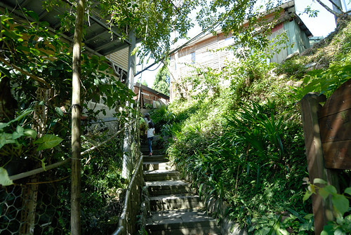](http://flickr.com/photos/33703965@N00/22455402433) 其實行前做功課時就發現有網友寫吊橋已因年久危險而公告封閉 但遠遠看見還是有人在走　而且真的都沒有任何繩索或明顯禁止進入的障礙 讓我好想走過這座好有味道的吊橋 可惜我的心存僥倖(不主動告知)　還是讓向來出門在外小心謹慎的徹哥給發現那小小一張的縣府公文 [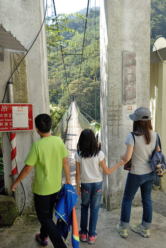](http://flickr.com/photos/33703965@N00/22658205218) 我之外的三個人怎樣都不願意冒險陪我走吊橋  而我硬是走小小一段以玆紀念 [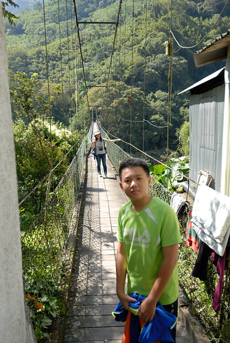](http://flickr.com/photos/33703965@N00/23076617415) 走在社區裡 隨處可見遠處上方的天主教堂 [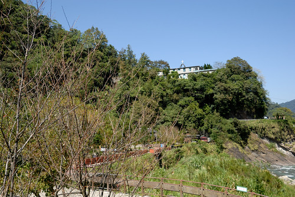](http://flickr.com/photos/33703965@N00/22684347619) 離開清泉前 我們開車循著可能路徑找到天主堂 [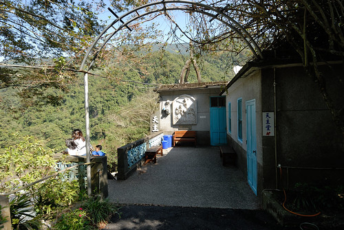](http://flickr.com/photos/33703965@N00/22455398433) 臨著山壁建立的教堂 有種遺世獨立但卻溫馨的氛圍 [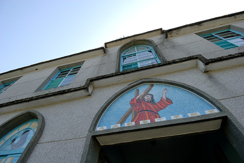](http://flickr.com/photos/33703965@N00/22658235017) 尤其看見教堂旁籃球場上打球的少年 教堂內彈琴 排舞的少女 [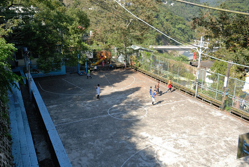](http://flickr.com/photos/33703965@N00/23062989482) 加上具歷史感但卻整潔且別具巧思的佈置 [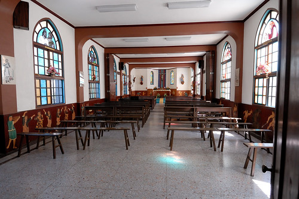](http://flickr.com/photos/33703965@N00/22684332269) 感受到教堂對於聚落的愛與影響 我們在教堂川堂聽著裏頭傳來的鋼琴聲 [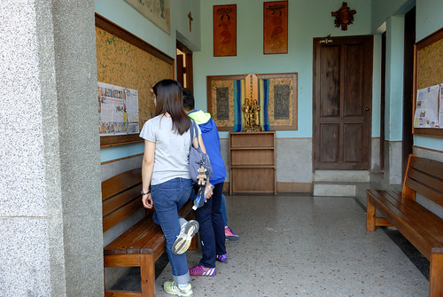](http://flickr.com/photos/33703965@N00/23076611185) 享受這裡的寧靜祥和 [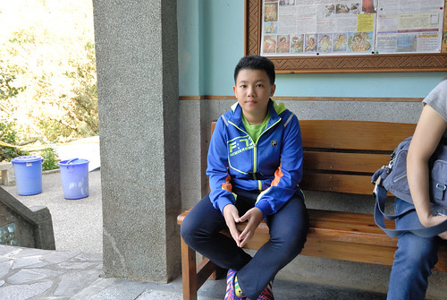](http://flickr.com/photos/33703965@N00/23076610465)

這一晚住宿的是在更往山裡走 更接近觀霧的白蘭部落 [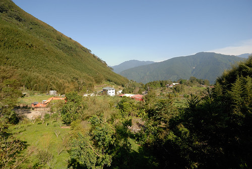](http://flickr.com/photos/33703965@N00/23076608055) 網友評價很好的民宿訂不到 只好選擇照片看起來還OK的白蘭山莊 三點抵達山莊時 主人不在家 我們自己來的在庭院裡搬椅休息 [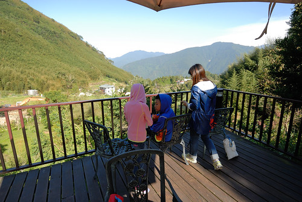](http://flickr.com/photos/33703965@N00/22453803214) 登高望遠 對我們來說就是最好的旅行放鬆方式 [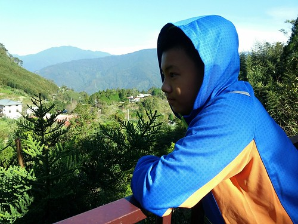](http://flickr.com/photos/33703965@N00/23541069941) 各自拿出私藏 各自沉浸在自己的愜意中 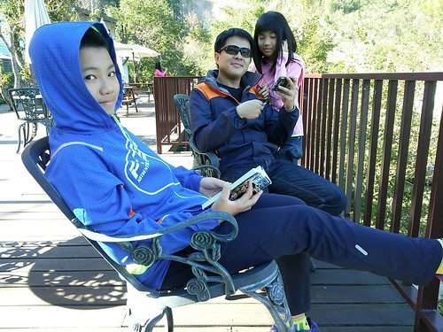 主人說白蘭部落每年元旦的跨年迎日出活動很熱鬧  這裡正是看日出的最佳視野 我們還沒見識到日出 但天黑前對方山頭的光影變化已饒富趣味 [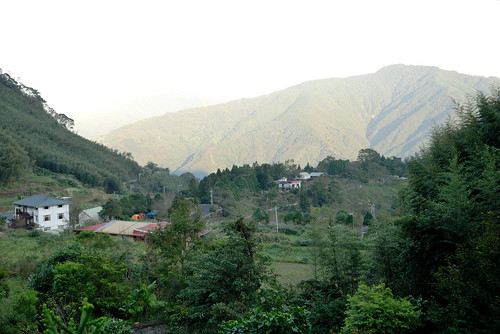](http://flickr.com/photos/33703965@N00/22455389073) 部落真的很偏僻 所以晚餐事先就先跟民宿訂好 六菜一湯 不豪華也不商業 但是吃很飽的家常好料理 [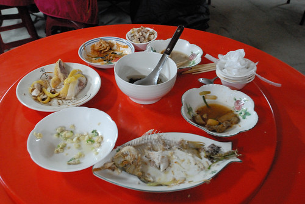](http://flickr.com/photos/33703965@N00/23076605675) 民宿房間簡單 對我們向來在外過夜就是晚餐過後看點電視 玩點牌 說點故事後就早早睡覺就已足夠 [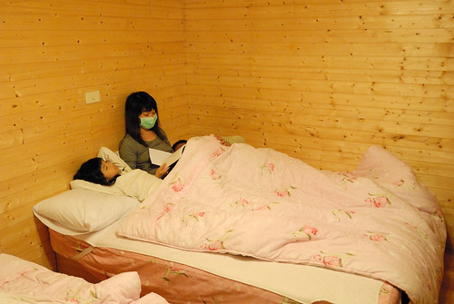](http://flickr.com/photos/33703965@N00/22453800894) 我們最愛看也只會看的日出就是起床直接就可以看到的那種 [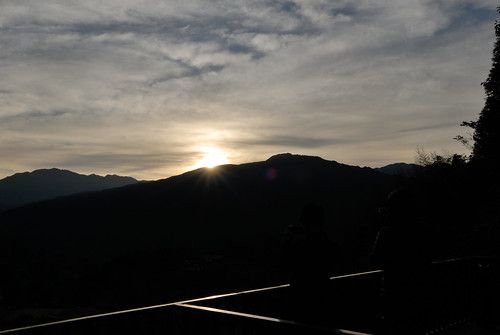](http://flickr.com/photos/33703965@N00/22658191948) 雖然雲層有些厚重 但曙光總是讓人熱血  尤其對於學生(難怪媽媽一臉睡) [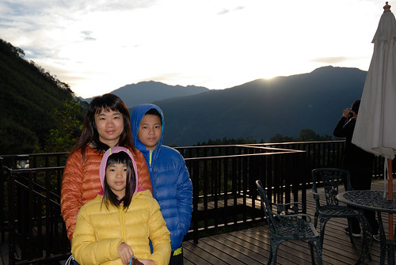](http://flickr.com/photos/33703965@N00/23050552016) 日出過後再回眠 然後早餐後的繼續庭院休憩後 我們便起身下山  原打算下到半山去走鳥嘴山登山步道 可惜找到桃山村後才發現離登山口還有一小時多的車程距離 只好作罷 車繼續往山下開 看到往五指山的指示於是岔到五指山上去 到山上後近中午的烈焰與尷尬 讓我們步道走與不走都不是 繼續再順興地往山下去 看到北埔的指示 想想來去北埔冷泉泡泡好像也不錯 於是我們又來到北埔冷泉 [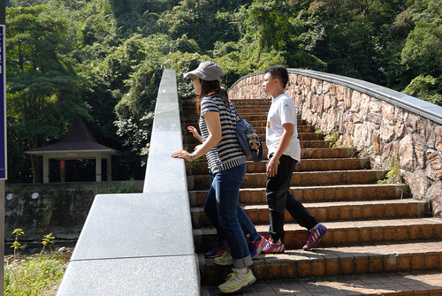](http://flickr.com/photos/33703965@N00/22658225687) 沒想到這裡的吊橋與溪谷 出乎意外的好風景 [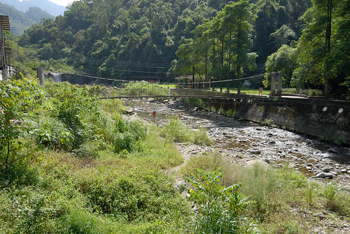](http://flickr.com/photos/33703965@N00/22658225037) 儼然一個遊憩區的規模 只是正常的黃濁濁冷泉實在引不起我們的興致 [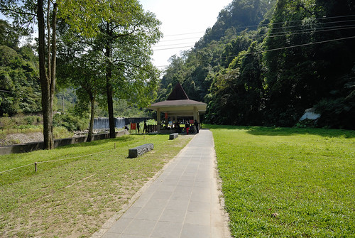](http://flickr.com/photos/33703965@N00/23076600815) 反倒溪谷裡的戲水人潮吸引著徹愛  撩起長褲館  涼涼的天 曬著溫暖的太陽下戲水是極舒服的 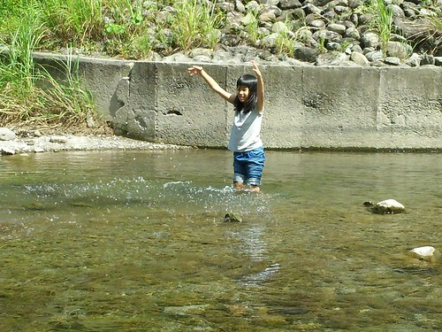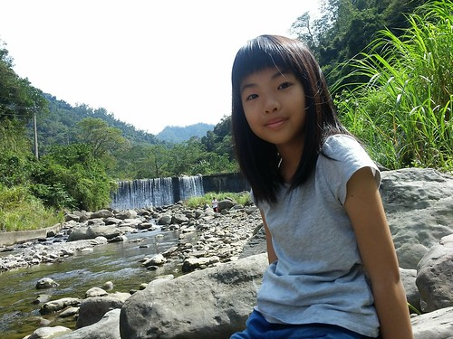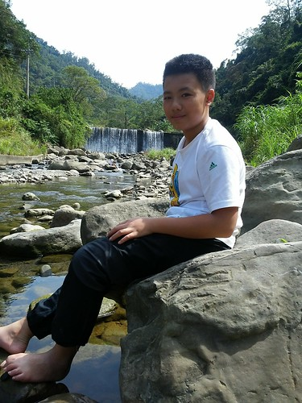 而徹愛戲水的同時也剛好讓徹爸打個盹 好繼續接下來的隨興遊 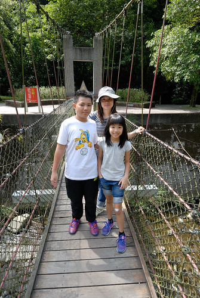 都來到北埔冷泉 很自然的又想那就來去北埔老街吃個中餐 逛逛吧 所以我們又來到果然都會很熱鬧的北埔老街 完全出乎行程規劃的地方對我們來說是考驗 光是要解決午餐就不是件容易的事 好不容易看到人少的巷子裡有家看來好像還不差的客家麵店  四碗麵簡單解決掉中餐  吃完麵來碗冰又是很理所當然   剛好麵店附近有家冰店很引我好奇 於是傻傻不知名店的我們就這麼幸運地吃到"幸運草良口冰"美味到令人難忘的冰淇淋 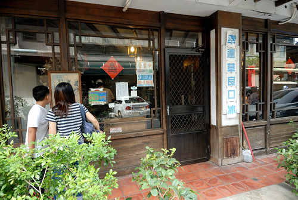 竹科工程師背景的老闆 完全自家手工製作的冰淇淋 細緻綿密卻又扎實 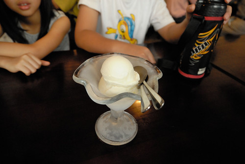 除了給徹愛點的招牌冰淇淋很令徹愛滿意 老闆極力推薦給大人的 冰淇淋咖啡更是令人驚豔 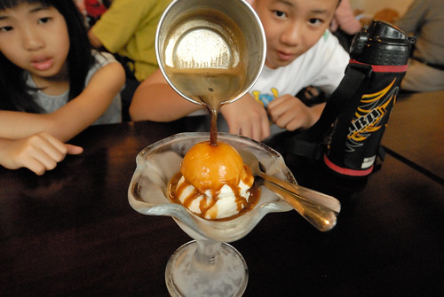 健談的老闆在倒下熱咖啡前 還很可愛的問要不要拍照 然後非常有專業 不緩不及又愜意的沖下咖啡 讓我們睜大嘴欣賞著冰熱交融 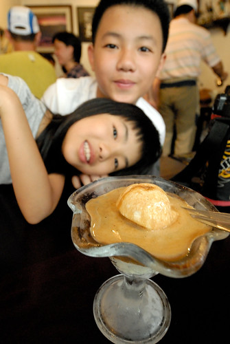 咖啡的醇加上冰淇淋的甜密 非常棒的組合 好奇的徹愛嘗鮮一口後 欲罷不能的也要一口接一口 徹爸想了好久後恍然想起似的說這是小時候統一咖啡廣場的味道 雖然笑徹爸把人家的咖啡比LOW了 但真的是好咖啡 好的視覺與味覺享受無誤 這是意外北埔之行的意外美味收穫~[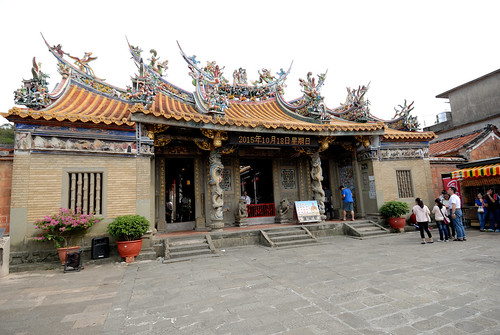](http://flickr.com/photos/33703965@N00/22684307839) 吃完冰後到老街裡逛逛買買 吃吃喝喝 [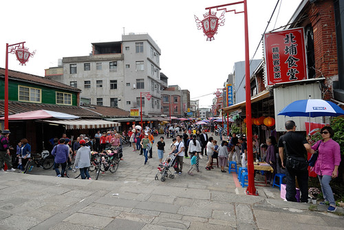](http://flickr.com/photos/33703965@N00/22453783674) 開心這次的新竹小旅行有盡興 有機會實在應該多走走西部這樣的小鄉鎮 發現不一樣的美味 美好....
