徹哥升上國中後不用再練球 讓我們的週末多了許多時間與彈性 但不用練球 加上沉重的課業安排卻也讓徹哥運動量驟減 為了讓國中生的身心眼都多些舒展 愛玩的媽媽更義無反顧地領一家子出門玩 而感受到課業壓力的徹哥不若六年級時只享宅在家 現在珍惜出門踏青玩樂的放鬆

開始寒假旅行計劃前 先發奮來把這幾個月的小遊記補上 就從九月中秋假期回嘉義時到鰲鼓濕地森林園區的那下午寫起 雖然時節不對還颱風來臨前的風大鳥不見 但秋高氣爽很好散步~ [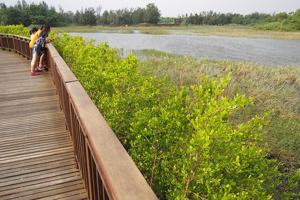](http://flickr.com/photos/33703965@N00/23049765930)

連假期回嘉義 習慣透早六七點就出門避開點高速公路的人潮 回到嘉義後剛好去現在嘉義很夯的樂檸漢堡吃早餐  自製天然酵母麵包加上不多也不少的生菜炒蛋 不若一般早餐店風味  但健康清爽 徹愛說很有媽媽早餐的味道 

雖然颱風來臨前天氣有些不穩定 徹爸還是如約定開車帶我們來鰲鼓溼地 [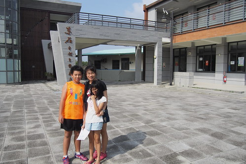](http://flickr.com/photos/33703965@N00/23319621806) 不知怎麼怎麼逛起看起的時候 先到遊客中心報到是最快速的方法 這兒的服務人員非常的熱心 不只有定時的影片介紹還熱心的拿著園區圖給我們建議的參觀路線  聽完簡介了解園區設立的緣起與展望後 先到遊客中心頂樓  鳥瞰這大片溼地  然後繼續往濕地深處的觀海樓挺進  只是人都快站不穩的颱風天 果然魚潰鳥散 只見汪洋一片  其實本無心也沒準備的我們 本來就不是以賞鳥為目的  入口意象處的白千層大道 人工溼地 更適合散步的我們  不過沿途還是許有多的小蟲 小鳥 吸引我們注意  很不PRO級的我們 邊走邊吃邊看   [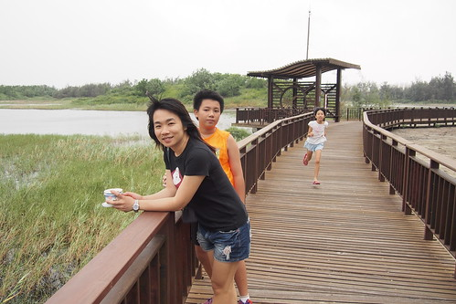](http://flickr.com/photos/33703965@N00/22717293284) [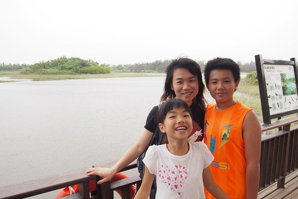](http://flickr.com/photos/33703965@N00/22717280604) 

 [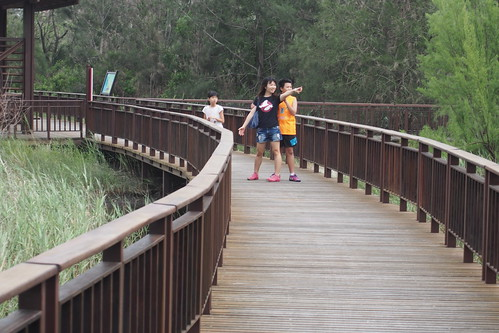](http://flickr.com/photos/33703965@N00/22718463603) 多達一千多公頃的園區 曾經被開發作為農業用地 但西南沿海的超抽地下水造成造成地層下陷 使得原有的台糖農場被關閉 而鹽化無法種植的海埔新生地經過二三十年的恢復自然也逐漸成為鳥類的重要棲息地 2012年正式開園 是為國際級的生態溼地園區 [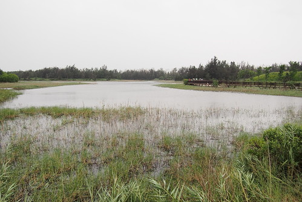](http://flickr.com/photos/33703965@N00/23345648395) 沿著人工溼地 走到森林步道  隨處有小發現 大驚喜 [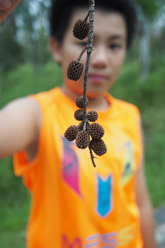](http://flickr.com/photos/33703965@N00/23049828470) 看不到盡頭的平地森林 [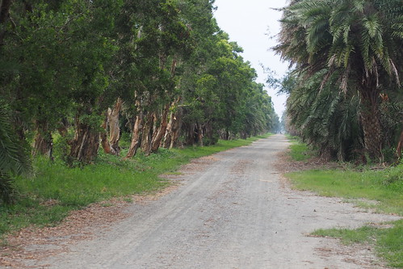](http://flickr.com/photos/33703965@N00/23262998031) 很壯觀 只是碎石路在颱風來臨前走來格外辛苦 風沙刺眼阿 [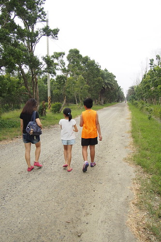](http://flickr.com/photos/33703965@N00/22718437903) 所以我們還是在很多的可以岔往木棧道的時候 走回悠閒 [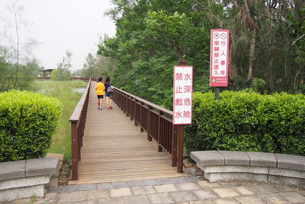](http://flickr.com/photos/33703965@N00/22977627419) [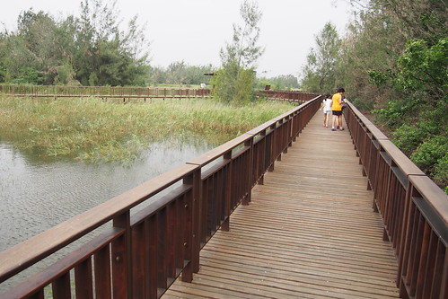](http://flickr.com/photos/33703965@N00/23049771960) 要走完整個園區 光用走 很難! 一開始難以相信解說員說用開車環園的我們後來體驗到真的很難!  我們沿著壩堤開著車 據說可以大ㄇ字型 各方位的看一圈濕地  好難想像這片遼闊的汪洋 曾經被以人力的方式填海造陸而為"海埔新生地"  果然不屬於自然的東西 到底還是回到最初 一切彷如一場空 但留下今日這片考慮了全球性候鳥遷徙問題而設計的鰲鼓溼地森林園區 [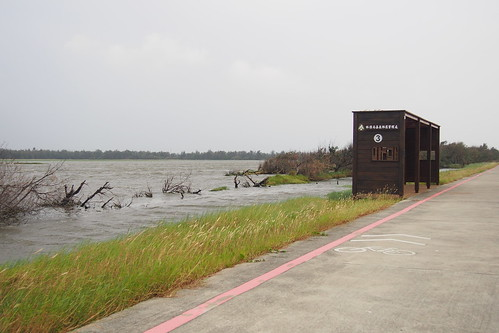](http://flickr.com/photos/33703965@N00/23262936081) 七孔水門外 是西南沿海經典的蚵棚區 [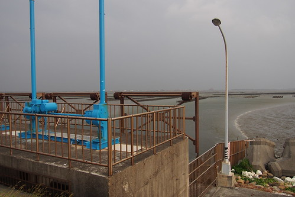](http://flickr.com/photos/33703965@N00/22977562639) 好天氣時這裡的夕景一定很棒  只是颱風天這兒的風也真大到讓人站不住  徹爸站在堤上 想照出最大的園區視野  而大道上的母子望著滾滾水流 則是難以想像鳥類如何棲息在此(來的天氣真的不對 不是賞鳥天)  今天就當作探路 有機會一定要在對的季節再來這兒賞鳥~ [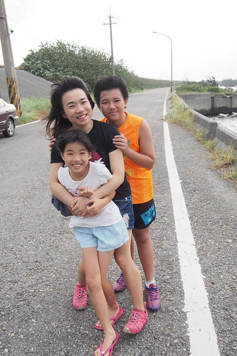](http://flickr.com/photos/33703965@N00/22717102624)
