離開玉里後 原先的規劃是走連接富里與東河的富東公路(台23) 從台9的山跨到台11的海 也順遊未曾走過但每每好奇的台23與東河 可惜我與徹爸苦於腸疾不適 只好捨長取短走最短最快的玉長公路(台30)從玉里直接到第四晚下榻的台東成功 而原先安排的二天時間從台東成功移動到花蓮石梯坪也因此更顯無為與緩慢 但這樣慢慢走的步調其實更適合夏日的太平洋阿~ 

走玉長公路真的是從縱谷最快到海邊的選擇 不用30分鐘就可以從玉里來到原先預計花半天時間抵達的成功下榻民宿 於是為了打發時間 也真是好多台11的景點我們沒停留過 這回我們沿著台11好好走走停停與看看

台11線98公里處轉入的烏石鼻漁港 規模不大卻曾在2009年被評為全台十大魅力漁港之一  烏石鼻也是全台面積最大的柱狀安山岩噴發處  可說是集海色風光於一身的美麗小漁港 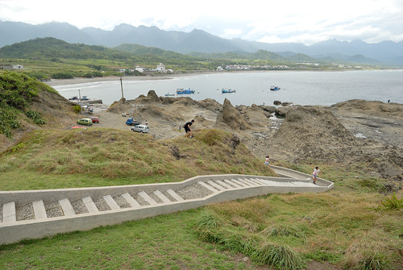 我們往高處走  飽覽這海天一色的美景  [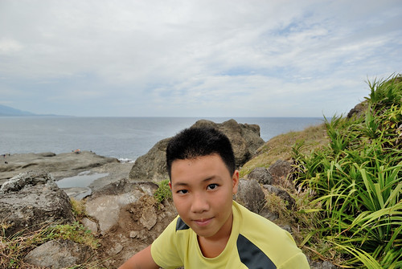](http://flickr.com/photos/33703965@N00/20753930511)也往滿佈的大大小小潮池和海蝕溝走 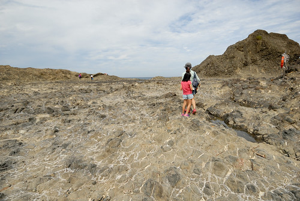 雖然或許時間來不對的未見潮間帶生物 但已是很令我們大開眼界的美麗地質景觀! 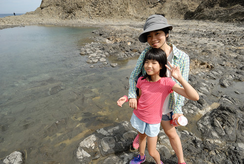 

這二年耳聞很兇也原安排傍晚或透早三仙台日出過後再來的比西里岸 在我們為了打發三點民宿可入房時間前而來到  這時間點來 果然遊覽車 遊客非常多  雖然羊群真的好可愛 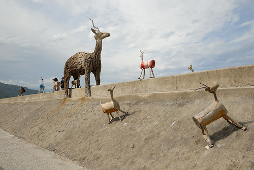 尤其藍天白雲襯著下 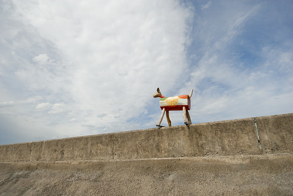 只是少了寧靜的地方就很不是我們家的菜... [ 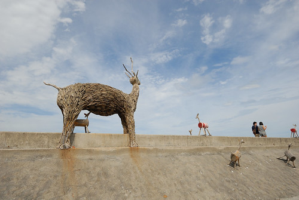](http://flickr.com/photos/33703965@N00/20126058273)據說比西里岸曾經牧羊 而且羊群還是每天上下班似的牧在三仙台那 只是觀光客如我們現在只能看到圈在小小圳溝木板上的羊 還有貪吃的羊為了不放過每一口觀光客餵食的食物 努力把頭探到線圈外 吃到食物卻也讓自己的頭進退兩難 讓人看的好心疼... 或許因為這一幕 自己才會出乎自己意外的沒那麼喜歡比西里岸吧!  而我們也沒停留太久 連大兔子也沒去找 更別說尋找一幕幕的幾米 只有在停車的地方剛好有這一幕 來個到此一遊照! 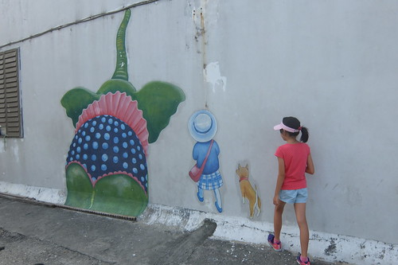 

這一晚我們住在台11線103.5K處的寂里雅嵐 很異國風味又氣派的建物 又如徹愛說的實在不像媽媽會選的民宿 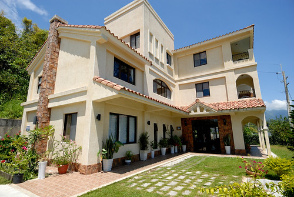 衝的就是民宿前面 僅有馬路之隔的沒有名字的沙灘(代表跟私人沙灘相去不遠啦)  同時對於外地工作多年後返鄉經營民宿的主人家 我往往有份好感 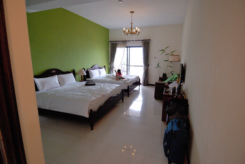 民宿不只漂亮 還非常寬敞 明亮與舒適 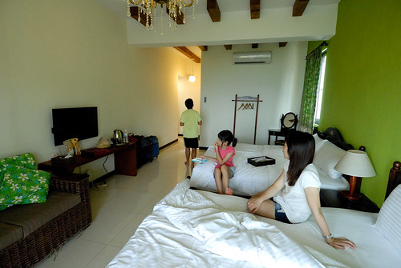 很哈沙灘的愛愛 對這樣的住海邊民宿愛的不得了  等不及爸媽休息過後帶她去沙灘 索性自己一人坐在房間陽台吃點心看海倒也怡然

 愛愛分秒計較的 媽媽約定的四點時間一到便拉著衝衝衝啦 [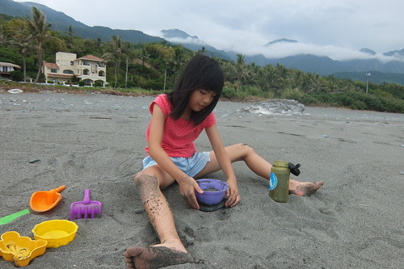](http://flickr.com/photos/33703965@N00/20560253549) 下午四點過後的太平洋岸 溫度很剛好 海風也很剛好 氣氛更是剛剛好  愛愛喊了好多次的 就是要這樣的沙灘最好玩 [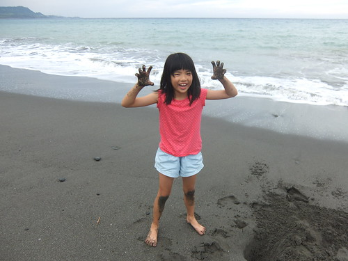](http://flickr.com/photos/33703965@N00/20720744286) 愛愛玩的手舞足蹈 [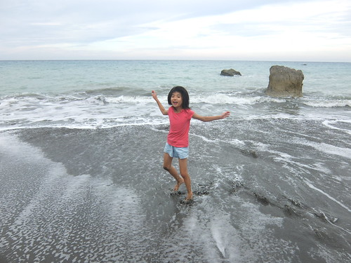](http://flickr.com/photos/33703965@N00/20560244659) 每個舉手投足 在阿母眼中都是好美的畫面 夏天的旅行 最期待與欣慰的就是這樣的畫面與時刻阿 [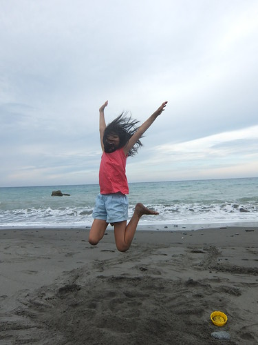](http://flickr.com/photos/33703965@N00/20746997315)

徹愛在沙灘上奔跑 跳遠 [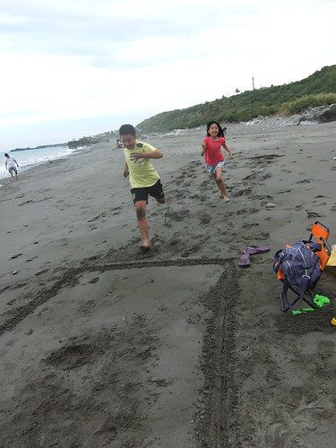](http://flickr.com/photos/33703965@N00/20560248509) 徹哥看似白費工但其實還蠻有想法的直搗螃蟹窩 [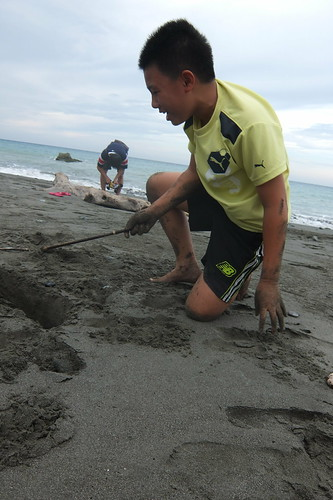](http://flickr.com/photos/33703965@N00/20720747096) 尋獲小螃蟹時 徹哥開心爆表也讓我們不敢再說他只是瞎忙  而再捕獲又更大些的螃蟹時 全家一起high翻了  我們輪流嘗試著抓螃蟹的方式  徹哥愛"挖"螃蟹但卻很怕"抓"螃蟹 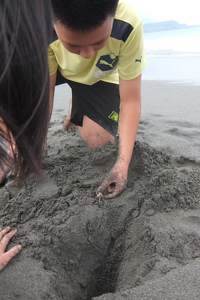 順利安全地的抓起螃蟹時 徹哥露出少年很久不見的笑到闔不攏嘴 [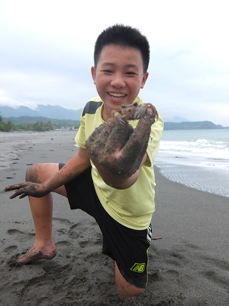](http://flickr.com/photos/33703965@N00/20560238759) 就這樣 我們從沙灘的這頭玩到另一頭 越玩越開心也越玩越遠 玩到浪填滿了下面畫面 我的包 我的手機落海了也都沒發現... [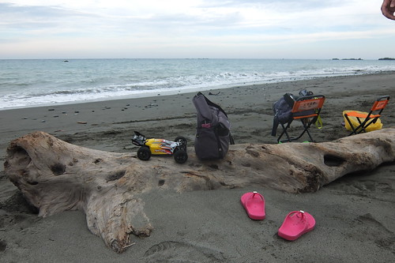](http://flickr.com/photos/33703965@N00/20559013198) 直到抓螃蟹高潮過後才發現 我的包好像漂浮在遠遠的海水裡 我衝百米的速度跑去 幸好什麼都還在 只是我的手機陣亡了...........Orz  

我與徹爸的腸疾一直反覆好好壞壞 我們痛下決心來個了斷 為了接下來二天還可以吃的海鮮大餐 這晚我們吃吐司裹腹 為難徹愛也陪著在小七簡單解決! 住海邊 當然不能放過太平洋的日出 本來雄心壯志且早早放話要去三仙台看日出 可惜颱風過後封園整修 殘念... 但也樂得輕鬆的連房門也不用出的在陽台看(其實這是我們家向來的看日出方式)  以前只有徹哥會陪著我看(雖然都是有看到一眼就回去睡覺 前後醒來不到3分鐘) 這回愛愛也長大到體會日出之美 總叮嚀我記得叫醒她看日出還會大呼"好美麗喔~' 看完日出 再睡回籠覺 直到八點過後起床吃早餐(旅行好多天總算可以在民宿內吃到美味早點) 早餐用畢 愛愛又開始問著可以去沙灘了嗎 雖然日頭赤炎炎 但其實阿母早就做好心理準備做這樣熱的事 [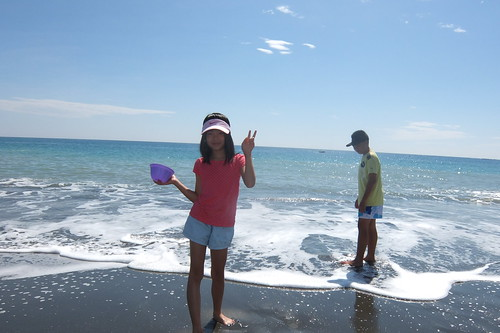](http://flickr.com/photos/33703965@N00/20720737326) 早上是天空藍的最美的時候  雲淡風輕 雖然太陽大但其實真的很舒服 [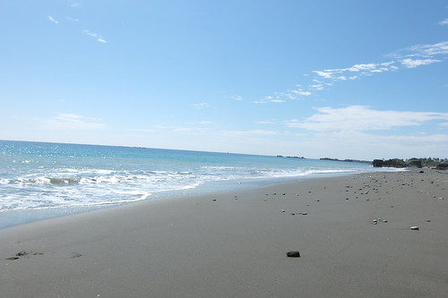](http://flickr.com/photos/33703965@N00/20560236479) 今早的浪比昨午的浪大  徹愛樂得踩浪 逐浪 [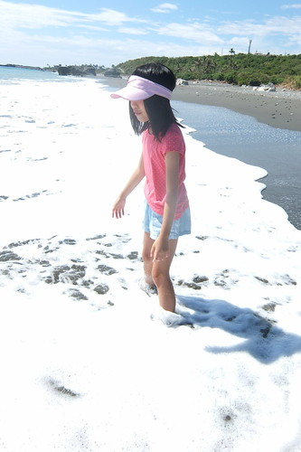](http://flickr.com/photos/33703965@N00/20746985705)   不同於抓螃蟹的另一種高潮 [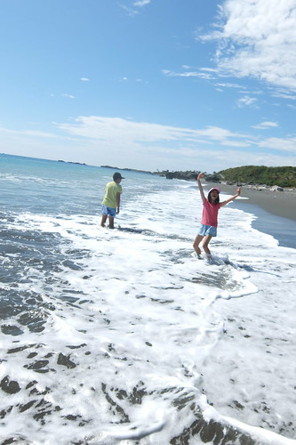](http://flickr.com/photos/33703965@N00/20737637402) 有時候愛愛會立定下來的凝視遠方許久  陶醉在自己的與天地合一  沉浸在無聲勝有聲的美好中 [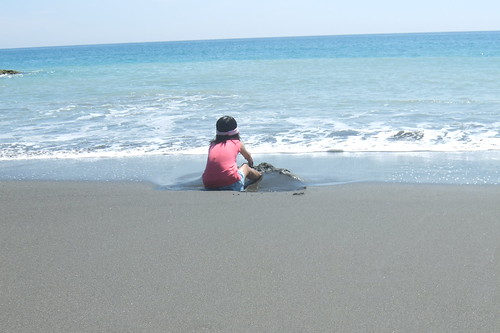](http://flickr.com/photos/33703965@N00/20753897971) 另一頭 徹哥則一如既往的埋頭苦幹於挖螃蟹 挖水壩  [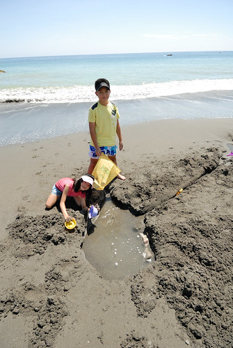](http://flickr.com/photos/33703965@N00/20746976815) 而徹爸則在他的遙控世界中悠遊飛翔 每個人有各自在海邊最喜歡做的事! (阿母有做什麼嗎? 阿母最喜歡的事就是看大家玩的開心阿)  我們依依不捨的玩到只剩11點退房前的沖洗時間 洗得一身乾淨與清爽後 繼續坐在民宿一樓大廳裡享受太平洋吹進來的涼風 很棒的住海邊阿~  大玩之後 我們預計往北的方向時順道在長濱的邱爸爸大嗑海鮮(長濱100前幾天電話就預訂不到 不用想) 沒想到不過11點初就怎樣也不接非預訂客 阿哩勒... 這回真的吃事不順阿!!! 我們只能在長濱街上簡單麵飯解決 而多出來的正午時間躲在小七喝涼 [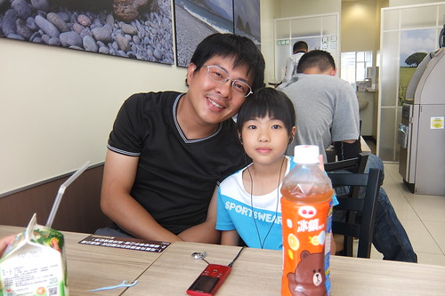](http://flickr.com/photos/33703965@N00/20753890681) 隨遇而安也是旅行中的學習  我們越懂得也就越能隨緣且自在 [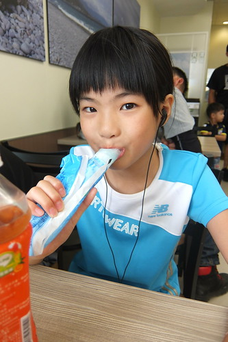](http://flickr.com/photos/33703965@N00/20720721776) 其實在我們11點離開前一晚的民宿時 接下來的具體目的地就是今晚的民宿 我們一樣填空似的沿途順遊喜歡的或曾看過介紹的景點地方 直到三點的再入宿  每次經過長濱 總忍不住在真柄繞進往老舍的那條路 (好棒的老舍 可惜已絕響 [blog.yam.com/hmchen1975/article/46737523](http://blog.yam.com/hmchen1975/article/46737523)) 看看金剛山 看看延伸向太平洋的這條小路與電線桿  不過據說長濱還有一條更厲害的路  我們尋(循)東13而來號稱媲美池上金城武大道的長濱金剛大道 [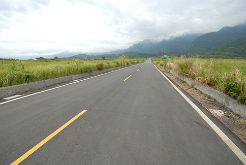](http://flickr.com/photos/33703965@N00/20746966835) 這裡的路一樣好直 看不見盡頭似  這裡看過去的金剛山更飄渺神秘 好似有武林高手隱身其中  而這裡有著池上曾經的寧靜與給我的感動 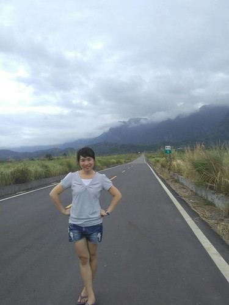 愛愛喊著好美 拿著她的相機拍不停  兄妹也出乎我意外的願意同我搞笑入境  來到路的另端 向著太平洋時 三人繼續陶醉不已 各自拍個不停 [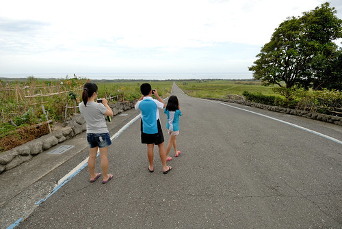](http://flickr.com/photos/33703965@N00/20720858746) 這樣的景色 當然要如在伯朗大道一樣跳一下 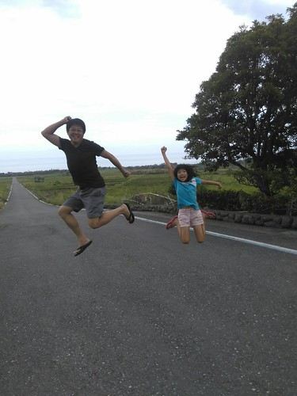 徹用他的手機抓到我們最棒的高度 拍下最生動的這一刻  跳功大進步的媽媽跟本來就很會跳的愛愛跳的超開心 [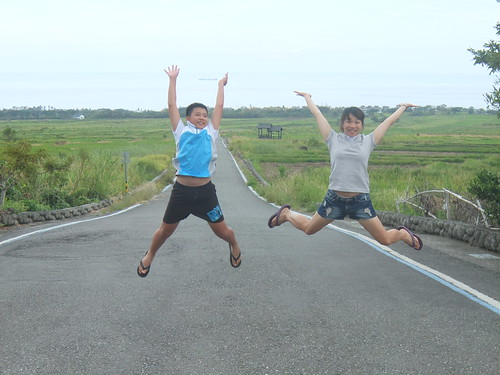](http://flickr.com/photos/33703965@N00/20560217279) 這一跳 又跳出我們的難忘美好回憶!  曾經我們在金剛大道一起跳跳跳.... 
