貼完這趟旅行待寫遊記的照片後才發現 這次的主題既是依日也是依住宿鄉鎮而分別 走條台東這麼多年 總算我們的行前準備越來越簡單 當下的行動力與心情也越來越隨心所至且隨遇而安 也許新奇與興奮度因頻繁造訪而略顯平淡 獲得的幸福卻益雋永~

第一天從嘉義出發後 我們單純的一路直驅南迴公路 探訪帶點謎樣的台東最南端村子南田村 第一次停留大武漁港 第一餐便飽食海鮮大餐 然後早早落腳太麻里  回味金崙的美好溫泉 [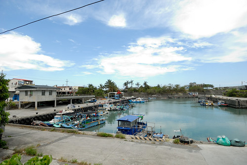](http://flickr.com/photos/33703965@N00/20559202348)

旅行開始在8/8蘇迪勒颱風走後的第一個週末 心裏不免有些擔心山區路況 以及連日不斷的豪大雨  [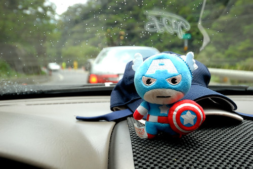](http://flickr.com/photos/33703965@N00/20124583734)幸好南迴公路只有因修路的小阻 [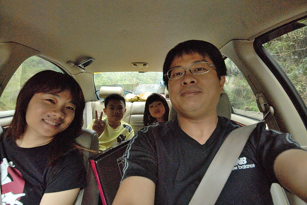](http://flickr.com/photos/33703965@N00/20124583054) 而好天氣也在我們進到台東後一直有著 [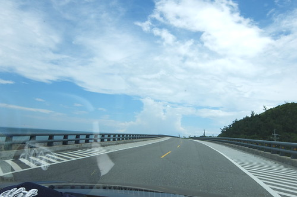](http://flickr.com/photos/33703965@N00/20124585824)這次走南迴公路到台東 刻意的在達仁鄉從台九右轉接台26 對於台26的好奇始於幾年前墾丁行 [blog.yam.com/hmchen1975/article/60557271](http://blog.yam.com/hmchen1975/article/60557271) 環繞恆春半島的海岸公路 卻因為生態及人為因素沒有完全貫通 從地圖上來看 是很妙的分成三段的路線  沒留意不會發現他們都是台26 [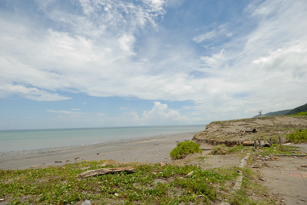](http://flickr.com/photos/33703965@N00/20720937256) 從台九轉台26一路向南到達台東最南的村落 南田村 這裏再向南 是台東與屏東的界限 也是阿朗壹古道由旭海端往北的出口處 [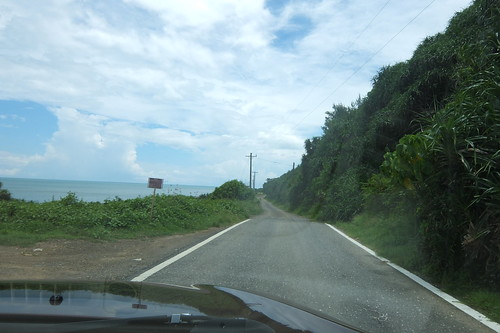](http://flickr.com/photos/33703965@N00/20737845392) 站在這段台26線的盡頭 向右看見的是屏東海灣 [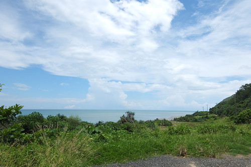](http://flickr.com/photos/33703965@N00/20754108911) 向左則是台東的海灣  但一樣都是太平洋其實沒差啦~ [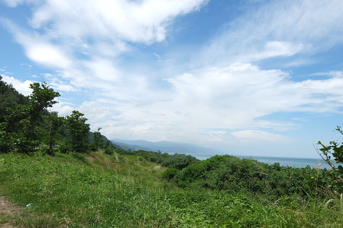](http://flickr.com/photos/33703965@N00/20720939646) 據說這裏的南田石很有名  但我們一顆也沒見著 [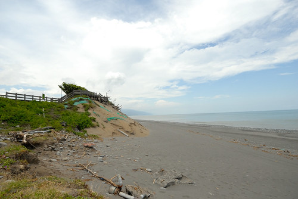](http://flickr.com/photos/33703965@N00/20126241953) 看見的反倒是颱風過後更顯凌亂的沙灘 [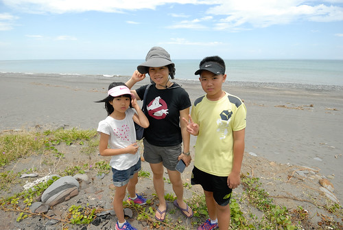](http://flickr.com/photos/33703965@N00/20124581354) 村落小小也很寧靜 於是我們在找不著網路上寫的石灘與觀海亭後 只是慢慢又安靜的開車經過又離去 

以前每次走南迴都是以台東市或回家為目的 匆匆的經過 第一次 我們在大武漁港停下來  第一次知道 原來這裏就有新鮮美味的海鮮可以吃 [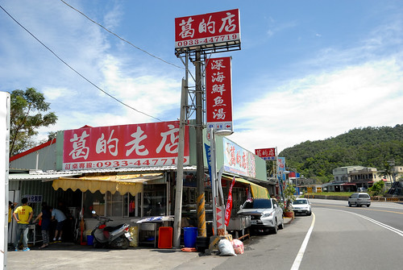](http://flickr.com/photos/33703965@N00/20126236523) 不用再像以前都要吃飽才上南迴或餓著肚子出南迴 [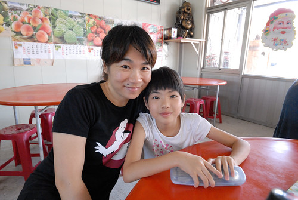](http://flickr.com/photos/33703965@N00/20720498146) 這裏的海鮮走粗俗大碗路線 [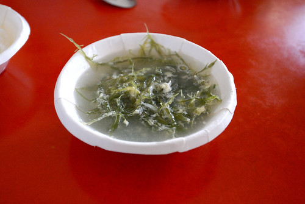](http://flickr.com/photos/33703965@N00/20754101681) 但不過鹹且美味可口 我們有喜歡 [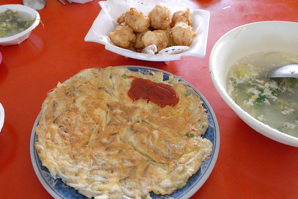](http://flickr.com/photos/33703965@N00/20126237463) 尤其那個依自己喜好挑選 論斤秤的鮮魚 真的太物超所值!!! (那個魚肉Q彈到捲起來 超棒的肉質 ) [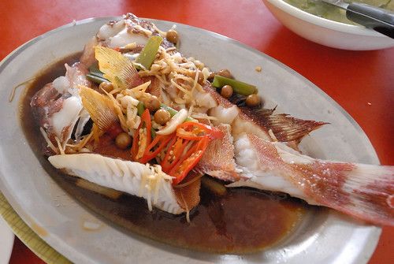](http://flickr.com/photos/33703965@N00/20747184125) 吃完海鮮後 我們在臨近的seven納涼休息 看著過往人車的來來去去 

本來打算順著台九沿途走訪大武彩虹街 不過因為太有私闖民街的不安感而作罷 而本來想再訪的向陽薪工坊 則因太多到多良車站的車潮也作罷 於是我們早早來到三點check-in的金崙 城堡溫泉 [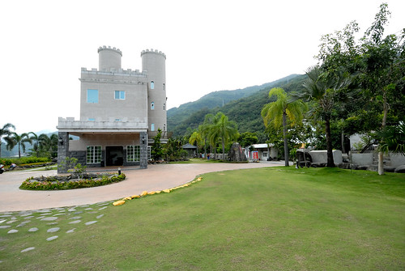](http://flickr.com/photos/33703965@N00/20559186388) 這是家豪華的民宿 室外環境大又美觀 [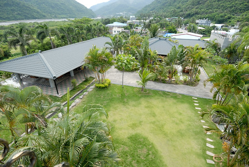](http://flickr.com/photos/33703965@N00/20126235433) 房間寬敞 也有室內浴池 [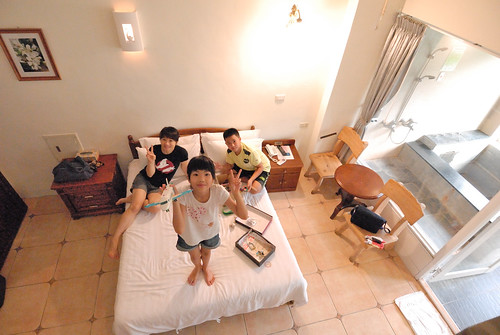](http://flickr.com/photos/33703965@N00/20737831432) 只是閣樓的小孩房 小人只有一開始大呼好酷卻越晚越不敢去睡 最後落得二老在這分床睡 [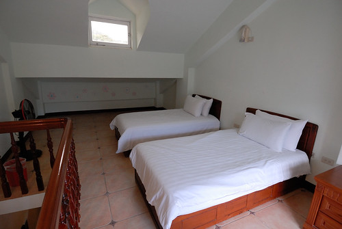](http://flickr.com/photos/33703965@N00/20126234153) 原本以為民宿坐擁的好視野 也因各種限制而打了好些折扣 [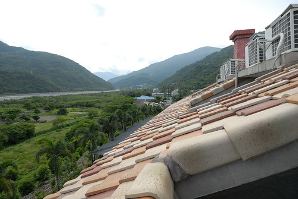](http://flickr.com/photos/33703965@N00/20737832782) [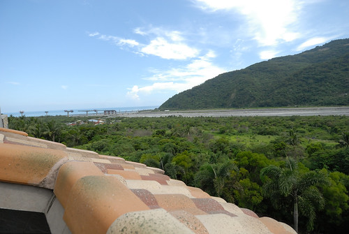](http://flickr.com/photos/33703965@N00/20559194440) 溫泉池不大但冷熱不同溫度的幾口池子加上包場獨享 就夠讓徹愛玩的開心 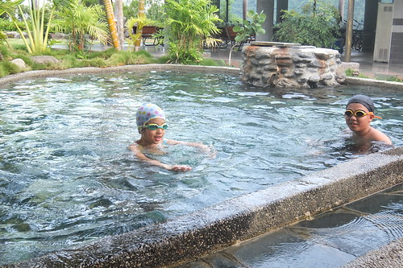 雖然也搞不太清楚 到底是在泡溫泉還是游泳 [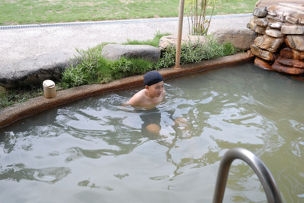](http://flickr.com/photos/33703965@N00/20754082841) 但炎夏裏 能泡到水中 小人都是很開心的! [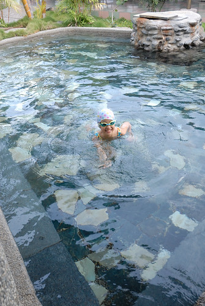](http://flickr.com/photos/33703965@N00/20737817222) 其實我很喜歡三年前住過 更深入進去的丹堤溫泉會館 [blog.yam.com/hmchen1975/article/47505144](http://blog.yam.com/hmchen1975/article/47505144) 我喜歡那的簡單 這回貪著離台九的近距離與好奇而訂了城堡 少了許多來到金崙該有的原味

民宿休息之後 我們來到金崙火車站尋找網路上偶然看見網友介紹的秘密沙灘 經當地人指路後 我們如宮崎駿神隱少女裏的那一幕 穿過隧道(其實是地下道)走到海灘 [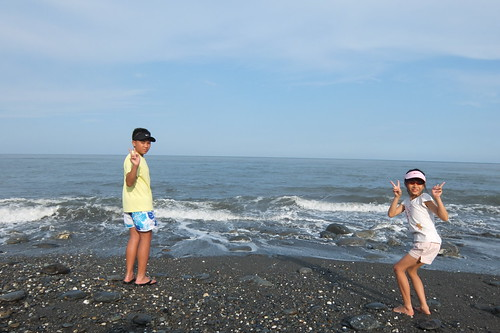](http://flickr.com/photos/33703965@N00/20126229023) 只是怎麼不是預期的"沙"灘!!!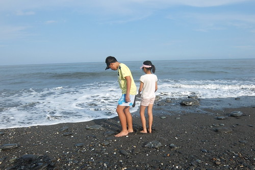](http://flickr.com/photos/33703965@N00/20747177005)驚訝的直碎念的徹愛還是試著玩起沙 [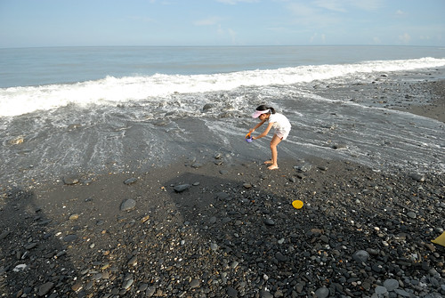](http://flickr.com/photos/33703965@N00/20754087681) 只是二人哀嚎 真的很難玩起來阿(舀不起沙)... [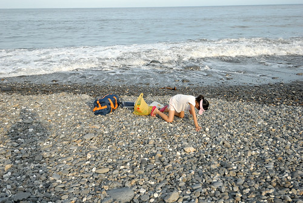](http://flickr.com/photos/33703965@N00/20747168225) 索性放棄 就堆堆石頭 沒魚蝦也好的作樂一番 [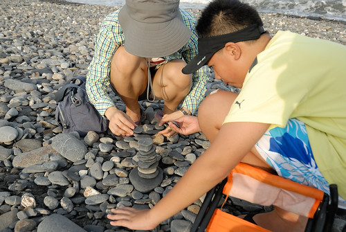](http://flickr.com/photos/33703965@N00/20559183078) 甚至就單純的看海 [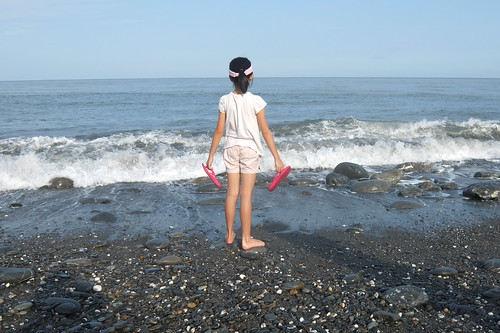](http://flickr.com/photos/33703965@N00/20126228393) 享受太平洋的視野與吹來的涼風 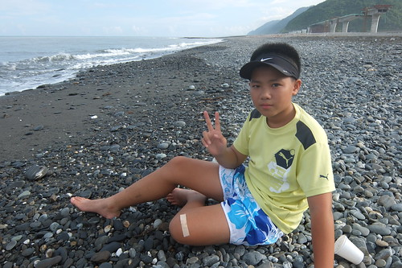 同時間 徹爸則是不受影響的 在海灘盡情飛奔她的遙控車與直升機 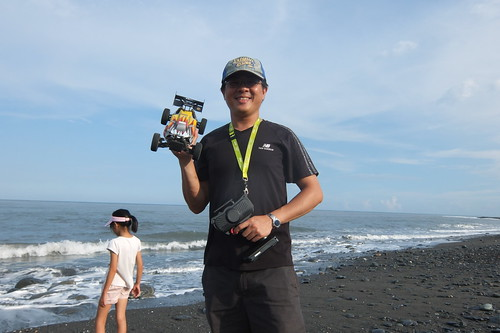 享受 開心的很~ [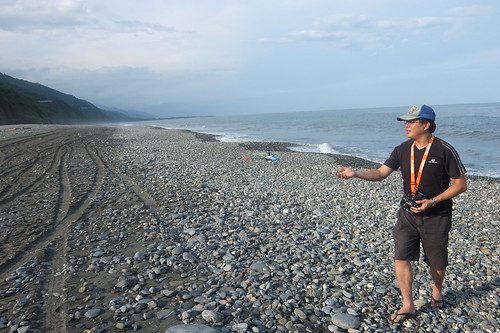](http://flickr.com/photos/33703965@N00/20754090681)

雖然金崙海灘一如每個花東的不知名沙灘那樣靜謐 有著朦朧美麗的海岸線風景 [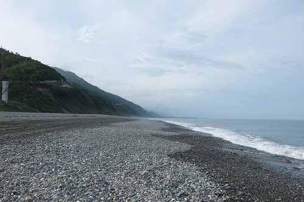](http://flickr.com/photos/33703965@N00/20737830892) 但視線另一頭看見的卻是進行中的南迴公路拓寬工程 [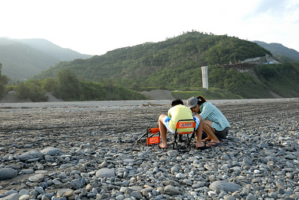](http://flickr.com/photos/33703965@N00/20126220123) 私心的我 喜歡本來彎彎曲曲的南迴 小小的路 配上剛好的車潮與車速還有完全美麗的山林[ 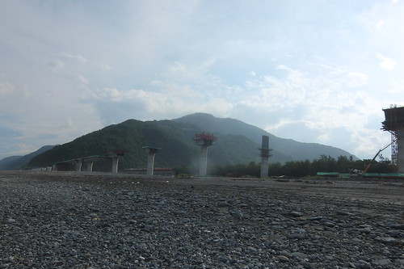](http://flickr.com/photos/33703965@N00/20720925206)話說我還是喜歡金崙這個偏避村落 但這裏卻食在考驗 即時是網路上被大推的牛肉麵店  我們也只能圖個不餓肚子.... 這恐是日後再歇金崙的最大考量 [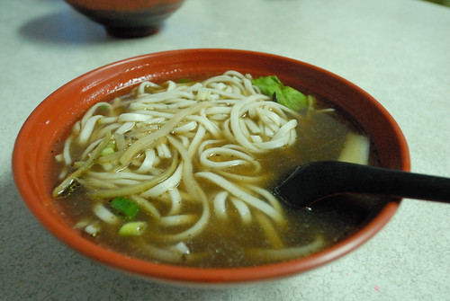](http://flickr.com/photos/33703965@N00/20124556244)
