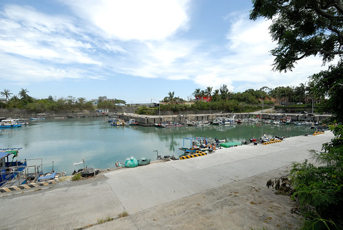

貼完這趟旅行待寫遊記的照片後才發現 這次的主題既是依日也是依住宿鄉鎮而分別 走條台東這麼多年 總算我們的行前準備越來越簡單 當下的行動力與心情也越來越隨心所至且隨遇而安 也許新奇與興奮度因頻繁造訪而略顯平淡 獲得的幸福卻益雋永~

第一天從嘉義出發後 我們單純的一路直驅南迴公路 探訪帶點謎樣的台東最南端村子南田村 第一次停留大武漁港 第一餐便飽食海鮮大餐 然後早早落腳太麻里  回味金崙的美好溫泉 

旅行開始在8/8蘇迪勒颱風走後的第一個週末 心裏不免有些擔心山區路況 以及連日不斷的豪大雨  幸好南迴公路只有因修路的小阻  而好天氣也在我們進到台東後一直有著 這次走南迴公路到台東 刻意的在達仁鄉從台九右轉接台26 對於台26的好奇始於幾年前墾丁行 [blog.yam.com/hmchen1975/article/60557271](http://blog.yam.com/hmchen1975/article/60557271) 環繞恆春半島的海岸公路 卻因為生態及人為因素沒有完全貫通 從地圖上來看 是很妙的分成三段的路線  沒留意不會發現他們都是台26  從台九轉台26一路向南到達台東最南的村落 南田村 這裏再向南 是台東與屏東的界限 也是阿朗壹古道由旭海端往北的出口處  站在這段台26線的盡頭 向右看見的是屏東海灣  向左則是台東的海灣  但一樣都是太平洋其實沒差啦~  據說這裏的南田石很有名  但我們一顆也沒見著  看見的反倒是颱風過後更顯凌亂的沙灘  村落小小也很寧靜 於是我們在找不著網路上寫的石灘與觀海亭後 只是慢慢又安靜的開車經過又離去 

以前每次走南迴都是以台東市或回家為目的 匆匆的經過 第一次 我們在大武漁港停下來  第一次知道 原來這裏就有新鮮美味的海鮮可以吃  不用再像以前都要吃飽才上南迴或餓著肚子出南迴  這裏的海鮮走粗俗大碗路線  但不過鹹且美味可口 我們有喜歡  尤其那個依自己喜好挑選 論斤秤的鮮魚 真的太物超所值!!! (那個魚肉Q彈到捲起來 超棒的肉質 )  吃完海鮮後 我們在臨近的seven納涼休息 看著過往人車的來來去去 

本來打算順著台九沿途走訪大武彩虹街 不過因為太有私闖民街的不安感而作罷 而本來想再訪的向陽薪工坊 則因太多到多良車站的車潮也作罷 於是我們早早來到三點check-in的金崙 城堡溫泉  這是家豪華的民宿 室外環境大又美觀  房間寬敞 也有室內浴池  只是閣樓的小孩房 小人只有一開始大呼好酷卻越晚越不敢去睡 最後落得二老在這分床睡  原本以為民宿坐擁的好視野 也因各種限制而打了好些折扣   溫泉池不大但冷熱不同溫度的幾口池子加上包場獨享 就夠讓徹愛玩的開心  雖然也搞不太清楚 到底是在泡溫泉還是游泳  但炎夏裏 能泡到水中 小人都是很開心的!  其實我很喜歡三年前住過 更深入進去的丹堤溫泉會館 [blog.yam.com/hmchen1975/article/47505144](http://blog.yam.com/hmchen1975/article/47505144) 我喜歡那的簡單 這回貪著離台九的近距離與好奇而訂了城堡 少了許多來到金崙該有的原味

民宿休息之後 我們來到金崙火車站尋找網路上偶然看見網友介紹的秘密沙灘 經當地人指路後 我們如宮崎駿神隱少女裏的那一幕 穿過隧道(其實是地下道)走到海灘  只是怎麼不是預期的"沙"灘!!!](http://flickr.com/photos/33703965@N00/20747177005)驚訝的直碎念的徹愛還是試著玩起沙  只是二人哀嚎 真的很難玩起來阿(舀不起沙)...  索性放棄 就堆堆石頭 沒魚蝦也好的作樂一番  甚至就單純的看海  享受太平洋的視野與吹來的涼風  同時間 徹爸則是不受影響的 在海灘盡情飛奔她的遙控車與直升機  享受 開心的很~ 

雖然金崙海灘一如每個花東的不知名沙灘那樣靜謐 有著朦朧美麗的海岸線風景  但視線另一頭看見的卻是進行中的南迴公路拓寬工程  私心的我 喜歡本來彎彎曲曲的南迴 小小的路 配上剛好的車潮與車速還有完全美麗的山林話說我還是喜歡金崙這個偏避村落 但這裏卻食在考驗 即時是網路上被大推的牛肉麵店  我們也只能圖個不餓肚子.... 這恐是日後再歇金崙的最大考量 
