小學生明天就是返校日 即將開學了 從徹哥六月中畢業開始放假 媽媽感覺這個夏天的暑假過好久! 七月我與徹爸一直巴望著八月旅行的快來 而八月從一開始的徹愛回嘉義住八天 接著全家一起去花東玩六天 然後咻的一下 怎麼旅行就沒了... 我們彷若灰姑娘 快樂的時光總是過的特別快而時間一到又立馬被打回原形 只是我們的旅行充電 不管有沒有充飽都只能再期待半年之後的寒暑假!

我們難得的間隔了一年才再去花東 以致雖然名為環島但我卻完全捨不得分給花東以外的其他地 尤其原本頭興興說要安排行程的徹愛 最後卻因每天貪於不務正業的玩而拱手把決定權全交回媽媽手上 我便不客氣的完全無視小人最愛的墾丁 把六天五個晚上的吃喝玩睡全放在花東 雖然還是會盡量安排沒去過的新景點 但其實呼吸那的空氣 看那的山與稻 還有太平洋吹來的風 就是花東旅行最大的滿足! 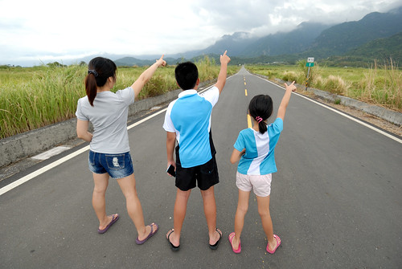

安排行程時 一如往常先決定要住宿的鄉鎮 某種原因一定要的瑞源(鹿野),玉里外  加上想多親近太平洋的成功與石梯坪 以及最後二週前才在屏東旭海與台東金崙反覆猶豫而決定的金崙 然後直到行前再如填空般 填上點 連成線 串成一個環

8/13(四) 嘉義 -> 台東大武漁港(午餐) -> 金崙海灘 -> 宿金崙 城堡溫泉民宿 8/14(五) 東大圖書館 -> 台東美術館 -> 原生植物園(午餐) -> 玉龍泉生態步道 -> 春一枝鹿野76誠信商店 -> 宿鹿野 大原日和 8/15(六)  關山親水農場冰淇淋 -> 南安瀑布 -> 玉里璞石藝術館 -> 宿玉里 智嵐雅居 8/16(日) 璞石藝術館 -> 璞石皂房 -> 玉長公路 -> 烏石鼻 -> 比西里岸 -> 沙灘 -> 宿成功 寂里雅嵐 8/17(一) 長濱(午餐) -> 金剛大道 -> 石門 -> 石梯坪潮間帶 -> 宿豐濱 石梯33號 8/18(二) 豐濱月洞 -> 花蓮市(午餐) -> 台北

安排時的八成刻意 加上執行時二成的人禍與天意促成(我跟徹爸旅行前就開始鬧了一週多的拉肚子) 不小心 六個天竟然都玩到水! 而且還都不一樣的水!! 其實水哪有不一樣 只是不同環境帶來不同的樂趣 第一天的金崙海灘 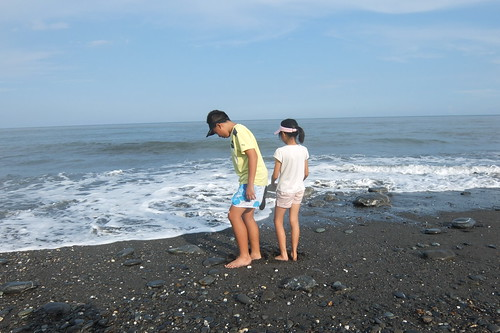 第二天的鹿野玉龍泉生態步道湧泉 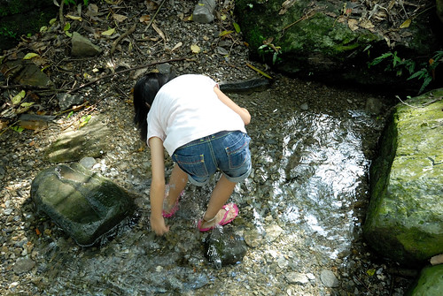 第三天的玉里南安瀑布 時間正好讓我們拎了池上便當來這野餐 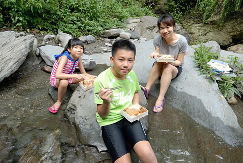 第四天的成功沙灘 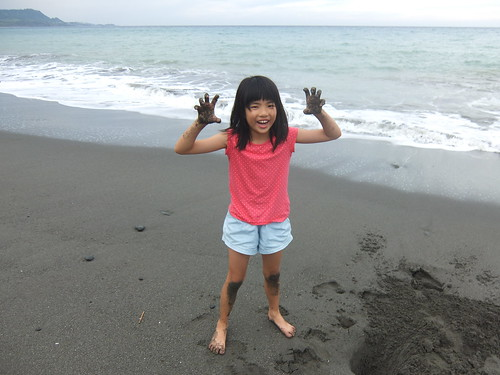 細緻的沙灘是徹愛的最愛 傍晚玩 隔日大熱的早上也玩 直到退房前一刻才不得不離開 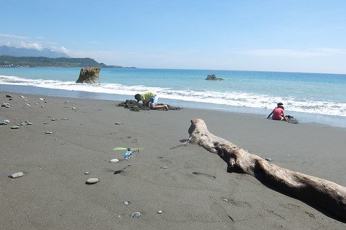 第五天的花蓮石梯坪 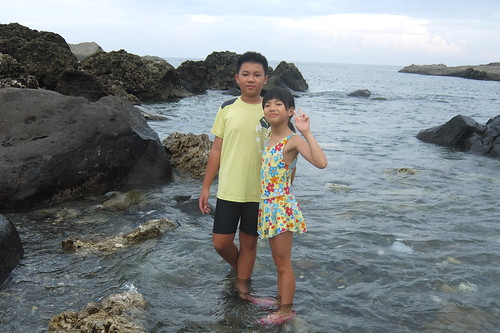 一樣面對著太平洋 但潮間帶的戲水趣又不同於沙灘 旅行最後的第六天早上 當然非得要去玩最後一攤才甘願回家 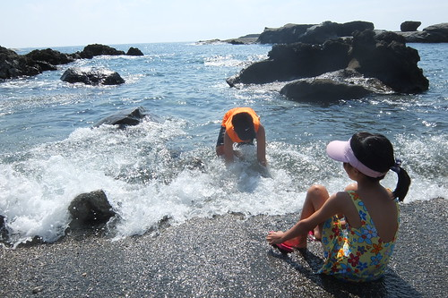

這次旅行其實有刻意安排住的舒適點 但因我與徹爸二人常半夜鬧肚子 加上有老闆剛好不在家 以及難以預期的不確定性 以致還蠻想念自己的家跟床 但體驗越多的民宿 卻也讓我們更能勾勒出(夢想)我們喜歡(想要)的民宿模樣

第一晚的金崙 城堡溫泉民宿 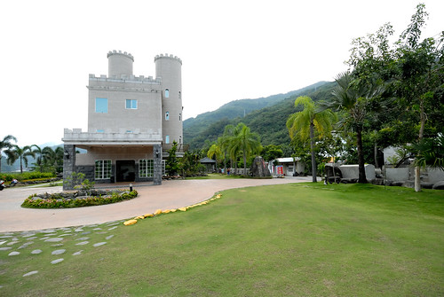 漂亮且經營的就如渡假村 其實就如徹愛說真不像媽媽會選的民宿 而媽媽選擇只是因為想讓徹愛泡個舒適溫泉 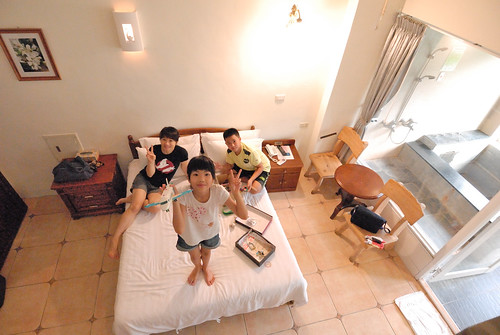 第二晚 鹿野瑞源村的大原日和 這是我們家吃很愛的南島秧滿田夫婦今年甫開張的民宿  我們很不好意思的無償被接待 雖然早上的廚房真的好曬 但綠油油稻田的視野真的好棒 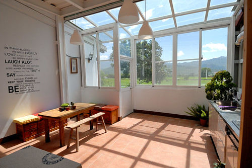 第三晚的智嵐雅居 不同以前住在玉里鎮上或安通溫泉區 這次選擇玉里鎮北邊半山腰上的智嵐雅居 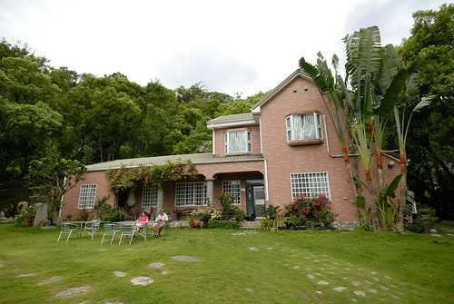 民宿非常的雅致且具禪意 原本想藉這機會好好跟民宿主人請益聊聊的 可惜主人剛好有事上台北不在家 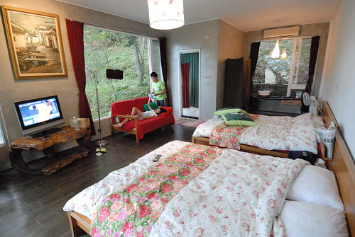 第四晚 成功鎮台11線上的寂里雅嵐 真的浪漫華麗 很有海邊渡假的氣氛 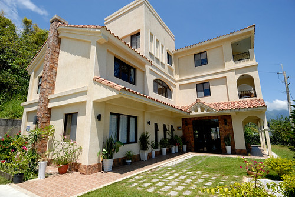 雖然一樣不太像媽媽會選的菜 但衝的就是民宿對面的無名沙灘 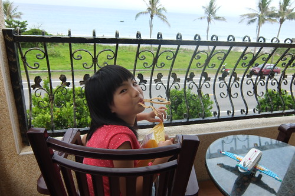 第五晚 花蓮石梯坪風景區內的石梯33號民宿 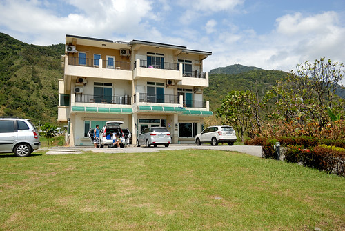 門前的無敵海景 加上一切都剛好的房子 擺設 主人 早餐 第一次聽徹爸說 這就是他夢想中民宿的樣子 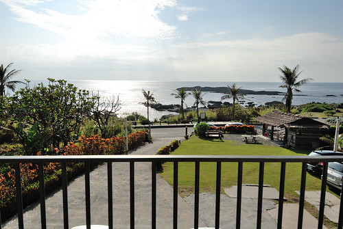

我們的旅行似乎就依著玩水與住宿 而切成三部分 剩下的一部份就是 拜訪我們沒去過卻意外驚喜的地方 如台東美術館 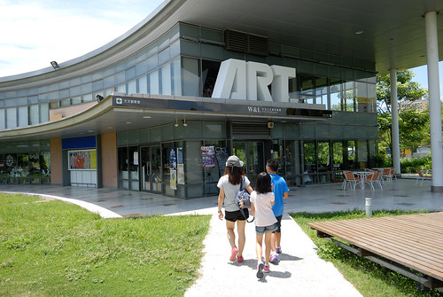 許諾徹愛的讓他們不趕時間的在璞石藝術館隨心做石頭畫 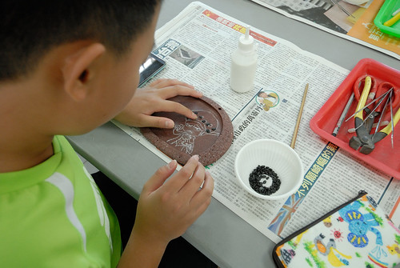 還有以前從沒停留過的台11線上奇岩怪石景觀逐一踩踏 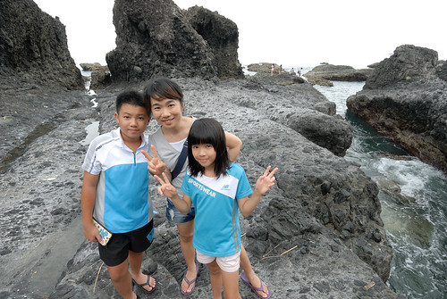 每次的大旅行時 我與徹爸都會驚覺"小孩怎麼又長大了" 這回旅行 徹愛常在車上跟著音樂大聲哼唱著喜歡的流行歌(聽說那個TF boy在小人間很紅 ) 讓父母我們不禁回想我們好久以前的青春  感嘆不知不覺已到小孩的青春 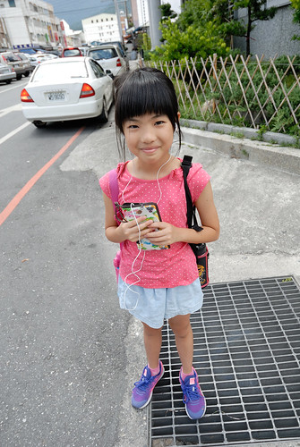 旅行的每天 我們一起吃三餐  一起打牌打發晚上時間 一起早早上床睡覺 還有一起聽彼此說的話 吐別人的槽  笑其實笑點很低的笑話 難怪愛愛說這次旅行跟爸爸感情變好好 好愛這樣跟爸爸在一起 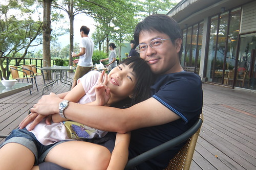 雖然"又"去花東  但我們旅行的意義就在一家子這樣一起的走在花東縱谷間 濱海線上...
