第二天早上離開金崙後 我們一心就等著中午的原生植物園野菜鍋 所以比較像是填滿時間 在經過台東市時 順道去東大知本校區還有台東美術館走走 意外的  這二處都有著好風景,好涼風,好愜意~

這二年舉辦的最漂亮圖書館等活動票選  都可以看到台東大學知本校區的圖書館冊上有名 這回 我們順著南往北的路來眼見為憑 

大門口換證進入校園後 就可以看見不遠處的圖書資訊館 不過其實若不是我先前網路上看過照片 一片綠意中 也不是太容易發現那兒躲著一棟建築物  雖然明白現代所謂的綠建築 因為建材與設計 造價都不斐 而很多的綠建築在我們看來也只有"財大氣粗"與"只是潮流"的觀感 但不得不說 東大圖書館真的綠的很漂亮 [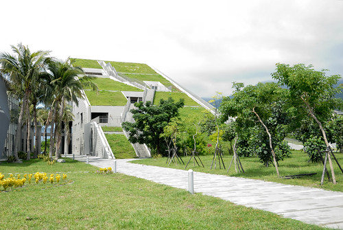](http://flickr.com/photos/33703965@N00/20559167580) 我們雖然沒能入館 感受綠與書的結合 但光是走在走廊上 沿著階梯而上(下) 便能感受如果身在其中的幸福  圖書館的正方是鏡心湖  沒有建築物阻擋的平緩好視野 果然讓人靜心  來到二樓的走廊  感覺這的溫度比在太陽下低五度以上  考量各季節的陽光風向 調整建築走道與開窗 產生對流 讓夏天時能捕捉天然的涼意 冬天時能增加熱源且避免寒意 我覺得這是綠建築最需具備的功能 [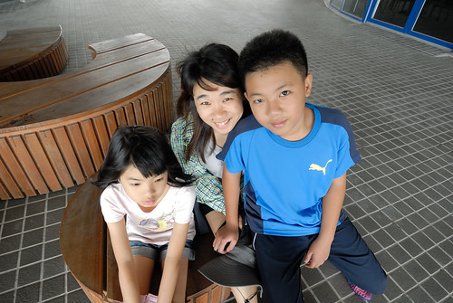](http://flickr.com/photos/33703965@N00/20560397659) 涼風吹得我們好舒服 愛愛甚至不想走  念著要一直坐在這 [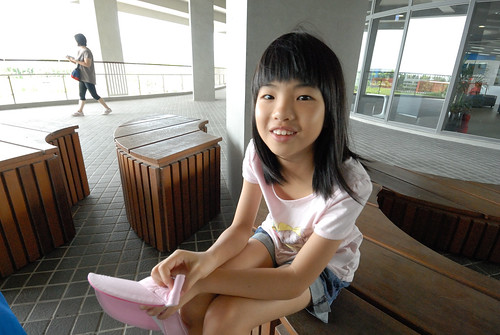](http://flickr.com/photos/33703965@N00/20560396629) 果然貪涼的愛愛躲在一樓二棟建物間納涼 不願意跟著我們烈陽下走好幾層樓梯上圖書館頂樓平台 [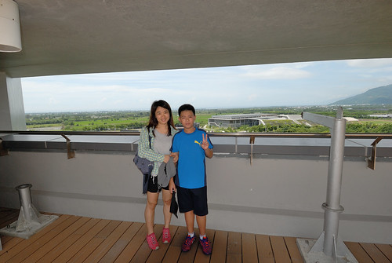](http://flickr.com/photos/33703965@N00/20720905596) 有屋頂的頂樓 風更涼快 [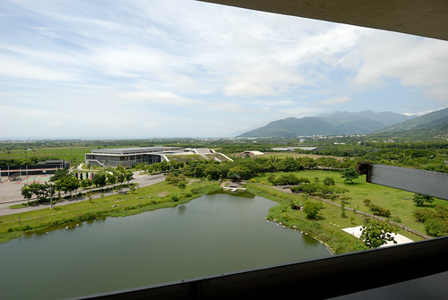](http://flickr.com/photos/33703965@N00/20124536084) 而且視野更好 連太平洋都清晰可見 [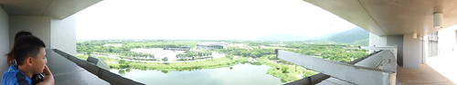](http://flickr.com/photos/33703965@N00/20747157795) 我們邊走下階梯邊環視四週建物  打心底讚嘆真是個美麗校園  徹哥對這樣寬廣美麗的學校 嚮往不已阿~  

接著我們來到台東美術館 這是出發前幾天看見剛剛好生活女主人分享的照片後期待想來的地方  衝的不是名為"美術"的藝術欣賞  而是為了其實是個大創作的戶外空間 一進到園區 看到有階梯通往樹上  徹愛不多想便急急爬上 [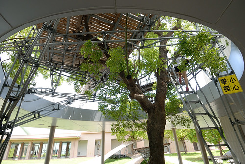](http://flickr.com/photos/33703965@N00/20124532674) 興沖沖上去後 愛愛才大喊他最怕下這種階梯了 可惜後悔也來不及  上面儼然就是一個樹屋概念的平台 [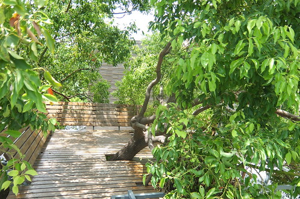](http://flickr.com/photos/33703965@N00/20124542184) 很適合圍坐在這裏的秘密基地阿 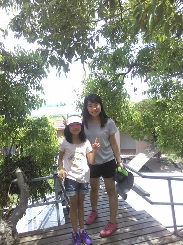 突然間 聽到徹爸喚我們的聲音  發現對面徹爸所在的地方也很有趣阿兄妹倆就又興沖沖的趕過去  或坐  或躺  很有趣又舒服的大型藝術創作 [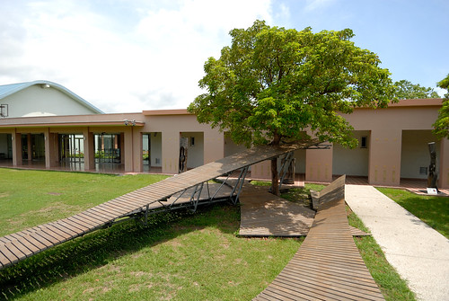](http://flickr.com/photos/33703965@N00/20720885776) 而且至高點視野極佳 園區全景盡入眼簾當我們還沉浸在當下的享受中 徹爸又早先一步發現下一個有趣  這次換像是搭船  忍不住往船頭走  想像鐵達尼號的傑克與蘿絲站在船艉迎著風 [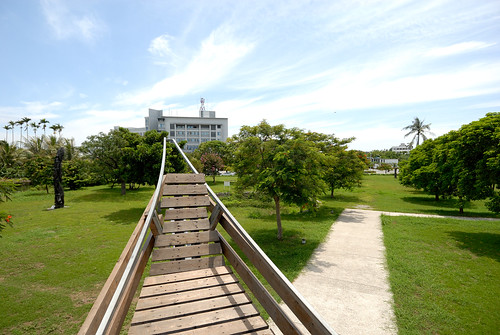](http://flickr.com/photos/33703965@N00/20559148740) 徹爸說別小看這 站在上面也是會忍不住發抖的 [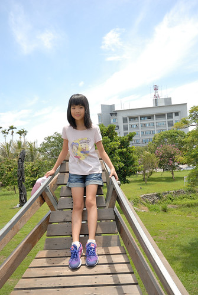](http://flickr.com/photos/33703965@N00/20560380909) 徹愛嘻嘻哈哈說"一點都不恐怖阿!"  但阿母真的也發抖了.... 好吧! 承認二老已過了當傑克與蘿絲的青春了 [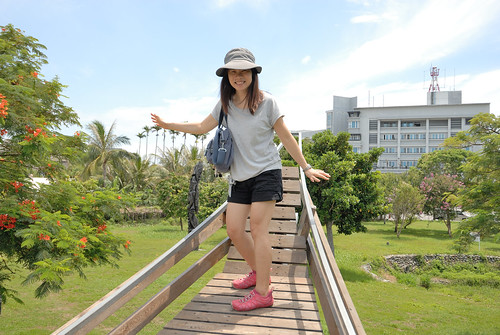](http://flickr.com/photos/33703965@N00/20720879096) 台東美術館的戶外空間本身就是一個展覽場 自然而然的就融在自然與藝術當中 讓人心情放鬆又愉快  一路欣賞著草地 走廊上的各個陶瓷藝術品 我們要進美術館瞧瞧了  當初吸引我想到台東美館的就是這片牆! [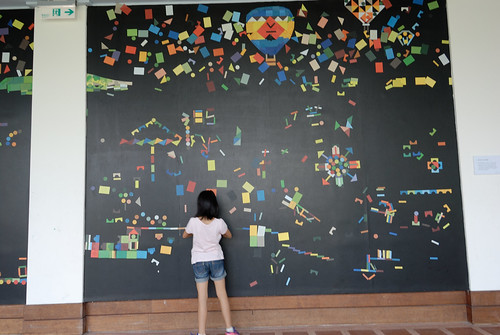](http://flickr.com/photos/33703965@N00/20737779662) 徹愛有些躍躍欲試 但又不好意思破壞原先的美麗創作 [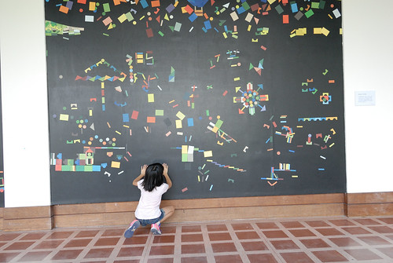](http://flickr.com/photos/33703965@N00/20560376719) 牆的對面放著幾張長板凳 我們坐在這休息好久 看著 等著徹愛的玩拼圖 也享受美術館的寧靜與美好 [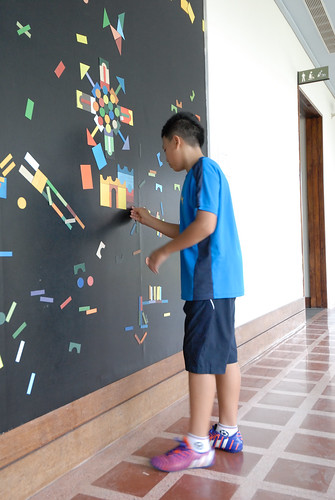](http://flickr.com/photos/33703965@N00/20737778652) 館內的展覽廳並不是太大 正在展出的朱銘美術作品主題也不是那麼容易讓小人看明白 很快就走完一圈 反倒是來到駐館藝術創作區(店)時 店裡的許多小物令我們愛不釋手 徹愛買了明信片 寫下/寄出他們在台東的好心情 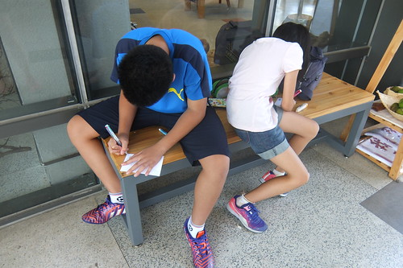 徹爸買的小鳳梨 [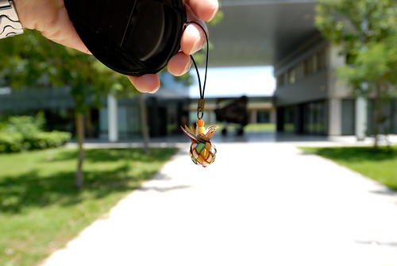](http://flickr.com/photos/33703965@N00/20126179623) 徹愛提議要買的在地小農檸檬 [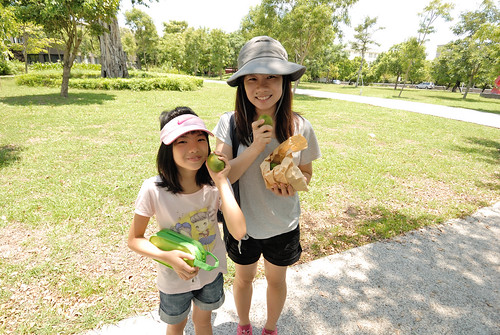](http://flickr.com/photos/33703965@N00/20124501534) 很棒的一個小而美的美術館!  一切這樣緩與靜 [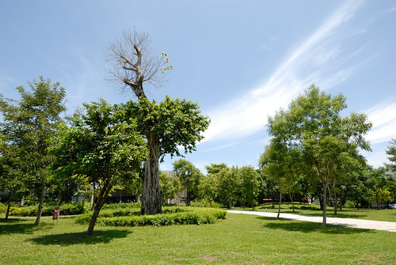](http://flickr.com/photos/33703965@N00/20560373809) 美學就在草木 環境中不著痕跡的表現著! [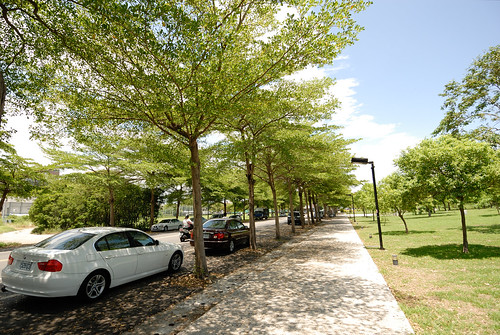](http://flickr.com/photos/33703965@N00/20559138888)

離開台東市 我們帶著興奮期待繼續往北的方向開 睽違一年的野菜涮涮鍋我們又來啦~  講真的! 吃到還蠻不好意思跟台東人說我們去原生吃野菜鍋 因為這裡真的越來越是觀光客的標準行程之一 我們就真的很喜歡喝湯 又真的很喜歡這裡的野菜與涮鍋 所以才一來再來 變成我們花東旅行的SOP [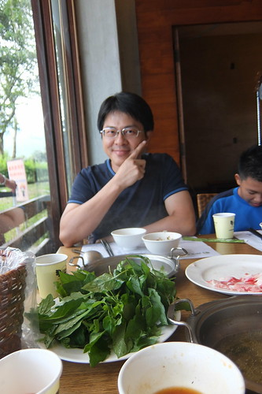](http://flickr.com/photos/33703965@N00/20559124348) 我們每次都飽食的意猶未竟阿~ 
