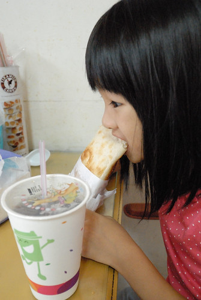
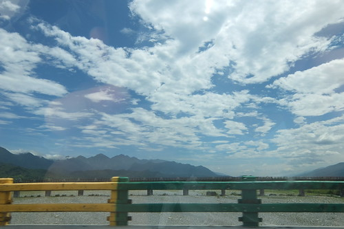

一直很喜歡玉里這個小鎮 也一直沒忘記曾經承諾徹愛讓他們再去做石頭畫 而且要時間多一些的慢慢做那種 第三天早上離開關山後 我們拎著池上便當來到玉里 停留一日一夜 好好休憩在最喜愛的小鎮也讓徹愛做了滿意不得了的璞石畫

一來打發璞石館下午一點半開館前的時間 再者繼續累積我們第三日的玩水目標 我們剛好拎著正午時分經過池上買的全美行便當來到南安瀑布野餐加戲水 

南安瀑布其實地屬花蓮卓溪鄉 但就在玉里隔壁所以一直被當作(玉里)的景點  常常都是冬天到玉里的我們 一直沒來過南安瀑布 其實就在我們來過好幾次的玉山國家公園南安遊客中心上來一點點而已 (已經是四年前的紀錄了 [blog.yam.com/hmchen1975/article/37437494](http://blog.yam.com/hmchen1975/article/37437494))  隱於山徑裏的瀑布 讓路過的我們不曾留意停下腳步過 但還真是炎夏裡的避暑戲水好去處  徹哥用手機拍的這一張 復古色彩超有意境 一種記憶中 家庭相簿裡都會有的一張攝於烏來瀑布或是XX水庫前的全家旅行照片  而基於安全或環境等等因素考量  瀑布當然有用欄杆圍著 所以我們是不守法但很順應民情的鑽過開了很大洞的欄杆後而親水  水好清 好涼 人踩到水裏後就不想起來了  每次來到這樣的溪河戲水 兄妹就是認真的找漁蝦 築水壩  堆石頭還有往更冰的水裏去  愛愛這二天碰到水就特興奮也胃口特好的大嚷肚子餓要吃便當嚕  其實她應該只是喜歡野餐的感覺  不過冷掉之後的池上便當真的(才)好吃  小鳥胃的愛愛不自覺就吃掉大半盒  帶著便當來溪裏野餐  難得的體驗 真是只有阿母想的出的點子 哈哈哈~ 

躲過最熱的二點後 我們回到玉里鎮上 來到兄妹念念不忘的璞石藝術館 [blog.yam.com/hmchen1975/article/72099183](http://blog.yam.com/hmchen1975/article/72099183) 雖然DIY產品模板跟去年初不一樣 但徹哥很熟手的立刻開始動工 這二年很迷航海王的他 主題選定他最愛的角色'羅'  只是這線條真的很細耶...我實在好奇(擔心)要怎麼用石頭做出來阿  不過因為答應讓徹哥好好做一幅他想做的石頭畫 我們只能靜觀其變  另一邊的愛愛則一如每次藝術創作時的叨念"我不知道要畫什麼? 我不會畫耶.." (這部份,愛妹活在哥哥陰影下)  然後在很多的鼓勵與建議後 才小心翼翼加小心肝的做其實很有她自己風格的小巧創作  尤其愛愛不同於哥哥的用色 讓作品總有一種素雅但溫暖的感覺  在志工老師的協助下 很快的愛愛就完成了作品  同時間 二個小時過去 徹哥的羅離完成還有很長的路要走 不過看著徹哥用一粒粒石頭勾勒出羅的線條 讓人不得不佩服這小子難得的專注與執著  徹哥勾勒好主角的線條後也剛好到閉館的四點半時間 隔日早上九點的開館時間 我們準時報到繼續徹哥的作品  繼前一日的一下午 徹哥再花了一上午 完成他的作品 99%的自己來 而大人們看到他的耐性也忍不住適時的出手成全阿  徹哥最後的成品! 其實璞石畫大部分都是寫意寫景 看到一個這樣卡通的作品 志工老師們不知道心裏有什麼感想... 呵呵  不過徹哥對於他的作品 雖然自覺還有可以改善的小地方但可滿意喜歡的不得了 至於像不像 就視觀賞者的年齡還有對航海王的著迷程度而異嚕 愛妹就佩服他哥佩服的不得了~  不過愛妹在這個上午也再完成了一個小文鎮的創作 這一回做了二個作品算是彌補她上回沒有做的遺憾  話說我們在璞石館的下午與上午都沒有遇著也來DIY的遊客 除了幾位參觀者 或許這樣的DIY對於大部分的觀光客來講實在太花時間 很難排進三或四天要上山下海還要吃遍美食的花東旅行中 我們心裏有些遺憾 這樣好的地方這樣的冷清 但也很慶幸越來越熱鬧的花東 還有可以這樣慢與靜的地方...

玉里的這一晚 我們住在以往不曾留意過的北邊山坡上  智嵐雅居  非常文雅的名字 也非常雅致禪意的民宿  戶外跟房間都非常寬敞乾淨  而且非常的舒適  讓人放鬆  唯一可惜的是主人剛好有事到台北 無法親自招待且隔日沒有民宿早餐可食  第二天早上我們只能帶著女主人送(自己做)的小扇子與遺憾下山吃早餐 原先決定來個不同以往到玉里的住宿選擇 為的就是想多個機會跟不同民宿主人聊聊 多些了解玉里的說...  不過也因為民宿沒提供早餐 我們才得以來品嚐玉里的人氣早餐店  只賣燒餅與豆漿的新興燒餅店 人氣鼎沸  每天限量製作燒烤的燒餅  不若只知道的夾油條或蔥蛋 這家店提供的選擇可多了  我的豆乾酸菜  酸鹹開胃  愛愛要的水果沙拉售罄 只好改選苜蓿芽  一樣好吃令她驚艷 

玉里好吃的東西不少  例如橋頭冰  還有每次都會來的橋頭臭豆腐 只是那個人潮真的太誇張了! 第一次得領號碼牌 等了30分鐘後才能吃到 我說一整個白日冷清的玉里 卻在用餐時間莫名奇妙的冒出一堆遊客 搞的吃飯的品質實在很不好....  但是吃飯時間以外的玉里 真的寧靜簡樸  慢慢開著車或散著步穿梭玉里巷弄間 處處有讓我們喜歡的地方  早上徹哥總算做好石頭畫後 我們尋來到鎮公所附近的一家墣石皂房 店面小小的 但女主人熱情的招呼我們 還請我們先到門口洗個手 再開始聽她的介紹 站在門口的我們 滿臉問號的找著"洗手皂"在哪阿?  沒錯! 原以為是鎮店之"石"的那顆美麗石頭是"皂"無誤  這下原本只是不得不跟著媽媽來買皂的徹愛 眼睛都亮了, 好奇心全開 我們洗了手 也打了卡後 女主人繼續搬出印模家私頭 讓徹愛體驗在皂上蓋章  之後也熱烈的介紹解說各式各樣讓我們嘖嘖稱奇的作品 例如這個馬卡龍 其他還有包子 南瓜 石頭....  全都是他們的皂作品 真是太強了!!!  這樣的小店大發現 讓徹愛荷包失了不少但肯定又更喜歡玉里  離開皂房 午餐吃過玉里麵後 我們再回到璞石館  百年茄冬樹樹蔭加上微風徐徐  非常的舒爽與愜意  我們休息在這 我與徹爸消化著用餐過後的可能腸胃不適  徹哥玩著手機  愛妹聽著音樂  各自沉浸在自己的休息中  我們的旅行方式真的越來越簡單也很沒什麼  但我們卻越來越習慣這樣的方式  休息夠久 我們起身繼續旅程 車子開過玉里大橋 窗外的藍天白雲好壯觀  上玉長公路前在便利商店買養樂多時的隨便路邊一景也隨便的就好美  我陶醉不已看著眼前這片景 徹哥偷偷拍下我的背影 跟我說"這樣好美"........... 
