徹爸前幾天問說環島的最後一天你都一直還沒寫... 有有有! 寫完上一篇就開始寫了, 只是工作忙寫的斷斷續續一直沒寫完 今天就來一鼓作氣完成吧! 而話說難得的還沒走到冬天 我就把暑假大旅行的遊記給寫完 其實進步了! 也再次給自己的堅持拍拍手 (以上已經又是三週前寫! )

花蓮的海岸線走過幾回 但卻常常只是路過到長濱而已, 除了曾經去過住過的磯崎 總算這回有多在花蓮海岸線慢慢走慢慢看 雖然漏網的還有不少 ,不過這 不也是每次寒暑假都想去花東旅行的最大理由.... [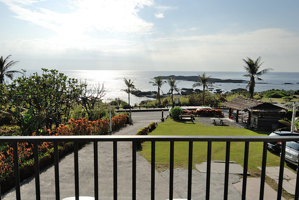](http://flickr.com/photos/33703965@N00/20558811640)

離開台東長濱 沿著海線 我們來到花蓮豐濱 離三點的民宿可check-in時間還有段時間  我們繼續用沿途景點填滿時間

秀姑巒溪的出海口  長虹橋下是每年夏季熱門的秀姑巒溪泛舟終點 也許再過幾年 我們全家也可以一起去泛舟了  石門班哨角休憩區 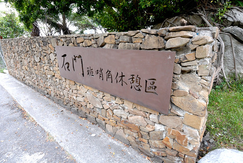 不同台東海岸線的地質景觀  [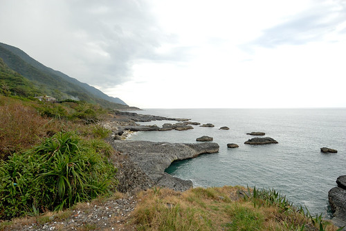](http://flickr.com/photos/33703965@N00/20737577792) 徹哥國中後開始上台灣歷史跟地理 他說很多地方因為旅行去過讓他學來輕而易舉(其實徹哥的讀書習慣 就算沒去過也是讀很輕) 雖然我們的旅行深度實在不怎麼樣 但一如我始終相信 凡走過必會留下痕跡的  這兒有熱門的石門雙心  據說往海的方像照過去很漂亮 可是內地同胞很多 而且一個個卡的緊還都超搔首弄姿  實在很難輪到 而我背道而馳的這張 其實重點是在背後的雙心跟大嬸阿 [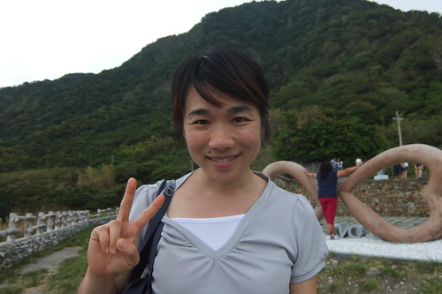](http://flickr.com/photos/33703965@N00/20753862811) 雙心實在太令我們失望 靠著google map我們繼續來到石門遊憩區 尋找網路上的海蝕洞奇景 [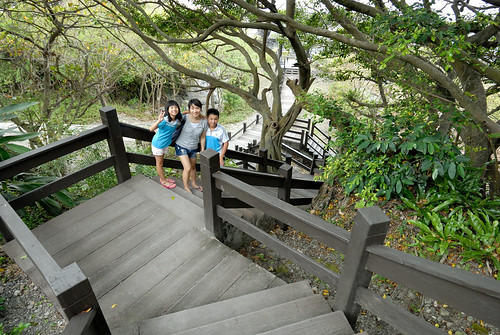](http://flickr.com/photos/33703965@N00/20737386122) 幸運地 我們很快就找到 [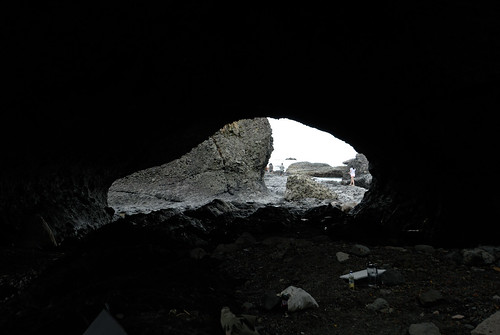](http://flickr.com/photos/33703965@N00/20746899905) 就由阿母開著小march載姑娘出海  看壯觀的火山岩海蝕地形  台灣的美麗與豐富 課堂說再說都不如讓小學生自己走過看過[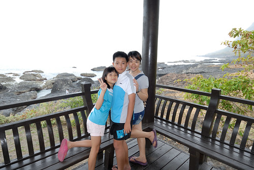](http://flickr.com/photos/33703965@N00/20558901068) (徹哥偷拍媽媽的背影 還怪有FU) 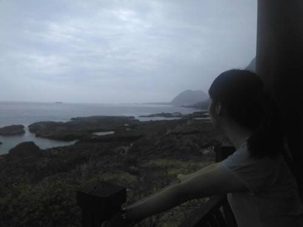 

最後一晚我們住在石梯坪風景區內的石梯 33民宿  民宿位在風景區的最底處 露營區的對面 民宿的門口 客廳 房間陽台 任何地方看出去都是豪華大海景 非常之奢華 [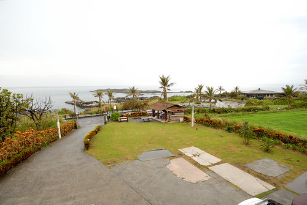](http://flickr.com/photos/33703965@N00/20125925853) 房間內的空間寬敞 擺設簡單但帶著自然味  不只徹愛喜歡 連徹爸也難得  第一次說出口 "這就是我心目中的民宿"  剛剛好的簡單 溫度 與結合環境  剛抵達民宿時 飄起細雨 我們剛好在民宿內休憩一會 不過雨停後 怎也按耐不住徹愛往海邊去的渴望  傍晚時分不是今日潮間帶時間 沒有太多生物可觀察  也不若沙灘那樣可以玩沙 碉堡 [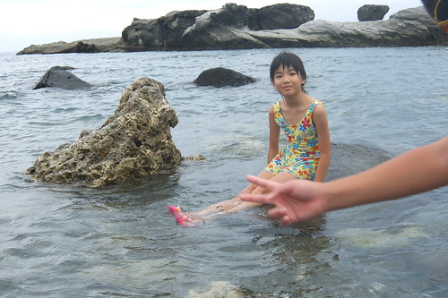](http://flickr.com/photos/33703965@N00/20560110129) 但徹愛就是想(要)泡在海水裡[ 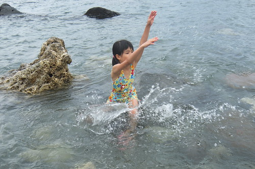](http://flickr.com/photos/33703965@N00/20558878618)感受海水的浪來潮去  尤其在旅行即將結束前的一天 更要好好享受太平洋的擁抱白天的石梯坪過往人車不少 但入夜之後的石梯坪一如大部分的花東鄉鎮冷清而安靜

[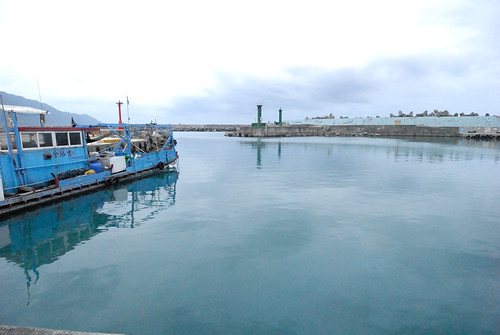](http://flickr.com/photos/33703965@N00/20746830265) 雖然偏僻 但靠海港 不愁沒有海產店可吃飯 [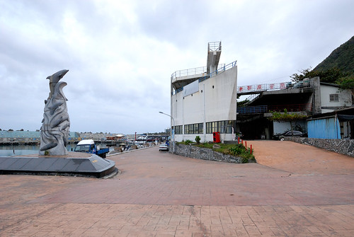](http://flickr.com/photos/33703965@N00/20124227404)我們來到位於石梯港內的田媽媽米那度海吧餐廳 向來對田媽媽這招牌很有信心的我們  很驚喜石梯坪也有田媽媽 不過後來跟老闆娘聊天才知道 海線的田媽媽跟之前我們吃過的農村裡的田媽媽是不同的 海線歸漁業署(還甚麼跟海有關的單位) 而農村裡的歸農委會輔導 不過田媽媽這招牌指的都是當地婦女經輔導 利用在地食材發展的特色餐廳 [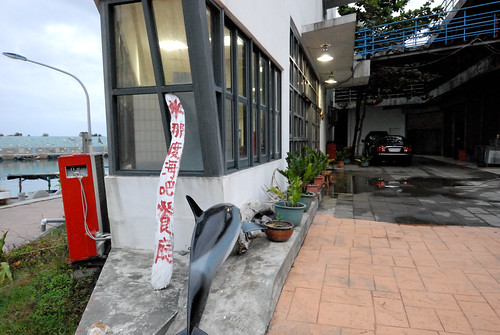](http://flickr.com/photos/33703965@N00/20124217394) 緊鄰漁港的餐廳 當然入內就也擁有好窗景  只是餐廳中午生意興隆 到了晚上卻不敵冷清 只有我們一家子包場 [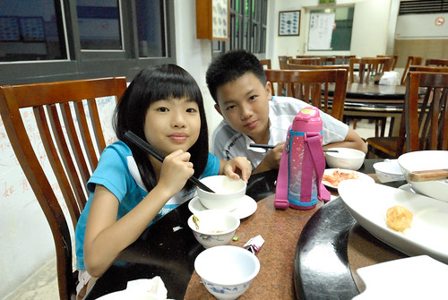](http://flickr.com/photos/33703965@N00/20558833180) 第一天在大武之後 又期待了好些天的海鮮大餐當然要大快朵頤 [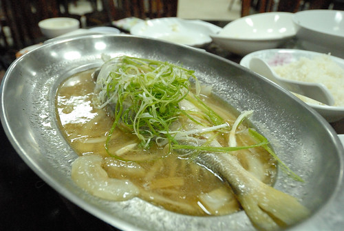](http://flickr.com/photos/33703965@N00/20753733271) 一定要的魚 蝦 還有花枝丸 ....   每次都很飽實的五菜一湯 [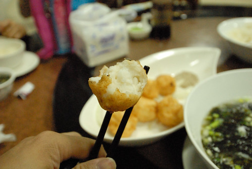](http://flickr.com/photos/33703965@N00/20558836130) 很愛花枝丸的愛愛形容這裡的花枝丸是她吃過最好吃的花枝丸 從滿牆的食客留言 我想愛愛說的一點也不誇張  真的很好吃的海鮮大餐!  不管白日一台台載著陸客的遊覽車如何馳騁在台 11 線上 入夜後 一切寧靜的 回復花東本來的純樸美麗 [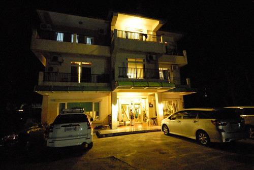](http://flickr.com/photos/33703965@N00/20560062089) 我們設定鬧鐘 清早六點多起床看日出 [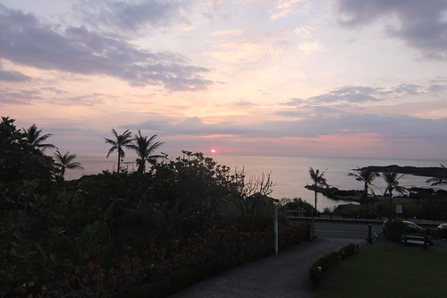](http://flickr.com/photos/33703965@N00/20560053769) 太平洋的日出怎麼都看不膩 [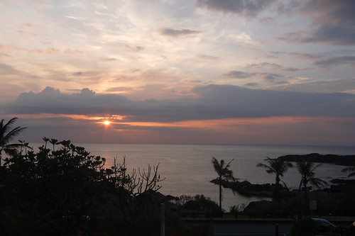](http://flickr.com/photos/33703965@N00/20560051949) 雖然沒有大景 但可以在房間內輕鬆簡單的看見這樣的日出 我們就很心滿意足 (話說這二天的日出都是徹愛主動提出說要設鬧鐘起來看)  早餐過後的九點 日頭赤炎炎 但已經熱得很有經驗的母子女三人  理所當然地又往海邊走 [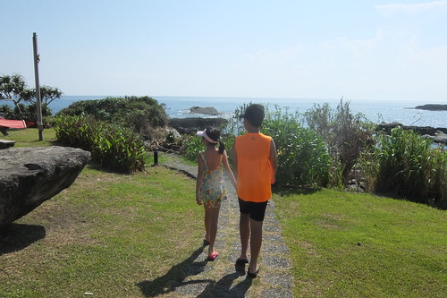](http://flickr.com/photos/33703965@N00/20558808270) 如徹愛說的 就要回家了當然一定要再來玩水 下次可以再到海邊玩水已經要一年以後了  二人還特別強調是太平洋  所以毒辣辣的太陽一點都不是問題 好好把握享受這海之味 夏之浪 才是最重要 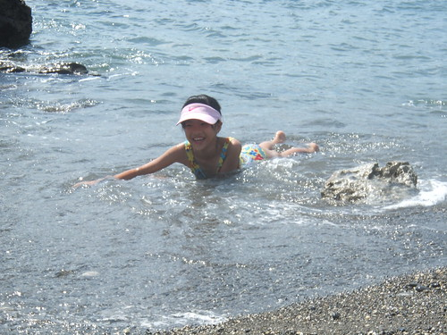 尤其今天的天空又好乾淨 海又閃亮的好漂亮 連天上的雲也野的像一隻飛兔  踏上回家路途前 我們到鄰近的豐濱月洞 [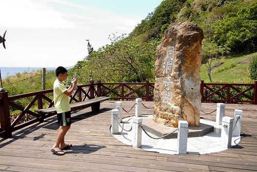](http://flickr.com/photos/33703965@N00/20558783838) 這裡也是觀海好地方  但大家來這的目的都是為了一睹所謂的月洞奇景 [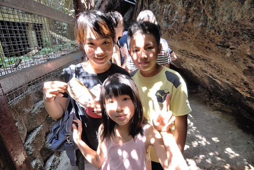](http://flickr.com/photos/33703965@N00/20558776818) 想入洞參觀 購票後還得排隊等候好一會 但洞內的"奇"觀讓不愛排隊的我們大呼值得 尤其等我們看完後的排隊人潮更顯我們的等候半小時一點都不算甚麼  月洞的奇景 奇在哪 美在哪.... 寫到最後一篇只想快快寫完遊記的我實在不想再贅述(網路隨便估也都有) 就留在我們的心裡  還有才一出洞就喊著下次還要再來的徹哥回憶裡吧 [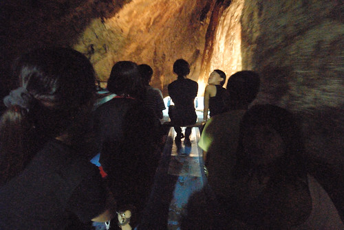](http://flickr.com/photos/33703965@N00/20720503966) 帶著滿足 我們結束了今年的夏之旅 一樣環了台灣一圈  雖然其實都在花東 真的! 花東的夏天也會讓人上癮 (雖然中午在花蓮市的覓食又一整個被人潮給驚嚇到 ) 難忘太平洋的風.... [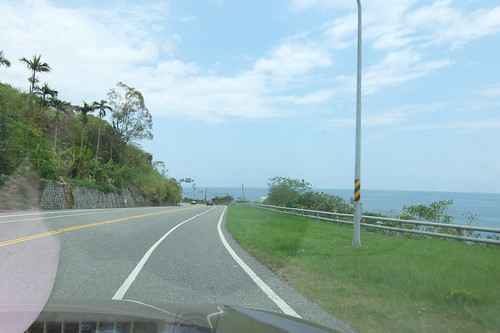](http://flickr.com/photos/33703965@N00/20737411462) 而最後最後 車出蘇花後當然要在蘇澳停留下吃個叭噗再回台北嚕  完美Ending~
