野菜鍋吃飽飽後 最好的處置應該是早早到民宿睡個大午覺 但這樣實在太像一種動物的行為而且已經跟民宿主人約好傍晚入住 所以我們還是把握在花東的美好時光 多積極活動 問了徹愛要去走步道玩水還是去高台吃冰  愛妹選前項而徹哥則選了後項 既然如此那就先去玩水再去吃冰吧!  反正都在鹿野...

為了達到每日有玩到水的怪目標 猜想鹿野會不會有什麼小溪或小瀑布 竟然還真搜尋到永安社區的玉龍泉生態步道 步道的入口就在鹿野鄉永安村聖安宮的對面 

迎接的先是一排茂密涼爽的藤蔓隧道 [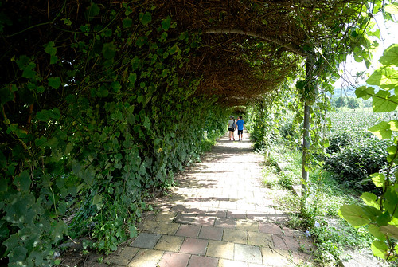](http://flickr.com/photos/33703965@N00/20753996761) 然後108階的階梯走進一個因水源豐沛而保留豐富的自然生態林  一心想著玩水的兄妹倆納悶著水在哪? [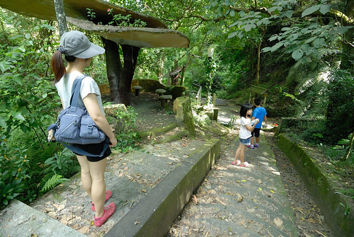](http://flickr.com/photos/33703965@N00/20124470804) 而一個轉身便發現 小小但清澈的湧泉口  唯一穿夾腳拖來的愛愛 立馬走入水中涼快 [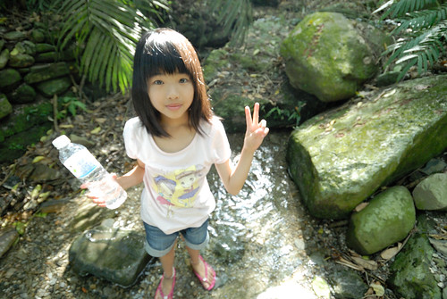](http://flickr.com/photos/33703965@N00/20126129413) 大喊"水好冰 好舒服阿"  看的我跟徹哥立馬走回車上換鞋子  也要好好親這裏的水  雖然在台東 一個轉身便是入山下海並不令人意外 但習慣也只知道高台與茶園的我們 還是挺訝異鹿野原來也有這樣的親水步道 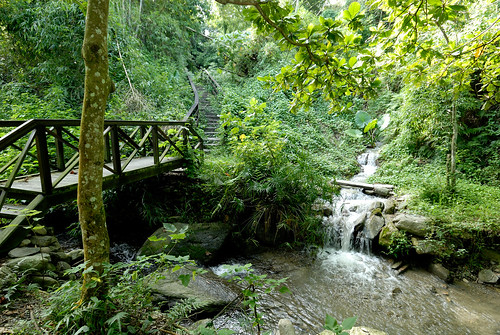 入口的導覽圖上標示著步道沿途有二個戲水區 我們期待著更大更過癮的水區域 繼續往裏走 [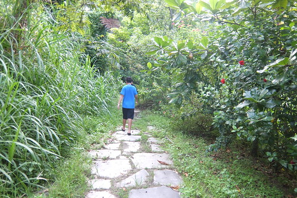](http://flickr.com/photos/33703965@N00/20754009101) 或許是颱風過後也或許是人煙罕至 步道二旁有些雜草叢生 尤其原本別具巧思的輪胎步道 走來更是不易  沿途的小蟲與小蜘蛛絲也不少 需要開路者披草斬絲一番 [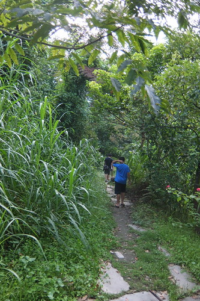](http://flickr.com/photos/33703965@N00/20560340909) 走到一處有階梯可下溪處  雖然懷疑但我們猜應該就是戲水區了吧  雖然溪水實在淺的很出人意外 [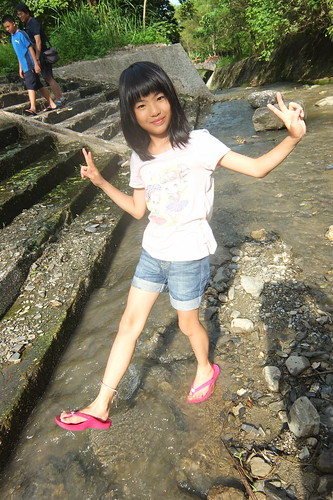](http://flickr.com/photos/33703965@N00/20559114100) 但有水 有泥巴 愛愛就也開心 [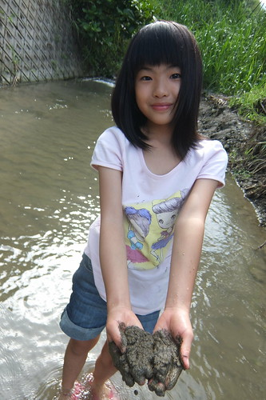](http://flickr.com/photos/33703965@N00/20559115360) 我們在這裡曬太陽 踩水 [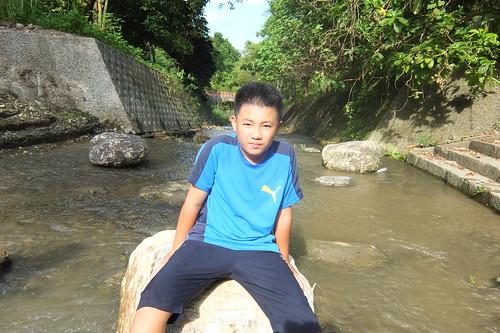](http://flickr.com/photos/33703965@N00/20720843756) 雖然與預期的很不一樣  但有卻有一種很在地的親切感 只可惜愛愛早上才在美術館買的紀念品  在玩水過後摘下來晾乾時不小心在車門開關之間遺失了 

步道繼續往下還有第二戲水區  沿途景色也看似優美 據說還可以通往高台茶園區 但據徹爸探勘第二戲水區比較不適合玩水 我們就未再繼續往裡走 [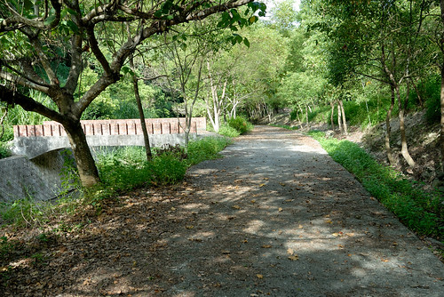](http://flickr.com/photos/33703965@N00/20747073395) 只是來程的路實在雜草叢生走來並不是太好走   徹爸打算到步道的對岸探勘是否有其他路線 [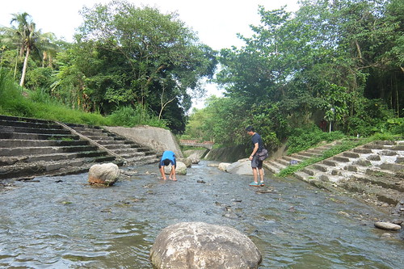](http://flickr.com/photos/33703965@N00/20124494314) 為了讓沒穿夾腳拖來的徹爸過岸 徹哥孝順的一路鋪石讓徹爸順利過溪 [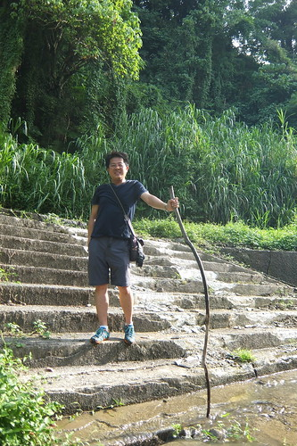](http://flickr.com/photos/33703965@N00/20754011991) 徹爸探勘之後  母子三人堅持還是走原路回去 一來是不想節外生枝 再者我們還想再去洗洗沁涼的湧泉水阿! 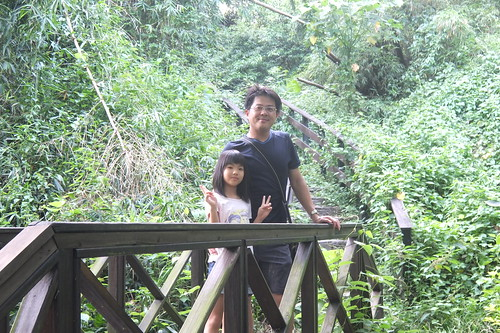 短短又小而美的親水步道健行是不錯的飯後小散步~  

戲完水 我們玩性亢起 繼續往高台吃冰去 [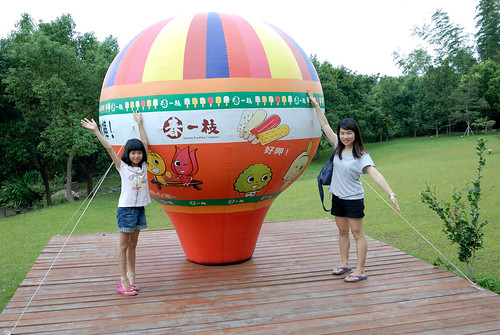](http://flickr.com/photos/33703965@N00/20559079700) 本來以為春一枝誠信商店在鹿野高台旁 到高台撲空後再搜尋才明瞭原來商店在另一邊靠近茶園區 雖然鹿野高台依舊美麗 但不同於很多年前時的小貓二三隻 現在已是台東大熱門景點 來到春一枝誠信商店後 我們驚豔於這裡的清幽 [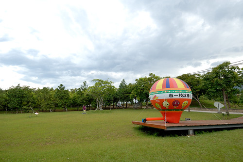](http://flickr.com/photos/33703965@N00/20559081418) 一直沒有成功看過鹿野熱氣球的我們 在這看到假的小熱氣球竟也開心  很觀光客的拍了好多照  春一枝商行是一位常住鹿野的台北商人 為了幫助鹿野農民與經濟而創辦的友善交易品牌 販售的純手工冰棒 原料都來自於收購鹿野生產過剩 過熟的水果 [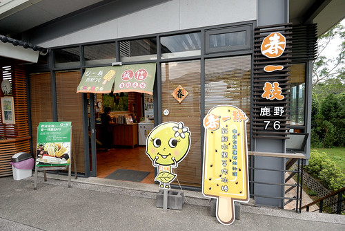](http://flickr.com/photos/33703965@N00/20747063925) 買一支春一枝冰棒 不止吃進對身體健康的祝福 也是購買了一份送給農民的希望  在這間商店沒有店員  一切自助且誠信交易  挑選好喜歡的口味冰棒後 依照冰棒包裝顏色投入相對應的價錢 從30到50不等  最後再挑個喜歡的座位 在中央山脈陪伴下享受冰棒的美好滋味  雖然照片中的父子倆沒有很開心的樣子 但真的都有很喜歡手裡的冰棒  雖然現場沒有任何店員或工作員  但整個環境與清潔卻維護的相當好而且漂亮  所以在這不止享受冰棒 也享受這份美好氛圍  吃完冰 我們玩著桌上的小遊戲  徹哥在商店留言本畫下他的開心滿足  自己交易 好吃的芒果冰棒  還擺好pose 露出青春期少年拍照時難得的笑容  商店裡還有超多的紀念章可以蓋 [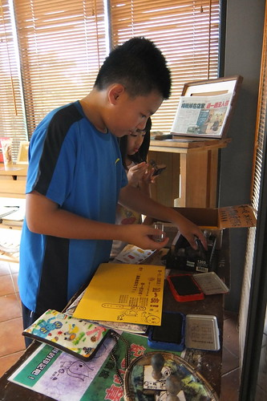](http://flickr.com/photos/33703965@N00/20737725332) 一張A4紙幾乎可以蓋滿不同的章 有吃有蓋的誠信商店深得徹哥喜歡 徹哥喜歡到隔天早上還一直嚷著要再來吃一支春一枝~  今天的行程 每個都是小而美 而一整日的累積下來又是滿滿讓我們一來再來花東的回憶與動力~ [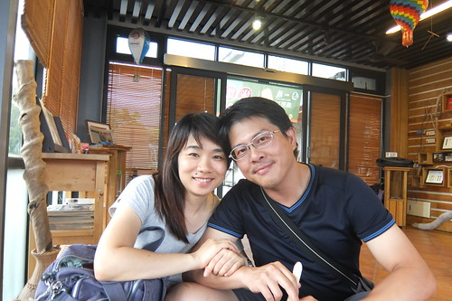](http://flickr.com/photos/33703965@N00/20559083028)

第二晚我們住在鹿野瑞源村的大原日和 這是南島秧滿田今年初開幕的民宿 原本就十八般武藝樣樣行的他們 今年起又多了個民宿主人身分 民宿位在距離關山鎮或鹿野高台都約10分鐘車程的瑞源村上 雖說掛牌民宿經營也申請有民宿執照 但其實尚未積極經營 反倒像是他們的另一個家以及與至親好友分享的空間 [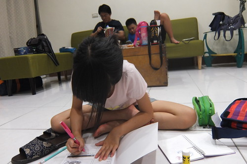](http://flickr.com/photos/33703965@N00/20124453934) 所以我們這一晚就很不客氣假裝自己是這棟房子的主人嚕  放鬆在家  帳篷概念的另一張床 讓房間別具野趣與童趣 [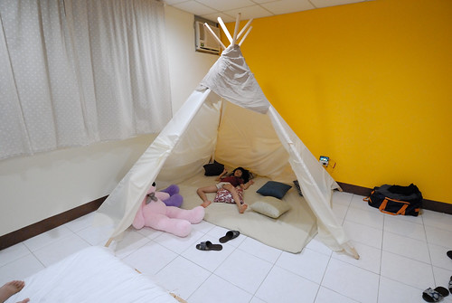](http://flickr.com/photos/33703965@N00/20124452504) 是小朋友絕對喜歡的角落  加上男女主人收藏頗豐的漫畫 徹愛對這個家滿意的不得了 聽說且羨慕很久房子面對著的稻田好視野 隔日一早起床後 總算讓我們見識也體會到主人家的這份喜歡 [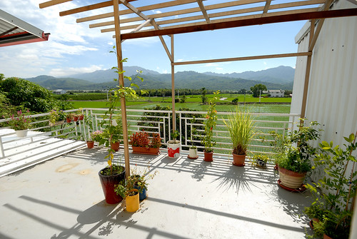](http://flickr.com/photos/33703965@N00/20753977041) 尤其從一樓後側廚房延伸出去的陽光 窗檯 綠樹 稻田與中央山脈 美的詩情畫意.... 只是正夏的早晨也曬的恐難久呆  是唯一的美中不足  在大原日和看見南島秧滿田對於夢想與家的實踐 很高興因為買米而認識 結交了這麼一對認真努力的農村小夫婦 雖然路還很艱辛 但相信也祝福他們一步步實現他們的想法與堅持 把好吃的米介紹給用心吃飯的朋友 ( 徹家相關紀錄: [blog.yam.com/hmchen1975/article/52220886](http://blog.yam.com/hmchen1975/article/52220886) 商家官網: [www.krice.com.tw/](http://www.krice.com.tw/) ) 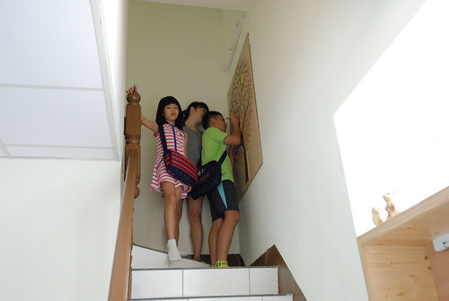 

瑞源是個很不觀光 很農村的小村落  一般遊客甚少知道的地方 但這裡卻有一家客家粄條店非常有名  很多走台九的遊客慕名而來  我們天黑後尋來這裡吃晚餐 小店一片祥和 難以想像午餐時刻的可能盛況 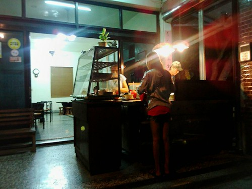 據說老闆是從屏東移居過來 屏東距離瑞源相聚200哩 因此店名就叫200哩客家粄條 品質還不錯的小麵店 只可惜正鬧腸炎的我與徹爸沒肚量與口福好好品嚐 

第三日早要離開瑞源 繼續往北前 我們尋指標來到瑞源的花布燈籠文化館  除了想來欣賞燈籠文化 主要也是想讓徹愛來做做網路上看來極可愛漂亮的DIY 但不知怎麼原因的休館  我們只能隔著玻璃望著裡頭作品遺憾... [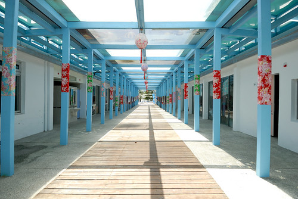](http://flickr.com/photos/33703965@N00/20126109963) 帶著遺憾 我們來到關山 交還民宿鑰匙也叨擾老闆娘話家常 帶著老闆娘的推薦(其實之前看他FB的分享 我就很ㄏㄚ)我們找到關山親山農園吃冰淇淋 農家自製的草莓 桑葚 百香果與鳳梨四種口味冰淇淋  剛好各投我們四個人喜好 [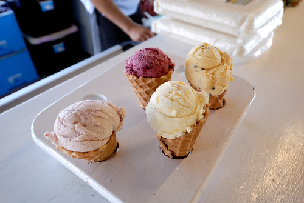](http://flickr.com/photos/33703965@N00/20753972381) 不誇張的 吃第一口就絕對讓人眼睛瞪大 欲罷不能的水果米冰淇淋 好吃到 很愛阿母,總不吝與阿母分享的愛愛怎樣也不肯讓我分享一口她的草莓口味 [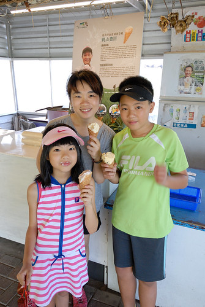](http://flickr.com/photos/33703965@N00/20753972061) 特別的是連餅皮也是農家老闆自己研發製作 餅皮的米香在吃完冰淇淋後還齒頰留香 讓人回味無窮阿~  話說位在關山環鎮車道旁的親山農場 我們幾年前曾經在這採過草苺說 [blog.yam.com/hmchen1975/article/28242878](http://blog.yam.com/hmchen1975/article/28242878) 有機會冬日再來關山騎車 採草莓 再吃草莓冰淇淋~ [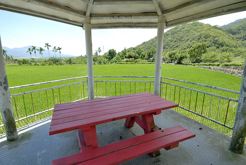](http://flickr.com/photos/33703965@N00/20559067130)
