愛愛在她的寒假作業"XX(日本)之行"小作文裡這樣開頭 "這次雖然不是我第一次去日本, 但這次是我印象中第一次去, 因為以前是小時候去的, 所以我ㄧ點印象也沒有" 可見小時候的旅行真的只是被愛玩的爸媽拎來而已 難忘的美好回憶只留相本與爸媽心中 這回小學生徹愛才真正作客東京 換是我們陪著累積她們的回憶 而相隔多年再訪東京 除了多個晴空塔 也因我們的自助行而才真正留下足跡! 

帶著紅眼 我們凌晨四點出家門前往機場搭6點40起飛的班機 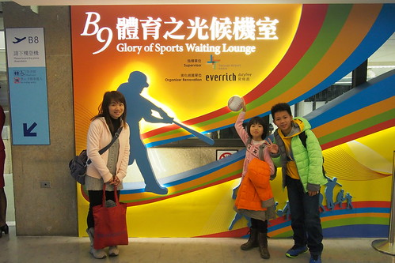 很久沒出國門 一連串的寄行李 出關 待機...挺令我們折騰  幸好因興奮與緊張 睡眠不足的我們精神還是異常的好 [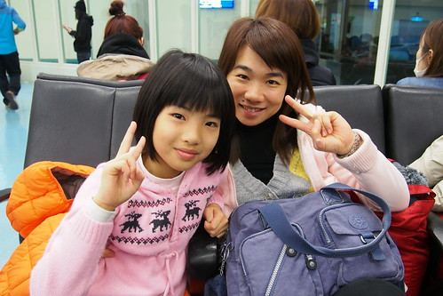](http://flickr.com/photos/33703965@N00/15894536563) 還沒出國門 我們就猛拍起照 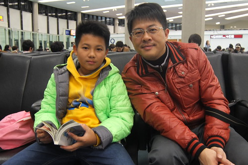爸爸說這樣才High 才像觀光客阿! 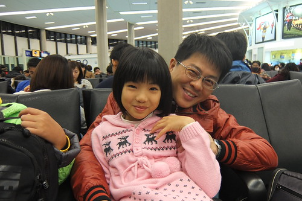 感謝玟姿的策劃與同行 第一次參與她旅行的我的確要好好在這一刻留下紀錄! 費心搶到的特惠廉航機票 價格令人滿意但也讓人有些小惶恐 所幸班機一切都很OK  或許因著廉航可以讓一家子所費不貲的旅行將來更加易行  愛愛的電力在坐上飛機後咻的就放光  飛機都還沒完全起飛便已睡昏 標準的上機(車)睡覺 下車玩的厲害玩家  飛機比想像的快很多 二個小時多些就抵達日本上空 如果不是出入境手續太折騰 要不真的比開車回嘉義還快阿!  辦理好入境 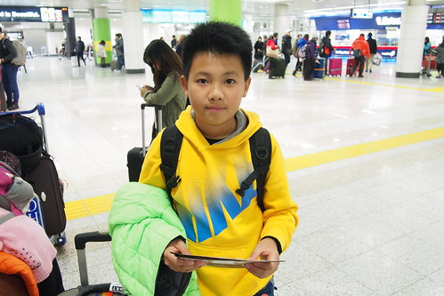 提領了行李 [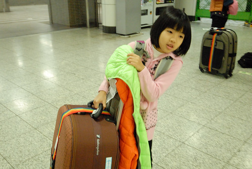](http://flickr.com/photos/33703965@N00/16327258570) 再購買了大人小孩都有的西瓜卡(小朋友要憑護照辦理 卡片記名) [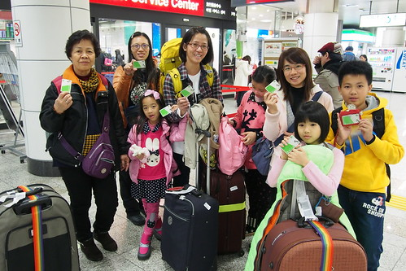](http://flickr.com/photos/33703965@N00/16512999141) 阿姨領軍 浩浩蕩蕩九個人開始一卡走關東 [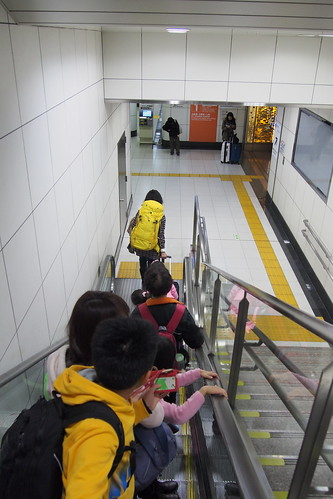](http://flickr.com/photos/33703965@N00/16514726195) (身處異國的徹哥散發著不同平日的穩重氣息 很是帥ㄚ!)  從成田機場到我們即將下榻三天的品川東橫INN飯店 車行一個小時 [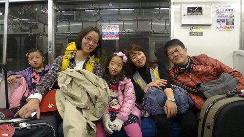](http://flickr.com/photos/33703965@N00/15894547873) 有些久的讓早起的大人又累了 但小學生很是興奮 拿著相機沿途拍個不停 [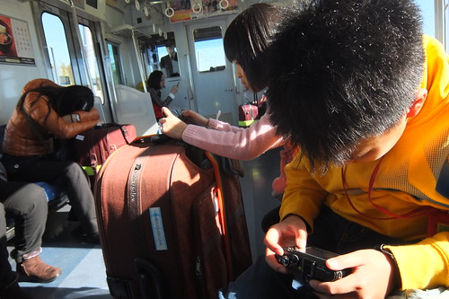](http://flickr.com/photos/33703965@N00/16488714516) 異國的天空與景色 在小學生眼裡這樣不同與美麗   (轉搭的單軌電車)  總算 在抵達飯店 辦理好住宿與寄放行李 下午二點半 我們吃到了我們在日本的第一餐 飯店附近的讚岐烏龍麵 [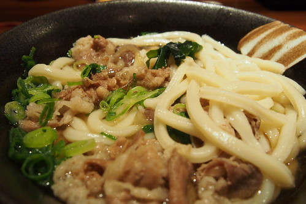](http://flickr.com/photos/33703965@N00/16488726356) 不知道是麵真的太好吃 還是餓太久 愛愛呼嚕呼嚕的吃了一大碗麵 還好些豆皮壽司 邊直嚷著"豆皮壽司真是太讚 每天都要來吃!" [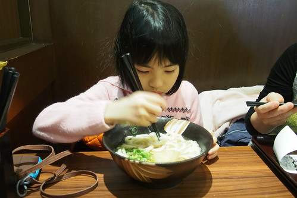](http://flickr.com/photos/33703965@N00/16513008801) 雖然我們每天總把飯店對面的這家店當沒吃飽時的備胎 幸好每天都吃太飽回來 但愛愛也一直遺憾沒再吃到這汁多味美的豆皮壽司  吃飽麵 我們蓄勢待發開始我們的東京行  很觀光客的東張西望 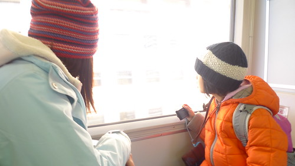 (觸控式販賣機引起我們的大驚小怪  小人順手就把西瓜卡刷下去買到飲料)  人手一台相機的記錄下自己的好奇與感動  可惜觀光客氣勢在我們在LAWSON取第三天將用到的森吉卜力門票時完全掉漆 看我跟阿姨二人對著完全看不懂也不會輸五十音的螢幕有多麼一臉愁容就知道 [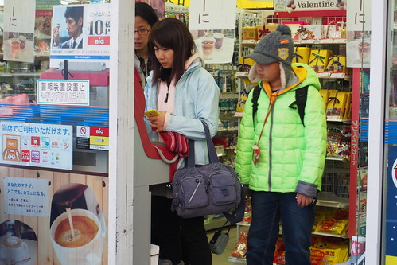](http://flickr.com/photos/33703965@N00/16327277080) (同時間 小學生一臉旁觀與悠哉阿) [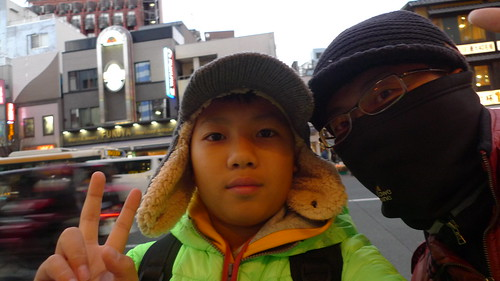](http://flickr.com/photos/33703965@N00/16328466969) 總算在花了好些十分鐘嘗試與比手畫腳請店員協助輸入五十音後成功取票 但天也快黑了我們才抵達今日原訂行程的第一站 上野的湯島天滿宮 原計畫這時候應該是離開上野後的淺草到晴空塔的散步 果然計畫比不上變化 也應驗阿姨說的這本來就是不可能的計畫 [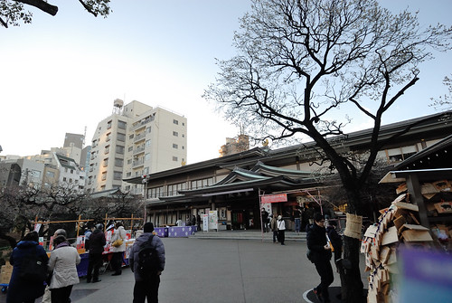](http://flickr.com/photos/33703965@N00/15892176574) 安排湯島天滿宮 只因這裡是有名的文昌廟  所以一定要帶四個小學生來這走走 有拜有保佑嚕  愛誠心誠意的許"希望我四年級可以考前三名" (阿母心裡困惑怎麼不是說接下來的三下ㄋ 是愛不強求的關係嗎)  徹問只能許學業的願望嗎? 阿母看到一旁也有的愛情籤 只能默默接受兒子可能的情竇初開 而除了拜拜 當然也是來買唯一這裡有的小書包御守 (話說御守也能百百款 不得不佩服日本人讓人吸睛 心甘情願掏錢的創意)  借這裡的學業御守 期望旅行來的小學生們回家後能感念爸媽心 認真用功阿! [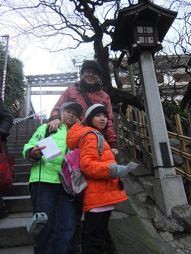](http://flickr.com/photos/33703965@N00/16327009748) 湯島天滿宮的梅園也是有名的賞梅地 可惜我們來的早只見些許梅花綻放 倒是慶典活動似已揭開序幕  離開我們在東京的第一個景點 大伙趕緊移動往下一站 [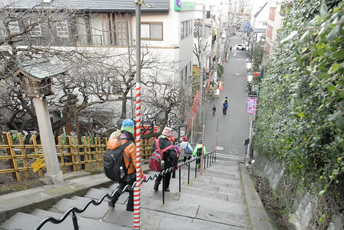](http://flickr.com/photos/33703965@N00/15892179694) 原本的計畫要在天黑前 傍晚時分來個淺草到晴空塔間的散步 雖然一開始就知道這有點難度 但沒想到第一天的行程被誤的這樣嚴重且小人這樣就開始吃不消 [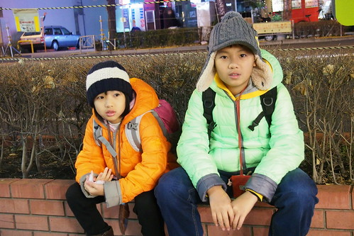](http://flickr.com/photos/33703965@N00/16514751245) 於是我們放棄原先的浪漫計畫 索性直接撘車往晴空塔去 去買我們的迪士尼門票  雖然走在東京街頭或因時間而趕路 或因城市步調而不得不快 但因此而體會 發現與台北不同或相同的風情 讓第一次自由行的我們最感有趣  從押上站一出來 我們一家子就張大嘴哇個不停也拍個不停  晴空塔比我們預想美麗多 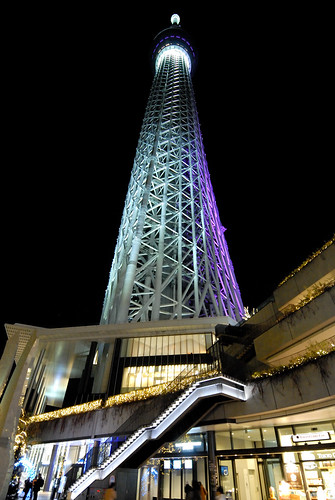 尤其對比著鄰近的空無寧靜(與信義區裡的101很不一樣) [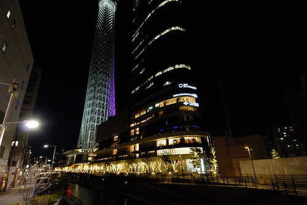](http://flickr.com/photos/33703965@N00/16488746476) 愛愛對著不同角度的晴空塔拍個不停 拍的好認真 [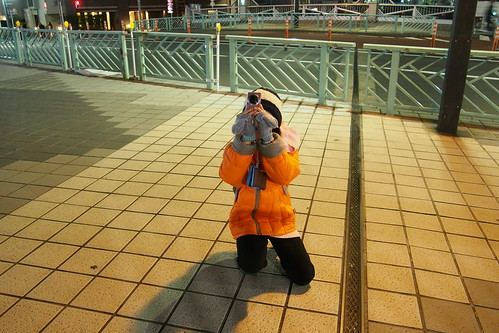](http://flickr.com/photos/33703965@N00/15894581133) 殊不知爸媽眼中 他們這樣開心認真的模樣才是我們最美的風景  離開熱鬧的晴空塔內後 我們沿著晴空塔旁的圳散步一小段路 這段路很不熱鬧  很舒服 遇見我們熟悉但招牌卻是綠色的MOS  一家人興奮的決定晚餐就是他 [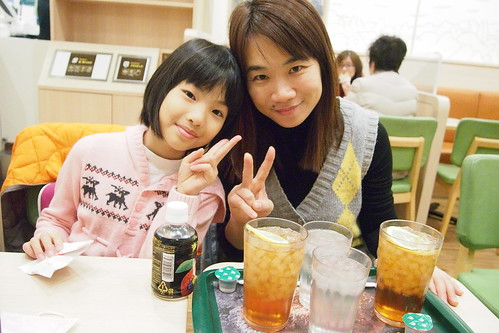](http://flickr.com/photos/33703965@N00/16513721832) 很有日本精神的很多冰的冰紅茶 我們小口小口珍惜著啜飲  小小的漢堡  但好MOS 好好吃! [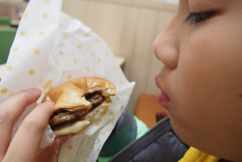](http://flickr.com/photos/33703965@N00/16327029408) 而且意外吃到因食品風暴而在台灣下架的咕咕雞堡 讓我們好驚喜 [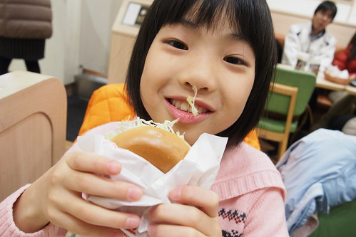](http://flickr.com/photos/33703965@N00/16514759875) 哥哥直呼著"好懷念的味道"  一家子也一直期待 唸著再吃MOS 沒再吃MOS是我們出境時最大的遺憾 [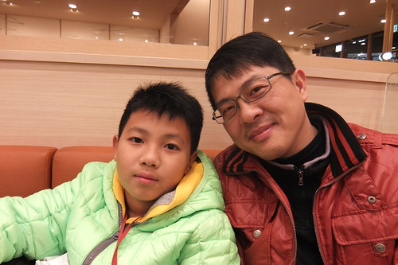](http://flickr.com/photos/33703965@N00/16328849087) 以上就是我們的第一天! 很興奮 很觀光客 也很暖身....
