若不是因為要帶小學生來迪士尼 東京實在不是我們想再訪的大城市 但意外發現離東京不遠 有古都風貌不輸京阪的鎌倉 自然風光不輸合掌村的富士五湖 我們對東京的排斥感就也消失 也體會了不一樣的東京自在行~

在傷腦筋該怎麼安排不一樣的東京行好引起徹爸興致時 才意外發現原來鎌倉離東京這樣近且吸引我們 鎌倉所在的神奈川縣常出現在柯南場景裡 鎌倉高校也是灌籃高手裡陵南高中的模型 再加上日劇流星裡竹野內豐工作的江之島水族館 以及我們感興趣的如京都的古寺古都風情 於是旅行第二天 我們安排一家子的鎌倉一日! 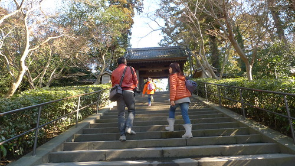

我們從飯店坐接駁車到品川站後 搭乘JR橫賀須線只要40多分鐘便可到鎌倉 很是方便 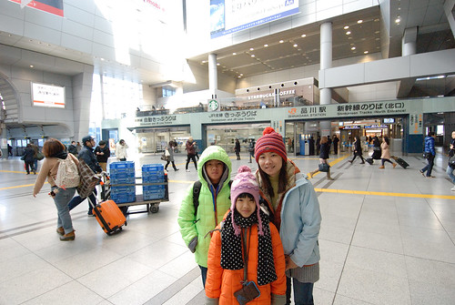 匆忙趕上車的我們誤上不能進的指定席車廂 傻傻的我們還心想  哇!這也太舒適的電車了! 直到列車人員來趕我們到一般車廂後才明白原來一切都是我們的誤闖與誤會  雖說是鎌倉一日  但安排從北鎌倉開始我們的散步 [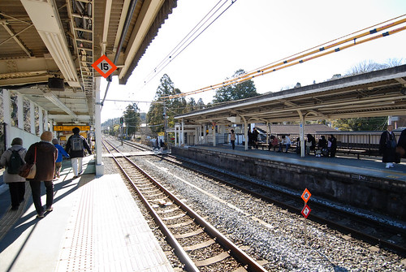](http://flickr.com/photos/33703965@N00/16328904377) 北鎌倉是相對純樸的小站  一下車的我們便感受到這裡不同的古都氛圍 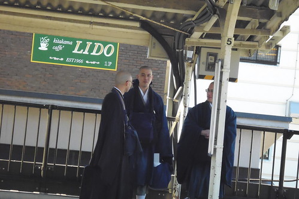 愛看到對面月台和尚 直盯著瞧 還偷偷照了相 (喜歡看墓地的他對於和尚也連帶很有好感) [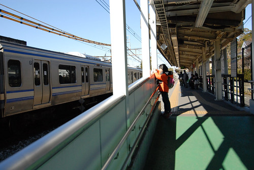](http://flickr.com/photos/33703965@N00/15892254014) 我們從車站的臨時出口出站 沿著鐵道走 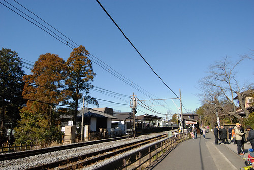 約莫50公尺便是安排拜訪的圓覺寺 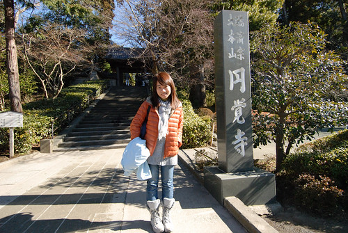 才在門口 我們便喜歡這古寺廟風情 [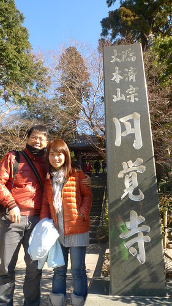](http://flickr.com/photos/33703965@N00/15892242724) 哥哥拍我們 妹妹拍哥哥拍我們的樣子 父子女三人拍的不亦樂乎  媽媽也更樂得輕鬆 好好觀賞風景與被拍 [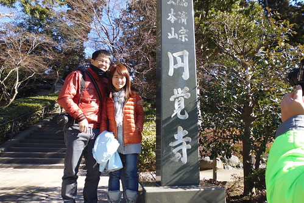](http://flickr.com/photos/33703965@N00/15892244844) 園區參觀有料 大人300円小人100円  我們忍不住又刷我們的西瓜卡過票 [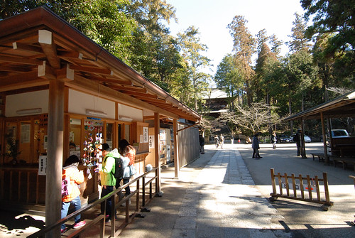](http://flickr.com/photos/33703965@N00/16513103111) 圓覺寺是鎌倉五山中之第二位  已有八百年歷史 [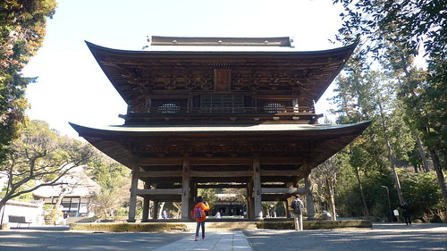](http://flickr.com/photos/33703965@N00/16488808876) 一入園區我們便對這雄偉莊嚴的建物 肅然起敬 [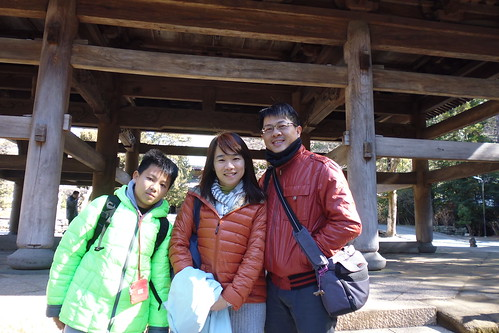](http://flickr.com/photos/33703965@N00/16328911807) 之前一直嚷著想去京阪的徹哥 來到這也感受到了日本古寺廟文化 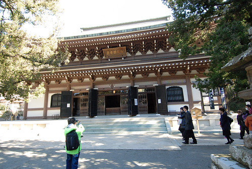 至於愛一樣的好奇不已 讚嘆不斷 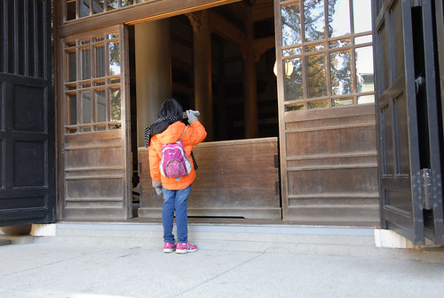 邊呼著"媽 你來看" 邊不停的按下相機的快門 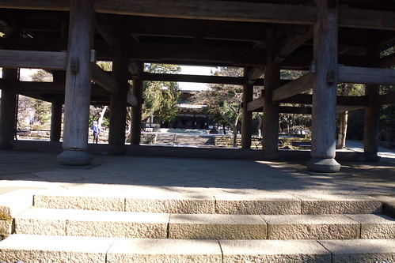 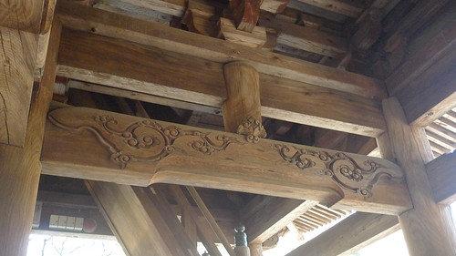[ 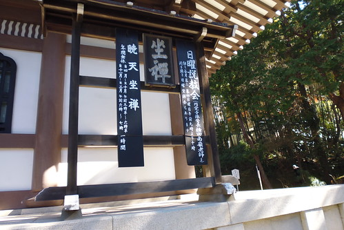](http://flickr.com/photos/33703965@N00/16328541829)[ 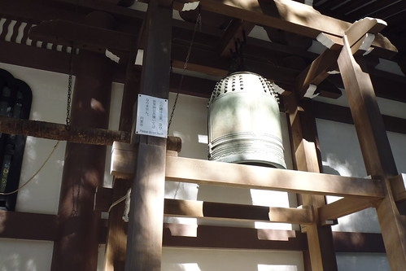](http://flickr.com/photos/33703965@N00/16514818805)[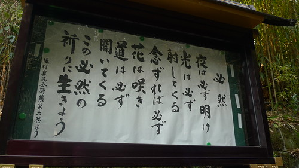](http://flickr.com/photos/33703965@N00/16328917837) 雖然阿母不是個能說故事典故的好導遊 但同他們一起慢慢發現沿途的美 [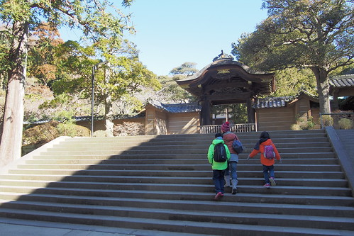](http://flickr.com/photos/33703965@N00/16513796052) 我們聽著神寺裡頭傳來的誦經聲 [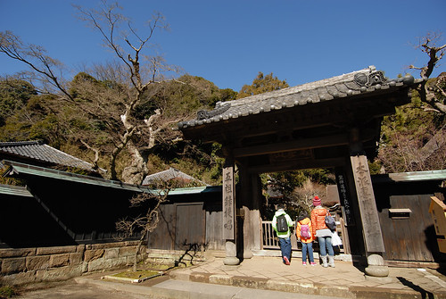](http://flickr.com/photos/33703965@N00/16513798662) 我們好奇多於期望的添香油錢於庭院木雕神像前 [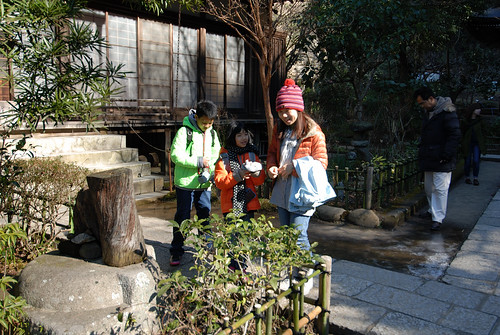](http://flickr.com/photos/33703965@N00/15894663833) 柯南看太多的兄妹倆說 這廂房挺像柯南裡的案發現場 [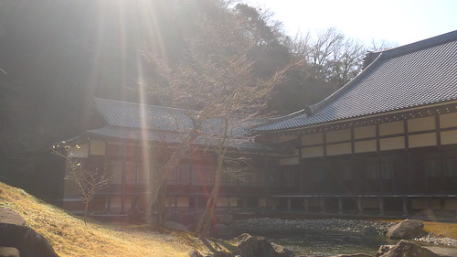](http://flickr.com/photos/33703965@N00/15892249734) 庭院裡結冰的池塘也引起兄妹的好奇 [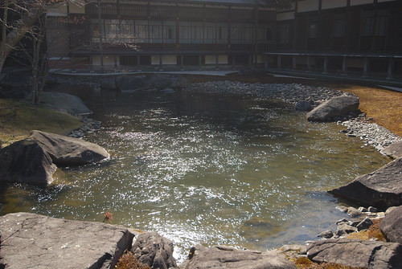](http://flickr.com/photos/33703965@N00/15894657233) 二人十足好奇與興奮的探索著古寺廟 [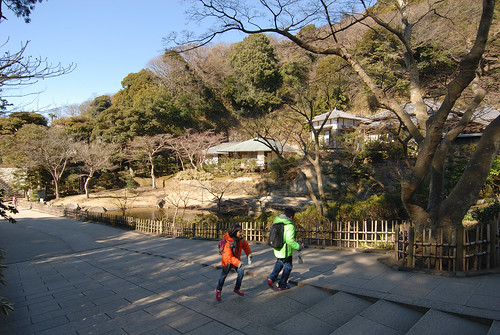](http://flickr.com/photos/33703965@N00/16328564009) [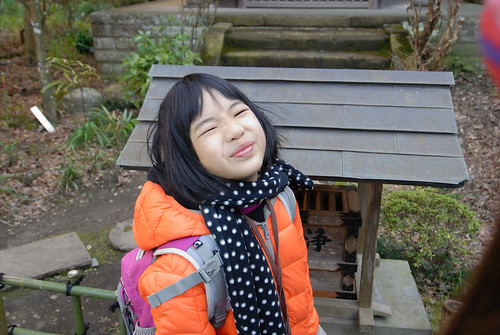](http://flickr.com/photos/33703965@N00/16327106908) [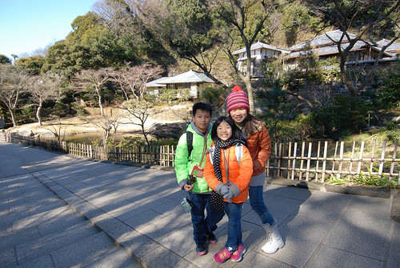](http://flickr.com/photos/33703965@N00/16488830606) [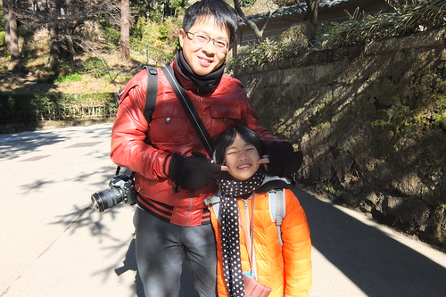](http://flickr.com/photos/33703965@N00/16513098561)

腹地廣大的圓覺寺 裡面包含著大大小小的神寺 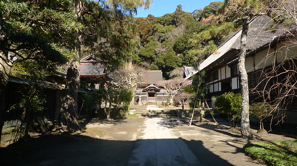 各有禪意與風情 [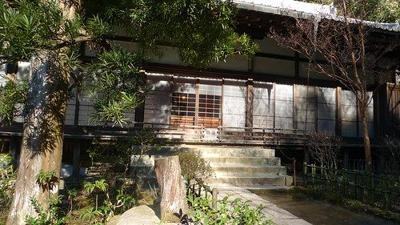](http://flickr.com/photos/33703965@N00/16327358050) 園區每各角落也都美的很雅緻 [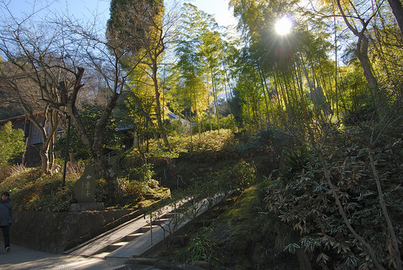](http://flickr.com/photos/33703965@N00/16327345330) 雖然櫻花盛開之時想必美麗 但冬日與古廟其實更是最佳表達 [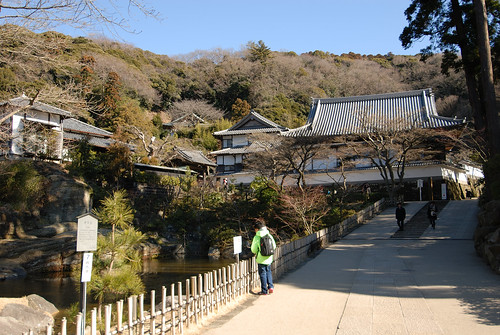](http://flickr.com/photos/33703965@N00/16328554779) 尤其遊客稀少更顯愜意(後來走到鎌倉的鶴岡八番宮更體會這裡的靜) [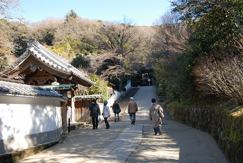](http://flickr.com/photos/33703965@N00/16328559209) 園內有個千年洪鐘 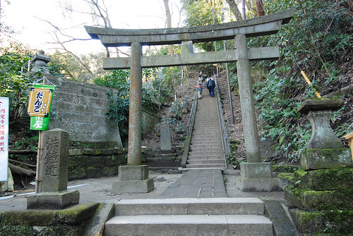 想看得先經過一段好漢階梯的考驗 [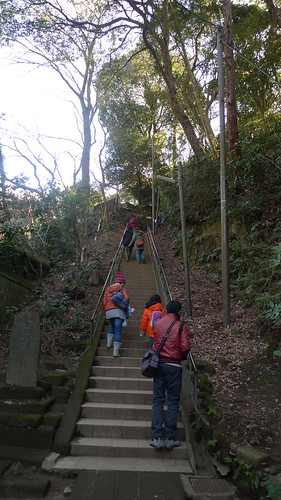](http://flickr.com/photos/33703965@N00/16328921637) 洪鐘沒有引起我們共鳴 倒是上頭的好視野很棒 還能看見富士山頭 [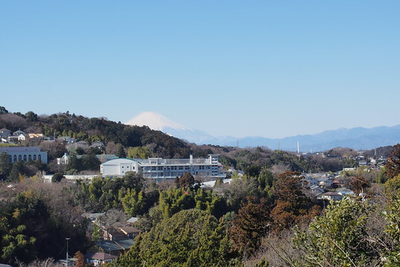](http://flickr.com/photos/33703965@N00/15892272784) 鎌倉其他的第一山建長寺 鶴幡八宮 大佛等也都是有名勝地 我們時間有限 不貪心的僅安排圓覺寺一遊 [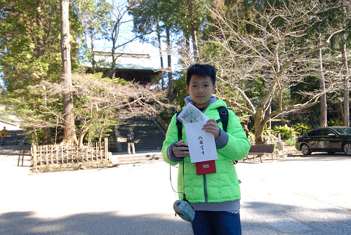](http://flickr.com/photos/33703965@N00/16328569669) 古廟走一遭 除是暫離東京的塵囂也一解我們沒去過京阪的尋古幽情 [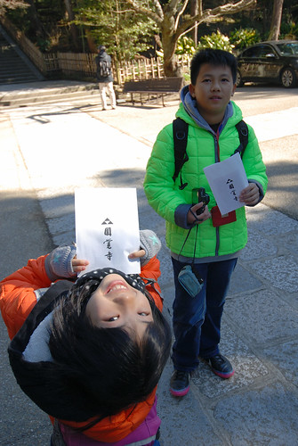](http://flickr.com/photos/33703965@N00/15894670543) 我們喜歡圓覺寺的這上午! [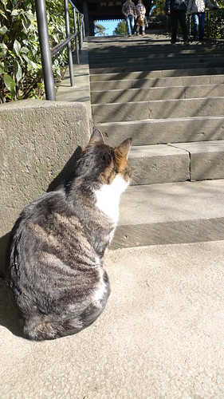](http://flickr.com/photos/33703965@N00/16488824596)

離開圓覺寺後 我們繼續沿著鐵道往鎌倉的方向前進 [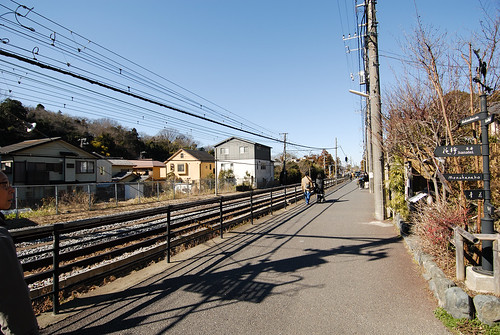](http://flickr.com/photos/33703965@N00/16327383260) 貼著鐵道的散步  總因來往的電車而打斷 [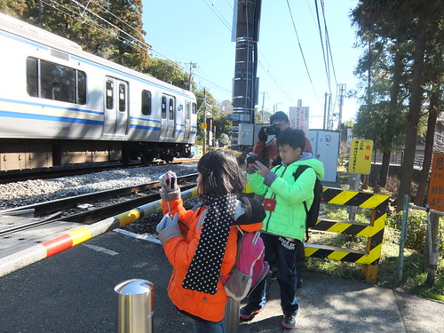](http://flickr.com/photos/33703965@N00/16327364160) 父子女看到電車 忍不住相機拍不停 [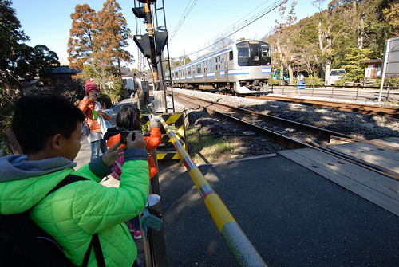](http://flickr.com/photos/33703965@N00/16327116828) 而我則愛拍他們有志一同的模樣 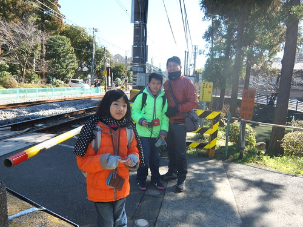 這段路很美 很有意思  有好些極具歷史或人文的老屋 博物館 茶屋 [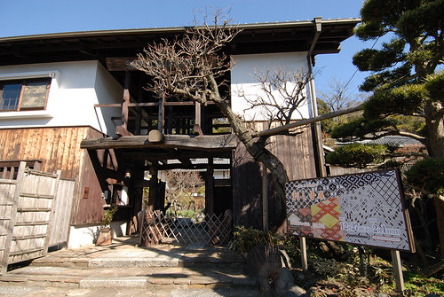](http://flickr.com/photos/33703965@N00/16513124591) 或漂亮的民居 [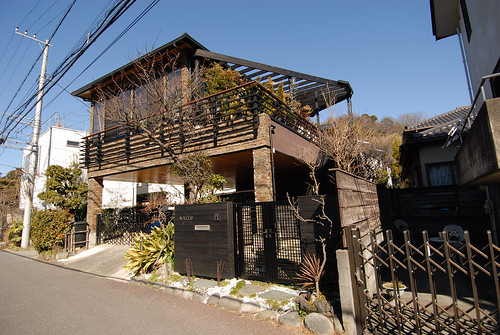](http://flickr.com/photos/33703965@N00/16328573829) 也有些個性文創小店 [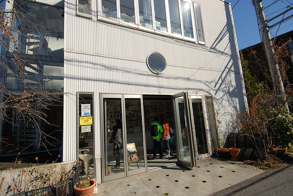](http://flickr.com/photos/33703965@N00/15894674263) 例如這家猫主題的藝術創作工作室 每個貓作品都讓人慧心一笑 [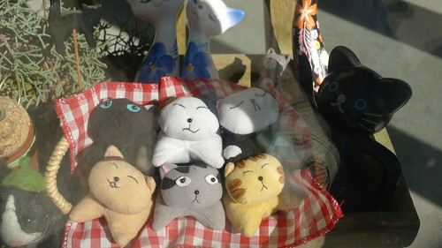](http://flickr.com/photos/33703965@N00/16514840565) 不過我說遠遠二樓上的這隻享受冬陽 睡著覺的貓胖嘟的最假最有趣 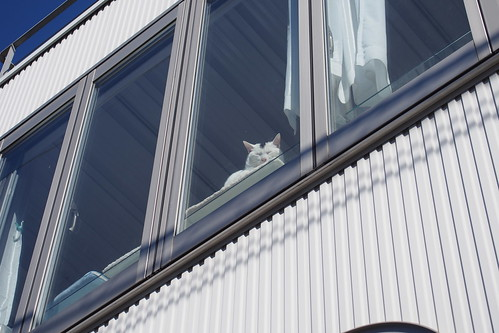 冷冷的空氣 溫暖的太陽 邊走邊拍 邊看邊說 很舒服愜意的散步(卻也導致下午行程很趕阿) 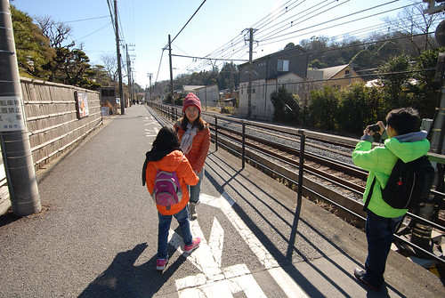 途經一長排的販賣機 又讓小人嘖嘖稱奇 [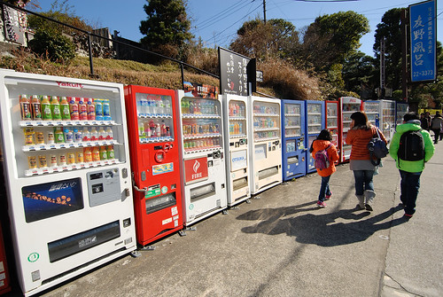](http://flickr.com/photos/33703965@N00/16513816322) 小學生總忍不住想投一罐 還很愛爸媽躲遠遠的水蜜桃口味  冰淇淋販賣機 也按耐不住來一支  我們說難得吃冰棒不會ㄑㄧㄡㄑㄧㄡ滴真不錯 0度左右的溫度 讓冰棒從一開始吃到最後一口都還是一樣口感的硬阿

路上經過五山第一也人氣第一的建長寺 ( 因為較多階梯步道所以一開始選定圓覺寺深入)  也經過一樣極具歷史的巨幅呂坂隧道  約莫半小時的路程來到鶴岡八幡宮  在這也總算見識到鎌倉的人氣與人潮  尤其小町通  我們順著人潮走了一小段若宮大道 沿途各式樣店很多但人潮多的我們僅僅只想路過  也轉進小町通 期待遇見網友們寫的許多名店名物 結果我們只光顧了仙貝專賣店  不擅逛大街的我們 沒找著用中餐的地方 也沒有太多心力與時間在這裡的熱鬧  索性直接前往下午行程起點的鎌倉車站  一樣是鎌倉 但我喜歡北鎌倉多很多!
