第二天下午是我與徹爸最是期待的行程 是我們的追星之旅 怎知卻不小心錯過了灌籃高手的鐵路平交道 引爆我們初次自助旅行的行前溝通不良 以致現在徹爸總用"我們吵架的那一天"來形容這一天! 雖然這一天的心情的確五味雜陳 但有好天氣的湘南海岸 療癒系的水母 還有富士山相伴的夕陽... 加上一家子的旅行因火花而更團結 其實這一天挺棒的! [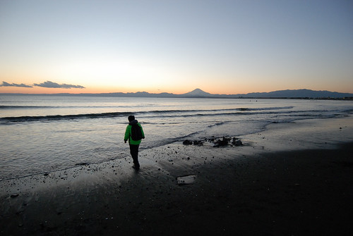](http://flickr.com/photos/33703965@N00/16488878426)

早上在北鎌倉散步的時間超乎預期 以致走到鎌倉站時已過下午一點 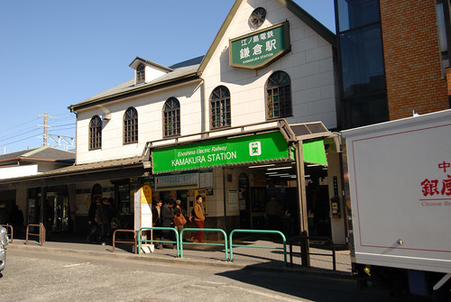 網路大當點 google map無法導航預期的餐廳   加上愛愛直嚷著想吃seven的飯糰 我們所幸在便利商店買幾個飯團與飲料後 等候電車時窩在月台上簡單解決我們的中餐 (話說在日本 隨便哪裡買的飯糰跟豆皮壽司都好好吃ㄚ! 讓愛愛每天都嚷著要買豆皮壽司) 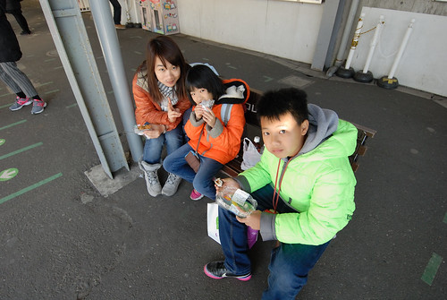 江之電是連接江之島入口藤澤與鎌倉的地上電車  全長10公里共15站 [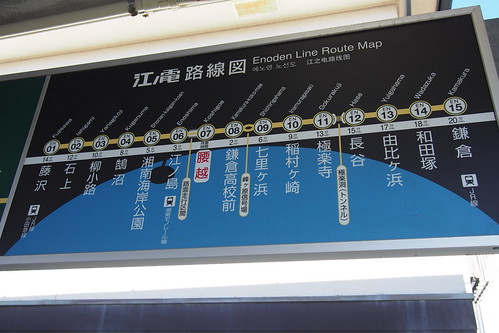](http://flickr.com/photos/33703965@N00/15892290804) 雖然原先就預期週日的鎌倉應該遊客如熾  還是有些訝異搭江之電的熱鬧人潮  江之電最吸引遊客來此的便是其延著湘南海岸線的行駛 尤其在七浬濱到鎌倉高校前這段 電車駛至這段 遊客無不被這豁然開朗的海景給驚豔 尤其是這樣的好天氣裡  我們在鎌倉高校前站下車  一來是站在月台便能眼底盡收這片海景 再者我們要去找傳說中的灌籃高手鐵路平交道 初當背包客的我們還抓沒到跟著人潮的訣竅 也還少了嗅景點的靈敏度 硬是往人少的出口走去 看到沒路還傻傻問路人怎麼繼續往前走 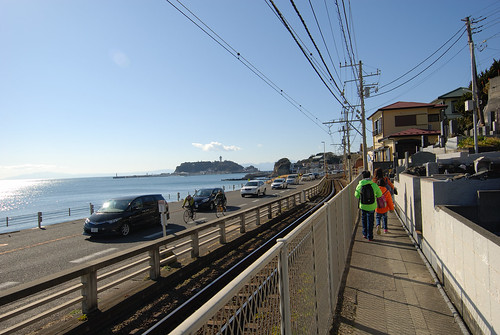 越走越怪 徹爸忍不住開口數落"都沒做好功課" 套徹爸日後說的"這一刻 我崩潰了" 而這當下我也一把火上來了... 加上徹哥急著要去水族館而焦躁不耐 更是往火上添油去 雖然自助行就是try error and try 左邊不對就回頭往右邊去就是 但因為一家子的鬧脾氣 我們硬是悶著頭一直往下一站的方向走去 [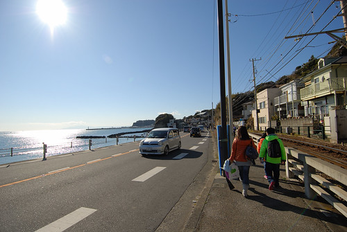](http://flickr.com/photos/33703965@N00/16328953237) 雖然我心中也會有遺憾 但今天的這片海真的好漂亮 好藍好閃耀 以致我潛意識的想 就這樣走下去也挺好 當作是一場美麗的誤會 [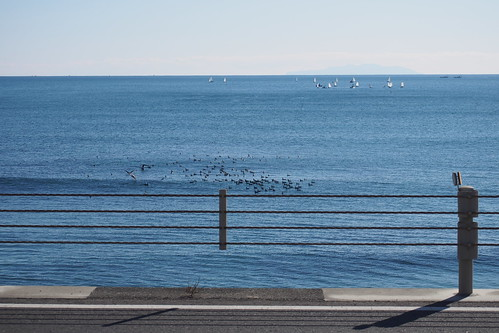](http://flickr.com/photos/33703965@N00/15892287194) 而且走近下一站"腰越"時 也意外近距離觀察到電車行駛於路面 [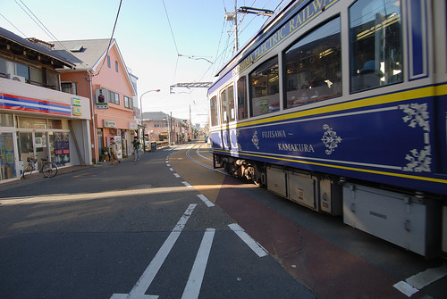](http://flickr.com/photos/33703965@N00/16513825072) [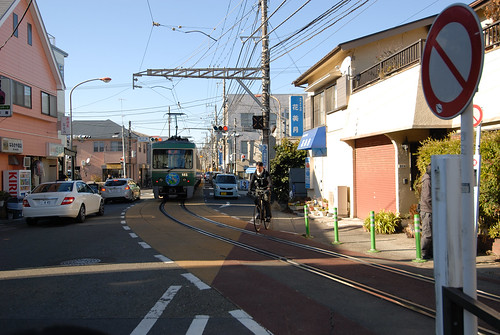](http://flickr.com/photos/33703965@N00/16514859275) 穿梭在民宅間 [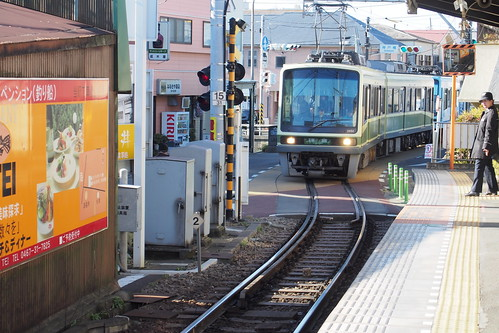](http://flickr.com/photos/33703965@N00/16514862465)  還有這隱於住宅區內的無人小車站 [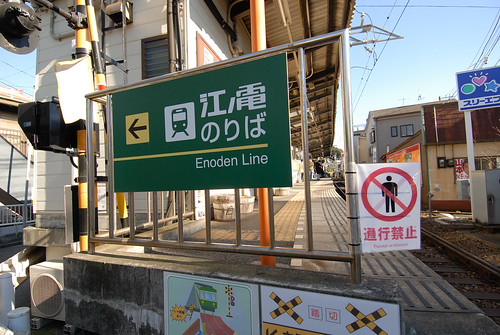](http://flickr.com/photos/33703965@N00/16327394810) 一切很是有趣阿! [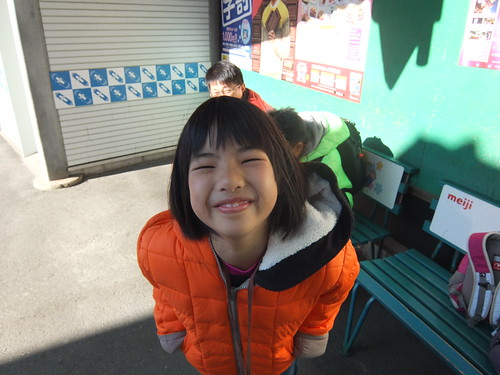](http://flickr.com/photos/33703965@N00/16327124778) 帶著小小遺憾 我們再上電車往江之島去 [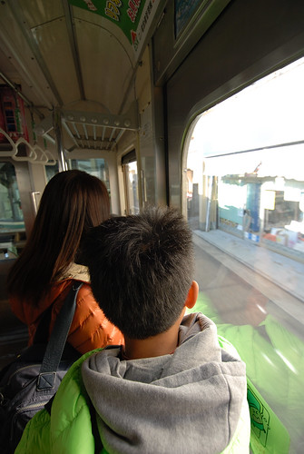](http://flickr.com/photos/33703965@N00/16513139951) 雖然是江之電但江之電並未直達江之島 從江之島站出來後要再走10多分鐘且需過橋才能到江之島 [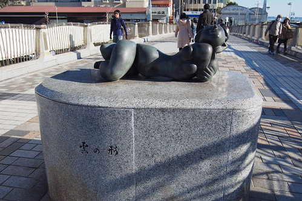](http://flickr.com/photos/33703965@N00/15894691853) 不過這一路的散步一樣的挺好的 [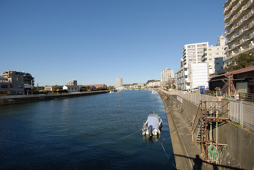](http://flickr.com/photos/33703965@N00/15894690553) 途中經過的小田急電鐵江之島站反到離江之島近很多  且江戶風格的車站外體太讓人過目難忘 [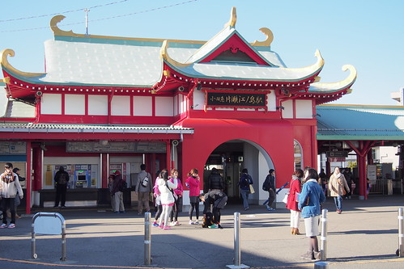](http://flickr.com/photos/33703965@N00/16327401120)

我們的目的地並不是江之島 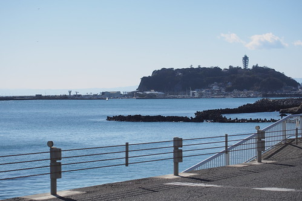 而是往江之島路上的新江之島水族館 雖然已經近3點 離五點的閉館時間所剩不多 我們還是買票進場(不能再有遺憾..) [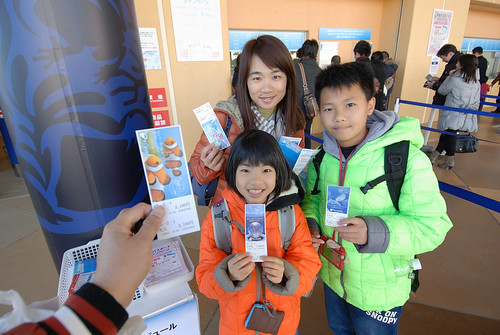](http://flickr.com/photos/33703965@N00/16327403240) 入館後的走道上 大片玻璃窗外映入眼簾的是毫不遮掩的富士山 哇! 雖然本來就知道鎌倉可以看到富士山 卻完全沒想到是這樣的大視野阿 這下子本來在水族館閉館後的黃昏再去找灌籃高手平交道的打算在我腦海頓時消滅 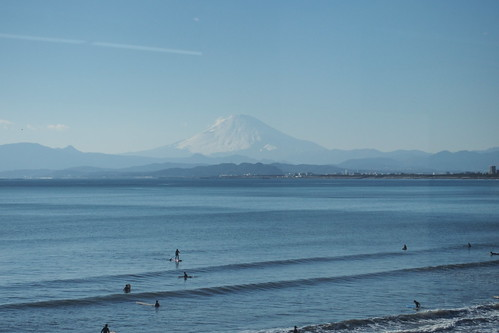 館內展示以鎌倉週邊的相模灣海域為主軸 非常豐富且漂亮 每個大小水缸徹愛都不放過的看個仔細 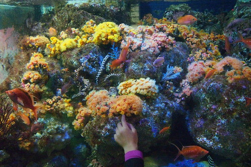 其中大水族缸內的這"片"群游魚群最讓我們讚嘆 [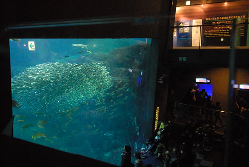](http://flickr.com/photos/33703965@N00/16514871275) 魚群仿若有人指揮似的舞著緞帶 [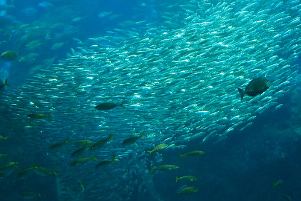](http://flickr.com/photos/33703965@N00/16328965767) 而我們就像在看一場精彩的舞蹈表演 [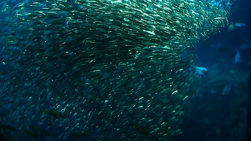](http://flickr.com/photos/33703965@N00/16514813155) 看得瞠目結舌 [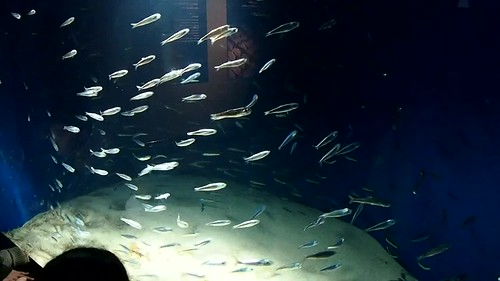](http://flickr.com/photos/33703965@N00/15892241774) 相模灣大水槽裡有著各式魚群  也有著隧道設計讓遊客感受魚群在你身邊週游 這隻魟魚我們覺得最可愛 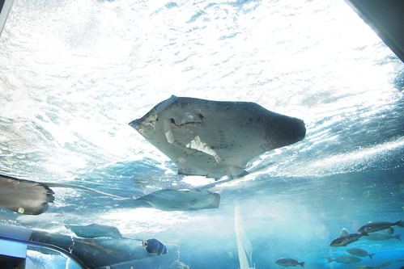 漂亮弧線的上揚嘴角就像直衝著你笑 非常的討喜 [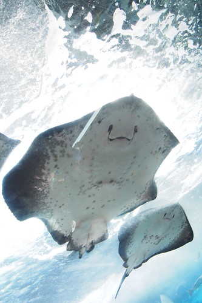](http://flickr.com/photos/33703965@N00/16513148561) 大水槽也有不少洞穴的設計  我們很幸運的看到一隻大海龜休憩其間且動身遨游 [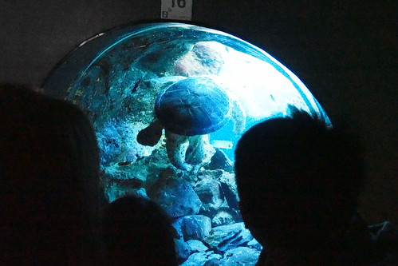](http://flickr.com/photos/33703965@N00/16327407030) 同時看到旅人生動速畫下海龜的回眸之間 (在館內我們與這位旅人交遇好些次 每次都忍不住偷窺她的筆下) 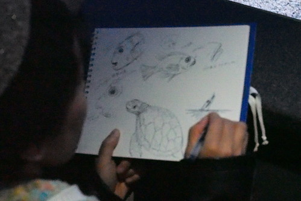 這裡也有餵食秀的表演 可惜我們只有看到後面一點點 [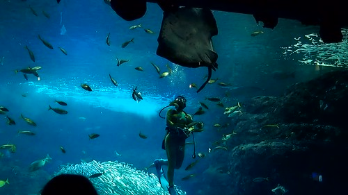](http://flickr.com/photos/33703965@N00/15892243844) 伴著徹愛仔細又慢慢的從入口看下來 總算來到我們最是期待的水母幻象廳 [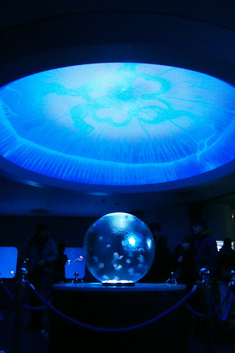](http://flickr.com/photos/33703965@N00/16328974387) 當初日劇"流星"的重要場景就是在這裡阿! 我們也要來感受竹野內豐對水母的濃郁感情啦! [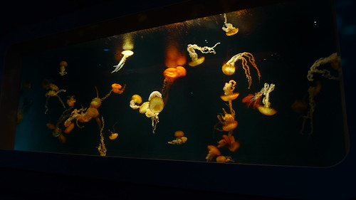](http://flickr.com/photos/33703965@N00/16488861156) 其實水母展示區並不大 但真的好多各式風采的水母 [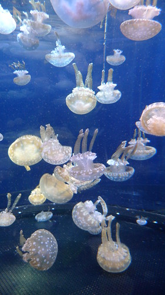](http://flickr.com/photos/33703965@N00/16327400200) [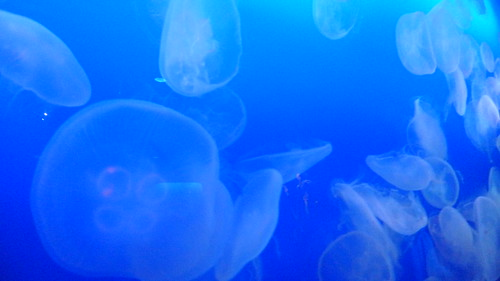](http://flickr.com/photos/33703965@N00/16514867405) [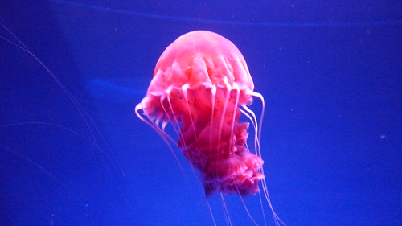](http://flickr.com/photos/33703965@N00/15892295494)[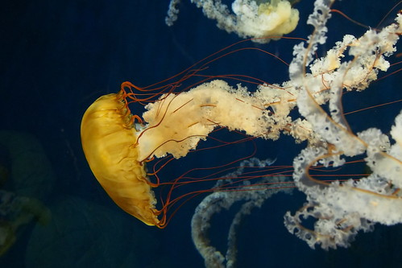](http://flickr.com/photos/33703965@N00/15892306164) [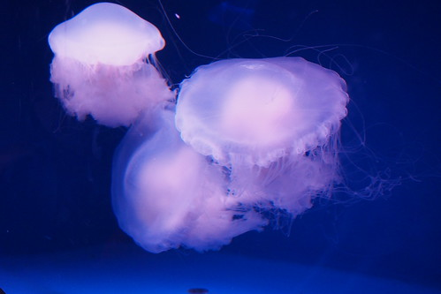](http://flickr.com/photos/33703965@N00/16327144418)[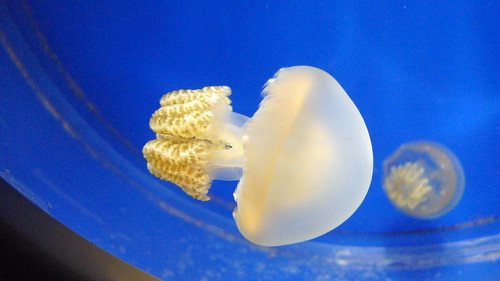](http://flickr.com/photos/33703965@N00/16327402780) [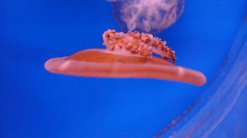](http://flickr.com/photos/33703965@N00/16513834562)[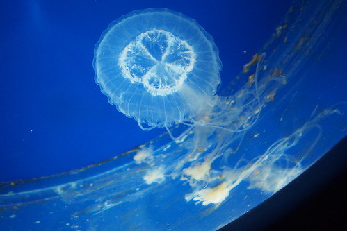](http://flickr.com/photos/33703965@N00/16328970317) [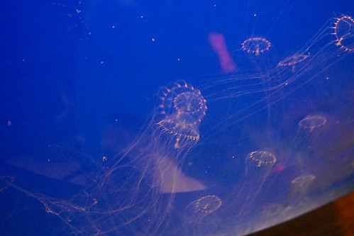](http://flickr.com/photos/33703965@N00/15892311284) (超可愛的迷你水母寶寶) [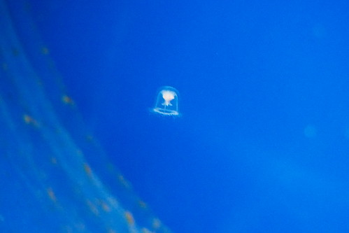](http://flickr.com/photos/33703965@N00/15894701983) 我們貼在每個窗檯前看著裡頭水母漂阿飄 [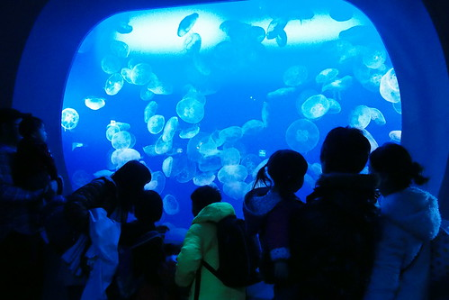](http://flickr.com/photos/33703965@N00/16514876175) 讚嘆著水母怎麼可以這麼可愛 這麼無慮... [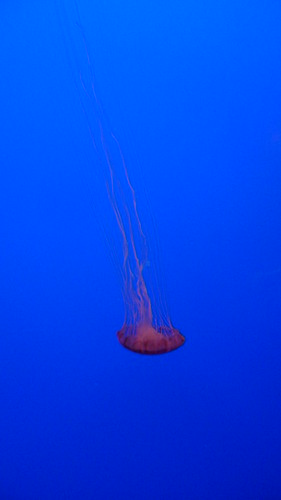](http://flickr.com/photos/33703965@N00/16514867615) 我說水母就像穿上不同顏色款式禮服的新娘子們 雖然顏色不同 姿態不同 但一樣搖曳著薄紗般的裙襬 優雅的舞著 [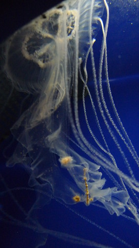](http://flickr.com/photos/33703965@N00/16328962607) [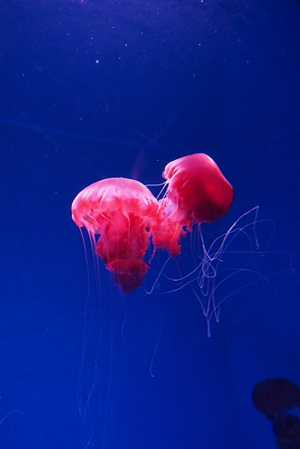](http://flickr.com/photos/33703965@N00/16328969747) [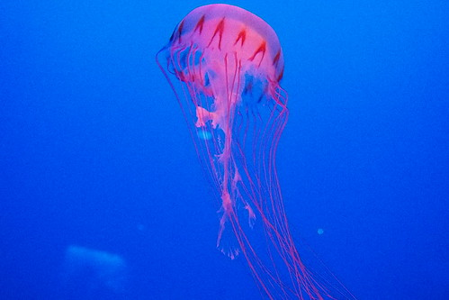](http://flickr.com/photos/33703965@N00/16514878445) [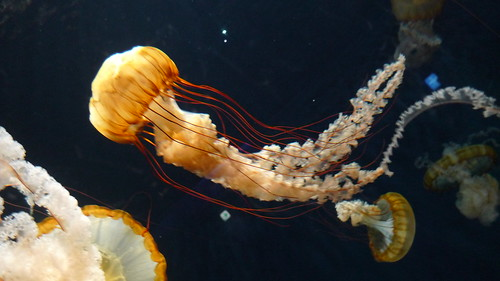](http://flickr.com/photos/33703965@N00/16514867455) 看著這些水母 人都被療癒了! (我硬是要徹爸幫我拍會黑咪嘛七的人) 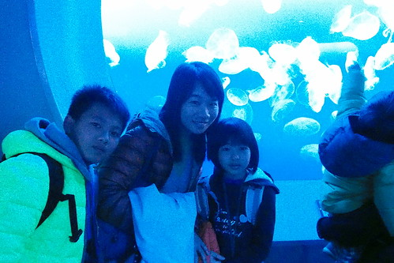 我們在水母廳療癒很久 直到近關館的五點才慢慢往出口方向移動 經過的不少展示區剛好都在進行可能是每日關館前的清理與餵食 [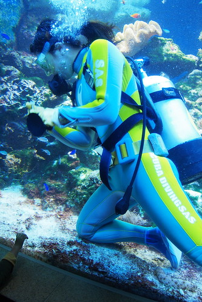](http://flickr.com/photos/33703965@N00/16327416850) 企鵝們乖乖排隊等候一個接一個的餵食 [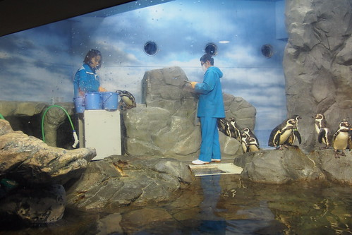](http://flickr.com/photos/33703965@N00/15892311414) 海瀨也聽從指示的領便當 最後我們往戶外區走  意外來到海龜的家  覺得日本很多建設 很多園區其實都小小的  甚至舊舊的 但卻都很清潔 維護運轉的很好 而生活期間的生物們也當然都很有精神  雖然只有短短二小時  礙於來的太晚也沒機會看海豚 海獅的表演 但卻已足夠讓我們深深喜歡這個水族館  我們依依不捨 享受這裡的夕陽餘暉  還有這裡的好視野!  雖然三天後我們就要去富士山下 今日算是個意外暖身版  很棒的一個午後阿~ 步出水族館後 我們往後方的海水浴場區去 (這裡是竹野內豐與上戶彩常坐著看海談心的地方 嘿嘿~)  看著太陽漸漸隱於海平線之後  看著遙遠但卻感覺那麼近的富士山  這樣的關東夕景 讓今日的鎌倉行更是值回票價  雖然跟徹爸鬧著彆扭 還是要在美景當前來張合照(因為生氣而抱憾就不好了)  徹哥按耐不住的玩起沙子  佩服他在這低溫的海邊有勇氣出手玩沙  他興高采烈的做了一個台灣 雖然被我笑"不說還真看不出來是台灣"  還大辣辣寫下台灣二字  小學生的愛國心在國外一整個不客氣的表現  雖然水很冰 手很凍 徹哥肯定難忘曾經的這麼一個傍晚  這樣的關東夕景!  天黑了 明月相伴 我們走回江之島站  路上少了白日的燥氣 多了份暖暖的愜意  一家子也更有心思留意沿途的店家與有趣的事務: 車站口 隨著四季穿著不同衣裳的鳥兒  我們今天就是拿事先在台灣買的平溪卷兌換江之電一日卷的使用  雖然是媽媽基於省錢的歐巴桑心態 但剛好有機會可以這樣的兌換還蠻具意義的  晚上回鎌倉的班次比起下午 人潮少許多 甚至在半途 四節車廂縮減為二節 我們被告知要移往前方車廂  回到鎌倉後 我們再到若宮大道上找中午導航定不到的餐廳 雖然又因為網路太遜而差點引爆我與徹爸間的火 幸好關鍵一刻好視力的徹哥看見前方招牌有英文字 沒錯 就是阿母做功課看到的"Bowls"  幸好! 我們不用站在街上徬徨要去哪吃飯 (這是徹爸很抗拒自助行的理由之一) 幸好! 我們有來到bowls吃到美味的餐點 (雖然點餐到上菜間 我與徹爸好好的激烈溝通一番)  雖然本來就是衝著bowls的招牌吻仔魚蓋飯還有吻仔魚pizza, 吻仔魚義大利麵而來 卻因為看不懂菜單 晚餐一整個很吻仔魚 除了上述 還包含了吻子魚生菜  吻仔魚玉子燒  阿彌陀佛 我們今天吃了上萬隻的吻仔魚!  以後不該如此了... 不過今晚的每盤都很好吃 徹愛讚不絕口 只可惜 激吵之後的我們並未留下太多照片回憶 殘念

鎌倉最後我們買了二塊蛋糕帶回飯店吃 雖然蛋糕不是太好吃 但甜點甜了嘴也緩了心 明日開始肯定是好日! 因為我們為了更好而爭吵 溝通過了...  期待接下來更厲害的行程~ 
