東京第三日 繼荒川都電沿途玩耍後 一行人繼續趕路到三鶯的吉卜力美術館 充滿每一部宮崎駿動畫身影的美術館果然讓小人看的哇哇大叫 尤其縱情爬在龍貓巴士上 躺在龍貓巴士裡 玩著數不盡的小黑鬼 小人一個個笑到極至 而結束這一日預訂行程後 徹爸還佛心來著 許徹哥來去唯一的航海王專賣店 這一日很鐵腿 但是充滿遊樂的小朋友日 無誤!  

我們預約的是下午四點的場次 那一天很趕的來到三鶯站 很趕的搭公車到美術館 再接著很趕的入園入館 因為是最後一個場次 距離閉館的六點只有二小時 我們實在不想耽擱太多而減少了停留時間 [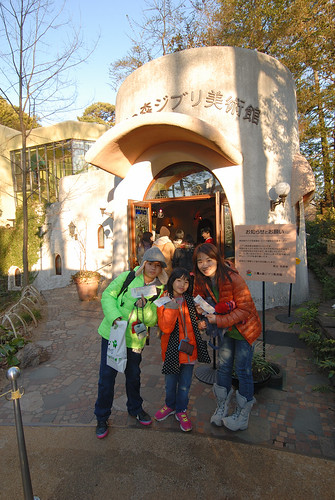](http://flickr.com/photos/33703965@N00/16488934706) 冬日裏的四點時分 好天氣的太陽光影開始柔和 襯著美術館建築更是有氛圍 可惜我們沒有時間趁著太陽西下前多觀賞建築本體 [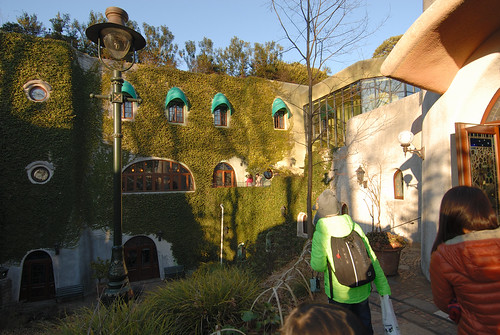](http://flickr.com/photos/33703965@N00/16327214148) 在還沒搞不清狀況下 我們跟著人群進入大廳 開始我們的觀賞 沒有路線指標的館內 不規則的空間設計 果然讓人就如迷路般的探索著 我們邊欣賞一樓展示的同時 也邊等著土座室的動畫播放 幸運的只排了10分鐘隊就看到只有在美術館內才看的到的獨家動畫 以女孩與小狗為主題的短短20分鐘影片 讓一直想養狗的徹愛看的更是嚮往小狗相伴的日子...

我們隨興所至的參觀了大師的工作室 還有許多難得可見的手稿 真是大開了小人眼界 但還是比不過那個好大好大的龍貓巴士 那一刻 小人的眼睛亮的好大 而當小人幾乎是獨享龍貓巴士而盡情躺在其中 爬在其上 坐在巴士頂上時 看著小人笑開懷的大人仿佛也圓了小時候看龍貓後想搭龍貓巴士的夢想  小人在門內的龍貓巴士玩很久(不知是否最後一場所以小朋友很少) 我們只好門外的庭院看風景 拍照  把握可以拍照的戶外  [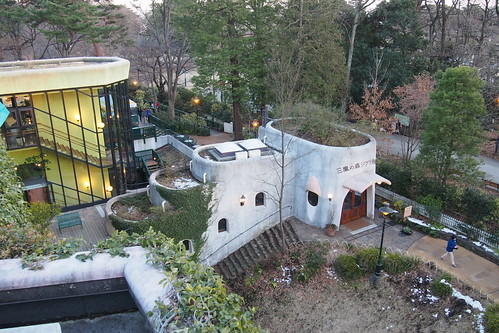](http://flickr.com/photos/33703965@N00/15939860283)[ 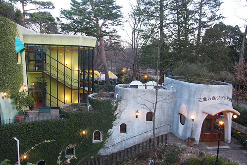](http://flickr.com/photos/33703965@N00/16558368121)如果不是我們要求  小人應該在龍貓巴士玩到閉館都可能 但阿姨說 我們還沒去找機器人ㄋ [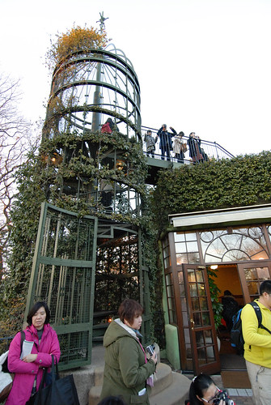](http://flickr.com/photos/33703965@N00/16327478150) 沿著鐵籠裡的旋轉樓梯而上 我們見到了天空之城裡的機器人 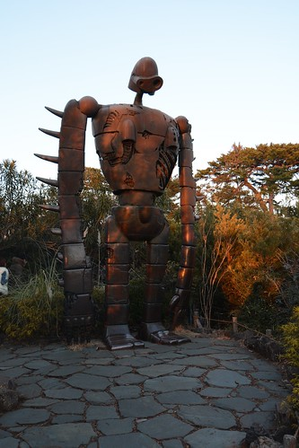 不可避免的來張美術館經典遊客照 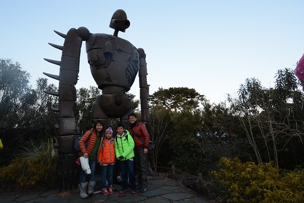 再往一旁的林間小徑探秘去 [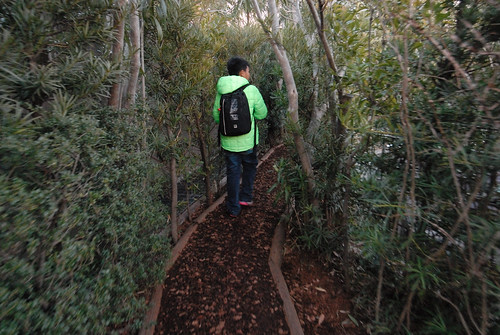](http://flickr.com/photos/33703965@N00/16488930366) 小學生發現了飛行石 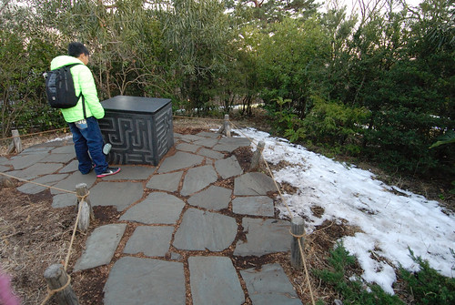 老實講 除了龍貓外其實不精其他部動畫的我並不認識這飛行石 有賴小學生們的解惑與帶來興奮感 [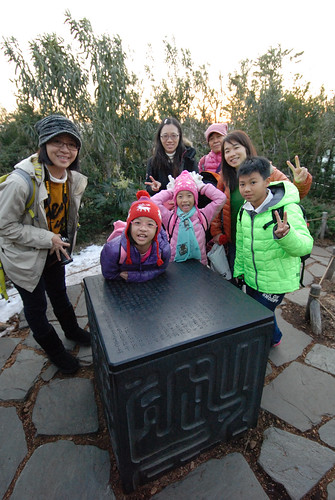](http://flickr.com/photos/33703965@N00/16513217281) 往回走 看見機器人的背影 隱於荒煙漫草與夕陽下 感覺有些落寞孤單  雖然最後一場的參觀 時間有些緊湊 但這時刻在美術館看見的夕景很漂亮  而亮燈後的美術館也更多份不同於白日的溫暖氛圍 [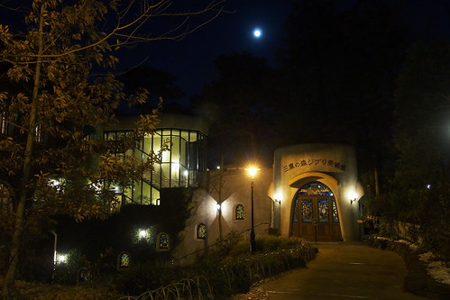](http://flickr.com/photos/33703965@N00/16372360198) 閉館時間後我們依依不捨離開館內 流連在戶外庭園 阿姨說 還有龍貓售票亭還沒看著說... 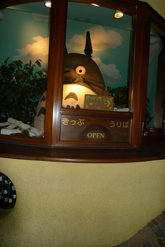 從側門入館的我們總算見著守在售票亭內的大龍貓  好大! 好大!! 真的好大的龍貓!!!  好想抱抱他...... 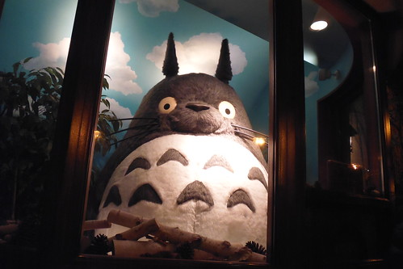 台灣自由行旅客必朝聖的吉卜力美術館  我們圓滿達陣!!!  [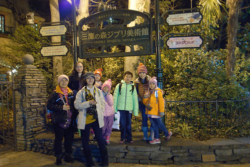](http://flickr.com/photos/33703965@N00/16488926206)

本來打算趁著進美術館前的時間順道先去臨近井之頭公園散散步 沒想今日行程大滿 離開美術館時天也黑了   我們只能經過公園圍牆外直往吉祥寺車站 我跟阿姨的旅行都不是以吃為目地 所以我們並未有非吃不可的名店名物 今天的晚餐同中餐都是在搜尋資料時看見會在剛好的用餐時間剛好經過的路上  連鎖品牌的蛋包飯店 很合小人們的喜好與胃口  相較於台灣 日本的兒童餐不論餐具,餐點, 給小玩具的用心度都很令人讚賞 小朋友吃的開心也吃光光 [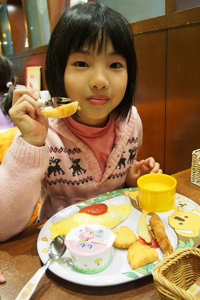](http://flickr.com/photos/33703965@N00/16372542540) 從SS到L四種尺寸的蛋包飯選擇(這是SS) 加上不同口味的炒飯與醬汁搭配可能 讓不擅點菜的男生們看的霧煞煞 急性子的媽媽很容易不小心就又爆 哈 [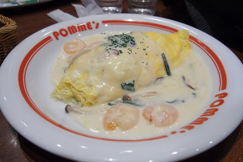](http://flickr.com/photos/33703965@N00/16558880792) 幸好四個人的餐點都讓人很滿意 而轉盤一輪也讓每個人都吃到不同口味餐點 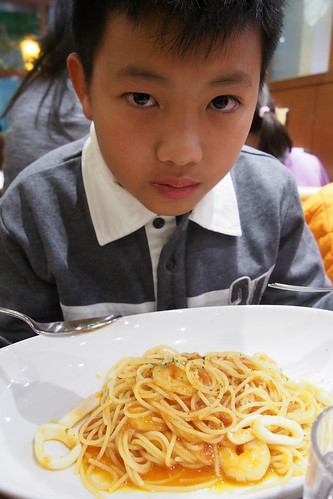 吃完晚餐不過晚上7點多 徹哥一直問"接下來要去哪" 我說"回飯店吧" 徹哥一直說"還這麼早" 我說"你們不是喜歡早點回飯店休息" 徹哥又一直說"還這麼早 這樣很可惜..."   徹哥好像體會背包客不把腿走斷的捨不得心情 不過為娘想也知道 他想去澀谷的航海王專賣店 這是他行前除了迪士尼外查好的資訊 其實我跟徹爸在下午就討論過 今晚是最適合去專賣店的時間 但我們還是在最後一刻才告訴徹哥 今晚我們抱著鐵腿決心陪他去澀谷圓夢 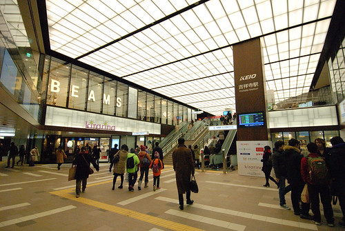 於是我們來到了不屬於我們的攘來熙往熱鬧澀谷 來到徹哥從沒想過自己有這麼一天可以來到的航海王專賣店  電梯裡的裝置讓兄妹一開始就熱血沸騰起  一直以為一年半載後才有可能來日本的徹哥直怪我隱瞞太久 讓他來不及存夠零用錢 但還是豪擲他那所有的一點點零用錢以及我們這次旅行給的買紀念品coda 一整個真的就是圓夢般的容光煥發 興奮不已 游走於店內  其實很多東西台灣就有賣 有的甚至還比較便宜  但有自己從日本扛回去的虛榮與感情 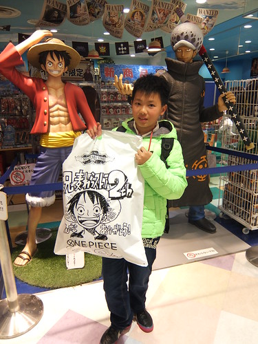 而我們也成就了自己陪著小孩圓夢的偉大 (哈哈哈! 其實這才是我與徹爸的最大心機)  徹哥買了一頂他最喜歡角色"羅"的帽子 這一刻我才認識這號人物  才恍然明白兒子崇拜這樣帥氣的人物 [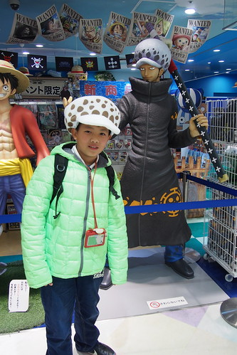](http://flickr.com/photos/33703965@N00/16373693949) 我說徹哥戴上這頂帽子真的還挺帥 [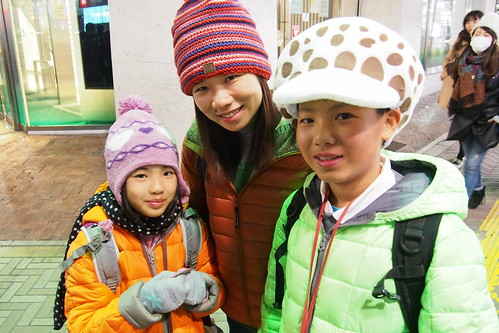](http://flickr.com/photos/33703965@N00/16559978675) 也佩服他接下來的幾天戴著這頂魔菇帽闖蕩日本  前幾天看日劇看到一句話"雖然旅行的目的地一樣 但每個人的旅行目的不一樣  所以讓每個人都開心是最重要的" 我想這次旅行有達成目的的徹哥 是有開心的!

同場加映: 愛妹雖然也跟著哥哥看航海王 幸好還沒有很入迷  而明明一開始笑哥哥竟然買這樣帽子的她 看到哥哥帥氣的模樣也忍不住搶著(威脅利誘)戴蘑菇帽 [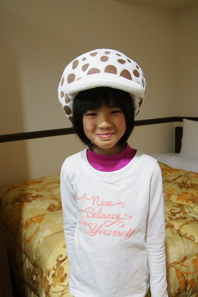](http://flickr.com/photos/33703965@N00/16533934076)
