今天玟姿問我的day3打算寫幾篇 哎呀~ 被這麼一問 我怎麼好意思這麼愛寫 還這麼漏漏長... 實在每篇都是發乎真心的紀錄些什麼 留下點什麼阿!!! 前幾天我讓徹哥看我寫的水母(day2) 徹哥邊看邊笑 看完大讚"媽媽你寫的真好看"還欲罷不能的一篇一篇往前看 真快! 想當初是為了紀錄徹哥開始上幼稚園而開始寫BLOG 一晃眼當初的小主角已經快要比我高了 只是寫BLOG十年 每次一寫就字很多上身的習慣卻一直沒改變...

荒川都電的飛鳥山站是一開始就最期待的地方 美味的家庭餐館 奇妙的都電大轉彎 以及孩子的遊樂城堡 滿足我們的胃 我們的眼與我們的心 很值得的荒川都電一日遊! 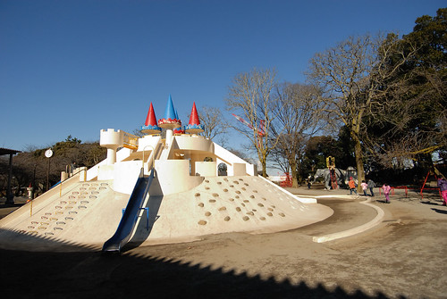

刻意也剛好的在中午時分到飛鳥山 圖的就是來位於車站口 大轉彎處的家庭餐館吃飯 [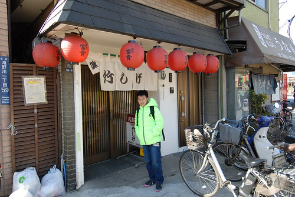](http://flickr.com/photos/33703965@N00/16514962625) 這是一個我很喜歡的部落客所介紹 雖然從其文章就可看出這家餐館的'家庭'味 入店門後的我們還是驚訝於眼前這樣狹長甚至可用擁擠形容的空間與家常氛圍 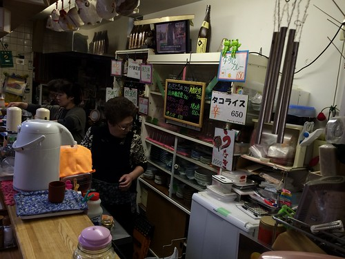 我們浩浩蕩蕩的九個人幸運的有足夠的位置可以一起入座 只是我們九人一坐之後也幾乎把店給包了 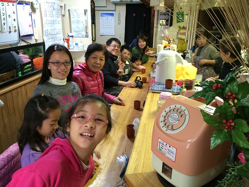 沒有菜單 沒有照片可看 我們只能對著吧檯後掛著的菜單亂比一通 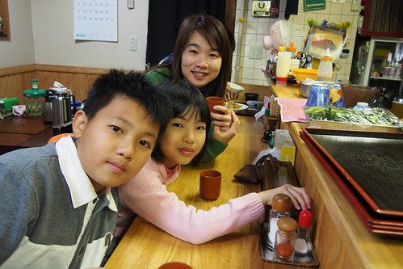 首先上桌的是三碟青菜 漬物 [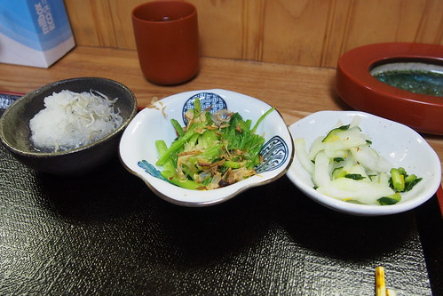](http://flickr.com/photos/33703965@N00/16559100642) 我們好奇而加點的烤南瓜 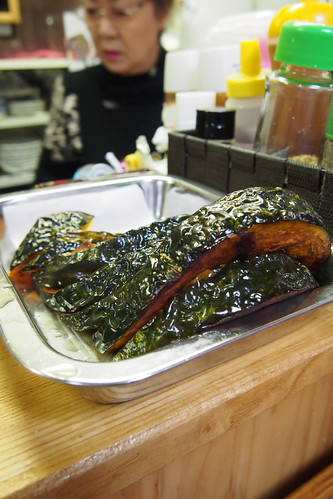 完全鎖住甜味又鬆軟的南瓜讓向來不吃有形南瓜的徹爸也驚豔 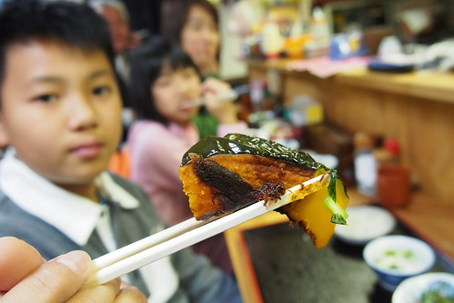 三位媽媽忙一會後一口氣上的主菜: 我只看的懂"鍋"與'季節限定"而點的 應該是泡菜豆腐鍋 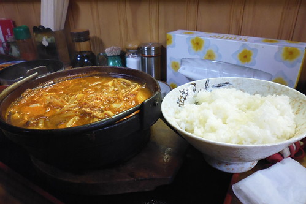 唯一之前看過介紹而知道是什麼的油淋雞\*2 (外酥內軟的日式炸雞) [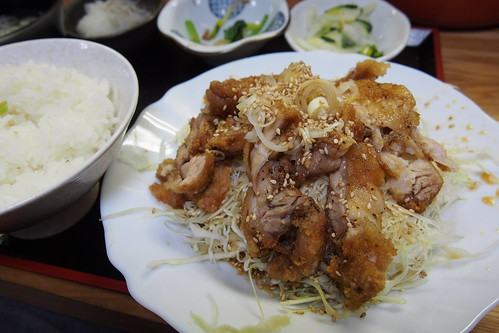](http://flickr.com/photos/33703965@N00/16372745230) 徹哥的只看到"丼"就點的丼販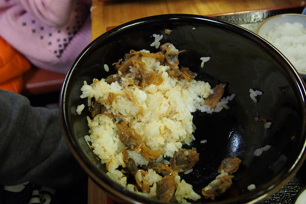 都吃大半了 徹爸才想起要將這簡單但鮮美好吃的丼飯照相 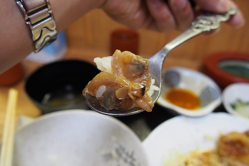 漬物 主菜之外還有味增湯 以及飯後小人的蘋果汁 大人的咖啡 加上每客的大碗飯 我們吃的好撐好滿足 而且每客餐不過700円上下的價格  CP值超高! [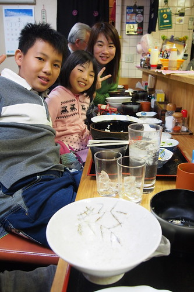](http://flickr.com/photos/33703965@N00/15937627734) 好像是二位姐妹+二位母女的三位媽媽一起在小小吧檯裡忙著很有趣 雖然我們的日文一句都不會說 還是靠著比手畫腳跟google翻譯與她們熱情交流一番 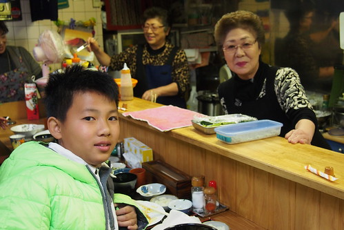 我們的很難得家庭餐館體驗  美味又溫馨! 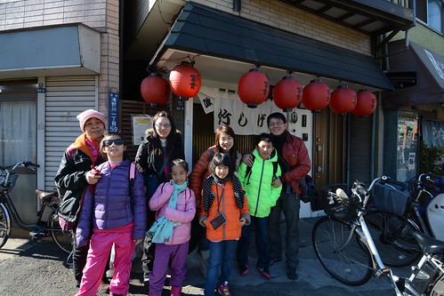 

吃飽飯後 在飛鳥山的重頭戲也才開始 首要之務去大天橋 [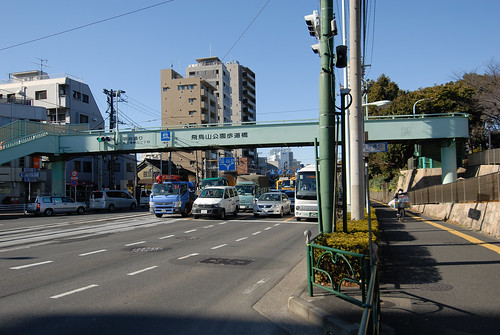](http://flickr.com/photos/33703965@N00/16513921642) 站在天橋上等待... [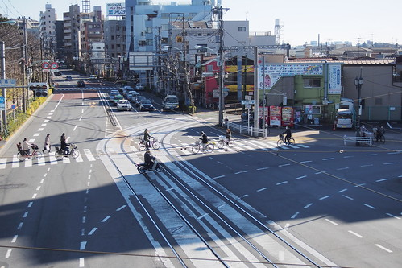](http://flickr.com/photos/33703965@N00/16373895379) 等待著都電的大轉彎 [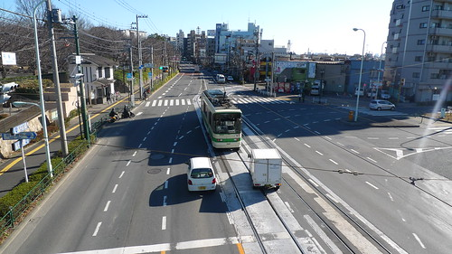](http://flickr.com/photos/33703965@N00/15894792453) [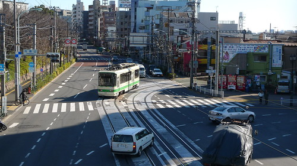](http://flickr.com/photos/33703965@N00/16329060207) 等待著看都電與汽車排排站等紅綠燈 [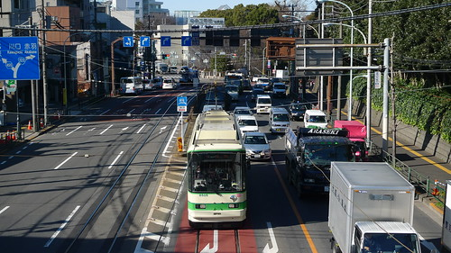](http://flickr.com/photos/33703965@N00/16328690569) 等待著都電來來往往的交會 [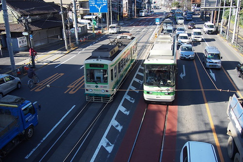](http://flickr.com/photos/33703965@N00/15937584064) 真的很有趣的都電觀賞 [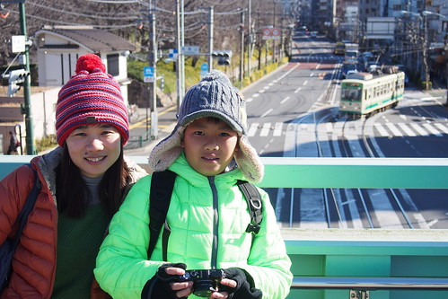](http://flickr.com/photos/33703965@N00/16560168525)

走過天橋的另一邊是飛鳥山公園 走在倘大的公園裡 剛吃撐飯的小人有些意興闌珊 我說公園裡有座大城堡 看誰可以先找到 果然所有小人精神全來的往前衝去 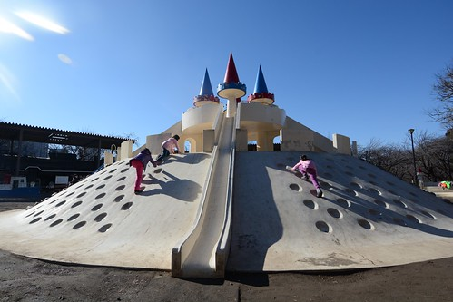 看見城堡 大家更是一古腦的往上爬 [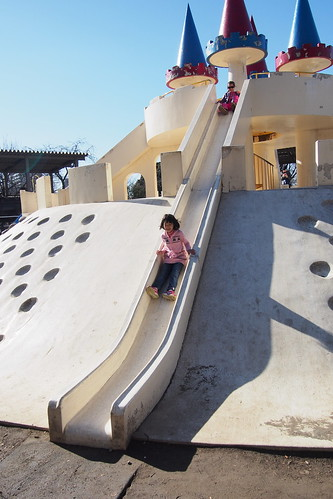](http://flickr.com/photos/33703965@N00/16373850879) 縱情享受城堡溜滑梯的快感 [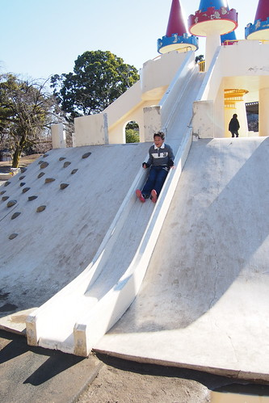](http://flickr.com/photos/33703965@N00/16534115366) 藍天下的城堡太吸引人 連大人也想爬上一探究竟 [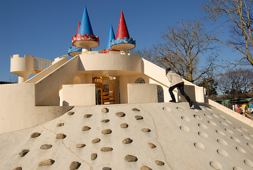](http://flickr.com/photos/33703965@N00/16327495940) 滿足佔領城堡的童心 [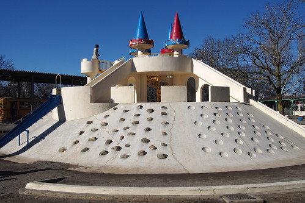](http://flickr.com/photos/33703965@N00/16559006412) 開闊自己的視野 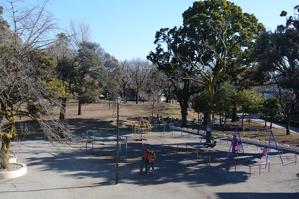 小人急切的一樣玩過一樣 盪鞦韆 [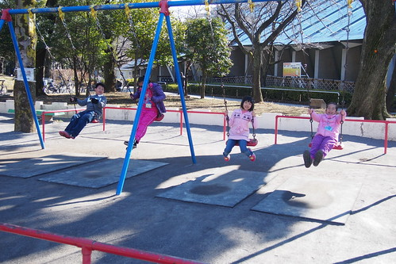](http://flickr.com/photos/33703965@N00/16372459828) [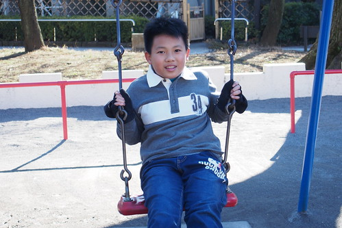](http://flickr.com/photos/33703965@N00/16534093256)[ 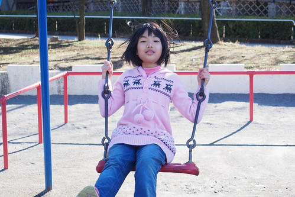](http://flickr.com/photos/33703965@N00/16372436348)轉圈圈 [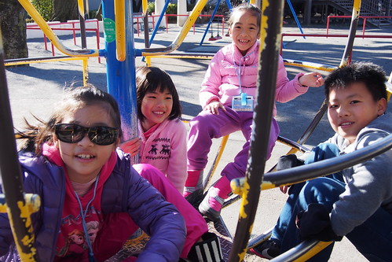](http://flickr.com/photos/33703965@N00/16560116315) 鐵格子爬上爬下 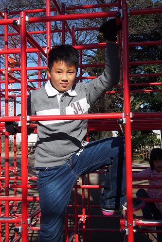 日常的遊戲與風景  卻讓小人玩的滿頭大汗 看著小人玩的這樣開心 我們也跟著開心 high翻 [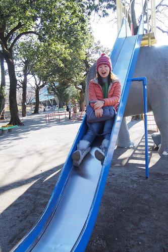](http://flickr.com/photos/33703965@N00/15937570294) (徹爸還來個卡卡西嘞) [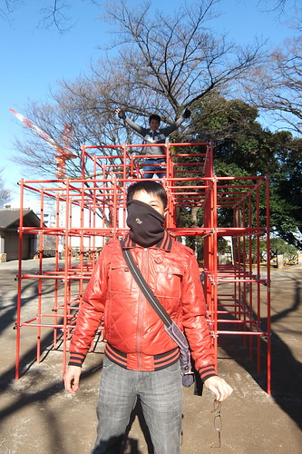](http://flickr.com/photos/33703965@N00/16327233768) 小人流汗之後喝著涼冰冰的水更是大喊過癮 [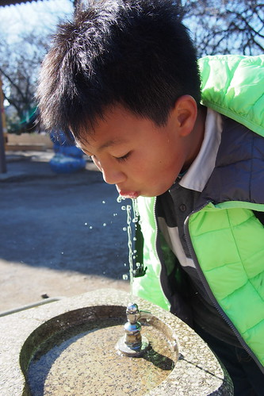](http://flickr.com/photos/33703965@N00/16372640770) 不亦樂乎~  前一日我與徹爸的不愉悅 在今日看見小人在遊樂園與公園玩的這樣開心後 一切都煙消雲散也值得了

雖然小人們直嚷著還不夠 還要繼續玩 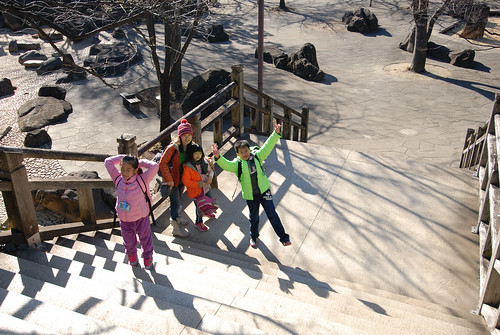 礙於四點有預約的行程我們還是得依依不捨離開飛鳥山 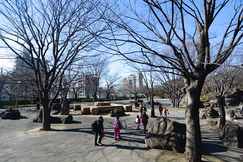 繼續往我們的下一站去 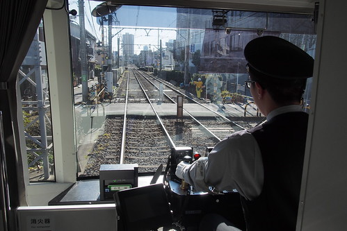 不同區段的都電有著不同的風景 [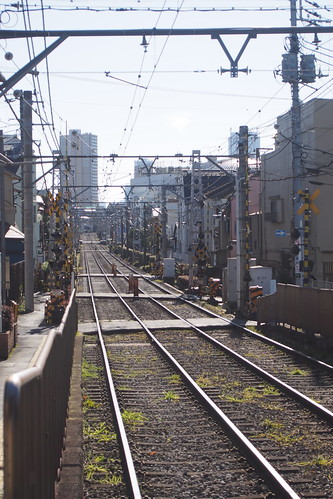](http://flickr.com/photos/33703965@N00/16373806379) 即使我們只能在車內隔著玻璃看著沿途一站站的過去 卻也深刻感受到不同以往印象的東京風情 [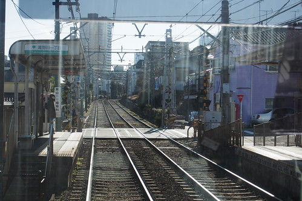](http://flickr.com/photos/33703965@N00/16534068546)

我們接著下車的站是大塚站 只因這裡有都電紀念品的販售(唯一有售票窗口與站務人員的"大"站) 原以為像台北捷運商品部的規模 沒想到竟只是月台邊的小小售票窗檯 徹愛各買了都電造型小車與時鐘後窗檯還遞不出來有勞站務人員開門送出[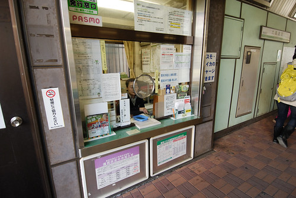](http://flickr.com/photos/33703965@N00/16513227731) 我們的都電一日最後來到鬼子母神站 這一幕鐵道的起伏畫面很是經典 (可惜沒有時間等電車經過) 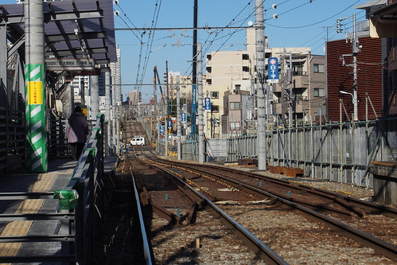 繼第一日的上野湯島宮祈福小學生課業 第三日我們再到鬼子母神堂祈福小人的平安長大 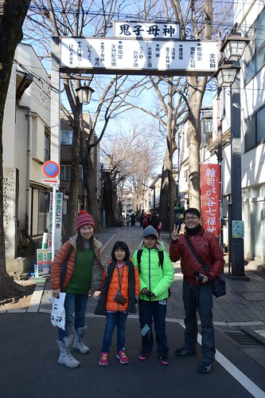 往神社的表參道二旁都是漂亮的住家房子 看的我們好生羨慕這樣的居住環境 [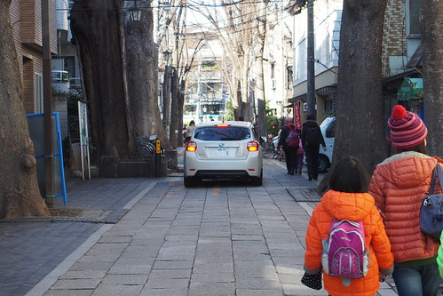](http://flickr.com/photos/33703965@N00/16558957642)途經案內處 裡頭有關於這個地方文化與再造的介紹 可惜我們只能看圖會意 不過小人被送紙陀螺小禮物很開心 [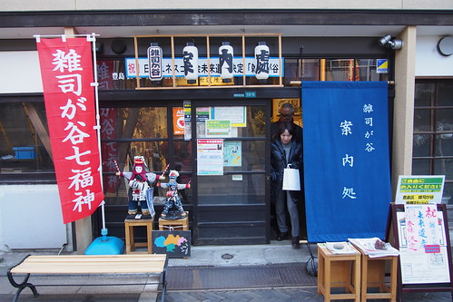](http://flickr.com/photos/33703965@N00/16373777829) 其實我們不太拜拜的 只是來日本沒去神社走一走實在少個風景與體驗 [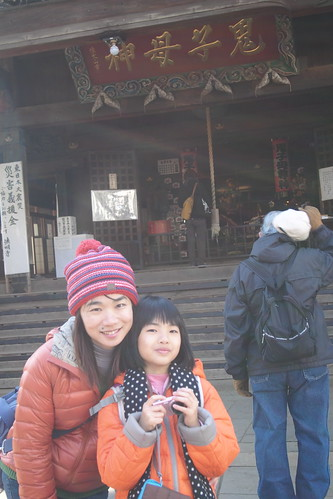](http://flickr.com/photos/33703965@N00/15937489784) [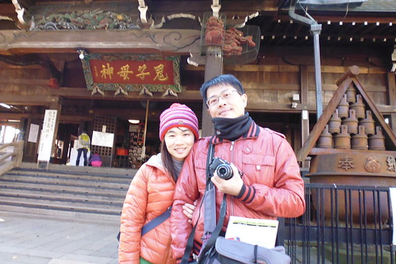](http://flickr.com/photos/33703965@N00/15892388474) 我喜歡鬼子母神堂這裡的風景與周圍寧靜氛圍 [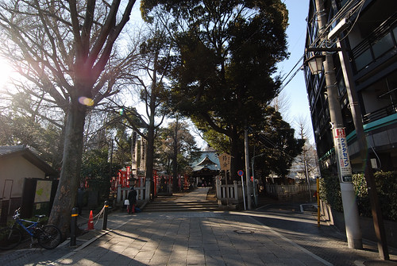](http://flickr.com/photos/33703965@N00/16329045727)  [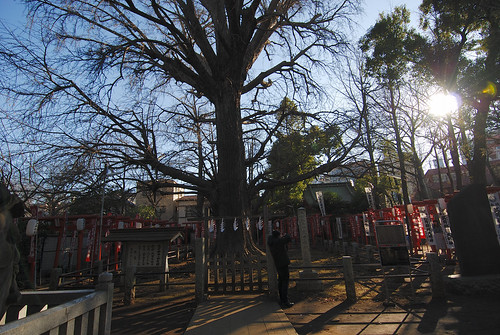](http://flickr.com/photos/33703965@N00/16560067035)       到此 我們的荒川都電一日也要劃下句點   雖然今天玩的很開心 但我們還有好多風景沒看 好玩的地方沒去 如果有機會 荒川都電值得再一日 甚至更多日的一路玩下去阿! 而話說day3還沒完阿!!!
