二年前徹爸不知那的心血來潮買了本"都電荒川線 攝影散策"一書 明明徹爸向來只靠自己摸索,累積攝影技巧與經驗 明明我們的再出國旅行遙遙無期 更別說還是來去自由的自助行 我只能猜想已有百年歷史的荒川都電 其懷舊氛圍與悠然緩行的沿途風景太優美吧 以致徹爸沒來由的買了這本書 也悄然在我們心中埋下種子... 難得的東京自由行 當然我們循著都電圓夢去~  

其實荒川都電已是很多人到東京會排入的行程 因為是東京都內唯一僅存的路面電車 充滿濃郁的下町氛圍而且沿途好買好吃好逛 行前我很認真的把徹爸買的書看過二三回 並且貼滿標籤 沒想願意與我們一同來個荒川一日的玟姿卻輕易靠著網路爬文就安排好讓我不想反駁的散策計畫 再次驗證網路世界太強大以及阿姨背包客精神太令人佩服!

我們從荒川都電的起點 三丿輪橋站開始 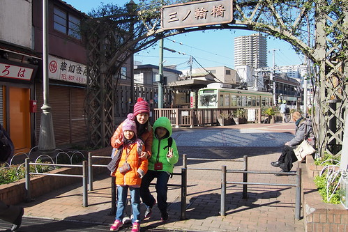 雖然從JR站到三丿輪橋站的路上便也漸漸感受到這裡的老東京下町氛圍 來到車站前廣場 看見如電影場景裡的小車站與老電車 我們還是驚喜不已 [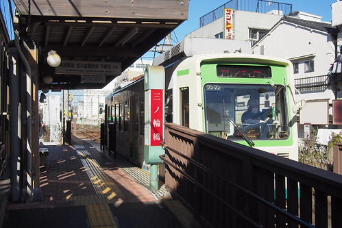](http://flickr.com/photos/33703965@N00/15937784754) 也雖然知道電車是走在路面上 貼著一家家屋簷而行 車站四周便見人家曬衣陽台上曬著棉被 掛著滿滿衣物而嘖嘖稱奇 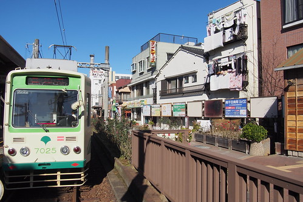 再加上一幕幕舊廣告看板! 太令人期待的懷舊之旅! 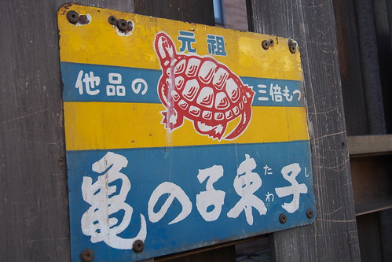 荒川都電不論到哪裡都只要160円 要上上下下玩一路的我們買的是400円的一日劵 上車時跟司機員購買即可(無人車站也只能上車買票 ) 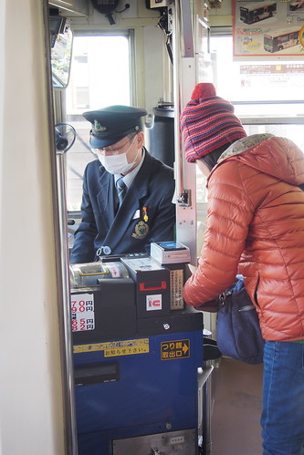 大人的一日劵如一般列印的車票 但小人的劵則是用"刮"日期的方式代表開始使用  拿著票 開心開始我們的都電小旅行 [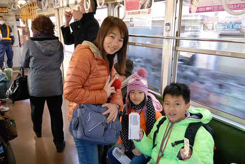](http://flickr.com/photos/33703965@N00/16513272501) 都電各站各有特色 我們預計下車的站有 荒川遊園地前 荒川車庫前 飛鳥山  大塚還有母子鬼神社 [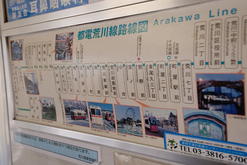](http://flickr.com/photos/33703965@N00/16329087607) 徹爸出乎我意外的 竟然很觀光客上身的站在司機後方 [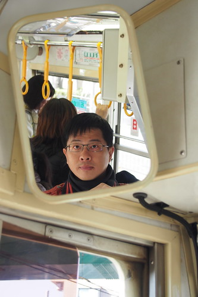](http://flickr.com/photos/33703965@N00/16558643021) 相機咖個不停的紀錄所行所見 [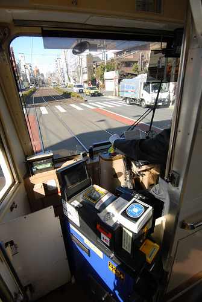](http://flickr.com/photos/33703965@N00/16513272011) [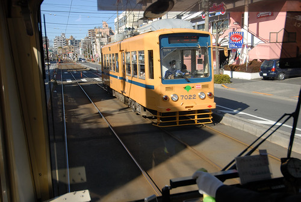](http://flickr.com/photos/33703965@N00/16329088047) [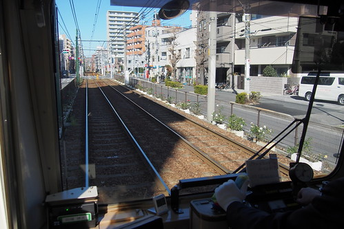](http://flickr.com/photos/33703965@N00/16559218182)[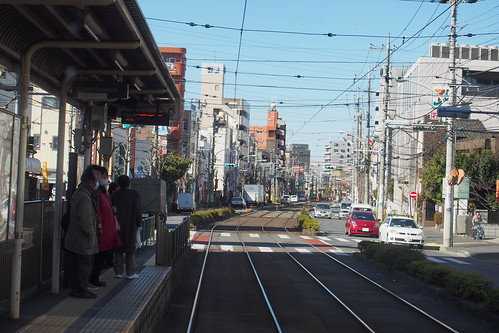](http://flickr.com/photos/33703965@N00/15937747594)    雖然這時節不是櫻花 繡球花或山茶花開的美麗季節  單純的鐵道卻已很有風景!

原以為上車很容易購買的一日劵 沒想到在我們家買完後就缺票 而且下車後的再下班車也一樣買無  玟姿只好直衝都電車庫辦公室買她們家的票  荒川車庫顧名思義就是荒車電車的發車地  在這可見電車的進進出出(可見買票買多久) [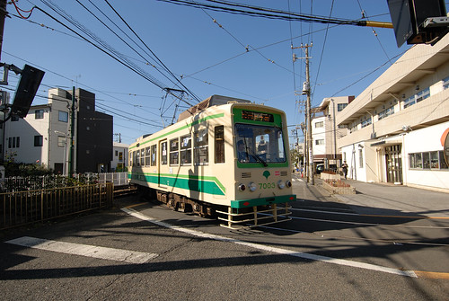](http://flickr.com/photos/33703965@N00/16514991295) 雖然有些搞不明白 電車進出的方式邏輯 [ 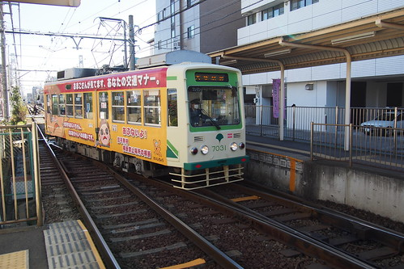](http://flickr.com/photos/33703965@N00/16372634878)看不懂門道的我們還是覺得很有趣 [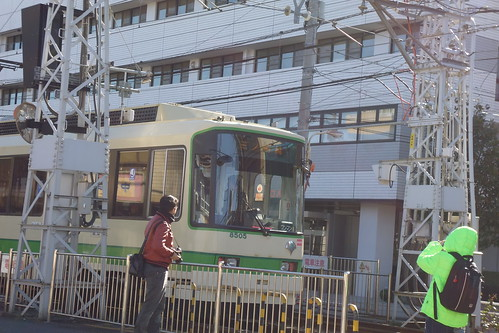](http://flickr.com/photos/33703965@N00/16329091167) 父子女三人相機照個不停 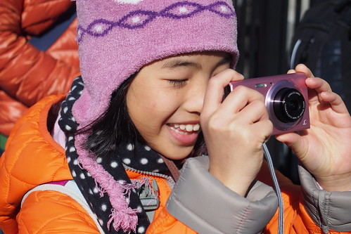 而以鐵道為背景更是怎樣都照不膩  同時路邊殘留的結冰塊也讓小人開心 彷彿看見雪似 [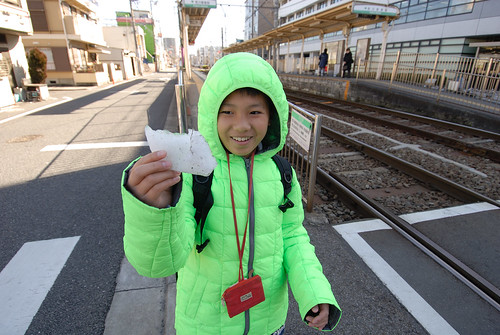](http://flickr.com/photos/33703965@N00/15894818263) 雖然散策其實還沒開始 時間卻已不知不覺過很快(已經11點了)  而小人竟也開心 [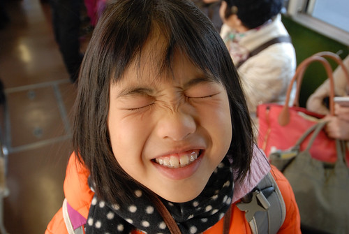](http://flickr.com/photos/33703965@N00/15892421514) 再搭上電車 車廂滿滿人潮 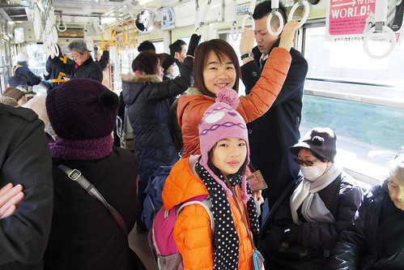 除了一開始的起點有位置坐外  其他站上上下下的乘客都不少 單車廂的都電 行駛於路面 而且一樣得停紅綠燈 其實真的很像搭公車 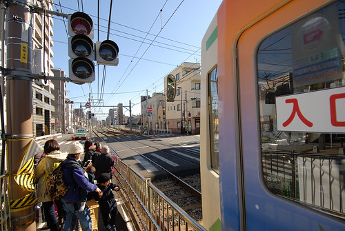 

今天是以都電代步的小旅行 順道暢玩小人的點  第一玩來到荒川遊樂園 [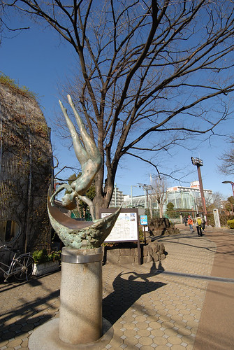](http://flickr.com/photos/33703965@N00/16513263381) 從荒川遊園前站走到遊樂園有五百公尺左右的距離  好天氣 曬著太陽 怎麼走都舒服 [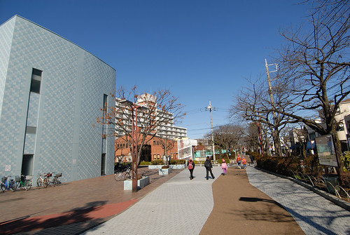](http://flickr.com/photos/33703965@N00/15892411804) [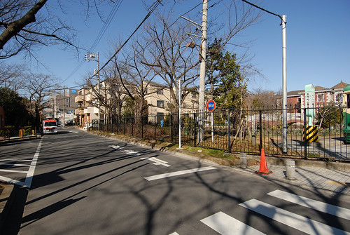](http://flickr.com/photos/33703965@N00/15894808733)  也更能體會 觀察日本民宅風格與生活 [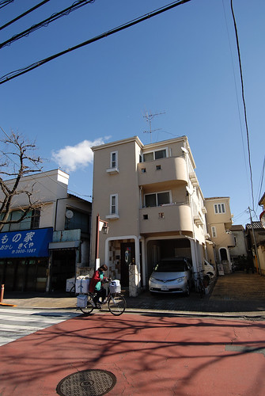](http://flickr.com/photos/33703965@N00/16329077667) 慢慢走 好不容易走到小人殷切期盼的遊樂園  遠遠看到五彩繽紛的摩天輪  一群人飛也似的跑過去  小小的遊樂園 但色彩溫馨 氣氛懷舊 讓人第一眼就喜歡  持荒川都電一日劵可免費入遊樂園 而遊樂設施則採使用者付費(同台北兒童樂園) 單次小人100円 大人200円  小人玩的CP值比較高 但其實這些遊樂設施也小尺寸的只適合小人 大人坐進小雲宵飛車後真的會被"卡"的動彈不得 雲霄飛車路程短短的 刺激也小小的 但對小人一切剛剛好  一趟 二趟 還不夠... [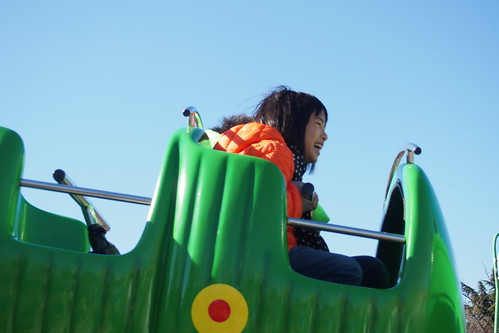](http://flickr.com/photos/33703965@N00/16372597528)愛愛坐了三趟還大呼不過癮  遊樂園必備的咖啡杯 小人當然也要來一杯  只是容易暈車的愛愛在開心的天旋地轉後果然也暈了  遊樂園內有許多都鐵或巴士造型的投幣式搖搖車  逼真的造型讓小人即時只是乾坐就也過癮 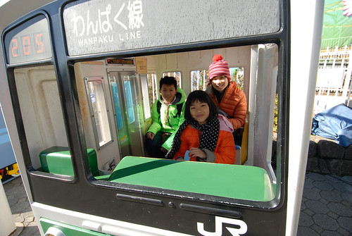 今天的天空好藍  襯著摩天輪更是美麗 [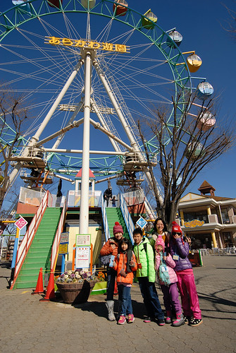](http://flickr.com/photos/33703965@N00/16488968116) 我喜歡這樣小巧又樸實的摩天輪 就像繪本裡的摩天輪 很感動的風景 當然一定要跟導遊阿姨來一張以滋紀念  忘了是否是我的一頭熱喲喝 大伙一起上了摩天輪  摩天輪果然也跟劍湖山的一樣慢 但剛好休息一下  同時登高望遠 感受不同的風景 [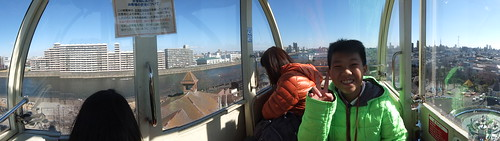](http://flickr.com/photos/33703965@N00/16328657009) 走至至高點 下面看以為沒什麼但其實也夠嗆  盡覽360度的好視野 [ 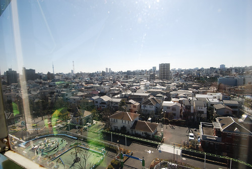](http://flickr.com/photos/33703965@N00/16514975675) 我喜歡一家子這樣在摩天輪內的小約會 搭摩天輪就是很有約會的FU阿~  有可愛摩天輪的遊樂園讓我亂感動的不是拉著導遊就是抓著徹爸拍以滋紀念!  遊樂園深處還有一個動物區 只有總是好奇的徹哥與徹爸去一探究竟  一樣的規模小小的  但依然整潔 元氣的很 令人喜歡  停留一個多小時 雖然小人依依不捨 但已嚴重delay行程的我們還是該移動了 離去前 在有攝影地標的摩天輪前大合照一張  請了一旁老媽媽級的員工幫我們的忙 老媽媽俐落的架勢 專業的攝影 很厲害阿~ 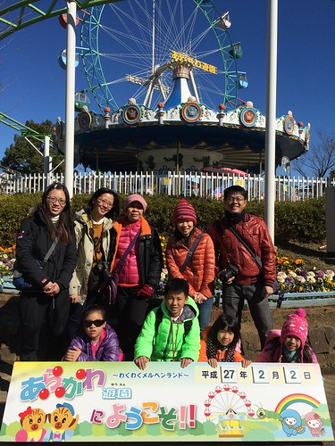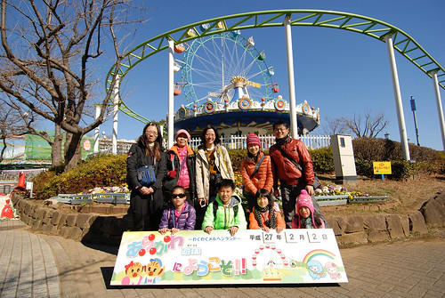 我們走回車站繼續往我們的下一站去!  接下來我們要去飛鳥山吃好吃的中餐 看更多的都電風情 還有小人的更好玩遊區...(待續)

另, 今日天氣好 風景美 還有我們的破繭  真開心徹家真正開始享受自由自在的旅行......... 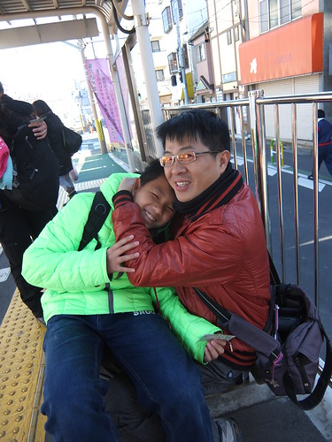
